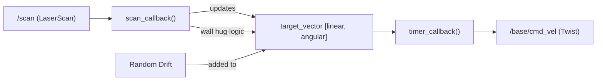
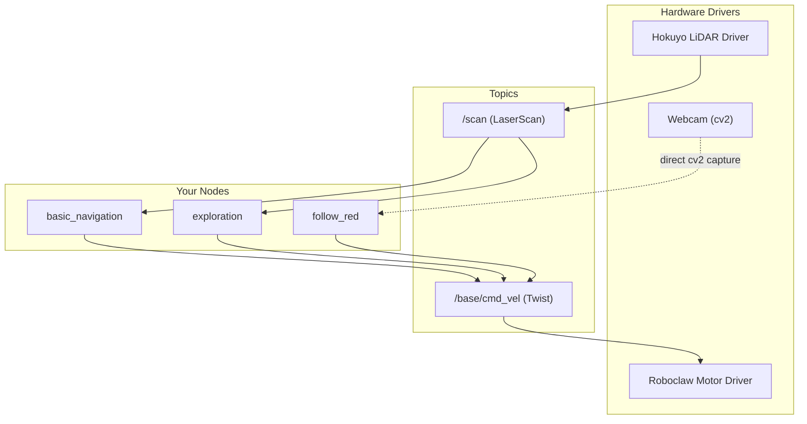

# OMN Project — Current State Documentation

> **OMN** = "Omar macht Navigation" — a group internship project focused on autonomous navigation of **Tortugabot** robots using ROS 2.

---

## 1. Project Overview

| Attribute | Detail |
|---|---|
| **Goal** | Implement self-navigating behavior on Tortugabot hardware and present it |
| **Platform** | Tortugabot (4-wheel differential drive, Hokuyo LiDAR, webcam) |
| **Framework** | ROS 2 (Python, `ament_python` build type) |
| **Maintainer** | Arian (`pilkiad+github@proton.me`) |
| **Robot IP** | `10.0.1.35` (tortuga4) |

---

## 2. Repository Structure

```
omn/
├── .gitignore              # Ignores build/, install/, log/, data/
├── README.md               # Quick-start connection & data playback guide
├── introduction.md         # Full hardware/software setup tutorial (from course)
├── download_data.sh        # SCP recorded bag data FROM the turtlebot
├── upload.sh               # SCP ros_ws TO the turtlebot (cleans build artifacts first)
├── imgs/
│   └── rviz2_screenshot.png
└── ros_ws/                 # ◀ ROS 2 workspace
    ├── build.sh            # `colcon build`
    ├── run_basic_navigation.sh
    ├── run_exploration.sh
    └── src/
        ├── basic_navigation/   # Package 1 — simple obstacle avoidance
        ├── exploration/        # Package 2 — advanced autonomous exploration
        └── follow_red/         # Package 3 — camera-based red object tracking
```

---

## 3. ROS 2 Packages in Detail

### 3.1 `basic_navigation` — Simple Obstacle Avoidance

| | |
|---|---|
| **Source** | [basic_navigation.py](file:///home/nasimpcm/Desktop/omn/ros_ws/src/basic_navigation/basic_navigation/basic_navigation.py) |
| **Entry point** | `ros2 run basic_navigation basic_navigation` |
| **Lines of code** | ~63 |

#### Behavior
A minimal "drive forward, turn when blocked" node:

1. Subscribes to `/scan` (LiDAR)
2. Checks if **any** range reading within **±30°** of the front is closer than **1.0 m**
3. If clear → drives forward (`linear.x = 0.1`)
4. If blocked → stops and rotates (`angular.z = 0.2`)
5. Publishes to `/base/cmd_vel` every **0.5 s**

#### Key Parameters (hardcoded)
| Parameter | Value | Meaning |
|---|---|---|
| `self.angle` | `30` | Half-width of the forward detection cone (degrees) |
| `self.distance` | `1.0` | Obstacle detection threshold (meters) |

> [!NOTE]
> This is the simplest node — essentially a proof-of-concept. It has no wall-following, no randomness, and no recovery logic.

---

### 3.2 `exploration` — Autonomous Exploration with Wall Hugging

| | |
|---|---|
| **Source** | [exploration.py](file:///home/nasimpcm/Desktop/omn/ros_ws/src/exploration/exploration/exploration.py) |
| **Entry point** | `ros2 run exploration exploration` |
| **Lines of code** | ~145 |

#### Behavior
A more sophisticated exploration node combining multiple strategies:

1. **Potential-field avoidance** — For each LiDAR ray in **-90° to +90°** with range < `MAX_SENSOR_RANGE`, a repulsive correction vector is computed and accumulated onto the target movement vector.
2. **Wall hugging** — If LiDAR readings at **80°** (right) or **10°** (left) fall within a "hug range", the robot steers slightly toward the wall to follow it.
3. **Random drift** — Every ~30 timer cycles, a small random offset is applied to both linear and angular speed to encourage diverse exploration paths.
4. **Safety lock** — The robot won't move until the first `/scan` message is received (`unlock_driving` flag).

#### Key Parameters (hardcoded as class constants)
| Constant | Value | Purpose |
|---|---|---|
| `MAX_SENSOR_RANGE` | `0.75 m` | Max distance at which obstacles affect trajectory |
| `WALL_HUG_RANGE` | `[0.5625, 0.9375]` | Distance band for wall-hugging activation |
| `WALL_HUG_STRENGTH` | `0.1` | Angular steering force toward a wall |
| `DAMPING_MULTIPLIER` | `[0.008, 0.008]` | How strongly each obstacle pushes the vector |
| `DEFAULT_TARGET_VECTOR` | `[0.1, 0.0]` | Base forward speed with no turning |
| `DRIFT_MAX` | `[0.025, 0.5]` | Max random perturbation (linear, angular) |
| `DRIFT_SHUFFLE_MAX_TIME` | `30` | Timer cycles between drift recalculations |

#### Architecture Diagram



> [!TIP]
> The `get_point()` helper converts a polar coordinate (angle + distance) to a Cartesian offset — used to compute repulsive vectors pointing **away** from obstacles.

---

### 3.3 `follow_red` — Camera-Based Red Object Tracking

| | |
|---|---|
| **Source** | [follow_red.py](file:///home/nasimpcm/Desktop/omn/ros_ws/src/follow_red/follow_red/follow_red.py) |
| **Entry point** | Not yet registered in a `setup.py` (see status below) |
| **Lines of code** | ~288 |

#### Behavior
A vision-based node that uses the webcam to detect and follow a red/orange colored object (cube):

1. **Captures frames** at 20 Hz from the webcam (640×480)
2. **Color segmentation** — Converts to HSV, applies a dual-range red mask (H: 0–22 and 157–179), finds contours
3. **Target tracking** — Tracks the largest contour; uses an **exponential moving average (EMA)** filter on position (`α=0.25`) and area (`α=0.20`) for smooth tracking
4. **Gating** — Rejects sudden large area drops (>60% decrease) to avoid losing track on occlusion
5. **Speed control**:
   - **Angular**: Proportional to the horizontal offset from screen center (`gain = 0.002`)
   - **Linear**: Proportional to `(target_area - current_area)` — approaches the cube until it fills `25000 px²`. Only moves forward when centered (error < 60px) and target not touching frame edges
6. **Debug output** — Records annotated video to `debug_output.mp4` and saves a matplotlib performance plot on shutdown

#### HSV Tuner
The file also contains a standalone `run_hsv_tuner()` function (currently commented out in `main()`) — an interactive OpenCV trackbar tool for calibrating the red color detection thresholds.

> [!WARNING]
> **Incomplete package**: The `follow_red` package is missing its `setup.py`, `package.xml`, and `setup.cfg`. It cannot be built with `colcon build` in its current state. Only the Python source file exists.

---

## 4. ROS Topic Data Flow



> [!IMPORTANT]
> Only **one** navigation node should run at a time — they all publish to the same `/base/cmd_vel` topic and would conflict.

---

## 5. Development & Deployment Workflow

### Build & Run Locally (with recorded bag data)
```bash
# Build
cd ros_ws && colcon build

# Play back recorded data in a loop
ros2 bag play data/BAG_NAME/ -l --clock

# Visualize
rviz2 --ros-args -p use_sim_time:=true
# Set: global frame → "laser", reliability → "best effort"
```

### Deploy to Tortugabot
```bash
# 1. Upload workspace (cleans build artifacts first)
./upload.sh

# 2. SSH into the robot
ssh roscourse@10.0.1.35
byobu

# 3. On the robot — start hardware drivers
ros2 launch roboclaw_node roboclaw_launch.py
ros2 launch urg_node2 urg_node2.launch.py
ros2 run topic_tools throttle messages /scan 10.0

# 4. Build & run your node
cd ~/Documents/ros_ws
colcon build
source install/setup.bash
ros2 run exploration exploration   # or basic_navigation
```

### Record & Download Data
```bash
# On the robot
ros2 bag record -a             # Record everything
ros2 bag record --topics /scan  # Record specific topics

# On your laptop
./download_data.sh
```

---

## 6. Current Status Summary

| Area | Status | Notes |
|---|---|---|
| **basic_navigation** | ✅ Complete | Simple but functional. Drives forward, rotates on obstacle. |
| **exploration** | ✅ Complete | Tuned and tested. Multiple iterations visible in git history. |
| **follow_red** | ⚠️ Partially complete | Python source exists with tracking + filtering logic, but **missing package scaffolding** (`setup.py`, `package.xml`). Cannot be built/run via `colcon`. |
| **Package descriptions** | ❌ Missing | Both `basic_navigation` and `exploration` still have `TODO: Package description` in their `package.xml` and `setup.py`. |
| **Tests** | ❌ None written | Test directories exist with boilerplate but no custom tests. |
| **Launch files** | ❌ None | No ROS 2 launch files — all nodes are run manually. |
| **Configuration** | ❌ Hardcoded | All behavioral parameters are hardcoded as class attributes. No YAML configs or ROS parameters used. |

---

## 7. Git History (Chronological Summary)

| Commit | Description |
|---|---|
| `55d6a4d` | Initial commit |
| `f590925` | Added README.md and upload.sh |
| `e77bcc4`–`0373569` | QoL scripts, data recording |
| `ed5ff60`–`a15c717` | Added exploration node |
| `31aae68`–`68e6913` | Tuned exploration for real turtlebot |
| `7595efe` | More exploration data |
| `f05855b`–`29e002c` | Added `follow_red` package (cube follower) |
| `a52ed1f`–`b5c44d6` | Cleaned up gitignore, deleted data folder |
| `9579fb6` | **HEAD** — Merge branch |
