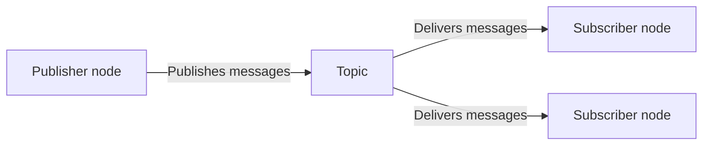
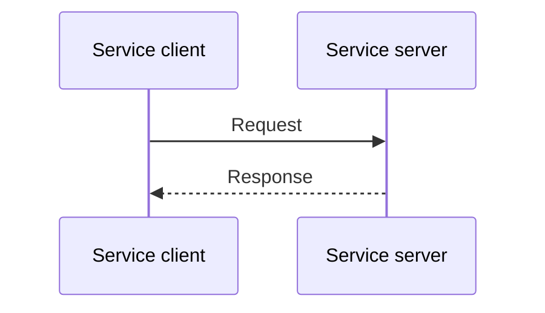
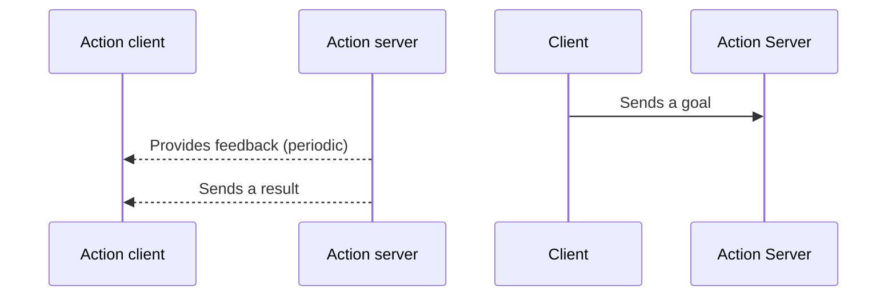

> Navigation: [Wiki index](../../../index.md) | [Summary](../../../SUMMARY.md) | [Concepts hub](../../../wiki/concept-map.md)
> Related: [Actions](about-actions.md) | [Client libraries](about-client-libraries.md) | [Composition](../intermediate/about-composition.md) | [Cross-compilation](../intermediate/about-cross-compilation.md) | [Different ROS 2 middleware vendors](../intermediate/about-different-middleware-vendors.md)

# Interfaces (topics, services, actions)

Interfaces in ROS define how nodes exchange data.
This article explains the different types of ROS interface and the differences between them.
With this information, you’ll be able to select the right interfaces for your purposes.

**Area: ROS-framework | Content-type: concept | Experience: beginner**

Table of Contents

- [Summary](#summary)
- [Topics](#topics)
- [Topic statistics](#topic-statistics)
- [Services](#services)
- [Actions](#actions)
- [Key differences between ROS interfaces](#key-differences-between-ros-interfaces)

## Summary

ROS nodes typically communicate through the following three types of interfaces:

- Topics: For continuous data streams.
- Services: For synchronous request/response interactions (short tasks which happen immediately).
- Actions: For long-running tasks with feedback (tasks that may take some time to complete).

For consistent communication, each interface uses definitions provided in `.msg`, `.srv`, or `.action` files.

[Learn more about nodes](about-nodes.md)

## Topics

The topic interface is meant for continuous data streams, for example, streaming sensor data or the status of your robot.
Topic definitions are stored in `.msg` files.
Topics implement a publish/subscribe pattern.
A node publishes data to a topic, and other nodes subscribe to receive that data.
This interface type has the following main characteristics:

- Asynchronous, one-way communication
- Multiple publishers and subscribers can share the same topic

Topic keys identify individual publishers on a topic so nodes and tools can distinguish where messages come from.
Each topic key makes it easier to track data sources when several publishers share the same topic.

## Topic statistics

Topic statistics are built-in measurements that help you understand how messages behave when a subscription receives them.
When enabled, they automatically track two things:

Message age:
:   How old a message is when it arrives, based on its timestamp.

Message period:
:   The time between incoming messages.

For both message age and period, ROS calculates the average, minimum, maximum, standard deviation, and the number of samples, using a moving window that updates every time a new message arrives.
These calculations run in constant time and memory using the dedicated utilities.
When you enable topic statistics for a subscription, ROS publishes the collected data at regular intervals as a `MetricsMessage` on a statistics topic.
This gives you a clear view of timing patterns, delays, and irregularities, making it easier to assess system performance or diagnose problems related to the message flow.

> [!TIP]
>
> The default interval is 1 second.
> The default statistics topic is `/statistics`.

[Learn how to enable topic statistics](../../tutorials/advanced/topic-statistics-tutorial.md)

## Services

The service interface is meant for synchronous request/response interactions, for example, when you want to send a query requesting the configuration of a specific robot.
Service definitions are stored in `.srv` files.
Services implement a request/response pattern.
A client sends a request, and a server replies with a response.
This interface type has the following main characteristics:

- Synchronous communication
- Ideal for short-lived operations that require confirmation, or provide a result in response to a request

## Actions

The action interface is meant for long-running tasks with feedback, for example, moving a robot to a specific position, or asking the robot to perform a complex motion.
Action definitions are stored in `.action` files.
Actions allow clients to send goals, receive feedback during the execution, cancel if needed, and return a result if available.
This interface type has the following main characteristics:

- Asynchronous, with feedback and result
- Suitable for operations that take time

## Key differences between ROS interfaces

All three interfaces enable communication between nodes, but each serves a different purpose.
The table below summarizes the differences between ROS interface types:

|  | Pattern | Direction | Provided result | Typical use case | Cancellation |
| --- | --- | --- | --- | --- | --- |
| **Topics** | Publish/Subscribe | One-way | No | Continuous data | Not supported |
| **Services** | Request/Response | Two-way | Yes | Quick queries | Not supported |
| **Actions** | Goal/Feedback/Result | Two-way with feedback | Yes | Long-running tasks | Supported |
