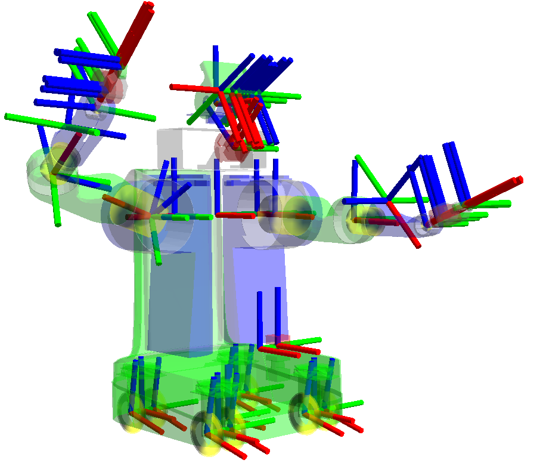
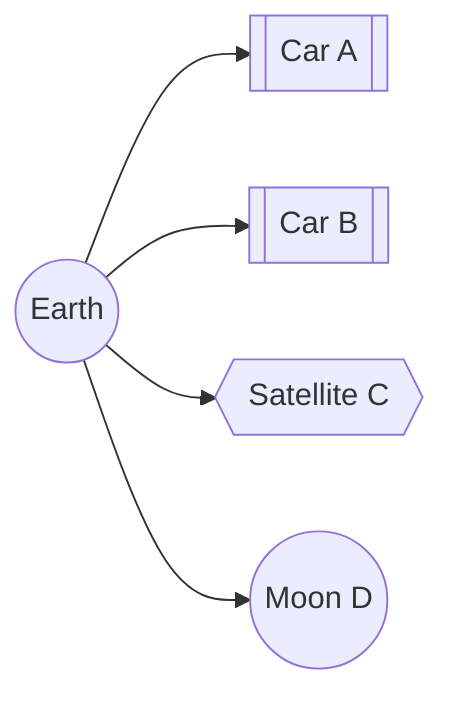

> Navigation: [Wiki index](../../../index.md) | [Summary](../../../SUMMARY.md) | [Concepts hub](../../../wiki/concept-map.md)
> Related: [Actions](../basic/about-actions.md) | [Client libraries](../basic/about-client-libraries.md) | [Composition](about-composition.md) | [Cross-compilation](about-cross-compilation.md) | [Different ROS 2 middleware vendors](about-different-middleware-vendors.md)

# Tf2

Table of Contents

- [Overview](#overview)
- [Properties of tf2](#properties-of-tf2)

  - [Publishing transforms](#publishing-transforms)
  - [Position](#position)
  - [Velocity](#velocity)
- [Tutorials](#tutorials)
- [Paper](#paper)

## Overview

tf2 is the transform library, which lets the user keep track of multiple coordinate frames over time.
tf2 maintains the relationship between coordinate frames in a tree structure buffered in time and lets the user transform points, vectors, etc. between any two coordinate frames at any desired point in time.

## Properties of tf2

A robotic system typically has many 3D coordinate frames that change over time, such as a world frame, base frame, gripper frame, head frame, etc.
tf2 keeps track of all these frames over time, and allows you to ask questions like:

- Where was the head frame relative to the world frame 5 seconds ago?
- What is the pose of the object in my gripper relative to my base?
- What is the current pose of the base frame in the map frame?

tf2 can operate in a distributed system.
This means all the information about the coordinate frames of a robot is available to all ROS 2 components on any computer in the system.
tf2 can have every component in your distributed system build its own transform information database or have a central node that gathers and stores all transform information.

### Publishing transforms

When publishing transforms we typically think of the transforms as the transform from one frame to the other.
The semantic difference is whether you are transforming data represented in a frame or transforming the frame itself.
These values are directly inverse.
Transforms published in the `geometry_msgs/msg/Transform` message represent the frame formulation.
Keep this in mind when debugging published transforms they are the inverse of what you will lookup depending on what direction you’re traversing the transform tree.

\[\_{B}T^{data}\_{A} = (\_{B}T^{frame}\_{A})^{-1}\]

The TF library handles inverting these elements for you depending on which way you’re traversing the transform tree.
For the rest of this document we will just use \(T^{data}\) but the `data` is unwritten.

### Position

If the driver in car \(A\) observes something and a person on the ground wants to know where it is relative to it’s position, you transform the observation from the source frame to the target frame.

\[\_{E}T\_{A} \* P\_{A}^{Obs} = P\_{E}^{Obs}\]

Now if a person in car B wants to know where it is too you can compute the net transform.

\[\_{B}T\_{E} \* \_{E}T\_{A} \* P\_{A}^{Obs} = \_{B}T\_{A} \* P\_{A}^{Obs} = P\_{B}^{Obs}\]

This is exactly what `lookupTransform` provides where `A` is the *source* `frame_id` and `B` is the *target* `frame_id`.

It is recommended to use the `transform<T>(target_frame, ...)` methods when possible because they will read the *source* `frame_id` from the datatype and write out the *target* `frame_id` in the resulting datatype and the math will be taken care of internally.

If \(P\) is a `Stamped` datatype then \(\_A\) is it’s `frame_id`.

As an example, if a root frame `A` is one meter below frame `B` the transform from `A` to `B` is positive.

However when converting data from coordinate frame `B` to coordinate frame `A` you have to use the inverse of this value.
This can be seen as you’ll be adding value to the height when you change to the lower reference frame.
However if you are transforming data from coordinate frame `A` into coordinate frame `B` the height is reduced because the new reference is higher.

\[\_{B}T\_{A} = (\_{B}{Tf}\_{A})^{-1}\]

### Velocity

For representing `Velocity` we have three pieces of information.
\(V^{moving\\_frame - reference\\_frame}\_{observing\\_frame}\)
This velocity represents the velocity between the moving frame and the reference frame.
And it is represented in the observing frame.

For example a driver in Car A can report that they’re driving forward (observed in A) at 1m/s (relative to earth) so that would be \(V\_{A}^{A - E} = (1,0,0)\)
Whereas that same velocity could be observed from the view point of the earth (lets assume the car is driving east and Earth is NED), it would be \(V\_{E}^{A - E} = (0, 1, 0)\)

However transforms can show that these are actually the same with:

\[\_{E}T\_{A} \* V\_{A}^{A - E} = V\_{E}^{A - E}\]

Velocities can be added or subtracted if they’re represented in the same frame, in this case `Obs`.

\[V\_{Obs}^{A - C} = V\_{Obs}^{A - B} + V\_{Obs}^{D - C}\]

Velocities can be “reversed” by inverting.

\[V\_{Obs}^{A - C} = -(V\_{Obs}^{C - A})\]

If you want to compare two velocities you must first transform them into the same observational frame first.

## Tutorials

We created a set of [tutorials](../../tutorials/intermediate/tf2/tf2-main.md) that walks you through using tf2, step by step.
You can get started on the [introduction to tf2](../../tutorials/intermediate/tf2/introduction-to-tf2.md) tutorial.
For a complete list of all tf2 and tf2-related tutorials check out the [tutorials](../../tutorials/intermediate/tf2/tf2-main.md) page.

There are essentially two main tasks that any user would use tf2 for, listening for transforms and broadcasting transforms.

If you want to use tf2 to transform between coordinate frames, your nodes will need to listen for transforms.
What you will do is receive and buffer all coordinate frames that are broadcasted in the system, and query for specific transforms between frames.
Check out the “Writing a listener” tutorial [(Python)](../../tutorials/intermediate/tf2/writing-a-tf2-listener-py.md) [(C++)](../../tutorials/intermediate/tf2/writing-a-tf2-listener-cpp.md) to learn more.

To extend the capabilities of a robot, you will need to start broadcasting transforms.
Broadcasting transforms means to send out the relative pose of coordinate frames to the rest of the system.
A system can have many broadcasters that each provide information about a different part of the robot.
Check out the “Writing a broadcaster” tutorial [(Python)](../../tutorials/intermediate/tf2/writing-a-tf2-broadcaster-py.md) [(C++)](../../tutorials/intermediate/tf2/writing-a-tf2-broadcaster-cpp.md) to learn more.

In addition to that, tf2 can broadcast static transforms that do not change over time.
This mainly saves storage and lookup time, but also reduces the publishing overhead.
You should note that static transforms are published once and assumed to not change, so no history is stored.
If you want to define static transforms in your tf2 tree, take a look at the “Writing a static broadcaster” [(Python)](../../tutorials/intermediate/tf2/writing-a-tf2-static-broadcaster-py.md) [(C++)](../../tutorials/intermediate/tf2/writing-a-tf2-static-broadcaster-cpp.md) tutorial.

You can also learn how to add fixed and dynamic frames to your tf2 tree in the “Adding a frame” [(Python)](../../tutorials/intermediate/tf2/adding-a-frame-py.md) [(C++)](../../tutorials/intermediate/tf2/adding-a-frame-cpp.md) tutorial.

Once you are finished with the basic tutorials, you can move on to learn about tf2 and time.
The tf2 and time tutorial [(C++)](../../tutorials/intermediate/tf2/learning-about-tf2-and-time-cpp.md) teaches the basic principles of tf2 and time.
The advanced tutorial about tf2 and time [(C++)](../../tutorials/intermediate/tf2/time-travel-with-tf2-cpp.md) teaches the principles of time traveling with tf2.

## Paper

There is a paper on tf2 presented at TePRA 2013: [tf: The transform library](https://ieeexplore.ieee.org/abstract/document/6556373).
