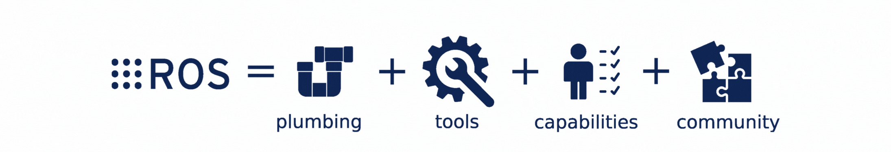

> Navigation: [Wiki index](../../index.md) | [Summary](../../SUMMARY.md) | [Getting Started hub](../../wiki/task-map.md)
> Related: [Citations](../reference/citations.md) | [Concepts](../concepts/overview.md) | [Contact](../reference/contact.md) | [Distributions](../releases/overview.md) | [First steps with ROS - learning path](first-steps.md)

# About ROS

ROS (Robot Operating System) is an open-source ecosystem that provides the framework, tools, and libraries for building, deploying, running, and maintaining robotic applications.
This article introduces the main areas of the ecosystem and outlines their intended use.

**Area: ROS-framework, ROS-tools, ROS-capabilities | Content-type: about | Experience: beginner**

Table of Contents

- [Summary](#summary)
- [The ecosystem](#the-ecosystem)
- [Framework](#framework)
- [Tools](#tools)
- [Capabilities](#capabilities)
- [Community](#community)
- [Integrations](#integrations)
- [ROS distributions](#ros-distributions)
- [Supported systems](#supported-systems)

## Summary

ROS is used in many areas of robotics.
In logistics, it helps robots move goods in warehouses by providing navigation, mapping, motion control, and coordination between multiple robots.
In manufacturing, it enables advanced tasks such as automated pick-and-place operations using vision systems for accurate handling.
In healthcare, ROS supports robotic systems that assist with patient care and improve efficiency in clinical workflows.

Watch the [ROS video](https://vimeo.com/237016358) for a quick introduction.

## The ecosystem

Despite its name, ROS is actually not an operating system in the traditional sense, but a set of tools and libraries that help developers create robots using various platforms and programming languages.

## Framework

The ROS framework is the “plumbing” which allows for communication between parts of a robot, and within parts of a robot.
It includes messaging, standard interfaces, and support for multiple programming languages and platforms.

For example, the framework handles sending data from a camera to a processing node or passing commands from a planning system to a motor controller.
It also provides the structure for sharing software across systems, so developers can build modular and reusable solutions.

ROS consists of the following basic components:

- Nodes
- Interfaces (topics, services and actions)
- Parameters
- Client libraries

## Tools

Tools in ROS help developers build, test, and monitor robotic systems.
They do not add new robot behaviours but make development easier.

For example, visualisation tools can be used to display a robot’s sensors, position, and environment in 3D during testing, which is common in projects involving drones or mobile robots.
With launch control tools, developers can define and verify how a robot starts up and manages its operation before actual deployment.
Data recording and playback tools allow you to register robot behaviour for later inspection, which is particularly useful when debugging why the robot did something wrong.

The core set of tools provided by ROS allows you to handle the following elements of the development workflow:

- Introspection
- Analysis
- Node management
- Debugging
- Builds
- Visualization
- Package documentation

## Capabilities

Capabilities in ROS are ready-to-use packages that offer common functions for robots, such as manipulation, motion planning, and perception.
These packages allow developers to add advanced behaviours without starting from scratch.

For example, manipulation packages can control robotic arms for tasks like picking and placing objects in automated workflows.
Motion planning packages allow robots to move from one point to another by calculating safe paths in their environment.
Perception packages enable robots to detect and recognise objects or people, supporting tasks such as retrieving objects or working in environments where the robot needs to respond to what it sees.
Different implementations of the same capabilities allow developers to switch implementations and experiment to find the best implementation for their needs.

> [!NOTE]
>
> Apart from the packages maintained by Open Robotics, you can also choose from many packages contributed by the ROS community.

ROS offers the following core capabilities either out of the box, or through supported third-party solutions:

- Simulation
- Motion planning
- Navigation
- Manipulation
- Perception

## Community

Community in ROS is the global network of developers, researchers, companies, and contributors who help our library of open-source software grow and improve.
People can contribute to plumbing, tools, and capabilities, and thanks to the community, it is easy to share code, exchange ideas, and work together on projects.

## Integrations

ROS works with other Open Robotics platforms to make development and deployment easier.

- [Gazebo](https://gazebosim.org/home): Offers physics-based simulation, so developers can test robots in a virtual environment before using real hardware.
- [Open-RMF](https://www.open-rmf.org/) (Robotics Middleware Framework): Helps different robots work together and interact with building systems like lifts and doors.
- [ros-controls](https://control.ros.org/rolling/index.html): Enables real-time control of robots using ROS.

These integrations make it simpler to design, test, and manage robots in complex environments on any budget and with any team size.

## ROS distributions

A ROS distribution is a packaged set of ROS software released on a regular schedule.
Each distribution provides a stable version of the core libraries and tools, plus many community packages.
This makes it easier for developers to work with a consistent codebase and keep projects compatible.

ROS has two main versions:

- [ROS 1](https://index.ros.org/): The original framework.
- ROS 2: The current and actively developed version.

ROS 1 has reached the end of development, with no new releases planned, while ROS 2 continues to be developed and releases new distributions every year.
These distributions include updates and improvements, so developers can choose between stability and the latest features.

## Supported systems

ROS runs on Ubuntu, Windows, and macOS, but we strongly recommend that you use a Tier 1 platform for your ROS distribution.
ROS on macOS is supported by the community, and we do not recommended it for new users.

Ubuntu support depends on the ROS distribution, with each distribution requiring a specific Ubuntu LTS (long-term support) release.
Other platforms may require building from source or using containers.

[See full details of currently supported platforms and support tiers](../releases/release-rolling-ridley.md)
