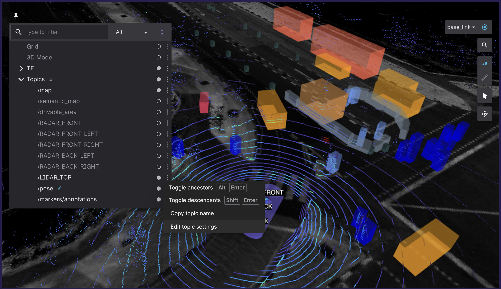
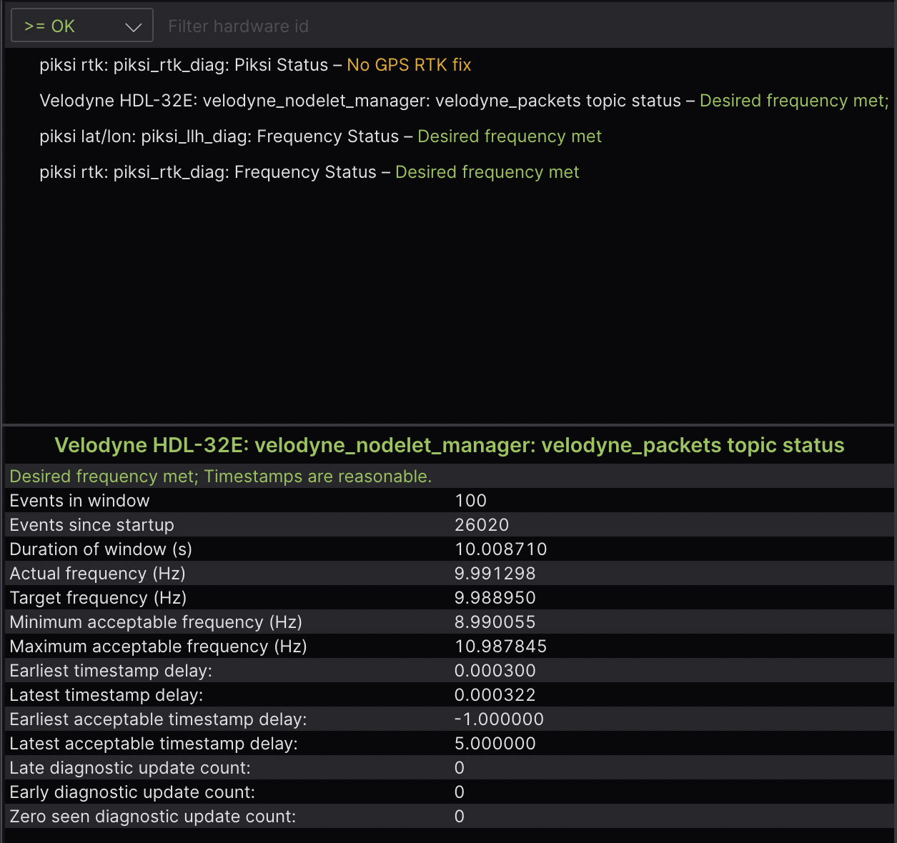
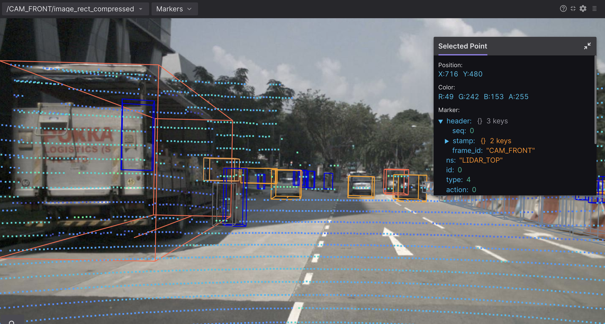
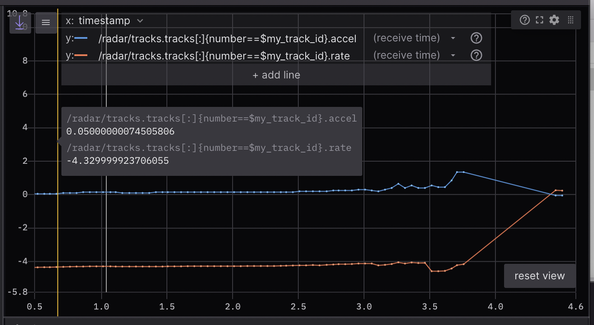
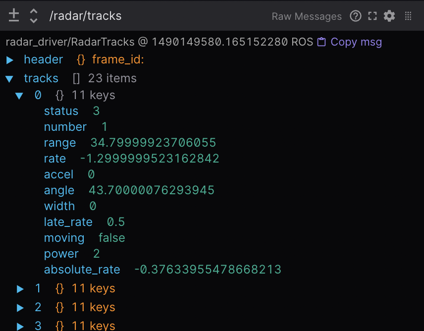
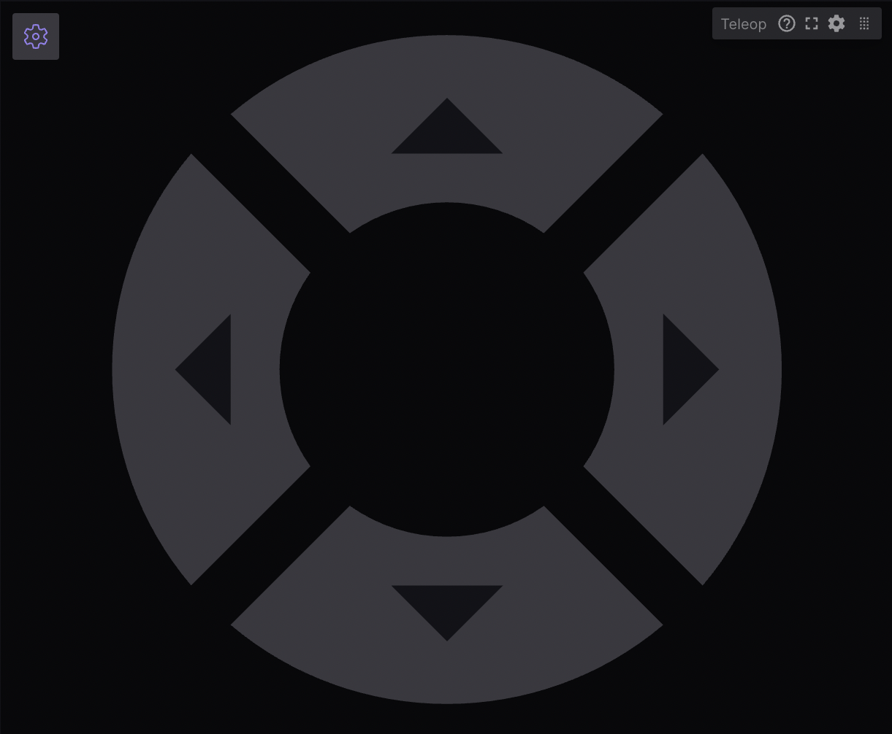
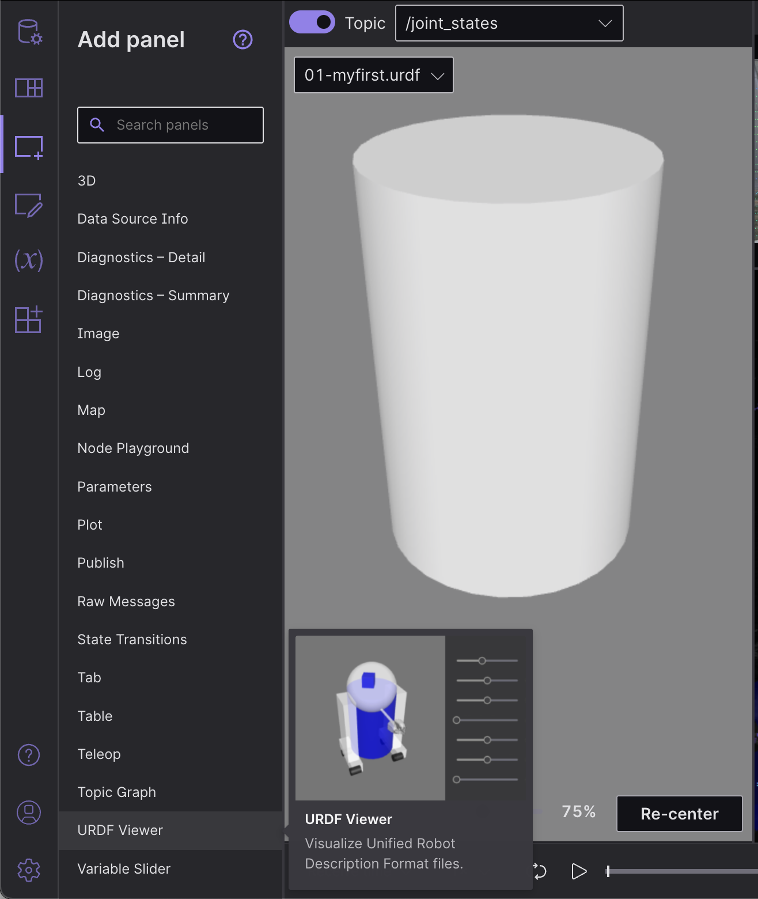
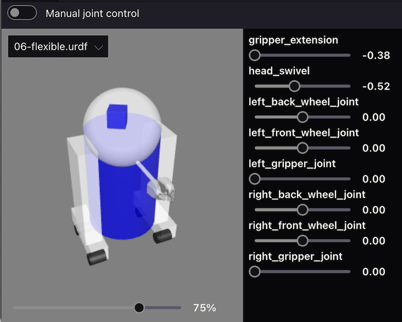
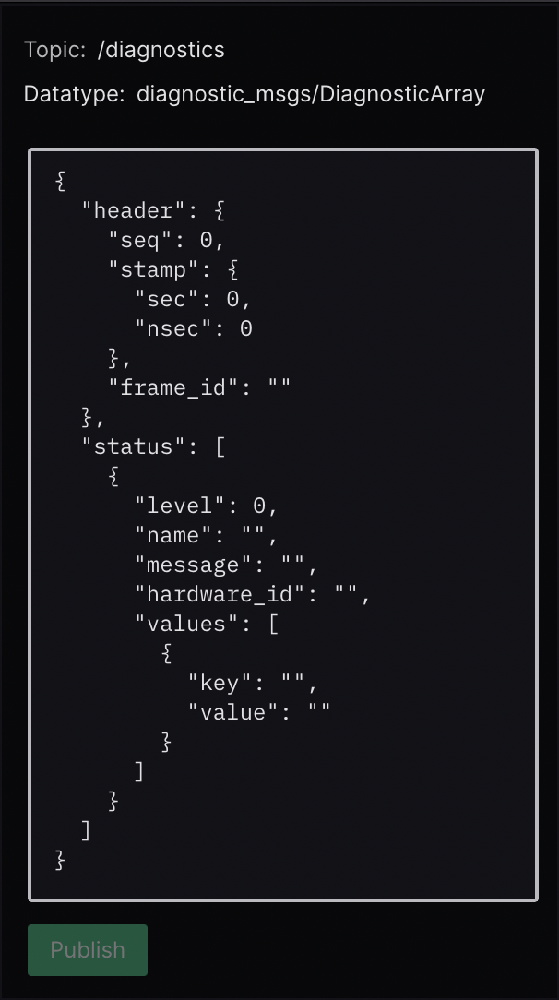

> Navigation: [Wiki index](../../index.md) | [Summary](../../SUMMARY.md) | [How-To Guides hub](../../wiki/task-map.md)
> Related: [ament_cmake user documentation](ament-cmake-documentation.md) | [ament_cmake_python user documentation](ament-cmake-python-documentation.md) | [Building a custom deb package](building-a-custom-deb-package.md) | [Building ROS 2 with tracing](building-ros-2-with-tracing.md) | [Configure Zero Copy Loaned Messages](configure-zero-copy-loaned-messages.md)

# Visualizing ROS 2 data with Foxglove Studio

[Foxglove Studio](https://foxglove.dev/studio) is an open source visualization and debugging tool for your robotics data.

It is available in a variety of ways to make development as convenient as possible – it can be run as a standalone desktop app, accessed via your browser, or even self-hosted on your own domain.

View the source code on [GitHub](https://www.github.com/foxglove/studio).

## Installation

To use the web app, simply open Google Chrome and navigate to [studio.foxglove.dev](https://studio.foxglove.dev).

To use the desktop app for Linux, macOS, or Windows, download it directly from the [Foxglove Studio website](https://foxglove.dev/download).

## Connect to a data source

On opening Foxglove Studio, you will see a dialog with a list of [all possible data sources](https://foxglove.dev/docs/studio/connection/data-sources).

To connect to your ROS 2 stack, click “Open connection”, select the “Rosbridge (ROS 1 & 2)” tab, and configure your “WebSocket URL”.

You could also drag-and-drop any local ROS 2 `.db3` files directly into the application to load them for playback.

> [!NOTE]
>
> In order to [load custom message definitions in your ROS 2 files](https://github.com/ros2/rosbag2/issues/782), try converting them to the [MCAP file format](https://mcap.dev).

Check out the [Foxglove Studio docs](https://foxglove.dev/docs/studio/connection/native) for more detailed instructions.

## Building layouts with panels

[Panels](https://foxglove.dev/docs/studio/panels/introduction) are modular visualization interfaces that can be configured and arranged into Studio [layouts](https://foxglove.dev/docs/studio/layouts).
You can also save your layouts for future use, for your own personal reference or with your larger robotics team.

Find the full list of available panels in the sidebar’s “Add panel” tab.

We’ve highlighted some particularly useful ones below:

### 1 3D: Display visualization markers in a 3D scene

Publish marker messages to add primitive shapes (arrows, spheres, etc.) and more complex visualizations (occupancy grids, point clouds, etc.) to your 3D panel’s scene.

Choose the topics you want to display via the topic picker on the left, and configure each topic’s visualization settings in the “Edit topic settings” menu.

Reference the [docs](https://foxglove.dev/docs/studio/panels/3d) for a full list of [supported message types](https://foxglove.dev/docs/studio/panels/3d#supported-messages) and some useful [user interactions](https://foxglove.dev/docs/studio/panels/3d#user-interactions).

### 2 Diagnostics: Filter and sort diagnostics messages

Display the status of seen nodes (i.e. stale, error, warn, or OK) from topics with a `diagnostic_msgs/msg/DiagnosticArray` datatype in a running feed, and display the diagnostics data for a given `diagnostic_name/hardware_id`.

Reference the [docs](https://foxglove.dev/docs/studio/panels/diagnostics) for more details.

### 3 Image: View camera feed images

Select a `sensor_msgs/msg/Image` or `sensor_msgs/msg/CompressedImage` topic to display.

Reference the [docs](https://foxglove.dev/docs/studio/panels/image) for more details.

### 4 Log: View log messages

To view `rcl_interfaces/msg/Log` messages live, use the desktop app to [connect](https://foxglove.dev/docs/studio/connection/native) to your running ROS stack.
To view `rcl_interfaces/msg/Log` messages from a pre-recorded data file, you can drag-and-drop your file into either the [web](https://studio.foxglove.dev) or desktop app.

Next, add a [Log](https://foxglove.dev/docs/studio/panels/log) panel to your layout.
If you’ve connected to your ROS stack correctly, you should now see a list of your log messages, with the ability to filter them by node name or severity level.

Reference the [docs](https://foxglove.dev/docs/studio/panels/log) for more details.

### 5 Plot: Plot arbitrary values over time

Plot arbitrary values from your topics’ message paths over playback time.

Specify the topic values you want to plot along the y-axis.
For the x-axis, choose between plotting the y-axis value’s timestamp, element index, or another custom topic message path.

Reference the [docs](https://foxglove.dev/docs/studio/panels/plot) for more details.

### 6 Raw Messages: View incoming topic messages

Display incoming topic data in an easy-to-read collapsible JSON tree format.

Reference the [docs](https://foxglove.dev/docs/studio/panels/raw-messages) for more details.

### 7 Teleop: Teleoperate your robot

Teleoperate your physical robot by publishing `geometry_msgs/msg/Twist` messages on a given topic back to your live ROS stack.

Reference the [docs](https://foxglove.dev/docs/studio/panels/teleop) for more details.

### 8 URDF Viewer: View and manipulate your URDF model

To visualize and control your robot model in Foxglove Studio, open the web or desktop application and add a [URDF Viewer](https://foxglove.dev/docs/studio/panels/urdf-viewer) panel to your layout.
Then, drag and drop your URDF file into that panel to visualize your robot model.

Select any topic publishing a `JointState` message to update the visualization based on the published joint states (defaults to `/joint_states`).

Toggle to “Manual joint control” to set joint positions using the provided controls.

Reference the [docs](https://foxglove.dev/docs/studio/panels/urdf-viewer) for more details.

## Other basic actions

### 1 View your ROS graph

[Using the desktop app](https://foxglove.dev/download), [connect](https://foxglove.dev/docs/studio/connection/native) to your running ROS stack.
Next, add a [Topic Graph](https://foxglove.dev/docs/studio/panels/topic-graph) panel to your layout.
If you’ve connected to your ROS stack correctly, you should now see a computational graph of your ROS nodes, topics, and services in that panel.
Use the controls on the right side of the panel to select which topics to display or to toggle services.

### 2 View and edit your ROS params

[Using the desktop app](https://foxglove.dev/download), [connect](https://foxglove.dev/docs/studio/connection/native) to your running ROS stack.
Next, add a [Parameters](https://foxglove.dev/docs/studio/panels/parameters) panel to your layout.
If you’ve connected to your ROS stack correctly, you should now see a live view of your current `rosparams`.
You can edit these parameter values to publish `rosparam` updates back to your ROS stack.

### 3 Publish messages back to your live ROS stack

[Using the desktop app](https://foxglove.dev/download), [connect](https://foxglove.dev/docs/studio/connection/native) to your running ROS stack.
Next, add a [Publish](https://foxglove.dev/docs/studio/panels/publish) panel to your layout.

Specify the topic you want to publish on to infer its datatype and populate the text field with a JSON message template.

Selecting a datatype in the dropdown of common ROS datatypes will also populate the text field with a JSON message template.

Edit the template to customize your message before hitting “Publish”.

