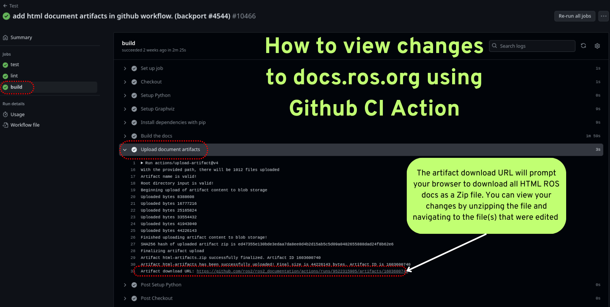
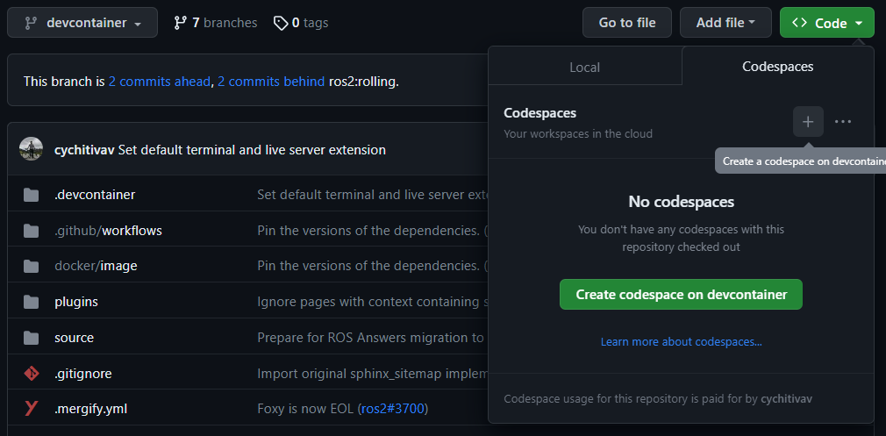
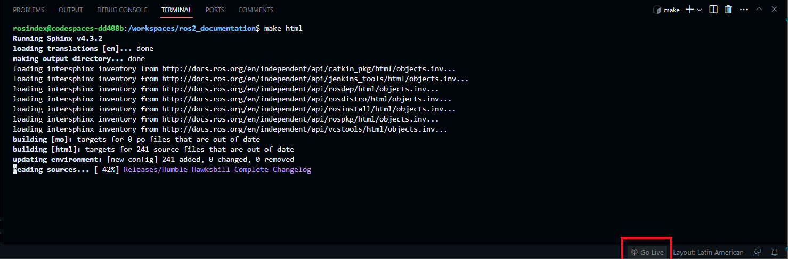
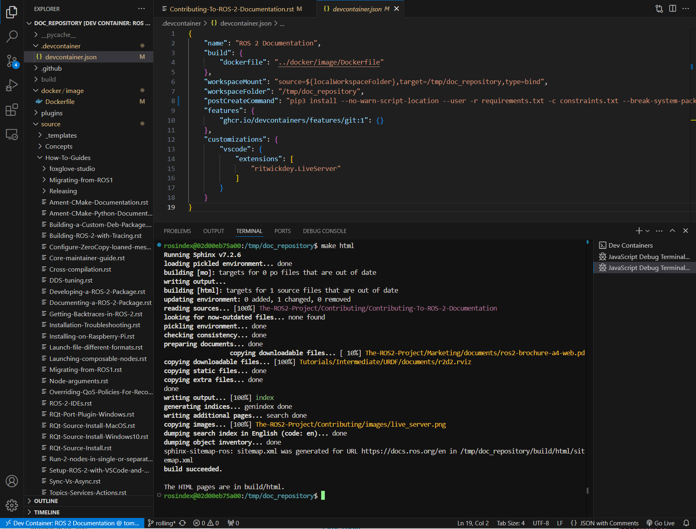

> Navigation: [Wiki index](../../../index.md) | [Summary](../../../SUMMARY.md) | [Project hub](../../../wiki/tooling-map.md)
> Related: [Add Your Project](../adopters/add-your-project.md) | [Code style and language versions](code-style-language-versions.md) | [Quality guide: ensuring code quality](quality-guide.md) | [ROS 2 developer guide](developer-guide.md) | [ROS Build Farms](build-farms.md)

<a id="contributing-to-ros-2-documentation"></a>

# Contributing to ROS 2 Documentation

Table of Contents

- [Branch structure](#branch-structure)
- [Source structure](#source-structure)
- [Building the site locally](#building-the-site-locally)

  - [Building the site for one branch](#building-the-site-for-one-branch)
  - [Live-reload local development](#live-reload-local-development)
  - [Checking / Testing the site](#checking-testing-the-site)
  - [View Site Through Github CI](#view-site-through-github-ci)
  - [Building the site for all branches](#building-the-site-for-all-branches)
  - [Checking for broken links](#checking-for-broken-links)
  - [Spelling check](#spelling-check)
- [Migrating Pages from the ROS Wiki](#migrating-pages-from-the-ros-wiki)

  - [Migrating a Wiki File](#migrating-a-wiki-file)
- [Building the Site with GitHub Codespaces](#building-the-site-with-github-codespaces)
- [Building the Site with Devcontainer](#building-the-site-with-devcontainer)
- [Writing pages](#writing-pages)

  - [Table of Contents](#id4)
  - [Headings](#headings)
  - [Lists](#lists)
  - [Code Formatting](#code-formatting)
  - [Images](#images)
  - [Charts, Graphs, and Diagrams](#charts-graphs-and-diagrams)
  - [References and Links](#references-and-links)

Contributions to this site are most welcome.
This page explains how to contribute to ROS 2 Documentation.
Please be sure to read the below sections carefully before contributing.

The site is built using [Sphinx](https://www.sphinx-doc.org/en/master/), and more particularly using [Sphinx multiversion](https://sphinx-contrib.github.io/multiversion/main/index.html).

<a id="branch-structure"></a>

## Branch structure

The source code of documentation is located in the [ROS 2 Documentation GitHub repository](https://github.com/ros2/ros2_documentation).
This repository is set up with one branch per ROS 2 distribution to handle differences between the distributions.
If a change is common to all ROS 2 distributions, it should be made to the `rolling` branch (and then will be backported as appropriate).
If a change is specific to a particular ROS 2 distribution, it should be made to the respective branch.

<a id="source-structure"></a>

## Source structure

The source files for the site are all located under the `source` subdirectory.
Templates for various sphinx plugins are located under `source/_templates`.
The root directory contains configuration and files required to locally build the site for testing.

<a id="building-the-site-locally"></a>

## Building the site locally

Start by creating [venv](https://docs.python.org/3/library/venv.html) to build the documentation:

```
$ python3 -m venv ros2doc  # create venv
$ source ros2doc/bin/activate  # activate venv
```

And install requirements located in the `requirements.txt` file:

Linux

```
$ pip install -r requirements.txt -c constraints.txt
```

macOS

```
$ pip install -r requirements.txt -c constraints.txt
```

Windows

```
$ python -m pip install -r requirements.txt -c constraints.txt
```

In order for Sphinx to be able to generate diagrams, the `dot` command must be available.

Linux

```
$ sudo apt update ; sudo apt install graphviz
```

macOS

```
$ brew install graphviz
```

Windows

Download an installer from [the Graphviz Download page](https://graphviz.gitlab.io/_pages/Download/Download_windows.html) and install it.
Make sure to allow the installer to add it to the Windows `%PATH%`, otherwise Sphinx will not be able to find it.

<a id="building-the-site-for-one-branch"></a>

### Building the site for one branch

To build the site for just this branch, type `make html` at the top-level of the repository.
This is the recommended way to test out local changes.

```
$ make html
```

The build process can take some time.
To see the output, open `build/html/index.html` in your browser.

<a id="live-reload-local-development"></a>

### Live-reload local development

When iterating on documentation, instead of re-running `make html` and refreshing the browser after every edit, use [sphinx-autobuild](https://github.com/sphinx-doc/sphinx-autobuild) to watch the source files, rebuild incrementally on save, and serve the result with automatic browser reload.

`sphinx-autobuild` is installed as part of `requirements.txt`.
Start the live server with:

```
$ make serve
```

Then open `http://localhost:8000` in a browser.

The `serve` target binds to `0.0.0.0:8000` by default so the server is reachable through devcontainer / port forwarding.
Override the bind address or port if needed:

```
$ make serve LIVE_HOST=127.0.0.1 LIVE_PORT=8080
```

<a id="checking-testing-the-site"></a>

### Checking / Testing the site

You can run the documentation tests locally (using [doc8](https://github.com/PyCQA/doc8)) with the following command:

```
$ make test
```

You can run the Python documentation tools tests locally (using [pytest](https://docs.pytest.org/en/stable/)) with the following command:

```
$ make test-tools
```

You can run the Python documentation tools tests locally (using [pytest](https://docs.pytest.org/en/stable/)) with the following command:

```
make test-tools
```

You can run the documentation linter locally (using [sphinx-lint](https://github.com/sphinx-contrib/sphinx-lint)) with the following command:

```
$ make lint
```

You can run the documentation spell checker locally (using [codespell](https://github.com/codespell-project/codespell)) with the following command:

```
$ make spellcheck
```

> [!NOTE]
>
> If that detects specific words that need to be ignored, add it to [codespell\_whitelist](https://github.com/ros2/ros2_documentation/blob/jazzy/codespell_whitelist.txt) .

To know more about spelling checks, refer to [Spelling check](#spelling-check)

<a id="view-site-through-github-ci"></a>

### View Site Through Github CI

For small changes to the ROS 2 Docs you can view your changes as rendered HTML using artifacts generated in our Github Actions.
The “build” action produces the entire ROS Docs as a downloadable Zip file that contains all HTML for [docs.ros.org](https://docs.ros.org/)
This build action is triggered after passing the test action and lint action.

To download and view your changes first go to your pull request and under the title click the “Checks” tab.
On the left hand side of the checks page, click on the “Test” section under the “tests” section click on “build” dialog.
This will open a menu on the right, where you can click on “Upload document artifacts” and scroll to the bottom to see the download link for the Zipped’ HTML files under the heading “Artifact download URL”.

[](../../../assets/images/github_action.png)

<a id="building-the-site-for-all-branches"></a>

### Building the site for all branches

To build the site for all branches, type `make multiversion` from the `rolling` branch.
This has two drawbacks:

1. The multiversion plugin doesn’t understand how to do incremental builds, so it always rebuilds everything.
   This can be slow.
2. When typing `make multiversion`, it will always check out exactly the branches listed in the `conf.py` file.
   That means that local changes will not be shown.

To show local changes in the multiversion output, you must first commit the changes to a local branch.
Then you must edit the [conf.py](https://github.com/ros2/ros2_documentation/blob/rolling/conf.py) file and change the `smv_branch_whitelist` variable to point to your branch.

<a id="checking-for-broken-links"></a>

### Checking for broken links

To check for broken links on the site, run:

```
$ make linkcheck
```

This will check the entire site for broken links, and output the results to the screen and `build/linkcheck`.

<a id="spelling-check"></a>
<a id="id2"></a>

### Spelling check

The `make spellcheck` command scans the documentation files and flags any misspellings.
If errors are detected, review the suggestions and update the pull request as necessary.

Some words, such as technical terms or proper nouns, maybe mistakenly flagged as misspelled.
If you encounter such instances, you can add them to the ignore list to prevent them from being flagged in the future.
To do this, add it to the [codespell\_whitelist](https://github.com/ros2/ros2_documentation/blob/jazzy/codespell_whitelist.txt) file as follows:

```
empy
jupyter
lets
ws
```

To include custom corrections that `codespell` should apply, you can add them to the [codespell\_dictionary](https://github.com/ros2/ros2_documentation/blob/jazzy/codespell_dictionary.txt) file as follows:

```
amnet->ament
colcn->colcon
rosabg->rosbag
rosdistroy->rosdistro
```

To check the dictionaries, you can run the `make check-dictionaries` command.
This will check the blank lines and leading/trailing spaces in the dictionaries.
If it complains about the dictionaries, you can run the `make sort-dictionaries` command.
This command will automatically modify the dictionaries if any issues are found.

<a id="migrating-pages-from-the-ros-wiki"></a>

## Migrating Pages from the ROS Wiki

The first step in migrating a page from the [ROS Wiki](https://wiki.ros.org) to the ROS 2 documentation is to determine if the page needs to be migrated.
Check if the content, or something similar, is available on <https://docs.ros.org/en/rolling> by searching for related terms.
If it has already been migrated, congratulations!
You are done.
If it hasn’t been migrated, then consider whether it is worth keeping.
Pages that you or others find useful, and refer to regularly, are good candidates assuming they have not been superseded by other documentation.
Pages for ROS projects and features that are no longer supported by a current distribution should not be migrated.

The next step for migrating a ROS Wiki page is to determine the correct location for the migrated page.
Only ROS Wiki pages that cover core ROS concepts belong in the ROS Documentation, these pages should be migrated to a logical location within the ROS documentation.
Package specific documentation should be migrated to the package-level documentation generated in the package’s source repository.
Once the package level documentation has been updated it will be visible [as part of the package-level documentation](https://docs.ros.org/en/jazzy/p/).
If you are unsure whether and where to migrate a page, please get in touch via an issue on <https://github.com/ros2/ros2_documentation> or on <https://discourse.openrobotics.org/>.

Once you’ve determined that a ROS Wiki page is worth migrating, and found an appropriate landing spot in the ROS documentation, the next step in the migration process is to set up the conversion tools necessary to migrate the page.
In most cases the only tools necessary to migrate a single ROS Wiki page to the ROS Docs are the [PanDoc](https://pandoc.org/) command line tool and a text editor.
PanDoc is supported by most modern operating systems using the installation instruction found on their website.
It is worth noting that the ROS Wiki uses an older wiki technology (MoinMoin), so the markup language used is an obscure dialect of the [MediaWiki](https://www.mediawiki.org/wiki/Help:Formatting) format.
We’ve found that the easiest way to migrate a page from the ROS Wiki is to convert it from HTML into reStructured text using PanDoc.

<a id="migrating-a-wiki-file"></a>

### Migrating a Wiki File

1. Clone the appropriate repository.
   If you are migrating a page to the official documentation hosted here, then you should clone <https://github.com/ros2/ros2_documentation>.
2. Create a new Github branch for your migrated page.
   We suggest something like `pagename-migration`.
3. Download the appropriate ROS Wiki page to an html file using wget or a similar tool (e.g. `wget -O urdf.html https://wiki.ros.org/urdf`).
   Alternatively you can use your web browser to save the page’s HTML.
4. Next you need to remove the extraneous HTML in the file you downloaded
   Using your browser’s developer mode, find the name of the first useful HTML element in the Wiki page.
   In most cases all of the HTML between the third line of the file, starting with the `<head>` tag, through the start of the first `<h1>` tag can be safely removed.
   In the case where there is a table of contents, the first useful tag may be an `<h2>` tag.
   Similarly, the ROS wiki contains some footer text that starts with `<div id="pagebottom"></div>` and ends just above `</body></html>` that can also be removed.
5. Convert your html file by running a PanDoc conversion between HTML and restructured text.
   The following command converts an HTML file to the equivalent reStructured text files: `pandoc -f html -t rst urdf.html > URDF.rst`.
6. Attempt to build your new documentation using the `make html` command.
   There may be errors and warnings that you will need to address.
7. **CAREFULLY** read through the entire page making sure the material is up to date for ROS 2.
   Check every single link to make sure it points to the appropriate location on docs.ros.org.
   Internal document references must be updated to point to the equivalent ROS 2 material.
   Your updated document should not point to the ROS Wiki unless it is absolutely necessary.
   This process may require you alter the document considerably, and you may need to pull multiple wiki files.
   You should verify that every code sample in the document is working correctly under ROS 2.
8. Find and download any images that may be in the old document.
   The easiest way to do this is to right click in the browser and download all of the images.
   Alternatively you can find images by searching for `` tags in the HTML file.
9. For each image files downloaded update the image file links to point to the correct image directory for the ROS Docs.
   If any of the images require updating, or could be replaced with a [Mermaid](https://mermaid.js.org/intro/) chart, please make this change.
   Be aware that Mermaid.js is only supported in the core ROS 2 documentation currently.
10. Once your document is complete add a table of contents to the top of your new rst document using the appropriate Sphinx commands.
    This block should replace any existing table of contents from the old ROS Wiki.
11. Issue your pull request.
    Make sure to point to the original ROS Wiki file for reference.
12. Once your pull request has been accepted please add a note to the top of the page on the original ROS Wiki article pointing to the new documentation page.

For a real-world example of this process in action, please refer to the ROS 2 Image Processing Pipeline in both [the ROS 2 Docs](https://github.com/ros-perception/image_pipeline/blob/rolling/image_pipeline/doc/tutorials.rst) and in the original [ROS Wiki](https://wiki.ros.org/image_pipeline).
The completed documentation page can be found in the [ROS 2 package documentation for image\_pipeline](https://docs.ros.org/en/rolling/p/image_pipeline/).

<a id="building-the-site-with-github-codespaces"></a>

## Building the Site with GitHub Codespaces

First, you need to have a GitHub account (if you don’t have one, you can create one for free).
Then, you need to go to the [ROS 2 Documentation GitHub repository](https://github.com/ros2/ros2_documentation).
After that, you can open the repository in Codespaces, it can be done just by clicking on the “Code” button on the repository page, then choose “Open with Codespaces” from the dropdown menu.

[](../../../assets/images/codespaces.png)

After that, you will be redirected to your Codespaces page, where you can see the progress of the Codespaces creation.
Once it is done, a Visual Studio Code tab will be opened in your browser.
You can open the terminal by clicking on the “Terminal” tab in the top panel or by pressing `Ctrl`-`J`.

In this terminal, you can run any command you want, for example, you can run the following command to build the site for just this branch:

```
$ make html
```

Finally, to view the site, you can click on the “Go Live” button in the right bottom panel and then, it will open the site in a new tab in your browser (you will need to browse to the `build/html` folder).

[](../../../assets/images/live_server.png)

<a id="building-the-site-with-devcontainer"></a>

## Building the Site with Devcontainer

[ROS 2 Documentation GitHub repository](https://github.com/ros2/ros2_documentation) also supports `Devcontainer` development environment with Visual Studio Code.
This will enable you to build the documentation much easier without changing your operating system.

See [Setup ROS 2 with VSCode and Docker [community-contributed]](../../how-to/setup-ros-2-with-vscode-and-docker-container.md) to install VS Code and Docker before the following procedure.

Clone repository and start VS Code:

```
$ git clone https://github.com/ros2/ros2_documentation
$ cd ./ros2_documentation
$ code .
```

To use `Devcontainer`, you need to install “Remote Development” Extension within VS Code search in Extensions (CTRL+SHIFT+X) for it.

And then, use `View->Command Palette...` or `Ctrl+Shift+P` to open the command palette.
Search for the command `Dev Containers: Reopen in Container` and execute it.
This will build your development docker container for you automatically.

To build the documentation, open a terminal using `View->Terminal` or `` Ctrl+Shift+` `` and `New Terminal` in VS Code.
Inside the terminal, you can build the documentation:

```
$ make html
```

[](../../../assets/images/vscode_devcontainer.png)

<a id="writing-pages"></a>

## Writing pages

The ROS 2 documentation website uses the `reStructuredText` format, which is the default plaintext markup language used by Sphinx.
This section is a brief introduction to `reStructuredText` concepts, syntax, and best practices.
When formatting your `reStructuredText` file **please make sure to write only one sentence per line as it makes reviewing and modifying your file much easier.**
Also, be mindful of the use of white space in your file!
The ROS 2 documentation linter will not accept pull requests with trailing white space.
We recommend that you enable automatic white space highlighting and or cleanup if your editor supports it.

You can refer to [reStructuredText User Documentation](https://docutils.sourceforge.io/rst.html) for a detailed technical specification.

<a id="id4"></a>

### Table of Contents

There are two types of directives used for the generation of a table of contents, `.. toctree::` and `.. contents::`.
The `.. toctree::` is used in top-level pages like `Tutorials.rst` to set ordering and visibility of its child pages.
This directive creates both left navigation panel and in-page navigation links to the child pages listed.
It helps readers to understand the structure of separate documentation sections and navigate between pages.

```
.. toctree::
   :maxdepth: 1
```

The `.. contents::` directive is used for the generation of a table of contents for that particular page.
It parses all present headings in a page and builds an in-page nested table of contents.
It helps readers to see an overview of the content and navigate inside a page.

The `.. contents::` directive supports the definition of maximum depth of nested sections.
Using `:depth: 2` will only show Sections and Subsections in the table of contents.

```
.. contents:: Table of Contents
   :depth: 2
   :local:
```

<a id="headings"></a>

### Headings

There are four main Heading types used in the documentation.
Note that the number of symbols has to match the length of the title.

```
Page Title Header
=================

Section Header
--------------

2 Subsection Header
^^^^^^^^^^^^^^^^^^^

2.4 Subsubsection Header
~~~~~~~~~~~~~~~~~~~~~~~~
```

We usually use one digit for numbering subsections and two digits (dot separated) for numbering subsubsections in Tutorials and How-To-Guides.

<a id="lists"></a>

### Lists

Stars `*` are used for listing unordered items with bullet points and number sign `#.` is used for listing numbered items.
Both of them support nested definitions and will render accordingly.

```
* bullet point

  * bullet point nested
  * bullet point nested

* bullet point
```

```
#. first listed item
#. second lited item
```

<a id="code-formatting"></a>

### Code Formatting

In-text code can be formatted using `backticks` for showing `highlighted` code.

```
In-text code can be formatted using ``backticks`` for showing ``highlighted`` code.
```

Code blocks inside a page need to be captured using `.. code-block::` [directives](https://www.sphinx-doc.org/en/master/usage/restructuredtext/directives.html#directive-code-block).
`.. code-block::` supports code highlighting for syntaxes like `C++`, `YAML`, `console`, `bash`, and more.
Code inside the directive needs to be indented.

```
.. code-block:: C++

   int main(int argc, char** argv)
   {
      rclcpp::init(argc, argv);
      rclcpp::spin(std::make_shared<ParametersClass>());
      rclcpp::shutdown();
      return 0;
   }
```

<a id="code-blocks-bash-vs-console"></a>

#### Code blocks: `bash` vs. `console`

`bash` and `console` are similar, but they serve two different purposes.
Choosing the right one is important to ensure that the content is formatted correctly and that the copy button copies the right content.
Below is an explanation of each one; skip to the end of this section for a list of use-cases and corresponding examples.

`bash` is meant for scripts, e.g., for bash commands from a script file.
Example result:

```
export ROS_DOMAIN_ID=42
ros2 run turtlesim turtlesim_node
```

`console` is meant for commands to be run in a terminal, optionally including their output.
This makes it clear that the given commands need to be run in a terminal.
It also allows separating command lines from output lines using prompt symbols such as `$` or `#`.
Command lines are formatted as bash commands while output lines are formatted as normal text.
The prompt symbol is not selectable, and clicking on the copy button in the upper right-hand corner copies *only* the commands, not the outputs nor the prompt symbols.
This means that, if a `console` code block is used without any `$`, the copy button will not copy any lines.
Example result:

```
$ export ROS_DOMAIN_ID=42
$ ros2 run turtlesim turtlesim_node --ros-args --remap "__node:=my_turtle"
[INFO] [1742150439.022947971] [my_turtle]: Starting turtlesim with node name /my_turtle
[INFO] [1742150439.026043867] [my_turtle]: Spawning turtle [turtle1] at x=[5.544445], y=[5.544445], theta=[0.000000]
```

Compare the above with a `bash` `code-block`:

```
$ export ROS_DOMAIN_ID=42
$ ros2 run turtlesim turtlesim_node --ros-args --remap "__node:=my_turtle"
[INFO] [1742150439.022947971] [my_turtle]: Starting turtlesim with node name /my_turtle
[INFO] [1742150439.026043867] [my_turtle]: Spawning turtle [turtle1] at x=[5.544445], y=[5.544445], theta=[0.000000]
```

To simplify code blocks, `bash` can still be used without `$` for commands meant to be run in a terminal if the code block does not include any output lines.
To help choose between `bash` and `console`, see the following list of use-cases and corresponding examples:

1. Commands meant to be copied into a script file

   - Use `.. code-block:: bash` without `$`:

     > ```
     > export ROS_DOMAIN_ID=42
     > ros2 run turtlesim turtlesim_node
     > ```
2. Commands meant to be run in a terminal:

   - It is highly recommended to use `.. code-block:: console` with `$` on all command lines for consistency and clarity.
     If there is output that needs to be displayed, include it in the same block:

     > ```
     > $ source /opt/ros/jazzy/setup.bash
     > $ ros2 run turtlesim turtlesim_node
     > [INFO] [1743878028.269334696] [turtlesim]: Starting turtlesim with node name /turtlesim
     > [INFO] [1743878028.275096618] [turtlesim]: Spawning turtle [turtle1] at x=[5.544445], y=[5.544445], theta=[0.000000]
     > ```
     >
     > > [!NOTE]
     > >
     > > If some output lines start with `#`, it is crucial to separate commands from their output because the `#` symbol is used to denote a command.
     > > Therefore, place the output in a separate `.. code-block:: text`.

<a id="images"></a>

### Images

Images can be inserted using the `.. image::` directive.

```
.. image:: images/turtlesim_follow1.png
```

In this case, the image file (`turtlesim_follow1.png`) is located in the `images/` directory relative to the `.rst` file that uses the image.

However, all image files end up in an `_images/` directory relative to the root of the docs.
Therefore, when using `:target:` to add a hyperlink to the image file, use a relative link going up to the root directory and then down to the `_images/` directory.

```
.. image:: images/turtlesim_follow1.png
   :target: ../../_images/turtlesim_follow1.png
```

<a id="charts-graphs-and-diagrams"></a>

### Charts, Graphs, and Diagrams

The ROS 2 Documentation now supports charts, graphs, and diagrams written using [Mermaid Charts.](https://mermaid.js.org/intro/)
We prefer that charts, graphs, and diagrams use Mermaid instead of static image files as it allows us to programmatically update and edit these resources as the project evolves.
Full documentation of the [Mermaid graph language syntax can be found on their website.](https://mermaid.js.org/intro/syntax-reference.html)

<a id="references-and-links"></a>

### References and Links

<a id="external-links"></a>

#### External links

The syntax of creating links to external web pages is shown below.

```
`ROS Docs <https://docs.ros.org>`_
```

The above link will appear as [ROS Docs](https://docs.ros.org).
Note the underscore after the final single quote.

<a id="internal-links"></a>

#### Internal links

The `:doc:` directive is used to create in-text links to other pages.

```
:doc:`Quality of Service <../Tutorials/Quality-of-Service>`
```

Note that the relative path to the file is used.

The `ref` directive is used to make links to specific parts of a page.
These could be headings, images or code sections inside the current or different page.

Definition of explicit target right before the desired object is required.
In the example below, the target is defined as `_talker-listener` one line before the heading `Try some examples`.

```
.. _talker-listener:

Try some examples
-----------------
```

Now the link from any page in the documentation to that header can be created.

```
:ref:`talker-listener demo <talker-listener>`
```

This link will navigate a reader to the target page with an HTML anchor link `#talker-listener`.

<a id="macros"></a>

#### Macros

Macros can be used to simplify writing documentation that targets multiple distributions.

Use a macro by including the macro name in curly braces.
For example, when generating the docs for Rolling on the `rolling` branch:

| Macro | Example | Becomes (for Jazzy) |
| --- | --- | --- |
| {DISTRO} | ros-{DISTRO}-pkg | ros-jazzy-pkg |
| {DISTRO\_TITLE} | ROS 2 {DISTRO\_TITLE} | ROS 2 Jazzy |
| {DISTRO\_TITLE\_FULL} | ROS 2 {DISTRO\_TITLE\_FULL} | ROS 2 Jazzy Jalisco |
| {REPOS\_FILE\_BRANCH} | git checkout {REPOS\_FILE\_BRANCH} | git checkout jazzy |
| {interface\_link(std\_msgs/msg/String)} | See: {interface\_link(std\_msgs/msg/String)}. | See: <https://docs.ros.org/en/jazzy/p/std_msgs/msg/String.html>. |
| {interface(std\_msgs/msg/String)} | Publish a {interface(std\_msgs/msg/String)}. | Publish a [std\_msgs/msg/String](https://docs.ros.org/en/jazzy/p/std_msgs/msg/String.html). |
| {package\_link(rclcpp)} | See: {package\_link(rclcpp)}. | See: <https://docs.ros.org/en/jazzy/p/rclcpp/>. |
| {package(rclcpp)} | Use {package(rclcpp)}. | Use [rclcpp](https://docs.ros.org/en/jazzy/p/rclcpp/). |

The same file can be used on multiple branches (i.e., for multiple distros) and the generated content will be distro-specific.
