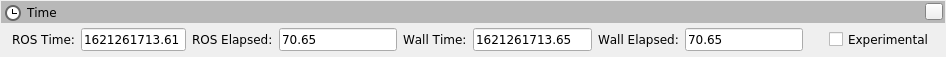
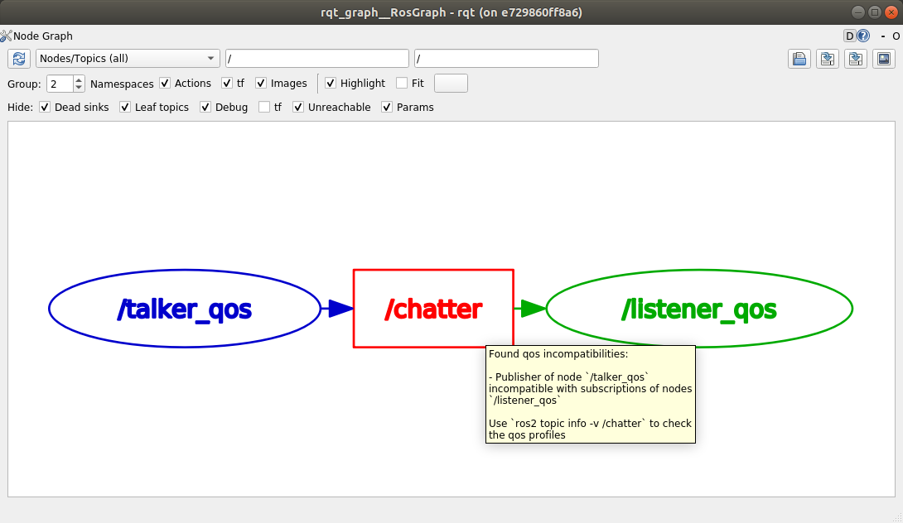

> Navigation: [Wiki index](../../index.md) | [Summary](../../SUMMARY.md) | [Releases hub](../../wiki/tooling-map.md)
> Related: [Alphas](alpha-overview.md) | [Ardent Apalone ( ardent )](release-ardent-apalone.md) | [Beta 1 ( Asphalt )](beta1-overview.md) | [Beta 2 ( r2b2 )](beta2-overview.md) | [Beta 3 ( r2b3 )](beta3-overview.md)

<a id="galactic-geochelone-galactic"></a>
<a id="galactic-release"></a>

# Galactic Geochelone (`galactic`)

Table of Contents

- [Supported Platforms](#supported-platforms)
- [Installation](#installation)
- [New features in this ROS 2 release](#new-features-in-this-ros-2-release)

  - [Ability to specify per-logger log levels](#ability-to-specify-per-logger-log-levels)
  - [Ability to configure logging directory through environment variables](#ability-to-configure-logging-directory-through-environment-variables)
  - [Ability to invoke `rosidl` pipeline outside CMake](#ability-to-invoke-rosidl-pipeline-outside-cmake)
  - [Externally configure QoS at start-up](#externally-configure-qos-at-start-up)
  - [Python point\_cloud2 utilities available](#python-point-cloud2-utilities-available)
  - [RViz2 Time Panel](#rviz2-time-panel)
  - [ros2 topic echo can print serialized data](#ros2-topic-echo-can-print-serialized-data)
  - [Get the YAML representation of messages](#get-the-yaml-representation-of-messages)
  - [Ability to load parameter files at runtime through the ros2 command](#ability-to-load-parameter-files-at-runtime-through-the-ros2-command)
  - [Tools to check for QoS incompatibilities](#tools-to-check-for-qos-incompatibilities)
  - [Use launch substitutions in parameter files](#use-launch-substitutions-in-parameter-files)
  - [Support for unique network flows](#support-for-unique-network-flows)
  - [Rosbag2 New Features](#rosbag2-new-features)
- [Changes since the Foxy release](#changes-since-the-foxy-release)

  - [Default RMW changed to Eclipse Cyclone DDS](#default-rmw-changed-to-eclipse-cyclone-dds)
  - [Connext RMW changed to rmw\_connextdds](#connext-rmw-changed-to-rmw-connextdds)
  - [Large improvements in testing and overall quality](#large-improvements-in-testing-and-overall-quality)
  - [rmw](#rmw)
  - [ament\_cmake](#ament-cmake)
  - [nav2](#nav2)
  - [tf2\_ros Python split out of tf2\_ros](#tf2-ros-python-split-out-of-tf2-ros)
  - [tf2\_ros Python TransformListener uses global namespace](#tf2-ros-python-transformlistener-uses-global-namespace)
  - [rclcpp](#rclcpp)
  - [rclpy](#rclpy)
  - [rclcpp\_action](#rclcpp-action)
  - [rosidl\_typesupport\_introspection\_c](#rosidl-typesupport-introspection-c)
  - [rcl\_lifecycle and rclcpp\_lifecycle](#rcl-lifecycle-and-rclcpp-lifecycle)
  - [rcl\_lifecycle and rclcpp\_lifecycle](#id4)
- [Known Issues](#known-issues)

  - [ros2cli](#ros2cli)
  - [rqt](#rqt)
  - [rviz2](#rviz2)
- [Timeline before the release](#timeline-before-the-release)

*Galactic Geochelone* is the seventh release of ROS 2.
What follows is highlights of the important changes and features in Galactic Geochelone since the last release.
For a list of all of the changes since Foxy, see the [long form changelog](galactic-geochelone-complete-changelog.md).

<a id="supported-platforms"></a>

## Supported Platforms

Galactic Geochelone supports the following platforms according to [the platform support tiers](../project/platform-support-tiers.md):

Tier 1 platforms:

- Ubuntu 20.04 (Focal): `amd64` and `arm64`
- Windows 10 (Visual Studio 2019): `amd64`

Tier 2 platforms:

- RHEL 8: `amd64`

Tier 3 platforms:

- Ubuntu 20.04 (Focal): `arm32`
- Debian Bullseye (11): `amd64`, `arm64` and `arm32`
- OpenEmbedded Thud (2.6) / webOS OSE: `arm32` and `arm64`
- Mac macOS 10.14 (Mojave): `amd64`

Targeted platforms:

| Architecture | Ubuntu Focal (20.04) | Windows 10 (VS2019) | RHEL 8 | macOS | Debian Bullseye (11) | OpenEmbedded / webOS OSE |
| --- | --- | --- | --- | --- | --- | --- |
| amd64 | Tier 1 [d][a][s] | Tier 1 [a][s] | Tier 2 [d][a][s] | Tier 3 [s] | Tier 3 [s] |  |
| arm64 | Tier 1 [d][a][s] |  |  |  | Tier 3 [s] | Tier 3 [s] |
| arm32 | Tier 3 [s] |  |  |  | Tier 3 [s] | Tier 3 [s] |

The following indicators show what delivery mechanisms are available for
each platform.

" [d] " Distribution-specific (Debian, RPM, etc.) packages will be
provided for this platform for packages submitted to the rosdistro.

" [a] " Binary releases are provided as a single archive per
platform containing all packages in the Galactic ROS 2 repos file[^10].

" [s] " Compilation from source.

Middleware Implementation Support:

| Middleware Library | Middleware Provider | Support Level | Platforms | Architectures |
| --- | --- | --- | --- | --- |
| rmw\_cyclonedds\_cpp\* | Eclipse Cyclone DDS | Tier 1 | All Platforms | All Architectures |
| rmw\_fastrtps\_cpp | eProsima Fast-DDS | Tier 1 | All Platforms | All Architectures |
| rmw\_connextdds | RTI Connext | Tier 1 | Ubuntu, Windows, and macOS | All Architectures except arm64 |
| rmw\_fastrtps\_dynamic\_cpp | eProsima Fast-DDS | Tier 2 | All Platforms | All Architectures |
| rmw\_gurumdds\_cpp | GurumNetworks GurumDDS | Tier 3 | Ubuntu and Windows | All Architectures except arm32 |

" \* " means default RMW implementation.

Middleware implementation support is dependent upon the platform support
tier. For example a Tier 1 middleware implementation on a Tier 2
platform can only receive Tier 2 support.

Minimum language requirements:

- C++17
- Python 3.6

Dependency Requirements:

|  | Required Support | | Recommended Support | | | |
| --- | --- | --- | --- | --- | --- | --- |
| Package | Ubuntu Focal | Windows 10\*\* | RHEL 8 | macOS\*\* | Debian Bullseye | OpenEmbedded\*\* |
| CMake | 3.16.3 | 3.19.1 | 3.18.2 | 3.14.4 | 3.18.4 | 3.16.1 / 3.12.2\*\*\*\* |
| EmPY | 3.3.2 | | | | | |
| Gazebo | 11.0.0\* | N/A | N/A | 11.0.0 | 11.0.0\* | N/A |
| Ignition | Edifice\* | N/A | N/A | Edifice\* | Edifice\* | N/A |
| Ogre | 1.10\* | | | | | N/A |
| OpenCV | 4.2.0 | 3.4.6\* | 3.4.6 | 4.2.0 | 4.5.1 | 4.1.0 / 3.2.0\*\*\*\* |
| OpenSSL | 1.1.1d | 1.1.1i | 1.1.1g | 1.1.1f | 1.1.1i | 1.1.1d / 1.1.1b\*\*\*\* |
| Python | 3.8.0 | 3.8.3 | 3.6.8 | 3.8.2 | 3.9.1 | 3.8.2 / 3.7.5\*\*\*\* |
| Qt | 5.12.5 | 5.12.10 | 5.12.5 | 5.12.3 | 5.15.2 | 5.14.1 / 5.12.5\*\*\*\* |
|  | | | **Linux only** | | | |
| PCL | 1.10.0 | N/A | 1.11.1 | N/A | 1.11.1 | 1.10.0 |
| **RMW DDS Middleware Providers** | | | | | | |
| Cyclone DDS | 0.8.x (Réplique) | | | | | |
| Fast-DDS | 2.3.x | | | | | |
| Connext DDS | 5.3.1 | | N/A | 5.3.1 | N/A | |
| Gurum DDS | 2.7.x | | N/A | | | |

" \* " means that this is not the upstream version (available on the
official Operating System repositories) but a package distributed by
OSRF or the community (package built and distributed on custom
repositories).

" \*\* " Rolling distributions will see multiple version changes of
these dependencies during their lifetime. The versions shown for
OpenEmbedded are those provided by the 3.1 Dunfell release series; the
versions provided by the other supported release series are listed here:
<<https://github.com/ros/meta-ros/wiki/Package-Version-Differences>> .
Note that the OpenEmbedded releases series for which a ROS distro has
support will change during its support time frame, as per the
OpenEmbedded support policy shown here:
<<https://github.com/ros/meta-ros/wiki/Policies#openembedded-release-series-support>>
. However, it will always be supported by least one stable OpenEmbedded
release series.

" \*\*\*\* " webOS OSE provides this different version.

This document only captures the version at the first release of a ROS
distribution and will not be updated as the dependencies move forward.
These versions are thus a low watermark.

Package manager use for dependencies:

- Ubuntu, Debian: apt
- Windows: Chocolatey, pip
- macOS: Homebrew, pip
- RHEL: dnf
- OpenEmbedded: opkg

Build System Support:

- ament\_cmake
- cmake
- setuptools

<a id="installation"></a>

## Installation

[Install Galactic Geochelone](https://docs.ros.org/en/galactic/Installation.html)

<a id="new-features-in-this-ros-2-release"></a>

## New features in this ROS 2 release

<a id="ability-to-specify-per-logger-log-levels"></a>

### Ability to specify per-logger log levels

It is now possible to specify different logging levels for different loggers on the command line:

```
$ ros2 run demo_nodes_cpp talker --ros-args --log-level WARN --log-level talker:=DEBUG
```

The above command sets a global log level of WARN, but sets the log level of the talker node messages to DEBUG.
The `--log-level` command-line option can be passed an arbitrary number of times to set different log levels for each logger.

<a id="ability-to-configure-logging-directory-through-environment-variables"></a>

### Ability to configure logging directory through environment variables

It is now possible to configure the logging directory through two environment variables: `ROS_LOG_DIR` and `ROS_HOME`.
The logic is as follows:

- Use `$ROS_LOG_DIR` if `ROS_LOG_DIR` is set and not empty.
- Otherwise, use `$ROS_HOME/log`, using `~/.ros` for `ROS_HOME` if not set or if empty.

Thus the default value stays the same: `~/.ros/log`.

Related PRs: [ros2/rcl\_logging#53](https://github.com/ros2/rcl_logging/pull/53) and [ros2/launch#460](https://github.com/ros2/launch/pull/460).

For example:

```
ROS_LOG_DIR=/tmp/foo ros2 run demo_nodes_cpp talker
```

Will place all logs in `/tmp/foo`.

```
ROS_HOME=/path/to/home ros2 run demo_nodes_cpp talker
```

Will place all logs in `/path/to/home/log`.

<a id="ability-to-invoke-rosidl-pipeline-outside-cmake"></a>

### Ability to invoke `rosidl` pipeline outside CMake

It is now straightforward to invoke the `rosidl` interface generation pipeline outside CMake.
Source code generators and interface definition translators are accessible through a unified command line interface.

For example, given a `Demo` message in some `demo` package like:

```
$ mkdir -p demo/msg
$ cd demo
$ cat << EOF > msg/Demo.msg
std_msgs/Header header
geometry_msgs/Twist twist
geometry_msgs/Accel accel
EOF
```

it is easy to generate C, C++, and Python support source code:

```
$ rosidl generate -o gen -t c -t cpp -t py -I$(ros2 pkg prefix --share std_msgs)/.. \
  -I$(ros2 pkg prefix --share geometry_msgs)/.. demo msg/Demo.msg
```

Generated source code will be put in the `gen` directory.

One may also translate the message definition to a different format for a third-party code generation tool to consume:

```
$ rosidl translate -o gen --to idl -I$(ros2 pkg prefix --share std_msgs)/.. \
  -I$(ros2 pkg prefix --share geometry_msgs)/.. demo msg/Demo.msg
```

The translated message definition will be put in the `gen` directory.

Note that these tools generate sources but do not build it – that responsibility is still on the caller.
This is a first step towards enabling `rosidl` interface generation in build systems other than CMake.
See the [design document](https://github.com/ros2/design/pull/310) for further reference and next steps.

<a id="externally-configure-qos-at-start-up"></a>

### Externally configure QoS at start-up

It is now possible to externally configure the QoS settings for a node at start-up time.
QoS settings are **not** configurable during runtime; they are only configurable at start-up.
Node authors must opt-in to enable changing QoS settings at start-up.
If the feature is enabled on a node, then QoS settings can be set with ROS parameters when a node first starts.

[Demos in C++ and Python can be found here.](https://github.com/ros2/demos/tree/a66f0e894841a5d751bce6ded4983acb780448cf/quality_of_service_demo#qos-overrides)

See the [design document for more details](http://design.ros2.org/articles/qos_configurability.html).

Note, user code handling parameter changes with registered callbacks should avoid rejecting updates for unknown parameters.
It was considered bad practice prior to Galactic, but with externally configurable QoS enabled it will result in a hard failure.

Related PRs: [ros2/rclcpp#1408](https://github.com/ros2/rclcpp/pull/1408) and [ros2/rclpy#635](https://github.com/ros2/rclpy/pull/635)

<a id="python-point-cloud2-utilities-available"></a>

### Python point\_cloud2 utilities available

Several utilities for interacting with [PointCloud2 messages](https://github.com/ros2/common_interfaces/blob/galactic/sensor_msgs/msg/PointCloud2.msg) in Python were [ported to ROS 2](https://github.com/ros2/common_interfaces/pull/128).
These utilities allow one to get a list of points from a PointCloud2 message (`read_points` and `read_points_list`), and to create a PointCloud2 message from a list of points (`create_cloud` and `create_cloud_xyz32`).

An example of creating PointCloud 2 message, then reading it back:

```
import sensor_msgs_py.point_cloud2
from std_msgs.msg import Header

pointlist = [[0.0, 0.1, 0.2]]

pointcloud = sensor_msgs_py.point_cloud2.create_cloud_xyz32(Header(frame_id='frame'), pointlist)

for point in sensor_msgs_py.point_cloud2.read_points(pointcloud):
    print(point)
```

<a id="rviz2-time-panel"></a>

### RViz2 Time Panel

The Rviz2 Time Panel, which shows the current Wall and ROS time, along with the elapsed Wall and ROS time, has been [ported to RViz2](https://github.com/ros2/rviz/pull/599).
To enable the Time Panel, click on Panels -> Add New Panel, and select “Time”.
A panel that looks like the following will appear:



<a id="ros2-topic-echo-can-print-serialized-data"></a>

### ros2 topic echo can print serialized data

When debugging middleware issues, it can be useful to see the raw serialized data that the RMW is sending.
The [–raw command-line flag](https://github.com/ros2/ros2cli/pull/470) was added to `ros2 topic echo` to show this data.
To see this in action, run the following commands.

Terminal 1:

```
$ ros2 topic pub /chatter std_msgs/msg/String "data: 'hello'"
```

Terminal 2:

```
$ ros2 topic echo --raw /chatter
b'\x00\x01\x00\x00\x06\x00\x00\x00hello\x00\x00\x00'
---
```

<a id="get-the-yaml-representation-of-messages"></a>

### Get the YAML representation of messages

It is now possible to get a YAML representation of all messages in C++ using the [to\_yaml](https://github.com/ros2/rosidl/issues/523) function.
An example of code that prints out the YAML representation:

```
#include <cstdio>

#include <std_msgs/msg/string.hpp>

int main()
{
  std_msgs::msg::String msg;
  msg.data = "hello world";
  printf("%s", rosidl_generator_traits::to_yaml(msg).c_str());
  return 0;
}
```

<a id="ability-to-load-parameter-files-at-runtime-through-the-ros2-command"></a>

### Ability to load parameter files at runtime through the ros2 command

ROS 2 has long had the ability to specify parameter values at startup (through command-line arguments or a YAML file), and to dump current parameters out to a file (through `ros2 param dump`).
Galactic adds the ability to [load parameter values at runtime](https://github.com/ros2/ros2cli/pull/590) from a YAML file using the `ros2 param load` verb.
For example:

Terminal 1:

```
$ ros2 run demo_nodes_cpp parameter_blackboard
```

Terminal 2:

```
$ ros2 param set /parameter_blackboard foo bar  # sets 'foo' parameter to value 'bar'
$ ros2 param dump /parameter_blackboard  # dumps current value of parameters to ./parameter_blackboard.yaml
$ ros2 param set /parameter_blackboard foo different  # sets 'foo' parameter to value 'different'
$ ros2 param load /parameter_blackboard ./parameter_blackboard.yaml  # reloads previous state of parameters, 'foo' is back to 'bar'
```

<a id="tools-to-check-for-qos-incompatibilities"></a>

### Tools to check for QoS incompatibilities

Built on top of new QoS compatibility check APIs, `ros2doctor` and `rqt_graph` can now detect and report QoS incompatibilities between publishers and subscriptions.

Given a publisher and a subscription with [incompatible QoS settings](../concepts/intermediate/about-quality-of-service-settings.md):

Terminal 1:

```
$ ros2 run demo_nodes_py talker_qos -n 1000  # i.e. best_effort publisher
```

Terminal 2:

```
$ ros2 run demo_nodes_py listener_qos --reliable -n 1000  # i.e. reliable subscription
```

`ros2doctor` reports:

```
$ ros2 doctor --report
~ ...
   QOS COMPATIBILITY LIST
topic [type]            : /chatter [std_msgs/msg/String]
publisher node          : talker_qos
subscriber node         : listener_qos
compatibility status    : ERROR: Best effort publisher and reliable subscription;
~ ...
```

while `rqt_graph` shows:



Related PRs: [ros2/ros2cli#621](https://github.com/ros2/ros2cli/pull/621), [ros-visualization/rqt\_graph#61](https://github.com/ros-visualization/rqt_graph/pull/61)

<a id="use-launch-substitutions-in-parameter-files"></a>

### Use launch substitutions in parameter files

Just like `rosparam` tags in ROS 1 `roslaunch`, `launch_ros` can now evaluate substitutions in parameter files.

For example, given some `parameter_file_with_substitutions.yaml` like the following:

```
/**:
  ros__parameters:
    launch_date: $(command date)
```

Set `allow_substs` to `True` to get substitutions evaluated upon `Node` launch:

```
import launch
import launch_ros.parameter_descriptions
import launch_ros.actions

def generate_launch_description():
    return launch.LaunchDescription([
        launch_ros.actions.Node(
            package='demo_nodes_cpp',
            executable='parameter_blackboard',
            parameters=[
                launch_ros.parameter_descriptions.ParameterFile(
                    param_file='parameter_file_with_substitutions.yaml',
                    allow_substs=True)
            ]
        )
    ])
```

XML launch files also support this.

```
<launch>
  <node pkg="demo_nodes_cpp" exec="parameter_blackboard">
    <param from="parameter_file_with_substitutions.yaml" allow_substs="true"/>
  </node>
</launch>
```

Related PR: [ros2/launch\_ros#168](https://github.com/ros2/launch_ros/pull/168)

<a id="support-for-unique-network-flows"></a>

### Support for unique network flows

Applications may now require UDP/TCP and IP-based RMW implementations to provide unique *network flows* (i.e. unique [Differentiated Services Code Points](https://tools.ietf.org/html/rfc2474) and/or unique [IPv6 Flow Labels](https://tools.ietf.org/html/rfc6437) and/or unique ports in IP packet headers) for publishers and subscriptions, enabling QoS specifications for these IP streams in network architectures that support such a feature, like 5G networks.

To see this in action, you may run these C++ examples (to be found in the [ros2/examples](https://github.com/ros2/examples) repository):

Terminal 1:

```
$ ros2 run examples_rclcpp_minimal_publisher publisher_member_function_with_unique_network_flow_endpoints
```

Terminal 2:

```
$ ros2 run examples_rclcpp_minimal_subscriber subscriber_member_function_with_unique_network_flow_endpoints
```

See the [Unique Network Flows design document](https://github.com/ros2/design/pull/304) for further reference.

<a id="rosbag2-new-features"></a>

### Rosbag2 New Features

<a id="split-recording-by-time"></a>

#### Split recording by time

In Foxy, you could only split bags as they were recording by the size of the bag, now you can also split by the elapsed time.
The following command will split bagfiles into 100-second chunks.

```
$ ros2 bag record --all --max-bag-duration 100
```

<a id="ros2-bag-list"></a>

#### ros2 bag list

This new command lists installed plugins of various types that rosbag2 uses.

```
$ ros2 bag list storage
rosbag2_v2
sqlite3

$ ros2 bag list converter
rosbag_v2_converter
```

<a id="compression-implementation-is-a-plugin"></a>

#### Compression implementation is a plugin

In Foxy, rosbag2 compression was hardcoded with a Zstd library implementation.
This has been rearchitected so that compression implementations are a plugin, and can be swapped out without modifying the core rosbag2 codebase.
The default plugin that ships with `ros-galactic-rosbag2` is still the Zstd plugin - but now more can be released and used, and by selectively installing packages Zstd could be excluded from an installation.

<a id="compress-per-message"></a>

#### Compress per-message

In Foxy, you could automatically compress each rosbag file as it was split (per-file compression), but now you can also specify per-message compression.

```
$ ros2 bag record --all --compression-format zstd --compression-mode message
```

<a id="rosbag2-python-api"></a>

#### Rosbag2 Python API

A new package `rosbag2_py` has been released in Galactic, which provides a Python API.
This package is a `pybind11` binding around the C++ API.
As of the initial Galactic release, it does not yet expose all functionality available via the `rosbag2_cpp` API, but it is the sole connection for the `ros2 bag` CLI tool, so a good deal of functionality is available.

<a id="performance-testing-package-and-performance-improvements"></a>

#### performance testing package and performance improvements

A thorough performance analysis project was performed on rosbag2 since the Foxy release.
The full initial report is available at <https://github.com/ros2/rosbag2/blob/galactic/rosbag2_performance/rosbag2_performance_benchmarking/docs/rosbag2_performance_improvements.pdf> .
The package `rosbag2_performance_benchmarking` provides tools to run performance analyses, especially on recording, which helps us maintain and improve the performance of rosbag2.

Following this report, key work was done do improve the performance to a much more usable state for actual robot workflows.
To highlight a key metric - in a high bandwidth stress test (200Mbps), the Foxy release dropped up to 70% of messages, whereas the Galactic version was approximately 100% retention.
Please see the linked report for more details.

<a id="regex-and-exclude-options-for-topic-selection"></a>

#### `--regex` and `--exclude` options for topic selection

The new recording options `--regex` and `--exclude` allow for fine-tuning the topics recorded in a bag, without having to explicitly list all topics.
These options may be used together or separately, and in conjunction with `--all`

The following command will record only topics with “scan” in the name.

```
$ ros2 bag record --regex "*scan*"
```

The following command will record all topics except for ones in `/my_namespace/`

```
$ ros2 bag record --all --exclude "/my_namespace/*"
```

<a id="ros2-bag-reindex"></a>

#### `ros2 bag reindex`

ROS 2 bags are represented by a directory, instead of a single file.
This directory contains a `metadata.yaml` file, and one or more bag files.
When the `metadata.yaml` file is lost or missing, `ros2 bag reindex $bag_dir` will attempt to reconstruct it by reading all the bag files in the directory.

<a id="playback-time-control"></a>

#### Playback time control

New controls have been added for rosbag2 playback - pause & resume, change rate, and play-next.
As of the Galactic release, these controls are exposed only as services on the rosbag2 player node.
Development is in progress to expose them to keyboard controls as well in `ros2 bag play`, but until then a user application with buttons or keyboard controls may be trivially implemented to call these services.

In one shell:

```
$ ros2 bag play my_bag
```

In another shell:

```
$ ros2 service list -t
/rosbag2_player/get_rate [rosbag2_interfaces/srv/GetRate]
/rosbag2_player/is_paused [rosbag2_interfaces/srv/IsPaused]
/rosbag2_player/pause [rosbag2_interfaces/srv/Pause]
/rosbag2_player/play_next [rosbag2_interfaces/srv/PlayNext]
/rosbag2_player/resume [rosbag2_interfaces/srv/Resume]
/rosbag2_player/set_rate [rosbag2_interfaces/srv/SetRate]
/rosbag2_player/toggle_paused [rosbag2_interfaces/srv/TogglePaused]

$ ros2 service call /rosbag2_player/is_paused rosbag2_interfaces/IsPaused
```

To pause playback:

```
$ ros2 service call /rosbag2_player/pause rosbag2_interfaces/Pause
```

To resume playback:

```
$ ros2 service call /rosbag2_player/resume rosbag2_interfaces/Resume
```

To change the paused state of playback to its opposite.
If playing, pauses.
If paused, resumes.

```
$ ros2 service call /rosbag2_player/toggle_paused rosbag2_interfaces/TogglePaused
```

To get the current playback rate:

```
$ ros2 service call /rosbag2_player/get_rate
```

To set the current playback rate (must be > 0):

```
$ ros2 service call /rosbag2_player/set_rate rosbag2_interfaces/SetRate "rate: 0.1"
```

To play a single next message (only works while paused):

```
$ ros2 service call /rosbag2_player/play_next rosbag2_interfaces/PlayNext
```

<a id="playback-publishes-clock"></a>

#### Playback publishes /clock

Rosbag2 can also dictate “simulation time” by publishing to the `/clock` topic during playback.
The following commands will publish the clock message at a regular interval.

To publish at the default rate of 40Hz:

```
$ ros2 bag play my_bag --clock
```

To publish at a specific rate, e.g., 100Hz:

```
$ ros2 bag play my_bag --clock 100
```

<a id="changes-since-the-foxy-release"></a>

## Changes since the Foxy release

<a id="default-rmw-changed-to-eclipse-cyclone-dds"></a>

### Default RMW changed to Eclipse Cyclone DDS

During the Galactic development process, the ROS 2 Technical Steering Committee [voted](https://discourse.ros.org/t/ros-2-galactic-default-middleware-announced/18064) to change the default ROS middleware (RMW) to [Eclipse Cyclone DDS](https://github.com/eclipse-cyclonedds/cyclonedds) project of [Eclipse Foundation](https://www.eclipse.org).
Without any configuration changes, users will get Eclipse Cyclone DDS by default.
Fast DDS and Connext are still Tier-1 supported RMW vendors, and users can opt-in to use one of these RMWs at their discretion by using the `RMW_IMPLEMENTATION` environment variable.
See the [Working with multiple RMW implementations guide](../how-to/working-with-multiple-rmw-implementations.md) for more information.

<a id="connext-rmw-changed-to-rmw-connextdds"></a>

### Connext RMW changed to rmw\_connextdds

A new RMW for Connext called [rmw\_connextdds](https://github.com/ros2/rmw_connextdds) was merged for Galactic.
This RMW has better performance and fixes many of the issues with the older RMW `rmw_connext_cpp`.

<a id="large-improvements-in-testing-and-overall-quality"></a>

### Large improvements in testing and overall quality

Galactic contains many changes that fix race conditions, plug memory leaks, and fix user reported problems.
Besides these changes, there was a concerted effort during Galactic development to improve overall quality of the system by implementing [REP 2004](https://reps.openrobotics.org/rep-2004/).
The `rclcpp` package and all of its dependencies (which include most of the ROS 2 non-Python core packages) were brought up to [Quality Level 1](https://reps.openrobotics.org/rep-2004/#quality-level-1) by:

- Having a version policy (QL1 requirement 1)
- Having a documented change control process (QL1 requirement 2)
- Documenting all features and public APIs (QL1 requirement 3)
- Adding many additional tests (QL1 requirement 4):

  - System tests for all features
  - Unit tests for all public APIs
  - Nightly performance tests
  - Code coverage at 95%
- Having all runtime dependencies of packages be at least as high as the package (QL1 requirement 5)
- Supporting all of the REP-2000 platforms (QL1 requirement 6)
- Having a vulnerability disclosure policy (QL1 requirement 7)

<a id="rmw"></a>

### rmw

<a id="new-api-for-checking-qos-profile-compatibility"></a>

#### New API for checking QoS profile compatibility

`rmw_qos_profile_check_compatible` is a new function for checking the compatibility of two QoS profiles.

RMW vendors should implement this API for QoS debugging and introspection features in tools such as `rqt_graph` to work correctly.

Related PR: [ros2/rmw#299](https://github.com/ros2/rmw/pull/299)

<a id="ament-cmake"></a>

### ament\_cmake

<a id="ament-install-python-package-now-installs-a-python-egg"></a>

#### `ament_install_python_package()` now installs a Python egg

By installing a flat Python egg, Python packages installed using `ament_install_python_package()` can be discovered using modules such as `pkg_resources` and `` `importlib.metadata ``. Also, additional metadata can be provided in a `setup.cfg` file (including entry points).

Related PR: [ament/ament\_cmake#326](https://github.com/ament/ament_cmake/pull/326)

<a id="ament-target-dependencies-handles-system-dependencies"></a>

#### `ament_target_dependencies()` handles SYSTEM dependencies

Some package dependencies can now be marked as SYSTEM dependencies, helping to cope with warnings in external code. Typically, SYSTEM dependencies are also excluded from dependency calculations – use them with care.

Related PR: [ament/ament\_cmake#297](https://github.com/ament/ament_cmake/pull/297)

<a id="nav2"></a>

### nav2

Changes include, but are not limited to, a number of stability improvements, new plugins, interface changes, costmap filters.
See [Migration Guides](https://navigation.ros.org/migration/Foxy.html) for full list

<a id="tf2-ros-python-split-out-of-tf2-ros"></a>

### tf2\_ros Python split out of tf2\_ros

The Python code that used to live in tf2\_ros has been moved into its own package named tf2\_ros\_py.
Any existing Python code that depends on tf2\_ros will continue to work, but the package.xml of those packages should be amended to `exec_depend` on tf2\_ros\_py.

<a id="tf2-ros-python-transformlistener-uses-global-namespace"></a>

### tf2\_ros Python TransformListener uses global namespace

The Python `TransformListener` now subscribes to `/tf` and `/tf_static` in the global namespace.
Previously, it was susbcribing in the node’s namespace.
This means that the node’s namespace will no longer have an effect on the `/tf` and `/tf_static` subscriptions.

For example:

```
$ ros2 run tf2_ros tf2_echo --ros-args -r __ns:=/test -- odom base_link
```

will subscribe to `/tf` and `/tf_static`, as `ros2 topic list` will show.

Related PR: [ros2/geometry2#390](https://github.com/ros2/geometry2/pull/390)

<a id="rclcpp"></a>

### rclcpp

<a id="change-in-spin-until-future-complete-template-parameters"></a>

#### Change in spin\_until\_future\_complete template parameters

The first template parameter of `Executor::spin_until_future_complete` was the future result type `ResultT`, and the method only accepted a `std::shared_future<ResultT>`.
In order to accept other types of futures (e.g.: `std::future`), that parameter was changed to the future type itself.

In places where a `spin_until_future_complete` call was relying on template argument deduction, no change is needed.
If not, this is an example diff:

```
std::shared_future<MyResultT> future;
...
-executor.spin_until_future_complete<MyResultT>(future);
+executor.spin_until_future_complete<std::shared_future<MyResultT>>(future);
```

For more details, see [ros2/rclcpp#1160](https://github.com/ros2/rclcpp/pull/1160).
For an example of the needed changes in user code, see [ros-visualization/interactive\_markers#72](https://github.com/ros-visualization/interactive_markers/pull/72).

<a id="change-in-default-clock-subscription-qos-profile"></a>

#### Change in default `/clock` subscription QoS profile

The default was changed from a reliable communication with history depth 10 to a best effort communication with history depth 1.
See [ros2/rclcpp#1312](https://github.com/ros2/rclcpp/pull/1312).

<a id="waitable-api"></a>

#### Waitable API

Waitable API was modified to avoid issues with the `MultiThreadedExecutor`.
This only affects users implementing a custom waitable.
See [ros2/rclcpp#1241](https://github.com/ros2/rclcpp/pull/1241) for more details.

<a id="change-in-rclcpp-s-logging-macros"></a>

#### Change in `rclcpp`’s logging macros

Previously, the logging macros were vulnerable to a [format string attack](https://owasp.org/www-community/attacks/Format_string_attack), where the format string is evaluated and can potentially execute code, read the stack, or cause a segmentation fault in the running program.
To address this security issue, the logging macro now accepts only string literals for it’s format string argument.

If you previously had code like:

```
const char *my_const_char_string format = "Foo";
RCLCPP_DEBUG(get_logger(), my_const_char_string);
```

you should now replace it with:

```
const char *my_const_char_string format = "Foo";
RCLCPP_DEBUG(get_logger(), "%s", my_const_char_string);
```

or:

```
RCLCPP_DEBUG(get_logger(), "Foo");
```

This change removes some convenience from the logging macros, as `std::string`s are no longer accepted as the format argument.

If you previously had code with no format arguments like:

```
std::string my_std_string = "Foo";
RCLCPP_DEBUG(get_logger(), my_std_string);
```

you should now replace it with:

```
std::string my_std_string = "Foo";
RCLCPP_DEBUG(get_logger(), "%s", my_std_string.c_str());
```

> [!NOTE]
>
> If you are using a `std::string` as a format string with format arguments, converting that string to a `char *` and using it as the format string will yield a format security warning. That’s because the compiler has no way at compile to introspect into the `std::string` to verify the arguments. To avoid the security warning, we recommend you build the string manually and pass it in with no format arguments like the previous example.

`std::stringstream` types are still accepted as arguments to the stream logging macros.
See [ros2/rclcpp#1442](https://github.com/ros2/rclcpp/pull/1442) for more details.

<a id="parameter-types-are-now-static-by-default"></a>

#### Parameter types are now static by default

Previously, the type of a parameter could be changed when a parameter was set.
For example, if a parameter was declared as an integer, a later call to set the parameter could change that type to a string.
This behavior could lead to bugs, and is rarely what the user wants.
As of Galactic parameter types are static by default, and attempts to change the type will fail.
If the previous dynamic behavior is desired, there is an mechanism to opt it in (see the code below).

```
// declare integer parameter with default value, trying to set it to a different type will fail.
node->declare_parameter("my_int", 5);
// declare string parameter with no default and mandatory user provided override.
// i.e. the user must pass a parameter file setting it or a command line rule -p <param_name>:=<value>
node->declare_parameter("string_mandatory_override", rclcpp::PARAMETER_STRING);
// Conditionally declare a floating point parameter with a mandatory override.
// Useful when the parameter is only needed depending on other conditions and no default is reasonable.
if (mode == "modeA") {
    node->declare_parameter("conditionally_declare_double_parameter", rclcpp::PARAMETER_DOUBLE);
}
// You can also get the old dynamic typing behavior if you want:
rcl_interfaces::msg::ParameterDescriptor descriptor;
descriptor.dynamic_typing = true;
node->declare_parameter("dynamically_typed_param", rclcpp::ParameterValue{}, descriptor);
```

For more details see <https://github.com/ros2/rclcpp/blob/galactic/rclcpp/doc/notes_on_statically_typed_parameters.md>.

<a id="id1"></a>

#### New API for checking QoS profile compatibility

`qos_check_compatible` is a new function for checking the compatibility of two QoS profiles.

Related PR: [ros2/rclcpp#1554](https://github.com/ros2/rclcpp/pull/1554)

<a id="rclpy"></a>

### rclpy

<a id="removal-of-deprecated-node-set-parameters-callback"></a>

#### Removal of deprecated Node.set\_parameters\_callback

The method `Node.set_parameters_callback` was [deprecated in ROS Foxy](https://github.com/ros2/rclpy/pull/504) and has been [removed in ROS Galactic](https://github.com/ros2/rclpy/pull/633).
Use `Node.add_on_set_parameters_callback()` instead.
Here is some example code using it.

```
import rclpy
import rclpy.node
from rcl_interfaces.msg import ParameterType
from rcl_interfaces.msg import SetParametersResult

rclpy.init()
node = rclpy.node.Node('callback_example')
node.declare_parameter('my_param', 'initial value')

def on_parameter_event(parameter_list):
    for parameter in parameter_list:
        node.get_logger().info(f'Got {parameter.name}={parameter.value}')
    return SetParametersResult(successful=True)

node.add_on_set_parameters_callback(on_parameter_event)
rclpy.spin(node)
```

Run this command to see the parameter callback in action.

```
ros2 param set /callback_example my_param "Hello World"
```

<a id="id2"></a>

#### Parameter types are now static by default

In Foxy and earlier a call to set a parameter could change its type.
As of Galactic parameter types are static and cannot be changed by default.
If the previous behavior is desired, then set `dynamic_typing` to true in the parameter descriptor.
Here is an example.

```
import rclpy
import rclpy.node
from rcl_interfaces.msg import ParameterDescriptor

rclpy.init()
node = rclpy.node.Node('static_param_example')
node.declare_parameter('static_param', 'initial value')
node.declare_parameter('dynamic_param', 'initial value', descriptor=ParameterDescriptor(dynamic_typing=True))
rclpy.spin(node)
```

Run these commands to see how statically and dynamically typed parameters are different.

```
$ ros2 param set /static_param_example dynamic_param 42
Set parameter successful
$ ros2 param set /static_param_example static_param 42
Setting parameter failed: Wrong parameter type, expected 'Type.STRING' got 'Type.INTEGER'
```

For more details see <https://github.com/ros2/rclcpp/blob/galactic/rclcpp/doc/notes_on_statically_typed_parameters.md>.

<a id="id3"></a>

#### New API for checking QoS profile compatibility

`rclpy.qos.qos_check_compatible` is [a new function](https://github.com/ros2/rclpy/pull/708) for checking the compatibility of two QoS profiles.
If the profiles are compatible, then a publisher and subscriber using them will be able to talk to each other.

```
import rclpy.qos

publisher_profile = rclpy.qos.qos_profile_sensor_data
subscription_profile = rclpy.qos.qos_profile_parameter_events

print(rclpy.qos.qos_check_compatible(publisher_profile, subscription_profile))
```

```
$ python3 qos_check_compatible_example.py
(QoSCompatibility.ERROR, 'ERROR: Best effort publisher and reliable subscription;')
```

<a id="rclcpp-action"></a>

### rclcpp\_action

<a id="action-client-goal-response-callback-signature-changed"></a>

#### Action client goal response callback signature changed

The goal response callback should now take a shared pointer to a goal handle, instead of a future.

For [example](https://github.com/ros2/examples/pull/291), old signature:

```
void goal_response_callback(std::shared_future<GoalHandleFibonacci::SharedPtr> future)
```

New signature:

```
void goal_response_callback(GoalHandleFibonacci::SharedPtr goal_handle)
```

Related PR: [ros2/rclcpp#1311](https://github.com/ros2/rclcpp/pull/1311)

<a id="rosidl-typesupport-introspection-c"></a>

### rosidl\_typesupport\_introspection\_c

<a id="api-break-in-function-that-gets-an-element-from-an-array"></a>

#### API break in function that gets an element from an array

The signature of the function was changed because it was semantically different to all the other functions used to get an element from an array or sequence.
This only affects authors of rmw implementations using the introspection typesupport.

For further details, see [ros2/rosidl#531](https://github.com/ros2/rosidl/pull/531).

<a id="rcl-lifecycle-and-rclcpp-lifecycle"></a>

### rcl\_lifecycle and rclcpp\_lifecycle

<a id="rcl-s-lifecycle-state-machine-gets-new-init-api"></a>

#### RCL’s lifecycle state machine gets new init API

The lifecycle state machine in rcl\_lifecycle was modified to expect a newly introduced options struct, combining general configurations for the state machine.
The option struct allows to indicate whether the state machine shall be initialized with default values, whether its attached services are active and which allocator to be used.

```
rcl_ret_t
rcl_lifecycle_state_machine_init(
  rcl_lifecycle_state_machine_t * state_machine,
  rcl_node_t * node_handle,
  const rosidl_message_type_support_t * ts_pub_notify,
  const rosidl_service_type_support_t * ts_srv_change_state,
  const rosidl_service_type_support_t * ts_srv_get_state,
  const rosidl_service_type_support_t * ts_srv_get_available_states,
  const rosidl_service_type_support_t * ts_srv_get_available_transitions,
  const rosidl_service_type_support_t * ts_srv_get_transition_graph,
  const rcl_lifecycle_state_machine_options_t * state_machine_options);
```

<a id="rcl-s-lifecycle-state-machine-stores-allocator-instance"></a>

#### RCL’s lifecycle state machine stores allocator instance

The options struct (discussed above) entails an instance of the allocator being used for initializing the state machine.
This options struct and there the embodied allocator are being stored within the lifecycle state machine.
As a direct consequence, the `rcl_lifecycle_fini function` no longer expects an allocator in its fini function but rather uses the allocator set in the options struct for deallocating its internal data structures.

```
rcl_ret_t
rcl_lifecycle_state_machine_fini(
  rcl_lifecycle_state_machine_t * state_machine,
  rcl_node_t * node_handle);
```

<a id="rclcpp-s-lifecycle-node-exposes-option-to-not-instantiate-services"></a>

#### RCLCPP’s lifecycle node exposes option to not instantiate services

In order to use rclcpp’s lifecycle nodes without exposing its internal services such as `change_state`, `get_state` et. al., the constructor of a lifecycle node has a newly introduced parameter indicating whether or not the services shall be available.
This boolean flag is set to true by default, not requiring any changes to existing API if not wished.

```
explicit LifecycleNode(
  const std::string & node_name,
  const rclcpp::NodeOptions & options = rclcpp::NodeOptions(),
  bool enable_communication_interface = true);
```

Related PRs: [ros2/rcl#882](https://github.com/ros2/rcl/pull/882) and [ros2/rclcpp#1507](https://github.com/ros2/rclcpp/pull/1507)

<a id="id4"></a>

### rcl\_lifecycle and rclcpp\_lifecycle

<a id="recording-split-by-time"></a>

#### Recording - Split by time

<a id="known-issues"></a>

## Known Issues

<a id="ros2cli"></a>

### ros2cli

<a id="daemon-slows-down-cli-on-windows"></a>

#### Daemon slows down CLI on Windows

As a workaround, CLI commands may be used without a daemon e.g.:

```
$ ros2 topic list --no-daemon
```

Issue is tracked by [ros2/ros2cli#637](https://github.com/ros2/ros2cli/issues/637).

<a id="rqt"></a>

### rqt

<a id="some-rqt-bag-icons-are-missing"></a>

#### Some rqt\_bag icons are missing

The icons to “Zoom In”, “Zoom Out”, “Zoom Home”, and “Toggle Thumbnails” are missing in `rqt_bag`.
The issue is tracked in [ros-visualization/rqt\_bag#102](https://github.com/ros-visualization/rqt_bag/issues/102)

<a id="most-rqt-utilities-don-t-work-standalone-on-windows"></a>

#### Most rqt utilities don’t work standalone on Windows

Launching the rqt utilities “standalone” on Windows (like `ros2 run rqt_graph rqt_graph`) generally doesn’t work.
The workaround is to launch the rqt container process (`rqt`), and then insert the plugins to be used.

<a id="rviz2"></a>

### rviz2

<a id="rviz2-panel-close-buttons-are-blank"></a>

#### RViz2 panel close buttons are blank

The upper right-hand corner of every RViz2 panel should contain an “X” to allow one to close the panel.
Those buttons are there, but the “X” inside of them is missing on all platforms.
The issue is being tracked in [ros2/rviz2#692](https://github.com/ros2/rviz/issues/692).

<a id="timeline-before-the-release"></a>

## Timeline before the release

> Mon. March 22, 2021 - Alpha
> :   Preliminary testing and stabilization of ROS Core [[1]](#id10) packages.
>
> Mon. April 5, 2021 - Freeze
> :   API and feature freeze for ROS Core [[1]](#id10) packages in Rolling Ridley.
>     Note that this includes `rmw`, which is a recursive dependency of `ros_core`.
>     Only bug fix releases should be made after this point.
>     New packages can be released independently.
>
> Mon. April 19, 2021 - Branch
> :   Branch from Rolling Ridley.
>     `rosdistro` is reopened for Rolling PRs for ROS Core [[1]](#id10) packages.
>     Galactic development shifts from `ros-rolling-*` packages to `ros-galactic-*` packages.
>
> Mon. April 26, 2021 - Beta
> :   Updated releases of ROS Desktop [[2]](#id11) packages available.
>     Call for general testing.
>
> Mon. May 17, 2021 - RC
> :   Release Candidate packages are built.
>     :   Updated releases of ROS Desktop [[2]](#id11) packages available.
>
> Thu. May 20, 2021 - Distro Freeze
> :   Freeze rosdistro.
>     No PRs for Galactic on the `rosdistro` repo will be merged (reopens after the release announcement).
>
> Sun. May 23, 2021 - General Availability
> :   Release announcement.
>     :   `rosdistro` is reopened for Galactic PRs.

[1]
([1](#id5),[2](#id6),[3](#id7))

The `ros_core` variant is described in [REP 2001 (ros-core)](https://reps.openrobotics.org/rep-2001/#ros-core).

[2]
([1](#id8),[2](#id9))

The `desktop` variant is described in [REP 2001 (desktop-variants)](https://reps.openrobotics.org/rep-2001/#desktop-variants).
