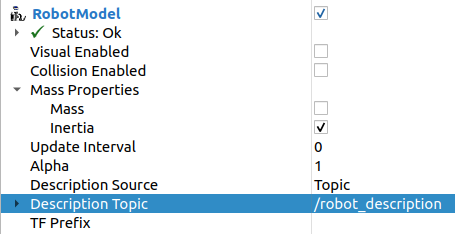
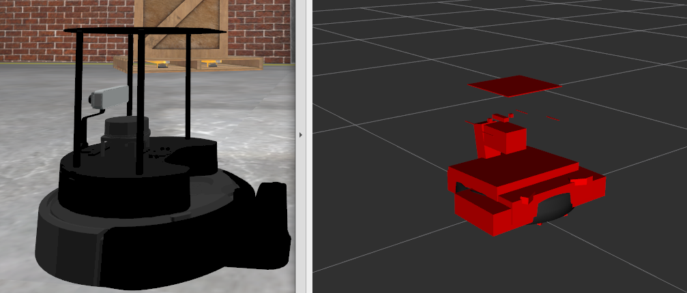

> Navigation: [Wiki index](../../index.md) | [Summary](../../SUMMARY.md) | [Releases hub](../../wiki/tooling-map.md)
> Related: [Alphas](alpha-overview.md) | [Ardent Apalone ( ardent )](release-ardent-apalone.md) | [Beta 1 ( Asphalt )](beta1-overview.md) | [Beta 2 ( r2b2 )](beta2-overview.md) | [Beta 3 ( r2b3 )](beta3-overview.md)

<a id="humble-hawksbill-humble"></a>
<a id="humble-release"></a>

# Humble Hawksbill (`humble`)

Table of Contents

- [Supported Platforms](#supported-platforms)
- [Installation](#installation)
- [Changes in Patch Release 1 (2022-11-23)](#changes-in-patch-release-1-2022-11-23)

  - [ros2topic](#ros2topic)
- [New features in this ROS 2 release](#new-features-in-this-ros-2-release)

  - [ament\_cmake\_gen\_version\_h](#ament-cmake-gen-version-h)
  - [launch](#launch)
  - [launch\_ros](#launch-ros)
  - [SROS2 Security enclaves support Certificate Revocation Lists](#sros2-security-enclaves-support-certificate-revocation-lists)
  - [Content Filtered Topics](#content-filtered-topics)
  - [ros2cli](#ros2cli)
  - [rviz2](#rviz2)
- [Changes since the Galactic release](#changes-since-the-galactic-release)

  - [C++ headers are installed in a subdirectory](#c-headers-are-installed-in-a-subdirectory)
  - [common\_interfaces](#common-interfaces)
  - [rmw](#rmw)
  - [rmw\_connextdds](#rmw-connextdds)
  - [rcl](#rcl)
  - [rclcpp](#rclcpp)
  - [rclcpp\_lifecycle](#rclcpp-lifecycle)
  - [rclpy](#rclpy)
  - [ros1\_bridge](#ros1-bridge)
  - [ros2cli](#id5)
  - [robot\_state\_publisher](#robot-state-publisher)
  - [rosidl\_cmake](#rosidl-cmake)
  - [rviz2](#id7)
  - [geometry2](#geometry2)
  - [rosbag2](#rosbag2)
- [Known Issues](#known-issues)
- [Release Timeline](#release-timeline)

*Humble Hawksbill* is the eighth release of ROS 2.
What follows is highlights of the important changes and features in Humble Hawksbill since the last release.
For a list of all of the changes since Galactic, see the [long form changelog](humble-hawksbill-complete-changelog.md).

<a id="supported-platforms"></a>

## Supported Platforms

Humble Hawksbill supports the following platforms according to [the platform support tiers](../project/platform-support-tiers.md):

Tier 1 platforms:

- Ubuntu 22.04 (Jammy): `amd64` and `arm64`
- Windows 10 (Visual Studio 2019): `amd64`

Tier 2 platforms:

- RHEL 8: `amd64`

Tier 3 platforms:

- Ubuntu 20.04 (Focal): `amd64`
- macOS: `amd64`
- Debian Bullseye: `amd64`

Targeted platforms:

| Architecture | Ubuntu Jammy (22.04) | Windows 10 (VS2019) | RHEL 8 | Ubuntu Focal (20.04) | macOS | Debian Bullseye (11) | OpenEmbedded / Yocto Project |
| --- | --- | --- | --- | --- | --- | --- | --- |
| amd64 | Tier 1 [d][a][s] | Tier 1 [a][s] | Tier 2 [d][a][s] | Tier 3 [s] | Tier 3 [s] | Tier 3 [s] | Tier 3 [s] |
| arm64 | Tier 1 [d][a][s] |  |  | Tier 3 [s] |  | Tier 3 [s] | Tier 3 [s] |
| arm32 | Tier 3 [s] |  |  | Tier 3 [s] |  | Tier 3 [s] | Tier 3 [s] |

The following indicators show what delivery mechanisms are available for
each platform.

" [d] " Distribution-specific (Debian, RPM, etc.) packages will be
provided for this platform for packages submitted to the rosdistro.

" [a] " Binary releases are provided as a single archive per
platform containing all packages in the Humble ROS 2 repos file[^11].

" [s] " Compilation from source.

Middleware Implementation Support:

| Middleware Library | Middleware Provider | Support Level | Platforms | Architectures |
| --- | --- | --- | --- | --- |
| rmw\_fastrtps\_cpp\* | eProsima Fast-DDS | Tier 1 | All Platforms | All Architectures |
| rmw\_cyclonedds\_cpp | Eclipse Cyclone DDS | Tier 1 | All Platforms | All Architectures |
| rmw\_connextdds | RTI Connext | Tier 1 | Ubuntu, Windows, and macOS | All Architectures except arm64 |
| rmw\_fastrtps\_dynamic\_cpp | eProsima Fast-DDS | Tier 2 | All Platforms | All Architectures |
| rmw\_gurumdds\_cpp | GurumNetworks GurumDDS | Tier 3 | Ubuntu and Windows | All Architectures except arm32 |

" \* " means default RMW implementation.

Middleware implementation support is dependent upon the platform support
tier. For example a Tier 1 middleware implementation on a Tier 2
platform can only receive Tier 2 support.

Minimum language requirements:

- C++17
- Python 3.6

Dependency Requirements:

|  | Required Support | | Recommended Support | | | | |
| --- | --- | --- | --- | --- | --- | --- | --- |
| Package | Ubuntu Jammy | Windows 10\*\* | RHEL 8 | Ubuntu Focal | macOS\*\* | Debian Bullseye | OpenEmbedded\*\* |
| CMake | 3.22.1 | 3.22.0 | 3.20.2 | 3.16.3 | 3.14.4 | 3.18.4 | 3.22.3 / 3.16.5\*\*\* |
| EmPY | 3.3.4 | 3.3.2 | | | | | |
| Gazebo Classic | 11.x.x\* | N/A | N/A | 11.0.0\* | 11.x.x | 11.x.x\* | N/A |
| Gazebo (Ignition) | Fortress\* | N/A | N/A | Fortress\* | Fortress\* | Fortress\* | N/A |
| NumPy | 1.21.5 | 1.18.4 | 1.14.3 | 1.17.4 | 1.18.4 | 1.19.5 | N/A |
| Ogre | 1.12.1\* | | | | | | N/A |
| OpenCV | 4.5.4 | 3.4.6\* | 3.4.6 | 4.2.0 | 4.2.0 | 4.5.1 | 4.1.0 / 3.2.0\*\*\* |
| OpenSSL | 1.1.1l | 1.1.1l | 1.1.1k | 1.1.1d | 1.1.1f | 1.1.1i | 1.1.1d / 1.1.1b\*\*\* |
| Python | 3.10.4 | 3.8.3 | 3.6.8 | 3.8.0 | 3.8.2 | 3.9.1 | 3.8.2 / 3.7.5\*\*\* |
| Qt | 5.15.3 | 5.12.12 | 5.15.2 | 5.12.5 | 5.12.3 | 5.15.2 | 5.14.1 / 5.12.5\*\*\* |
|  | | **Linux only** | | | | | |
| PCL | 1.12.1 | N/A | 1.11.1 | 1.10.0 | N/A | 1.11.1 | 1.10.0 |
| **RMW DDS Middleware Providers** | | | | | | | |
| Cyclone DDS | 0.9.x (Papillons) | | | | | | |
| Fast-DDS | 2.6.x | | | | | | |
| Connext DDS | 6.0.1 | | N/A | 6.0.1 | | N/A | |
| Gurum DDS | 2.7.x | | N/A | 2.7.x | N/A | | |

" \* " means that this is not the upstream version (available on the
official Operating System repositories) but a package distributed by
OSRF or the community (package built and distributed on custom
repositories).

" \*\* " means that the dependency may see multiple version changes,
because the dependency uses a package manager that continually updates
the dependency without a stable API.

" \*\*\* " webOS OSE provides this different version.

This document only captures the version at the first release of a ROS
distribution and will not be updated as the dependencies move forward.
These versions are thus a low watermark.

Package manager use for dependencies:

- Ubuntu, Debian: apt
- Windows: Chocolatey, pip
- macOS: Homebrew, pip
- RHEL: dnf
- OpenEmbedded: opkg

Build System Support:

- ament\_cmake
- cmake
- setuptools

<a id="installation"></a>

## Installation

[Install Humble Hawksbill](https://docs.ros.org/en/humble/Installation.html)

<a id="changes-in-patch-release-1-2022-11-23"></a>

## Changes in Patch Release 1 (2022-11-23)

<a id="ros2topic"></a>

### ros2topic

<a id="now-as-keyword-for-builtin-interfaces-msg-time-and-auto-for-std-msgs-msg-header"></a>

#### `now` as keyword for `builtin_interfaces.msg.Time` and `auto` for `std_msgs.msg.Header`

`ros2 topic pub` now allows to set a `builtin_interfaces.msg.Time` message to the current time via the `now` keyword.
Similarly, a `std_msg.msg.Header` message will be automatically generated when passed the keyword `auto`.
This behavior matches that of ROS 1’s `rostopic` (<http://wiki.ros.org/ROS/YAMLCommandLine#Headers.2Ftimestamps>)

Related PR: [ros2/ros2cli#751](https://github.com/ros2/ros2cli/pull/751)

<a id="new-features-in-this-ros-2-release"></a>

## New features in this ROS 2 release

<a id="ament-cmake-gen-version-h"></a>

### ament\_cmake\_gen\_version\_h

<a id="generating-a-c-c-header-with-version-info"></a>

#### Generating a C/C++ header with version info

A new CMake function to generate a header with the package version info was added to the `ament_cmake_gen_version_h` in [ament/ament\_cmake#377](https://github.com/ament/ament_cmake/pull/377).
Here’s the simplest use case:

```
project(my_project)
add_library(my_lib ...)
ament_generate_version_header(my_lib)
```

It will generate a header with version info from the `package.xml` and make it available to targets that link against the `my_lib` library.

How to include the header:

```
#include <my_project/version.h>
```

Where the header is installed to:

```
set(VERSION_HEADER ${CMAKE_INSTALL_PREFIX}/include/my_project/my_project/version.h)
```

<a id="launch"></a>

### launch

<a id="scoping-environment-variables-in-group-actions"></a>

#### Scoping environment variables in group actions

Similar to launch configurations, now by default, the state of environment variables are scoped to group actions.

For example, in the following launch files the executed processe will echo the value `1` (before Humble it would echo `2`):

XML

```
<launch>
  <set_env name="FOO" value="1" />
  <group>
    <set_env name="FOO" value="2" />
  </group>
  <executable cmd="echo $FOO" output="screen" shell="true" />
</launch>
```

Python

```
import launch
import launch.actions

def generate_launch_description():
    return launch.LaunchDescription([
        launch.actions.SetEnvironmentVariable(name='FOO', value='1'),
        launch.actions.GroupAction([
            launch.actions.SetEnvironmentVariable(name='FOO', value='2'),
        ]),
        launch.actions.ExecuteProcess(cmd=['echo', '$FOO'], output='screen', shell=True),
    ])
```

If you would like disable scoping for launch configurations and and environment variables you can set the `scoped` argument (or attribute) to false.

Related PR: [ros2/launch#601](https://github.com/ros2/launch/pull/601)

<a id="launch-pytest"></a>

#### launch\_pytest

We’ve added a new package, `launch_pytest`, that acts as an alternative to `launch_testing`.
`launch_pytest` is a simple pytest plugin that provides pytest fixtures to manage the lifetime of a launch service.

Check out the [package README for details and examples.](https://github.com/ros2/launch/tree/humble/launch_pytest)

Related PR: [ros2/launch#528](https://github.com/ros2/launch/pull/528)

<a id="allow-matching-target-actions-with-a-callable"></a>

#### Allow matching target actions with a callable

Event handlers that take a target action object to match can now also take a callable instead to do the matching.

Related PR: [ros2/launch#540](https://github.com/ros2/launch/pull/540)

<a id="access-to-math-module-when-evaluating-python-expressions"></a>

#### Access to math module when evaluating Python expressions

Inside `PythonExpression` substitutions (`eval`) we can now use symbols from Python’s math module.
For example,

```
<launch>
  <log message="$(eval 'ceil(pi)')" />
</launch>
```

Related PR: [ros2/launch#557](https://github.com/ros2/launch/pull/557)

<a id="boolean-substitutions"></a>

#### Boolean substitutions

New substitutions `NotSubstitution`, `AndSubstitution`, and `OrSubstitution` provide a convenient way to perform logical operations, for example

```
<launch>
  <let name="p" value="true" />
  <let name="q" value="false" />
  <group if="$(or $(var p) $(var q))">
    <log message="The first condition is true" />
  </group>
  <group unless="$(and $(var p) $(var q))">
    <log message="The second condition is false" />
  </group>
  <group if="$(not $(var q))">
    <log message="The third condition is true" />
  </group>
</launch>
```

Related PR: [ros2/launch#598](https://github.com/ros2/launch/pull/598)

<a id="new-actions"></a>

#### New actions

- `AppendEnvironmentVariable` appends a value to an existing environment variable.

  - Related PR: [ros2/launch#543](https://github.com/ros2/launch/pull/543)
- `ResetLaunchConfigurations` resets any configuration applied to the launch configuration.

  - Related PR: [ros2/launch#515](https://github.com/ros2/launch/pull/515)

<a id="launch-ros"></a>

### launch\_ros

<a id="passing-ros-arguments-to-node-actions"></a>

#### Passing ROS arguments to node actions

It is now possible to provide [ROS-specific node arguments](../how-to/node-arguments.md) directly, without needing to use `args` with a leading `--ros-args` flag:

XML

```
<launch>
  <node pkg="demo_nodes_cpp" exec="talker" ros_args="--log-level debug" />
</launch>
```

YAML

```
launch:
- node:
    pkg: demo_nodes_cpp
    exec: talker
    ros_args: '--log-level debug'
```

The corresponding parameter for the `Node` action in Python launch files is `ros_arguments`:

```
from launch import LaunchDescription
import launch_ros.actions

def generate_launch_description():
    return LaunchDescription([
        launch_ros.actions.Node(
            package='demo_nodes_cpp',
            executable='talker',
            ros_arguments=['--log-level', 'debug'],
        ),
    ])
```

Related PRs: [ros2/launch\_ros#249](https://github.com/ros2/launch_ros/pull/249) and [ros2/launch\_ros#253](https://github.com/ros2/launch_ros/pull/253).

<a id="frontend-support-for-composable-nodes"></a>

#### Frontend support for composable nodes

We can now start node containers and load components into them from frontend launch files, for example:

XML

```
<launch>
  <node_container pkg="rclcpp_components" exec="component_container" name="my_container" namespace="">
    <composable_node pkg="composition" plugin="composition::Talker" name="talker" />
  </node_container>
  <load_composable_node target="my_container">
    <composable_node pkg="composition" plugin="composition::Listener" name="listener" />
  </load_composable_node>
</launch>
```

YAML

```
launch:
  - node_container:
      pkg: rclcpp_components
      exec: component_container
      name: my_container
      namespace: ''
      composable_node:
        - pkg: composition
          plugin: composition::Talker
          name: talker
  - load_composable_node:
      target: my_container
      composable_node:
        - pkg: composition
          plugin: composition::Listener
          name: listener
```

Related PR: [ros2/launch\_ros#235](https://github.com/ros2/launch_ros/pull/235)

<a id="parameter-substitution"></a>

#### Parameter substitution

The new `ParameterSubstitution` lets you substitute the value of a parameter set previously in launch with the `SetParameter` action.
For example,

```
<launch>
  <set_parameter name="foo" value="bar" />
  <log message="Parameter foo has value $(param foo)" />
</launch>
```

Related PR: [ros2/launch\_ros#297](https://github.com/ros2/launch_ros/pull/297)

<a id="id1"></a>

#### New actions

- `RosTimer` acts like the launch `TimerAction`, but uses a ROS clock (so it can use simulation time, for example).

  - Related PRs: [ros2/launch\_ros#244](https://github.com/ros2/launch_ros/pull/244) and [ros2/launch\_ros#264](https://github.com/ros2/launch_ros/pull/264)
- `SetParametersFromFile` passes a ROS parameters file to all nodes in a launch file (including node components).

  - Related PRs: [ros2/launch\_ros#260](https://github.com/ros2/launch_ros/pull/260) and [ros2/launch\_ros#281](https://github.com/ros2/launch_ros/pull/281)

<a id="sros2-security-enclaves-support-certificate-revocation-lists"></a>

### SROS2 Security enclaves support Certificate Revocation Lists

Certificate Revocation Lists (CRLs) are a concept where particular certificates can be revoked before their expiration.
As of Humble, it is now possible to put a CRL in an SROS2 security enclave and have it be honored.
See [the SROS2 tutorials](https://github.com/ros2/sros2/blob/humble/SROS2_Linux.md#certificate-revocation-lists) for an example of how to use it.

<a id="content-filtered-topics"></a>

### Content Filtered Topics

Content Filtered Topics supports a more sophisticated subscription that indicates the subscriber does not want to necessarily see all values of each instance published under the Topic.
Content Filtered Topics can be used to request content-based subscriptions when underlying RMW implementation supports this feature.

RMW Content Filtered Topics support

|  |  |
| --- | --- |
| rmw\_fastrtps | supported |
| rmw\_connextdds | supported |
| rmw\_cyclonedds | not supported |

To learn more, see the [content\_filtering](https://github.com/ros2/examples/blob/humble/rclcpp/topics/minimal_subscriber/content_filtering.cpp) examples.

Related design PR: [ros2/design#282](https://github.com/ros2/design/pull/282).

<a id="ros2cli"></a>

### ros2cli

<a id="ros2-launch-has-a-launch-prefix-argument"></a>

#### `ros2 launch` has a `--launch-prefix` argument

This allows passing a prefix to all executables in a launch file, which is useful in many debugging situations.
See the associated [pull request](https://github.com/ros2/launch_ros/pull/254), as well as the [tutorial](../how-to/migrating-from-ros1/migrating-launch-files.md#launch-prefix-example) for more information.

Relatedly, the `--launch-prefix-filter` command-line option was added to selectively add the prefix from `--launch-prefix` to executables.
See the [pull request](https://github.com/ros2/launch_ros/pull/261) for more information.

<a id="ros2-topic-echo-has-a-flow-style-argument"></a>

#### `ros2 topic echo` has a `--flow-style` argument

This allows the user to force `flow style` for the YAML representation of data on a topic.
Without this option, the output from `ros2 topic echo /tf_static` could look something like:

```
transforms:
- header:
    stamp:
      sec: 1651172841
      nanosec: 433705575
    frame_id: single_rrbot_link3
  child_frame_id: single_rrbot_camera_link
  transform:
    translation:
      x: 0.05
      y: 0.0
      z: 0.9
    rotation:
      x: 0.0
      y: 0.0
      z: 0.0
      w: 1.0
```

With this option, the output would look something like:

```
transforms: [{header: {stamp: {sec: 1651172841, nanosec: 433705575}, frame_id: single_rrbot_link3}, child_frame_id: single_rrbot_camera_link, transform: {translation: {x: 0.05, y: 0.0, z: 0.9}, rotation: {x: 0.0, y: 0.0, z: 0.0, w: 1.0}}}]
```

See the [PyYAML documentation](https://pyyaml.docsforge.com/master/documentation/#dictionaries-without-nested-collections-are-not-dumped-correctly) for more information.

<a id="ros2-topic-echo-can-filter-data-based-on-message-contents"></a>

#### `ros2 topic echo` can filter data based on message contents

This allows the user to only print out data on a topic that matches a certain Python expression.
For instance, using the following argument will only print out string messages that start with ‘foo’:

```
ros2 topic echo --filter 'm.data.startswith("foo")` /chatter
```

See the [pull request](https://github.com/ros2/ros2cli/pull/654) for more information.

<a id="rviz2"></a>

### rviz2

<a id="apply-textures-to-arbitrary-triangle-lists"></a>

#### Apply textures to arbitrary triangle lists

We’ve added [the ability to apply textures defined via URI to arbitrary triangle lists using UV Coordinates](https://github.com/ros2/rviz/pull/719).
Now we can create a gradient pull from a texture map instead of the default grayscale.
This will enable complex coloring of markers.
To use this, you should use the `visualization_msgs/Marker.msg` and fill the `texture_resource`, `texture`, `uv_coordinates` and `mesh_file` fields.
You can find more information [here](https://github.com/ros2/common_interfaces/pull/153).


<a id="visualization-of-mass-properties-including-inertia"></a>

#### Visualization of mass properties (including inertia)

We also added the ability to visualize inertias. To do this, you select enable ‘Inertia’ in the ‘Mass Properties’ under the robot model:



You can see an image of an inertia below.



<a id="visualize-yuv-images-in-rviz"></a>

#### Visualize YUV images in RViz

It is now possible to directly visualize YUV images inside of RViz, rather than having to convert to RGB first.
See [ros2/rviz#701](https://github.com/ros2/rviz/pull/701) for details.

<a id="allow-rendering-of-objects-100-meters"></a>

#### Allow rendering of objects > 100 meters

By default, RViz only renders objects that are within 100 meters of a camera.
A new configuration property called “Far Plane Distance” in the rviz camera plugin allows that rendering distance to be configured.


See [ros2/rviz#849](https://github.com/ros2/rviz/pull/849) for more information.

<a id="changes-since-the-galactic-release"></a>

## Changes since the Galactic release

<a id="c-headers-are-installed-in-a-subdirectory"></a>

### C++ headers are installed in a subdirectory

In ROS 2 releases prior to Humble, C++ headers for all packages were installed into a single include directory.
For instance, in Galactic, the directory structure looks like this (reduced for brevity):

```
/opt/ros/galactic/include/
├── rcl
│   ├── node.h
├── rclcpp
│   ├── node.hpp
```

This structure can cause serious problems when trying to use overlays.
That is, it is very possible to get the wrong set of header files due to include directory order.
See <https://colcon.readthedocs.io/en/released/user/overriding-packages.html> for a detailed explanation of the problems.

To help combat this, in Humble (and in all ROS 2 releases going forward), the directory structure has changed:

```
/opt/ros/humble/include
├── rcl
│   └── rcl
│       ├── node.h
├── rclcpp
│   └── rclcpp
│       ├── node.hpp
```

Note that downstream packages that use these headers do *not* have to change; using `#include <rclcpp/node.hpp>` works as it always did before.
However, when using IDEs that are looking for include directories, it may be necessary to add the individual include directories to the search path.

See <https://github.com/ros2/ros2/issues/1150> for more information, including the reasoning behind this change.

<a id="common-interfaces"></a>

### common\_interfaces

<a id="support-textures-and-embedded-meshes-for-marker-messages"></a>

#### Support Textures and Embedded Meshes for Marker Messages

These two additions will improve the ability to both visualize data in new ways with standard messages and, simultaneously, enable the ability to track this data in rosbag.

**Textures** bring the addition of three new fields to markers:

```
# Texture resource is a special URI that can either reference a texture file in
# a format acceptable to (resource retriever)[https://index.ros.org/p/resource_retriever/]
# or an embedded texture via a string matching the format:
#   "embedded://texture_name"
string texture_resource
# An image to be loaded into the rendering engine as the texture for this marker.
# This will be used iff texture_resource is set to embedded.
sensor_msgs/CompressedImage texture
# Location of each vertex within the texture; in the range: [0.0-1.0]
UVCoordinate[] uv_coordinates
```

RViz will fully support texture rendering through the embedded format.

To those familiar with `mesh_resource`, `resource_retriever` should be familiar.
This will allow the programmer to choose where they want to load data from, either a local file or a networked file.
In the interest of being able to record all data in a rosbag, the ability to embed the texture image is included.

**Meshes** were modified in a similar way to add the ability to embed a raw Mesh file for the purpose of recording and are modified in a similar way. The Meshfile message has two fields:

```
# The filename is used for both debug purposes and to provide a file extension
# for whatever parser is used.
string filename

# This stores the raw text of the mesh file.
uint8[] data
```

The embedded `Meshfile` message is not yet supported in implementation.

Related PRs: [ros2/common\_interfaces#153](https://github.com/ros2/common_interfaces/pull/153) [ros2/rviz#719](https://github.com/ros2/rviz/pull/719)

<a id="added-prism-type-to-solidprimitive"></a>

#### Added `PRISM` type to SolidPrimitive

The `SolidPrimitive` message had a new `PRISM` type added, along with the appropriate metadata.
See [ros2/common\_interfaces#167](https://github.com/ros2/common_interfaces/pull/167) for more information.

<a id="rmw"></a>

### rmw

<a id="struct-type-name-suffix-changed-from-t-to-s"></a>

#### `struct` type name suffix changed from `_t` to `_s`

To avoid type name duplication errors between `struct` type names and their `typedef`-ed aliases when generating code documentation, the suffix for all `struct` type names has been changed from `_t` to `_s`.
Aliases with `_t` suffixes remain in place.
Thus, this change is a breaking change only for code that uses full `struct` type specifiers i.e. `struct type_name_t`.

See [ros2/rmw#313](https://github.com/ros2/rmw/pull/313) for more details.

<a id="rmw-connextdds"></a>

### rmw\_connextdds

<a id="use-connext-6-by-default"></a>

#### Use Connext 6 by default

By default, Humble Hawksbill uses Connext 6.0.1 as the DDS implementation for `rmw_connextdds`.
It is still possible to use Connext 5.3.1 with `rmw_connextdds`, but it must be rebuilt from source.

<a id="rcl"></a>

### rcl

<a id="id2"></a>

#### `struct` type name suffix changed from `_t` to `_s`

To avoid type name duplication errors between `struct` type names and their `typedef`-ed aliases when generating code documentation, the suffix for all `struct` type names has been changed from `_t` to `_s`.
Aliases with `_t` suffixes remain in place.
Thus, this change is a breaking change only for code that uses full `struct` type specifiers i.e. `struct type_name_t`.

See [ros2/rcl#932](https://github.com/ros2/rcl/pull/932) for more details.

<a id="ros-disable-loaned-messages-environment-variable-added"></a>

#### ROS\_DISABLE\_LOANED\_MESSAGES environment variable added

This environment variable can be used to disable loaned messages support, independently if the rmw supports them or not.
For more details, see the guide [Configure Zero Copy Loaned Messages](../how-to/configure-zero-copy-loaned-messages.md).

<a id="rclcpp"></a>

### rclcpp

<a id="support-type-adaption-for-publishers-and-subscriptions"></a>

#### Support Type Adaption for Publishers and Subscriptions

After defining a type adapter, custom data structures can be used directly by publishers and subscribers, which helps to avoid additional work for the programmer and potential sources of errors.
This is especially useful when working with complex data types, such as when converting OpenCV’s `cv::Mat` to ROS’s `sensor_msgs/msg/Image` type.

Here is an example of a type adapter that converts `std_msgs::msg::String` to `std::string`:

```
template<>
struct rclcpp::TypeAdapter<
   std::string,
   std_msgs::msg::String
>
{
  using is_specialized = std::true_type;
  using custom_type = std::string;
  using ros_message_type = std_msgs::msg::String;

  static
  void
  convert_to_ros_message(
    const custom_type & source,
    ros_message_type & destination)
  {
    destination.data = source;
  }

  static
  void
  convert_to_custom(
    const ros_message_type & source,
    custom_type & destination)
  {
    destination = source.data;
  }
};
```

And an example of how the type adapter can be used:

```
using MyAdaptedType = TypeAdapter<std::string, std_msgs::msg::String>;

// Publish a std::string
auto pub = node->create_publisher<MyAdaptedType>(...);
std::string custom_msg = "My std::string"
pub->publish(custom_msg);

// Pass a std::string to a subscription's callback
auto sub = node->create_subscription<MyAdaptedType>(
  "topic",
  10,
  [](const std::string & msg) {...});
```

To learn more, see the [publisher](https://github.com/ros2/examples/blob/b83b18598b198b4a5ba44f9266c1bb39a393fa17/rclcpp/topics/minimal_publisher/member_function_with_type_adapter.cpp) and [subscription](https://github.com/ros2/examples/blob/b83b18598b198b4a5ba44f9266c1bb39a393fa17/rclcpp/topics/minimal_subscriber/member_function_with_type_adapter.cpp) examples, as well as a more complex [demo](https://github.com/ros2/demos/pull/482).
For more details, see [REP 2007](https://reps.openrobotics.org/rep-2007/).

<a id="client-asnyc-send-request-request-returns-a-std-future-instead-of-a-std-shared-future"></a>

#### `Client::asnyc_send_request(request)` returns a `std::future` instead of a `std::shared_future`

This change was implemented in [rclcpp#1734](https://github.com/ros2/rclcpp/pull/1734).
This breaks API, as `std::future::get()` methods extracts the value from the future.
That means, if that method is called for a second time it will throw an exception.
That doesn’t happen with a `std::shared_future`, as its `get()` method returns a `const &`.
Example:

```
auto future = client->async_send_request(req);
...
do_something_with_response(future.get());
...
do_something_else_with_response(future.get());  // this will throw an exception now!!
```

should be updated to:

```
auto future = client->async_send_request(req);
...
auto response = future.get();
do_something_with_response(response);
...
do_something_else_with_response(response);
```

If a shared future is needed, the `std::future::share()` method can be used.

<a id="wait-for-all-acked-method-added-to-publisher"></a>

#### `wait_for_all_acked` method added to `Publisher`

This new method will block until all messages in the publisher queue are acked by the matching subscriptions or the specified timeout expires.
It is only useful for reliable publishers, as in the case of best effort QoS there’s no acking.
Examples:

```
auto pub = node->create_publisher<std_msgs::msg::String>(...);
...
pub->publish(my_msg);
...
pub->wait_for_all_acked(); // or pub->wait_for_all_acked(timeout)
```

For a more complete example, see [here](https://github.com/ros2/examples/blob/humble/rclcpp/topics/minimal_publisher/member_function_with_wait_for_all_acked.cpp).

<a id="get-callback-groups-method-removed-from-nodebase-and-node-classes"></a>

#### `get_callback_groups` method removed from `NodeBase` and `Node` classes

`for_each_callback_group()` method has replaced `get_callback_groups()` by providing a thread-safe way to access `callback_groups_` vector.
`for_each_callback_group()` accepts a function as an argument, iterates over the stored callback groups, and calls the passed function to ones that are valid.

For more details, please refer to this [pull request](https://github.com/ros2/rclcpp/pull/1723).

<a id="add-to-wait-set-method-from-waitable-class-changes-its-return-type-from-bool-to-void"></a>

#### `add_to_wait_set` method from `Waitable` class changes its return type from `bool` to `void`

Before, classes derived from `Waitable` overriding `add_to_wait_set` were returning false when failing to add elements to the wait set, so the caller had to check this return value and throw or handle the error.
This error handling should now be done directly on `add_to_wait_set` method, throwing if necessary.
It is not required to return anything if no errors happened.
Thus, this is a breaking change for downstream uses of `Waitable`.

See [ros2/rclcpp#1612](https://github.com/ros2/rclcpp/pull/1612) for more details.

<a id="get-notify-guard-condition-method-return-type-from-nodebaseinterface-class-changed"></a>

#### `get_notify_guard_condition` method return type from `NodeBaseInterface` class changed

Now `rclcpp` uses the `GuardCondition` class wrapper around `rcl_guard_condition_t`, so `get_notify_guard_condition` returns a reference to the node’s `rclcpp::GuardCondition`.
Thus, this is a breaking change for downstream uses of `NodeBaseInterface` and `NodeBase`.

See [ros2/rclcpp#1612](https://github.com/ros2/rclcpp/pull/1612) for more details.

<a id="sleep-until-and-sleep-for-methods-added-to-clock"></a>

#### `sleep_until` and `sleep_for` methods added to `Clock`

Two new methods were added to allow sleeping on a particular clock in [ros2/rclcpp#1814](https://github.com/ros2/rclcpp/pull/1814) and [ros2/rclcpp#1828](https://github.com/ros2/rclcpp/pull/1828).
`Clock::sleep_until` will suspend the current thread until the clock reaches a particular time.
`Clock::sleep_for` will suspend the current thread until the clock advances a certain amount of time from when the method was called.
Both methods will wake early if the `Context` is shutdown.

<a id="rclcpp-lifecycle"></a>

### rclcpp\_lifecycle

<a id="active-and-deactivate-transitions-of-publishers-will-be-triggered-automatically"></a>

#### Active and deactivate transitions of publishers will be triggered automatically

Before, users needed to override `LifecylceNode::on_activate()` and `LifecylceNode::on_deactivate()` and call the similarly named methods on `LifecyclePublisher` to make the transition actually happen.
Now, `LifecylceNode` provides a default interface of these methods that already do this.
See the implementation of the `lifecycle_talker` node [here](https://github.com/ros2/demos/tree/humble/lifecycle).

<a id="rclpy"></a>

### rclpy

<a id="managed-nodes"></a>

#### Managed nodes

Lifecycle nodes support was added to rclpy.
A complete demo can be found [here](https://github.com/ros2/demos/tree/humble/lifecycle_py).

<a id="id3"></a>

#### `wait_for_all_acked` method added to `Publisher`

Similar to the feature added to rclcpp.

<a id="id4"></a>

#### `sleep_until` and `sleep_for` methods added to `Clock`

Two new methods were added to allow sleeping on a particular clock in [ros2/rclpy#858](https://github.com/ros2/rclpy/pull/858) and [ros2/rclpy#864](https://github.com/ros2/rclpy/pull/864).
`sleep_until` will suspend the current thread until the clock reaches a particular time.
`sleep_for` will suspend the current thread until the clock advances a certain amount of time from when the method was called.
Both methods will wake early if the `Context` is shutdown.

<a id="ros1-bridge"></a>

### ros1\_bridge

Since there is no official ROS 1 distribution on Ubuntu Jammy and forward, `ros1_bridge` is now compatible with the Ubuntu-packaged versions of ROS 1.
More details about using `ros1_bridge` with Jammy packages are available in [the how-to guides](../how-to/using-ros1-bridge-jammy-upstream.md).

<a id="id5"></a>

### ros2cli

<a id="ros2-commands-disable-output-buffering-by-default"></a>

#### `ros2` commands disable output buffering by default

Prior to this release, running a command like

```
ros2 echo /chatter | grep "Hello"
```

would not print any data until the output buffer was full.
Users could work around this by setting `PYTHONUNBUFFERED=1`, but that was not very user friendly.

Instead, all `ros2` commands now do line-buffering by default, so commands like the above work as soon as a newline is printed.
To disable this behavior and use default python buffering rules, use the option `--use-python-default-buffering`.
See the [original issue](https://github.com/ros2/ros2cli/issues/595) and the [pull request](https://github.com/ros2/ros2cli/pull/659) for more information.

<a id="ros2-topic-pub-will-wait-for-one-matching-subscription-when-using-times-once-1"></a>

#### `ros2 topic pub` will wait for one matching subscription when using `--times/--once/-1`

When using `--times/--once/-1` flags, `ros2 topic pub` will wait for one matching subscription to be found before starting to publish.
This avoids the issue of the ros2cli node starting to publish before discovering a matching subscription, which results in some of the first messages being lost.
This is particularly unexpected when using a reliable qos profile.

The number of matching subscriptions to wait before starting publishing can be configured with the `-w/--wait-matching-subscriptions` flags, e.g.:

```
$ ros2 topic pub -1 -w 3 /chatter std_msgs/msg/String "{data: 'foo'}"
```

to wait for three matching subscriptions before starting to publish.

`-w` can also be used independently of `--times/--once/-1` but it only defaults to one when combined with them, otherwise the `-w` default is zero.

See <https://github.com/ros2/ros2cli/pull/642> for more details.

<a id="ros2-param-dump-default-output-changed"></a>

#### `ros2 param dump` default output changed

> - `--print` option for dump command was [deprecated](https://github.com/ros2/ros2cli/pull/638).
>
>   It prints to stdout by default:
>
>   ```
>   $ ros2 param dump /my_node_name
>   ```
> - `--output-dir` option for dump command was [deprecated](https://github.com/ros2/ros2cli/pull/638).
>
>   To dump parameters to a file, run:
>
>   ```
>   $ ros2 param dump /my_node_name > my_node_name.yaml
>   ```

<a id="ros2-param-set-now-accepts-more-yaml-syntax"></a>

#### `ros2 param set` now accepts more YAML syntax

Previously, attempting to set a string like “off” to a parameter that was of string type did not work.
That’s because `ros2 param set` interprets the command-line arguments as YAML, and YAML considers “off” to be a boolean type.
As of <https://github.com/ros2/ros2cli/pull/684> , `ros2 param set` now accepts the YAML escape sequence of “!!str off” to ensure that the value is considered a string.

<a id="ros2-pkg-create-can-automatically-generate-a-license-file"></a>

#### `ros2 pkg create` can automatically generate a LICENSE file

If the `--license` flag is passed to `ros2 pkg create`, and the license is one of the known licenses, `ros2 pkg create` will now automatically generate a LICENSE file in the root of the package.
For a list of known licenses, run `ros2 pkg create --license ? <package_name>`.
See the associated [pull request](https://github.com/ros2/ros2cli/pull/650) for more information.

<a id="robot-state-publisher"></a>

### robot\_state\_publisher

<a id="added-frame-prefix-parameter"></a>

#### Added `frame_prefix` parameter

A new parameter `frame_prefix` was added in [ros/robot\_state\_publisher#159](https://github.com/ros/robot_state_publisher/pull/159).
This parameter is a string which is prepended to all frame names published by `robot_state_publisher`.
Similar to `tf_prefix` in the original `tf` library in ROS 1, this parameter can be used to publish the same robot description multiple times with different frame names.

<a id="removal-of-deprecated-use-tf-static-parameter"></a>

#### Removal of deprecated `use_tf_static` parameter

The deprecated `use_tf_static` parameter has been removed from `robot_state_publisher`.
This means that static transforms are unconditionally published to the `/tf_static` topic, and that the static transforms are published in a `transient_local` Quality of Service.
This was the default behavior, and the behavior which the `tf2_ros::TransformListener` class expected before, so most code will not have to be changed.
Any code that was relying on `robot_state_publisher` to periodically publish static transforms to `/tf` will have to be updated to subscribe to `/tf_static` as a `transient_local` subscription instead.

<a id="rosidl-cmake"></a>

### rosidl\_cmake

<a id="deprecation-of-rosidl-target-interfaces"></a>

#### Deprecation of `rosidl_target_interfaces()`

The CMake function `rosidl_target_interfaces()` has been deprecated, and now issues a CMake warning when called.
Users wanting to use messages/services/actions in the same ROS package that generated them should instead call `rosidl_get_typesupport_target()` and then `target_link_libraries()` to make their targets depend on the returned typesupport target.
See <https://github.com/ros2/rosidl/pull/606> for more details, and <https://github.com/ros2/demos/pull/529> for an example of using the new function.

<a id="id7"></a>

### rviz2

- [improved the efficiency of 3-bytes pixel formats](https://github.com/ros2/rviz/pull/743)
- [changed the way inertias are computed to use ignition math rather than Ogre’s math libraries](https://github.com/ros2/rviz/pull/751).

<a id="geometry2"></a>

### geometry2

<a id="deprecation-of-tf2error-no-error-etc"></a>

#### Deprecation of TF2Error::NO\_ERROR, etc

The `tf2` library uses an enumeration called `TF2Error` to return errors.
Unfortunately, one of the enumerators in there is called `NO_ERROR`, which conflicts with a macro on Windows.
To remedy this, a new set of enumerators in `TF2Error` were created, each with a `TF2` prefix.
The previous enumerators are still available, but are now deprecated and will print a deprecation warning if used.
All code that uses the `TF2Error` enumerator should be updated to use the new `TF2` prefixed errors.
See <https://github.com/ros2/geometry2/pull/349> for more details.

<a id="more-intuitive-command-line-arguments-for-static-transform-publisher"></a>

#### More intuitive command-line arguments for static\_transform\_publisher

The `static_transform_publisher` program used to take arguments like: `ros2 run tf2_ros static_transform_publisher 0 0 0 0 0 0 1 foo bar`.
The first three numbers are the translation x, y, and z, the next 4 are the quaternion x, y, z, and w, and the last two arguments are the parent and child frame IDs.
While this worked, it had a couple of problems:

- The user had to specify *all* of the arguments, even if only setting one number
- Reading the command-line to figure out what it was publishing was tricky

To fix both of these issues, the command-line handling has been changed to use flags instead, and all flags except for `--frame-id` and `--child-frame-id` are optional.
Thus, the above command-line can be simplified to: `ros2 run tf2_ros static_transform_publisher --frame-id foo --child-frame-id bar`
To change just the translation x, the command-line would be: `ros2 run tf2_ros static_transform_publisher --x 1.5 --frame-id foo --child-frame-id bar`.

The old-style arguments are still allowed in this release, but are deprecated and will print a warning.
They will be removed in future releases.
See <https://github.com/ros2/geometry2/pull/392> for more details.

<a id="transform-listener-spin-thread-no-longer-executes-node-callbacks"></a>

#### Transform listener spin thread no longer executes node callbacks

`tf2_ros::TransformListener` no longer spins on the provided node object.
Instead, it creates a callback group to execute callbacks on the entities it creates internally.
This means if you have set the parameter `spin_thread=true` when creating a transform listener, you
can no longer depend on your own callbacks to be executed.
You must call a `spin` function on your node (e.g. `rclcpp::spin`), or add your node to your own executor.

Related pull request: [geometry2#442](https://github.com/ros2/geometry2/pull/442)

<a id="rosbag2"></a>

### rosbag2

<a id="new-playback-and-recording-controls"></a>

#### New playback and recording controls

Several pull requests have been added to enhance the user’s control over playback of bags.
Pull request [931](https://github.com/ros2/rosbag2/pull/931) adds the ability to specify a time stamp to begin playing from.
Due to pull request [789](https://github.com/ros2/rosbag2/pull/789) it is now possible to delay the start of playback by a specified interval.

Relatedly, `rosbag2` has gained new ways for users to control playback as it is happening.
Pull request [847](https://github.com/ros2/rosbag2/pull/847) adds keyboard controls for pausing, resuming, and playing the next message during playback from a terminal.
It is also possible to start playback paused thanks to pull requests [905](https://github.com/ros2/rosbag2/pull/905) and [904](https://github.com/ros2/rosbag2/pull/904), which makes it easy for the user to initiate playback and then step through messages, such as when debugging a pipeline.
Pull request [836](https://github.com/ros2/rosbag2/pull/836) adds an interface for seeking within bags, allowing the user to move around within a bag during playback.

Finally, a new snapshot mode has been added to recording in pull request [851](https://github.com/ros2/rosbag2/pull/851).
This mode, useful for incident recording, allows recording to begin filling up buffers, but not begin writing data to disc until a service is called.

<a id="burst-mode-playback"></a>

#### Burst-mode playback

While the playback of data from a bag in real-time is the most well-known use case for bag files, there are situations where you want the data in the bag as fast as possible.
With pull request [977](https://github.com/ros2/rosbag2/pull/977), `rosbag2` has gained the ability to “burst” data from the bag.
In burst mode, the data is played back as fast as possible.
This is useful in applications such as machine learning.

<a id="zero-copy-playback"></a>

#### Zero-Copy playback

By default, if loaned message can be used, playback messages are published as loaned message.
This can help to reduce the number of data copies, so there is a greater benefit for sending big data.
Pull request [981](https://github.com/ros2/rosbag2/pull/981) adds `--disable-loan-message` option for playback.

<a id="wait-for-an-acknowledgment"></a>

#### Wait for an acknowledgment

This new option will wait until all published messages are acknowledged by all subscribers or until the timeout elapses in millisecond before play is terminated.
Especially for the case of sending message with big size in a short time.
This option is valid only if the publisher’s QOS profile is RELIABLE.
Pull request [951](https://github.com/ros2/rosbag2/pull/951) adds `--wait-for-all-acked` option for playback.

<a id="bag-editing"></a>

#### Bag editing

`rosbag2` is taking steps towards enabling the editing of bags, such as removing all messages for one topic or merging multiple bags into a single bag.
Pull request [921](https://github.com/ros2/rosbag2/pull/921) adds bag rewriting and the `ros2 bag convert` verb.

<a id="other-changes"></a>

#### Other changes

Pull request [925](https://github.com/ros2/rosbag2/pull/925) makes `rosbag2` ignore “leaf topics” (topics without a publisher) when recording.
These topics will no longer be automatically added to the bag.

<a id="known-issues"></a>

## Known Issues

- When [installing ROS 2 on an Ubuntu 22.04 Jammy host](https://docs.ros.org/en/humble/Installation/Ubuntu-Install-Debians.html) it is important to update your system before installing ROS 2 packages.
  It is *particularly* important to make sure that `systemd` and `udev` are updated to the latest available version otherwise installing `ros-humble-desktop`, which depends on `libudev1`, could cause the removal of system critical packages.
  Details can be found in [ros2/ros2#1272](https://github.com/ros2/ros2/issues/1272) and [Launchpad #1974196](https://bugs.launchpad.net/ubuntu/+source/systemd/+bug/1974196)
- When ROS 2 apt repositories are available, ROS 1 packages in Ubuntu are not installable. See the [ros1\_bridge on Ubuntu Jammy](../how-to/using-ros1-bridge-jammy-upstream.md) document for more information.
- Some major Linux distributions have started patching Python to install packages to `/usr/local`, which is breaking some parts of `ament_package` and builds with `colcon`.
  In particular, using Ubuntu Jammy with `setuptools` installed from pip will manifest this misbehavior, and is therefore not recommended.
  There is currently a [proposed solution](https://github.com/colcon/colcon-core/pull/512) which requires further testing before widespread release.
- ROS 2 bags that are split by size or duration are not played correctly.
  Only the last bag recorded is played.
  It is recommended to avoid splitting bags by size or duration.
  Details can be found in [ros2/rosbag2#966](https://github.com/ros2/rosbag2/issues/966).

<a id="release-timeline"></a>

## Release Timeline

> Mon. March 21, 2022 - Alpha + RMW freeze
> :   Preliminary testing and stabilization of ROS Base [[1]](#id25) packages, and API and feature freeze for RMW provider packages.
>
> Mon. April 4, 2022 - Freeze
> :   API and feature freeze for ROS Base [[1]](#id25) packages in Rolling Ridley.
>     Only bug fix releases should be made after this point.
>     New packages can be released independently.
>
> Mon. April 18, 2022 - Branch
> :   Branch from Rolling Ridley.
>     `rosdistro` is reopened for Rolling PRs for ROS Base [[1]](#id25) packages.
>     Humble development shifts from `ros-rolling-*` packages to `ros-humble-*` packages.
>
> Mon. April 25, 2022 - Beta
> :   Updated releases of ROS Desktop [[2]](#id26) packages available.
>     Call for general testing.
>
> Mon. May 16, 2022 - Release Candidate
> :   Release Candidate packages are built.
>     Updated releases of ROS Desktop [[2]](#id26) packages available.
>
> Thu. May 19, 2022 - Distro Freeze
> :   Freeze rosdistro.
>     No PRs for Humble on the `rosdistro` repo will be merged (reopens after the release announcement).
>
> Mon. May 23, 2022 - General Availability
> :   Release announcement.
>     `rosdistro` is reopened for Humble PRs.

[1]
([1](#id20),[2](#id21),[3](#id22))

The `ros_base` variant is described in [REP 2001 (ros-base)](https://reps.openrobotics.org/rep-2001/#ros-base).

[2]
([1](#id23),[2](#id24))

The `desktop` variant is described in [REP 2001 (desktop-variants)](https://reps.openrobotics.org/rep-2001/#desktop-variants).
