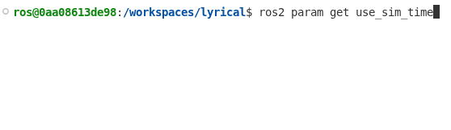
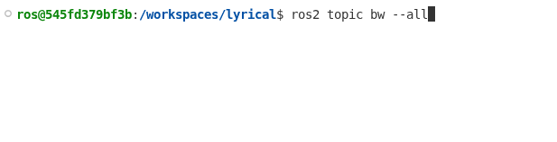

> Navigation: [Wiki index](../../index.md) | [Summary](../../SUMMARY.md) | [Releases hub](../../wiki/tooling-map.md)
> Related: [Alphas](alpha-overview.md) | [Ardent Apalone ( ardent )](release-ardent-apalone.md) | [Beta 1 ( Asphalt )](beta1-overview.md) | [Beta 2 ( r2b2 )](beta2-overview.md) | [Beta 3 ( r2b3 )](beta3-overview.md)

<a id="lyrical-luth-codename-lyrical-may-2026"></a>
<a id="latest-release"></a>
<a id="lyrical-release"></a>

# Lyrical Luth (codename ‘lyrical’; May, 2026)

*Lyrical Luth* is the twelfth release of ROS 2.
It is a Long Term Support (LTS) release, and it is supported until May 2031.

- [Install Lyrical Luth](https://docs.ros.org/en/lyrical/Installation.html)
- [Lyrical Luth Release Timeline](https://docs.ros.org/en/lyrical/release-timeline/)
- [Lyrical Luth Supported Platforms](https://docs.ros.org/en/lyrical/supported-platforms/)

<a id="new-features-in-lyrical"></a>

## New Features in Lyrical

This section highlights some of the new features in ROS Lyrical.
For all changes, see the [full ROS Lyrical changelog](lyrical-luth-complete-changelog.md).

Table of Contents

- [Callback Group Events executor (`rclcpp`)](#callback-group-events-executor-rclcpp)
- [Parameter range descriptors check bounds for integer and double arrays (`rclcpp`)](#parameter-range-descriptors-check-bounds-for-integer-and-double-arrays-rclcpp)
- [`AsyncNode` lets you use `asyncio` (`rclpy`)](#asyncnode-lets-you-use-asyncio-rclpy)
- [Publish messages without copying data using `rosidl::Buffer`](#publish-messages-without-copying-data-using-rosidl-buffer)
- [Annotate types in YAML Parameter Files](#annotate-types-in-yaml-parameter-files)
- [Per-message log severity in launch files](#per-message-log-severity-in-launch-files)
- [New substitutions in XML and YAML launch files](#new-substitutions-in-xml-and-yaml-launch-files)
- [Choose ROS logging backend at runtime](#choose-ros-logging-backend-at-runtime)
- [Control bag recording remotely using ROS services](#control-bag-recording-remotely-using-ros-services)
- [Control bag Playback and Recording using Python](#control-bag-playback-and-recording-using-python)
- [Circular bag recording with limit on number of bags](#circular-bag-recording-with-limit-on-number-of-bags)
- [More descriptive bag split names](#more-descriptive-bag-split-names)
- [Catch data loss early with `rosbag2` message-loss observability](#catch-data-loss-early-with-rosbag2-message-loss-observability)
- [`fish` shell support](#fish-shell-support)
- [`ros2 param get` a parameter from all nodes](#ros2-param-get-a-parameter-from-all-nodes)
- [`ros2 param` get and set multiple parameters on one node](#ros2-param-get-and-set-multiple-parameters-on-one-node)
- [`ros2 doctor --report` now reports Actions, Services, and Environment variables](#ros2-doctor-report-now-reports-actions-services-and-environment-variables)
- [Verbose service information `ros2 service info --verbose`](#verbose-service-information-ros2-service-info-verbose)
- [`ros2 topic bw` multiple topics at once](#ros2-topic-bw-multiple-topics-at-once)
- [URDF improvements](#urdf-improvements)
- [`robot_state_publisher` can read the robot description from a topic](#robot-state-publisher-can-read-the-robot-description-from-a-topic)
- [Resource retriever service](#resource-retriever-service)
- [Call `ament_python_install_package` multiple times](#call-ament-python-install-package-multiple-times)
- [New CMake target: `ament_cmake_ros_core::ament_ros_defaults`](#new-cmake-target-ament-cmake-ros-core-ament-ros-defaults)
- [New thread naming utilities](#new-thread-naming-utilities)
- [New `rcutils` APIs](#new-rcutils-apis)
- [New `rcl` APIs](#new-rcl-apis)
- [Pass constructor arguments to plugins using `class_loader`](#pass-constructor-arguments-to-plugins-using-class-loader)
- [Runtime tracing opt-out mechanism](#runtime-tracing-opt-out-mechanism)
- [Long-term tracing improvements](#long-term-tracing-improvements)

<a id="callback-group-events-executor-rclcpp"></a>

### Callback Group Events executor (`rclcpp`)

Looking for better executor performance?
Check out the new Callback Group Events Executor.
Like its predecessor the `EventsExecutor`, the `EventsCBGExecutor` uses an events queue to process ready entities.
However, `EventsCBGExecutor` adds support for multiple sources of ROS time and multiple threads.
Compared to the Single and Multithreaded executors, the `EventsCBGExecutor` uses 10% to 15% less CPU.

Try it out by instantiating `rclcpp::executors::EventsCBGExecutor`:

```
#include <rclcpp/rclcpp.hpp>

// ... class MyNode ...

int main(int argc, char ** argv)
{
  rclcpp::init(argc, argv);
  auto node = std::make_shared<MyNode>();
  rclcpp::executors::EventsCBGExecutor executor;
  executor.add_node(node);
  executor.spin();
  rclcpp::shutdown();
  return 0;
}
```

Using composable nodes?
Launch a component container with the `EventsCBGExecutor` using the new `--executor-type` argument.

```
ros2 run rclcpp_components component_container --executor-type events-cbg
```

```
<?xml version="1.0" encoding="UTF-8"?>
<launch>
  <node_container pkg="rclcpp_components" exec="component_container" name="my_node_container" namespace="" args="--executor-type events-cbg">
    <!-- Your composable nodes here -->
  </node_container>
</launch>
```

For more info, see [ros2/rclcpp#3097](https://github.com/ros2/rclcpp/pull/3097), [ros2/rclcpp#3134](https://github.com/ros2/rclcpp/pull/3134), and [ros2/rclcpp#3137](https://github.com/ros2/rclcpp/pull/3137).

<a id="parameter-range-descriptors-check-bounds-for-integer-and-double-arrays-rclcpp"></a>

### Parameter range descriptors check bounds for integer and double arrays (`rclcpp`)

Do your nodes have integer or double arrays?
Do you need to constrain the values in those arrays?
`rclcpp` nodes now validate range constraints on these arrays.
Using the code below, the node will only allow setting `my_integer_array` to a list containing even integers between 2 and 10 (inclusive).

```
rcl_interfaces::msg::ParameterDescriptor descriptor;
descriptor.integer_range.resize(1);
auto & integer_range = descriptor.integer_range.at(0);
integer_range.from_value = 2;
integer_range.to_value = 10;
integer_range.step = 2;
node->declare_parameter("my_integer_array", std::vector<int64_t>{2, 4, 6, 8, 10}, descriptor);
```

See [ros2/rclcpp#2828](https://github.com/ros2/rclcpp/pull/2828) for more info.

<a id="asyncnode-lets-you-use-asyncio-rclpy"></a>

### `AsyncNode` lets you use `asyncio` (`rclpy`)

Want to use `asyncio` and `rclpy` at the same time?
Check out the new `AsyncNode` class.
This node runs an `asyncio` event loop.
Call `await` on any `asyncio` operation from any subscription, service, and timer callback.
Try `await client.call(request)` to wait for service calls, and the sim-time aware `await clock.sleep(...)`.
This class uses significantly less CPU compared to the default `SingleThreadedExecutor`.

```
import asyncio
import rclpy
from rclpy.experimental import AsyncNode

class HelloWorldNode(AsyncNode):
    def __init__(self):
        super().__init__('hello_world_node')
        self._timer = self.create_timer(5.0, self._cb)

    async def _cb(self):
        self.get_logger().info('Hello')
        await self.get_clock().sleep(1.0)
        self.get_logger().info('World!')

async def _main():
    with rclpy.init():
        await HelloWorldNode().run()

if __name__ == '__main__':
    asyncio.run(_main())
```

<a id="publish-messages-without-copying-data-using-rosidl-buffer"></a>

### Publish messages without copying data using `rosidl::Buffer`

Are you publishing data on ROS topics, but using the data elsewhere, like a GPU?
Tired of copying data out of the GPU before publishing just to copy it back into the GPU in the subscriber?
Use `rosidl::Buffer` to publish and subscribe ROS messages without moving data from elsewhere.

All `uint8[]` fields now have the type `rosidl::Buffer<uint8_t>` in C++ instead of `std::vector<uint8_t>`.
Define your ROS messages with `uint8[]` fields and install an appropriate `rosidl::BufferBackend` implementation.
Note that only publishers and subscribers using `rmw_fastrtps_cpp` may use this feature for now, but [support in Zenoh is coming](https://github.com/ros2/rmw_zenoh/pull/930).

Using a custom hardware accelerator or machine learning library?
You can benefit from this too.

<a id="annotate-types-in-yaml-parameter-files"></a>

### Annotate types in YAML Parameter Files

Tired of `rcl` interpreting ambiguous YAML parameter values as the wrong type?
In ROS Lyrical, use YAML tags to specify the correct type.

```
my_node:
  ros__parameters:
    string_param: !!str true
    bool_param: !!bool yes
    int_param: !!int 0
    float_param: !!float 10
    seq_param: !!seq [10, 0, -10]
    map_param: !!map {str: string, bool: true, int: 10, float: 1.1}
```

See [ros2/rcl#1275](https://github.com/ros2/rcl/pull/1275) for more info.

<a id="per-message-log-severity-in-launch-files"></a>

### Per-message log severity in launch files

ROS Lyrical now supports per-message log severity levels in launch files.
This makes it easier to find important messages or ignore unimportant ones in log files when debugging!

Specify the log level using the new `level` argument on the `log` action.
Alternatively, use the new `log_debug`, `log_info`, `log_warning`, or `log_error` actions.

```
<?xml version="1.0" encoding="UTF-8"?>
<launch>
  <log level="INFO" message="Hello world! (log level=INFO)" />
  <log_debug message="Hello world debug!" />
  <log_info message="Hello world!" />
  <log_warning message="Hello world warning!" />
  <log_error message="Hello world error!" />
</launch>
```

For more info see [ros2/launch#866](https://github.com/ros2/launch/pull/866).

<a id="new-substitutions-in-xml-and-yaml-launch-files"></a>

### New substitutions in XML and YAML launch files

Use XML or YAML launch files?
[Substitutions](../tutorials/intermediate/launch/using-substitutions.md) make your launch files evaluate variables at launch time.
Launch frontends (the things that make it possible to use XML and YAML launch files) may now use `string-join` and `path-join` substitutions.

```
<?xml version="1.0" encoding="UTF-8"?>
<launch>
  <log_info message="Check out $(string-join . https://docs ros org)"/>
  <log_info message="Don't forget to source /$(path-join opt ros lyrical $(string-join . setup bash))"/>
</launch>
```

See [ros2/launch#857](https://github.com/ros2/launch/pull/857) and [ros2/launch#943](https://github.com/ros2/launch/pull/943) for more info.

<a id="choose-ros-logging-backend-at-runtime"></a>

### Choose ROS logging backend at runtime

Have you ever needed to use ROS with another framework that has its own logging system?
ROS supports replacing its logging backend, but it previously required rebuilding `rcl` from source.
Now you can change the logging implementation at runtime!
Set the `RCL_LOGGING_IMPLEMENTATION` environment variable to switch between logging backends.
Valid values are:

- `rcl_logging_spdlog`
- `rcl_logging_noop`
- or your own custom logging implementation!

If not specified, ROS uses `rcl_logging_spdlog` by default.

See [ros2/rcl#1178](https://github.com/ros2/rcl/issues/1178), [ros2/rcl#1276](https://github.com/ros2/rcl/pull/1276), and [ros2/rcl\_logging#135](https://github.com/ros2/rcl_logging/pull/135) for more details.

<a id="control-bag-recording-remotely-using-ros-services"></a>

### Control bag recording remotely using ROS services

Want to remotely control bag recording?
Use `rosbag2`’s new services to:

- start recording `~/record`
- stop recording `~/stop`
- start topic discovery `~/start_discovery`
- stop topic discovery `~/stop_discovery`
- query discovery state `~/is_discovery_running`

```
ros2 bag record --all -o /tmp/my_awesome_bag

# In another terminal, stop the existing recording
ros2 service call /rosbag2_recorder/stop rosbag2_interfaces/srv/Stop "{}"
# Start recording again at a new location
ros2 service call /rosbag2_recorder/record rosbag2_interfaces/srv/Record "{uri: 'file:///tmp/my_awesome_bag_2'}"
```

See [ros2/rosbag2#2248](https://github.com/ros2/rosbag2/pull/2248) for more details.

<a id="control-bag-playback-and-recording-using-python"></a>

### Control bag Playback and Recording using Python

Want to control bag playback and recording programmatically?
Previously, Python users relied on blocking command-line style helpers.
Now Python users may call APIs to pause, resume, stop, seek, play next, control spinning, and wait for events.

Recording example:

```
import rclpy
import rosbag2_py

with rclpy.init():
    # Configure storage and initialize the recorder
    storage_opts = rosbag2_py.StorageOptions(uri='/tmp/my_awesome_bag', storage_id='mcap')
    record_opts = rosbag2_py.RecordOptions()
    record_opts.all_topics = True

    recorder = rosbag2_py.Recorder(storage_opts, record_opts)

    # Start the ROS node spinner and kick off the recording thread
    recorder.start_spin()
    recorder.record()

    # Pause the recording and verify the current state
    recorder.pause()
    print(recorder.is_paused())

    # Terminate recording and shut down the spinner threads
    recorder.stop()
    recorder.stop_spin()
```

Playback example:

```
import rclpy
import rosbag2_py

with rclpy.init():
    # Configure storage and initialize the player
    storage_opts = rosbag2_py.StorageOptions(uri='/tmp/my_awesome_bag', storage_id='mcap')
    play_opts = rosbag2_py.PlayOptions()
    play_opts.start_paused = True

    player = rosbag2_py.Player(storage_opts, play_opts)

    # Start the ROS node spinner and kick off the playback thread
    player.start_spin()
    player.play()

    # Verify playback startup and retrieve bag timing metadata
    print(player.wait_for_playback_to_start(1.0))
    print(player.wait_for_playback_to_start_exclusively(1.0))
    print(player.get_starting_time())
    print(player.get_playback_duration())

    # Control the playback state and step through messages manually
    print(player.is_paused())
    print(player.play_next())
    player.resume()
    player.pause()
    player.seek(0)

    # Await playback completion and terminate the worker threads
    print(player.wait_for_playback_to_finish(1.0))
    print(player.wait_for_playback_to_finish_exclusively(1.0))
    player.stop()
    player.stop_spin()
```

See [ros2/rosbag2#2047](https://github.com/ros2/rosbag2/pull/2047), [ros2/rosbag2#2062](https://github.com/ros2/rosbag2/pull/2062), [ros2/rosbag2#2061](https://github.com/ros2/rosbag2/pull/2061), and [ros2/rosbag2#2095](https://github.com/ros2/rosbag2/pull/2095) for more details.

<a id="circular-bag-recording-with-limit-on-number-of-bags"></a>

### Circular bag recording with limit on number of bags

Recording data on your robot with limited disk space?
Try the new `--max-bag-files` option.
It limits the maximum number of bag files stored on disk by automatically deleting the oldest split files as new ones are created.

```
# Max bag size: 100MB
ros2 bag record --all --max-bag-size 100000000 --max-bag-files 5
```

See [ros2/rosbag2#2218](https://github.com/ros2/rosbag2/pull/2218) for more details.

<a id="more-descriptive-bag-split-names"></a>

### More descriptive bag split names

Do you have trouble identifying which bag is which?
`rosbag2` now names bag splits so that each is self-descriptive and chronologically traceable.

```
{counter}_{prefix}_{timestamp}.{extension}
```

- **counter**: split index (integer starting from 0, *not zero-padded*)
- **prefix**: derived from the bag directory name, with any default timestamp suffix removed
- **timestamp**: local time at file creation, formatted as `YYYY_MM_DD-HH_MM_SS`
- **extension**: bag file extension. e.g., `.mcap`, `.db3`

See [ros2/rosbag2#2265](https://github.com/ros2/rosbag2/pull/2265) for more details.

<a id="catch-data-loss-early-with-rosbag2-message-loss-observability"></a>

### Catch data loss early with `rosbag2` message-loss observability

Say you’ve built a robust system for recording data on your robot, but there is a problem.
How do you *know* there’s a problem?
With `rosbag2`’s new message-loss observability of course!

`rosbag2` now collects message-loss statistics from the transport layer and recorder internals.
It publishes incremental per-topic loss events on the `events/rosbag2_messages_lost` topic.
Control the publishing rate using `--stats_max_publishing_rate`.

```
# Publish message loss statistics at most 10 Hz
ros2 bag record --all --stats_max_publishing_rate 10 -o /tmp/my_awesome_bag
# If all is going well, you should see no output from this command
ros2 topic echo /events/rosbag2_messages_lost
```

See [ros2/rosbag2#2039](https://github.com/ros2/rosbag2/pull/2039), [ros2/rosbag2#2144](https://github.com/ros2/rosbag2/pull/2144), and [ros2/rosbag2#2150](https://github.com/ros2/rosbag2/pull/2150) for more details.

<a id="fish-shell-support"></a>

### `fish` shell support

Do you enjoy [fish shell](https://fishshell.com/)?
Do you want to use it with ROS?
Now you can!
Try out the new `setup.fish` script.

```
source /opt/ros/lyrical/setup.fish
```

See [ros2/ros2cli#1211](https://github.com/ros2/ros2cli/pull/1211) and [ament/ament\_package#164](https://github.com/ament/ament_package/pull/164) for more info.
To use `fish` shell with `colcon`, check out [@Sunrisepeak’s](https://github.com/Sunrisepeak) [colcon-fish package](https://github.com/ros-x/colcon-fish).

<a id="ros2-param-get-a-parameter-from-all-nodes"></a>

### `ros2 param get` a parameter from all nodes

Are you using simulated time?
How do you know if all of your nodes are using simulated time?
Use `ros2 param get <param name>` to get a parameter value from all nodes.



See [ros2/ros2cli#1174](https://github.com/ros2/ros2cli/pull/1174) for more info.

<a id="ros2-param-get-and-set-multiple-parameters-on-one-node"></a>

### `ros2 param` get and set multiple parameters on one node

Want to get and set multiple parameters on one node at the same time?
Use `ros2 param get <node name> <param1> <param2> ...` to get multiple values from a single node.

```
$ ros2 param get /robot_state_publisher frame_prefix ignore_timestamp publish_frequency
frame_prefix:
  String value is:
ignore_timestamp:
  Boolean value is: False
publish_frequency:
  Double value is: 20.0
```

Use `ros2 param set <node name> <param1> <value1> <param2> <value2> ...` to set multiple values on a single node.

```
$ ros2 param set /robot_state_publisher frame_prefix foo ignore_timestamp True publish_frequency 10.0
frame_prefix: Set parameter successful
ignore_timestamp: Set parameter successful
publish_frequency: Set parameter successful
```

See [ros2/ros2cli#1203](https://github.com/ros2/ros2cli/pull/1203) and [ros2/ros2cli#1204](https://github.com/ros2/ros2cli/pull/1204) for more details.

<a id="ros2-doctor-report-now-reports-actions-services-and-environment-variables"></a>

### `ros2 doctor --report` now reports Actions, Services, and Environment variables

`ros2 doctor --report` now includes information about Actions, Services, and ROS-related environment variables.
Include this report in your GitHub issues or AI prompts to debug problems faster.

```
$ ros2 doctor --report

  ACTION LIST
action                 : none
action server count    : 0
action client count    : 0

  ROS ENVIRONMENT
ROS environment variables        : ROS_AUTOMATIC_DISCOVERY_RANGE=SUBNET, ROS_DISTRO=lyrical
rcutils environment variables    :
rmw environment variables        :
# ...

  SERVICE LIST
service          : /dummy_joint_states/describe_parameters
service count    : 1
client count     : 0
service          : /dummy_joint_states/get_parameter_types
service count    : 1
client count     : 0
# ...
```

For more information see [ros2/ros2cli#1059](https://github.com/ros2/ros2cli/pull/1059), [ros2/ros2cli#1076](https://github.com/ros2/ros2cli/pull/1076), and [ros2/ros2cli#1045](https://github.com/ros2/ros2cli/pull/1045).

<a id="verbose-service-information-ros2-service-info-verbose"></a>

### Verbose service information `ros2 service info --verbose`

Are you debugging mismatched QoS settings between ROS clients and ROS services?
Try out the new `--verbose` option to `ros2 service info`.
Like `ros2 topic info`, this flag outputs detailed information about clients and services to help you troubleshoot issues.

```
$ ros2 service info --verbose /robot_state_publisher/list_parameters
Type: rcl_interfaces/srv/ListParameters
Clients count: 0
Services count: 1
Node name: robot_state_publisher
Node namespace: /
Service type: rcl_interfaces/srv/ListParameters
Service type hash: RIHS01_3e6062bfbb27bfb8730d4cef2558221f51a11646d78e7bb30a1e83afac3aad9d
Endpoint type: SERVER
Endpoint count: 2
GIDs:
- Request Reader : 01.0f.c8.b6.fe.43.b3.44.00.00.00.00.00.00.0e.04
- Response Writer : 01.0f.c8.b6.fe.43.b3.44.00.00.00.00.00.00.0f.03
QoS profiles:
- Request Reader :
      Reliability: RELIABLE
      History (Depth): KEEP_LAST (1000)
      Durability: VOLATILE
      Lifespan: Infinite
      Deadline: Infinite
      Liveliness: AUTOMATIC
      Liveliness lease duration: Infinite
- Response Writer :
      Reliability: RELIABLE
      History (Depth): KEEP_LAST (1000)
      Durability: VOLATILE
      Lifespan: Infinite
      Deadline: Infinite
      Liveliness: AUTOMATIC
      Liveliness lease duration: Infinite
```

Want to get client and service information programmatically?
Use these new C++ and Python APIs.

```
node.get_servers_info_by_service('some/service/name')
node.get_clients_info_by_service('some/service/name')
```

```
node->get_servers_info_by_service("some/service/name");
node->get_clients_info_by_service("some/service/name");
```

See [ros2/ros2cli#916](https://github.com/ros2/ros2cli/pull/916), [ros2/rclpy#1307](https://github.com/ros2/rclpy/pull/1307), and [ros2/rclcpp#2569](https://github.com/ros2/rclcpp/pull/2569) for more info.

<a id="ros2-topic-bw-multiple-topics-at-once"></a>

### `ros2 topic bw` multiple topics at once

Trying to figure out which topics are using most of your network bandwidth?
Now you can use `ros2 topic bw` with multiple topics at the same time.
Pass multiple topics by name:

```
ros2 topic bw /tf /joint_states
```

Or pass `--all` to watch bandwidth statistics in real time.



See [ros2/ros2cli#1124](https://github.com/ros2/ros2cli/pull/1124) and [ros2/ros2cli#1130](https://github.com/ros2/ros2cli/pull/1130) for more info.

<a id="urdf-improvements"></a>

### URDF improvements

URDF released a few new features:

- Quaternions
- Capsule geometry
- Acceleration, deceleration, and jerk limits

Add `version="1.2"` to your robot description to start using them.

```
<?xml version="1.0" ?>
<robot name="simple_capsule_arm" version="1.2">

  <link name="link1">
    <visual>
      <origin xyz="0 0 0.25" quat_xyzw="0 0 0 1"/>
      <geometry>
        <capsule radius="0.1" length="0.5"/>
      </geometry>
    </visual>
    <collision>
      <origin xyz="0 0 0.25" quat_xyzw="0 0 0 1"/>
      <geometry>
        <capsule radius="0.1" length="0.5"/>
      </geometry>
    </collision>
  </link>

  <joint name="joint1" type="revolute">
    <!-- ... -->
    <!-- Using quaternion for a 90-degree pitch rotation (y-axis) -->
    <origin xyz="0 0 0.5" quat_xyzw="0 0.7071068 0 0.7071068"/>
    <!-- Demonstrating new and existing limits -->
    <limit lower="-1.57" upper="1.57" effort="100.0" velocity="2.0" acceleration="10.0" deceleration="5.0" jerk="50.0"/>
  </joint>

  <!-- ... -->
</robot>
```

See [ros/urdfdom#235](https://github.com/ros/urdfdom/pull/235), [ros/urdfdom#238](https://github.com/ros/urdfdom/pull/238), and [ros/urdfdom#212](https://github.com/ros/urdfdom/pull/212) for more info.

Note that the Robot Model plugin [does not yet support capsule geometry](https://github.com/ros2/rviz/issues/1734).
Please consider opening a pull request for this feature!

<a id="robot-state-publisher-can-read-the-robot-description-from-a-topic"></a>

### `robot_state_publisher` can read the robot description from a topic

Most of the time in a ROS system the `robot_state_publisher` node does two things:

- It publishes the `robot_description` on a topic, and
- It publishes TF transforms given joint positions.

If you have ever tried to add ROS interfaces to a framework with its own internal robot model, you may have wished these were two separate utilities.
Now they can be!
Set the `use_robot_description_topic` parameter to `true` to make `robot_state_publisher` subscribe to the `robot_description` topic instead of publishing it.
Then, make the other robot framework publish its own robot description on that topic.

See [ros/robot\_state\_publisher#234](https://github.com/ros/robot_state_publisher/pull/234) for more info.

<a id="resource-retriever-service"></a>

### Resource retriever service

Say you are debugging a robot in the field.
You open up RViz on your laptop, but you don’t have the right version of the robot description installed.
In ROS Kilted, RViz added the ability to load meshes over the network using a ROS service `/rviz/get_resource`; however, that ability was limited to RViz.
ROS Lyrical comes with a generic `resource_retriever_service` so that any node can load meshes over the network.

```
resource_retriever::RetrieverVec plugins = resource_retriever::default_plugins();
// Create a RosServiceResourceRetriever plugin
plugins.push_back(std::make_shared<RosServiceResourceRetriever>(*node));
// Give that plugin to your Retriever instance
resource_retriever::Retriever retriever(plugins);
```

See [ros2/rviz#1698](https://github.com/ros2/rviz/pull/1698) for more details.

<a id="call-ament-python-install-package-multiple-times"></a>

### Call `ament_python_install_package` multiple times

Packages may now call `ament_python_install_package()` multiple times with the same Python package name.
This allows you to use `rosidl_generate_interfaces()` and `ament_python_install_package()` to put generated messages and code into the same Python package.

While you can include code and message definitions in the same package, a best practice is to put message definitions in their own package.
This lets others depend on just the messages, as they might not need the code or its dependencies.

See [ament/ament\_cmake#587](https://github.com/ament/ament_cmake/pull/587) for more info.

<a id="new-cmake-target-ament-cmake-ros-core-ament-ros-defaults"></a>

### New CMake target: `ament_cmake_ros_core::ament_ros_defaults`

Tired of specifying different C and C++ versions on different branches?
Let the new CMake target `ament_cmake_ros_core::ament_ros_defaults` set those for you.
This target uses [target\_compile\_features](https://cmake.org/cmake/help/v3.20/command/target_compile_features.html) to specify C and C++ version requirements.

```
find_package(ament_cmake_ros REQUIRED)
target_link_libraries(my_library PUBLIC ament_cmake_ros_core::ament_ros_defaults)
```

See [ros2/ament\_cmake\_ros#62](https://github.com/ros2/ament_cmake_ros/pull/62) for more info.

<a id="new-thread-naming-utilities"></a>

### New thread naming utilities

Debugging multithreading issues?
Use two new utilities in `rcpputils` to get and set thread names.
This makes it easier to identify threads in debuggers like `gdb`.

```
#include <iostream>
#include <rcpputils/thread_name.hpp>

int main() {
    rcpputils::set_thread_name("map_thread");
    std::cout << rcpputils::get_thread_name() << "\n";
}
```

See [ros2/rcpputils#213](https://github.com/ros2/rcpputils/pull/213) for more details.

<a id="new-rcutils-apis"></a>

### New `rcutils` APIs

The `rcutils` package includes some new utilities.
If your platform lacks `strnlen`, you may now use `rcutils_strnlen` instead.

```
#include <stdio.h>

#include <rcutils/strnlen.h>

int main() {
    const char *str = "Hello world";
    size_t len = rcutils_strnlen(str, 100);
    printf("%zu\n", len);
    return 0;
}
```

Need to encode or decode base64 data?
Try the new `rcutils_encode_base64` and `rcutils_decode_base64` functions.

```
#include <assert.h>
#include <stdio.h>
#include <string.h>

#include <rcutils/allocator.h>
#include <rcutils/base64.h>
#include <rcutils/types/uint8_array.h>

int main() {
    rcutils_allocator_t allocator = rcutils_get_default_allocator();

    rcutils_uint8_array_t input = rcutils_get_zero_initialized_uint8_array();
    assert(rcutils_uint8_array_init(&input, 11, &allocator) == RCUTILS_RET_OK);
    memcpy(input.buffer, "Hello World", 11);
    input.buffer_length = 11;

    char *encoded = NULL;
    assert(rcutils_encode_base64(&input, &encoded, &allocator) == RCUTILS_RET_OK);
    printf("%s\n", encoded);

    rcutils_uint8_array_t decoded = rcutils_get_zero_initialized_uint8_array();
    assert(rcutils_decode_base64(encoded, &decoded, &allocator) == RCUTILS_RET_OK);
    printf("%.*s\n", (int)decoded.buffer_length, (char *)decoded.buffer);

    allocator.deallocate(encoded, allocator.state);
    assert(rcutils_uint8_array_fini(&input) == RCUTILS_RET_OK);
    assert(rcutils_uint8_array_fini(&decoded) == RCUTILS_RET_OK);
    return 0;
}
```

See [ros2/rcutils#430](https://github.com/ros2/rcutils/pull/430) and [ros2/rcutils#533](https://github.com/ros2/rcutils/pull/533) for more info.

<a id="new-rcl-apis"></a>

### New `rcl` APIs

If you maintain a ROS client library, you might be interested in these new `rcl` APIs:

<a id="rcl-lifecycle-get-transition-label-by-id"></a>

#### `rcl_lifecycle_get_transition_label_by_id`

Retrieve the human-readable string label for a lifecycle transition ID.
Use this label to log, debug, or display state transitions without manually mapping IDs to strings.

<a id="rcl-subscription-is-cft-supported"></a>

#### `rcl_subscription_is_cft_supported`

Check whether a subscription supports Content Filtered Topics (CFT) on the underlying middleware.
Verify filtering support safely before applying or configuring message content filters.

<a id="rcl-action-count-clients"></a>

#### `rcl_action_count_clients`

Query the ROS graph to count active action clients for a specific action name.
Action servers can verify client presence before expending resources, or tools can inspect graph state.

<a id="rcl-action-count-servers"></a>

#### `rcl_action_count_servers`

Query the ROS graph to count active action servers for a specific action name.
Action clients can confirm a server is online before sending goal requests.

<a id="rcl-timer-exchange-callback-data"></a>

#### `rcl_timer_exchange_callback_data`

Update the user data pointer passed to a timer callback upon execution.
Dynamically swap callback context or state without recreating the active timer instance.

<a id="rcl-action-server-set-expired-event-callback"></a>

#### `rcl_action_server_set_expired_event_callback`

Register a custom event callback that triggers when an action server goal expiration timer fires.
Enable event-based execution patterns to asynchronously handle clean-up routines or notifications for expired goals.

For more information see these pull requests:

- [ros2/rcl#1229](https://github.com/ros2/rcl/pull/1229)
- [ros2/rcl#1257](https://github.com/ros2/rcl/pull/1257)
- [ros2/rcl#1293](https://github.com/ros2/rcl/pull/1293)
- [ros2/rcl#1294](https://github.com/ros2/rcl/pull/1294)
- [ros2/rcl#1295](https://github.com/ros2/rcl/pull/1295)

<a id="pass-constructor-arguments-to-plugins-using-class-loader"></a>

### Pass constructor arguments to plugins using `class_loader`

You may now pass arguments to plugins using `class_loader`.
This removes the need for an initialization method in a plugin’s API.
All you need to do is specialize `class_loader::InterfaceTraits<>` in your plugin’s base class.

```
class MyPluginWithConstructor
{
public:
  // constructor parameters for the base class do not need to match the derived classes
  explicit MyPluginWithConstructor(std::string) {}
  virtual ~MyPluginWithConstructor() = default;

  virtual int some_api() = 0;
};

template<>
struct class_loader::InterfaceTraits<MyPluginWithConstructor>
{
  // Define constructor arguments that you must pass to instantiate a plugin
  using constructor_parameters = class_loader::ConstructorParameters<std::string,
      std::unique_ptr<int>>;
};
```

For more information see [ros/class\_loader#223](https://github.com/ros/class_loader/pull/223).

<a id="runtime-tracing-opt-out-mechanism"></a>

### Runtime tracing opt-out mechanism

[Removing the built-in tracing instrumentation from ROS 2](https://github.com/ros2/ros2_tracing/blob/lyrical/README.md#removing-the-instrumentation) or [excluding tracepoints from the instrumentation](https://github.com/ros2/ros2_tracing/blob/lyrical/README.md#excluding-tracepoints) have so far been build-time options only.
This is all enabled by default in the Linux binaries.

To avoid loading the tracer at runtime (and therefore disable all instrumentation), set the `TRACETOOLS_RUNTIME_DISABLE` environment variable to `1`:

```
$ export TRACETOOLS_RUNTIME_DISABLE=1
$ ros2 run tracetools status
Tracing disabled
```

See [ros2/ros2\_tracing#185](https://github.com/ros2/ros2_tracing/pull/185) for more info.

<a id="long-term-tracing-improvements"></a>

### Long-term tracing improvements

<a id="snapshot-mode-tracing"></a>

#### Snapshot mode tracing

By default, tracing sessions write trace data continuously to disk.
Tracing sessions using LTTng’s [snapshot mode](https://lttng.org/docs/v2.13/#doc-tracing-session-mode) store trace data in memory and only write to disk when a [snapshot is taken](https://lttng.org/docs/v2.13/#doc-taking-a-snapshot).
When memory buffers fill up, the oldest data is discarded, maintaining a rolling history whose size can be controlled by configuring sub-buffer size.
This “flight recorder” mode is useful for capturing trace data only when something interesting occurs, avoiding continuous disk writes and thus lowering the runtime performance impact even more.

[Snapshot mode tracing](https://github.com/ros2/ros2_tracing/tree/lyrical#tracing-in-snapshot-mode) is available in `ros2_tracing` through the [ros2 trace command](https://github.com/ros2/ros2_tracing/tree/lyrical#trace-command-1) and the the [Trace launch file action](https://github.com/ros2/ros2_tracing/tree/lyrical#launch-file-trace-action-1).

See [ros2/ros2\_tracing#195](https://github.com/ros2/ros2_tracing/pull/195) and [ros2/ros2\_tracing#206](https://github.com/ros2/ros2_tracing/pull/206) for more info.

<a id="dual-session-tracing"></a>

#### Dual session tracing

[Dual session mode](https://github.com/ros2/ros2_tracing/tree/lyrical#dual-session-tracing) solves the problem of losing initialization trace data by using two separate tracing sessions: one for initialization events in snapshot mode, and another normal tracing session for runtime events.
This allows starting to actively record trace data at any point without losing initialization data.

Use the `Trace` action with `dual_session=True` to start the initialization data session in snapshot mode.
Then use the trace commands with `--dual-session` option to take a snapshot of the initialization session and start the runtime session.

See [ros2/ros2\_tracing#191](https://github.com/ros2/ros2_tracing/pull/191) and [ros2/ros2\_tracing#196](https://github.com/ros2/ros2_tracing/pull/196) for more info.
