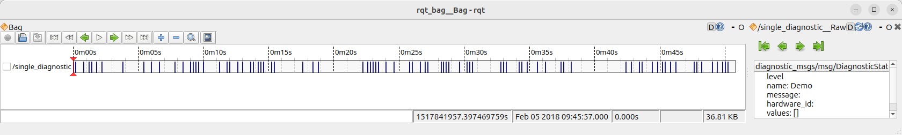
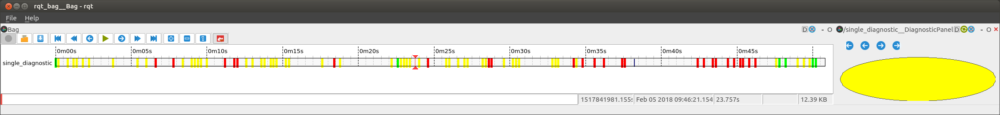
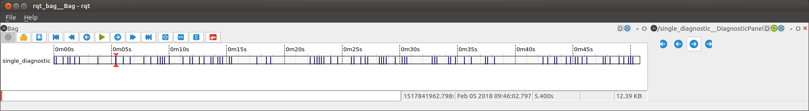
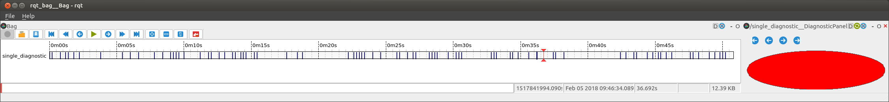
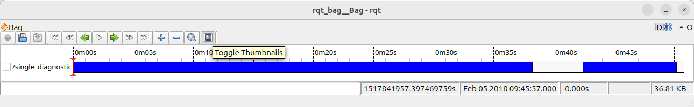
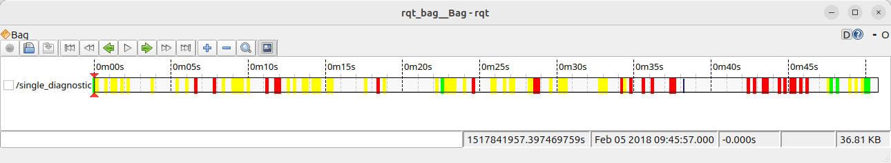

> Navigation: [Wiki index](../../../index.md) | [Summary](../../../SUMMARY.md) | [Tutorials hub](../../../wiki/tutorial-paths.md)
> Related: [Ament Lint CLI Utilities](ament-lint-for-clean-code.md) | [Building a package with Eclipse 2021-06](../miscellaneous/building-ros2-package-with-eclipse-2021-06.md) | [Building a real-time Linux kernel [community-contributed]](../miscellaneous/building-realtime-rt-preempt-kernel-for-ros-2.md) | [Composing multiple nodes in a single process](../intermediate/composition.md) | [Configure service introspection](../demos/service-introspection.md)

<a id="create-an-rqt-bag-plugin"></a>

# Create an rqt\_bag Plugin

Let’s say you have bag files and you want to be able to create a custom visualization of some data.
`rqt_bag` gives you the ability to scroll through the recorded messages and visualize the raw message values.

```
$ ros2 run rqt_bag rqt_bag ~/path/to/BagFile
$ rqt_bag ~/path/to/BagFile                     # alternative
```

This provides a standard uniform visualization:



However, you may sometimes want a more visual presentation, or you need to do some post-processing on the raw messages.
For that, you can write an `rqt_bag` plugin, using the Python plugin system.
This gives you the ability to get a customized visualization of the messages like this:



<a id="some-test-data"></a>

## Some Test Data

In this tutorial, we will be using the `level` field of the [diagnostic\_msgs/msg/DiagnosticStatus](https://docs.ros.org/en/jazzy/p/diagnostic_msgs/msg/DiagnosticStatus.html) message.
Below is a simple script for generating diagnostic statuses with random levels.
You can record your own bag from this script, or use [this sample data](https://github.com/MetroRobots/rqt_bag_diagnostics_demo/raw/refs/heads/main/SomeDiagnostics.zip) once you unzip it.

```
from diagnostic_msgs.msg import DiagnosticStatus
import random
import rclpy
from rclpy.node import Node

MODES = ['OK', 'WARN', 'ERROR']

class DiagnosticPub(Node):
    def __init__(self):
        super().__init__('diagnostic_pub')
        self.last_status = None
        self.publisher = self.create_publisher(DiagnosticStatus, '/diagnostics', 10)
        self.timer = self.create_timer(1, self.callback)

    def callback(self):
        if self.last_status is None:
            # Random initial status
            status = random.randint(0, len(MODES))
        elif random.randint(0, 5) != 0:
            # Do not publish a msg every cycle
            return
        else:
            # Random new (different) status
            delta = random.randint(1, 2)
            status = (self.last_status + delta) % len(MODES)

        self.get_logger().info(f'Publishing {MODES[status]} status')
        self.publisher.publish(DiagnosticStatus(level=bytes(status)))
        self.last_status = status

def main(args=None):
    rclpy.init(args=args)
    node = DiagnosticPub()
    rclpy.spin(node)

if __name__ == '__main__':
    main()
```

<a id="package-setup"></a>

## Package Setup

We’re going to create a package called `rqt_bag_diagnostics_demo`.
Start by creating a basic `ament_python` package, e.g. by calling:

```
$ ros2 pkg create --build-type ament_python --dependencies diagnostic_msgs python_qt_binding rqt_bag \
  --description "rqt_bag plugin for diagnostics_msgs" --license Apache-2.0 \
  --maintainer-name "My Name" --maintainer-email "my@name.robots" \
  rqt_bag_diagnostics_demo
```

Edit the relevant parts of the generated `package.xml` to look like this:

```
<exec_depend>diagnostic_msgs</exec_depend>
<exec_depend>python_qt_binding</exec_depend>
<exec_depend>rqt_bag</exec_depend>
<export>
  <build_type>ament_python</build_type>
  <rqt_bag plugin="${prefix}/plugins.xml"/>
</export>
```

What we’re doing here is making our package depend on the rqt\_bag, python\_qt\_binding and diagnostic\_msgs packages and then exporting an XML file that defines our rqt\_bag plugins.
In `setup.py`, add the following line

```
('share/' + package_name, ['plugins.xml']),
```

to the `data_files`.

Next, we’re going to define the plugin in an XML file called `plugins.xml` (as referenced in `package.xml`).
This file describes all plugins provided by this package (there can be multiple plugins per package).

```
<library path=".">
  <class name="DiagnosticBagPlugin"
         type="rqt_bag_diagnostics_demo.the_plugin.DiagnosticBagPlugin"
         base_class_type="rqt_bag::Plugin">
    <description>Awesome Diagnostic</description>
  </class>
</library>
```

The `name` attribute is the name of the plugin we create.
It has to be unique among all plugins, but you will not use it in any other way.
The `type` attribute is the way we would import the plugin’s class in Python, i.e. `package_name.module_name.class_name`

<a id="defining-the-plugin"></a>

## Defining the Plugin

Now we need to actually implement the `the_plugin.py` Python module (as referenced in `plugins.xml`).
First, make sure there is an empty file `__init__.py` in `rqt_bag_diagnostics_demo` subfolder, turning it into a Python package.

> [!NOTE]
>
> Please note that according to the current Python standards in ROS, the folder with ROS package (`rqt_bag_diagnostics_demo`) contains a subfolder with the same name.
> Therefore, the full path will be `WORKSPACE/src/rqt_bag_diagnostics_demo/rqt_bag_diagnostics_demo/__init__.py`.

Now create `the_plugin.py` next to `__init__.py`.
This file will contain all code of the plugin.

First, the core Plugin class.

```
from rqt_bag.plugins.plugin import Plugin
from python_qt_binding.QtCore import Qt
from diagnostic_msgs.msg import DiagnosticStatus

def get_color(diagnostic):
    if diagnostic.level == DiagnosticStatus.OK:
        return Qt.green
    elif diagnostic.level == DiagnosticStatus.WARN:
        return Qt.yellow
    else:  # ERROR or STALE
        return Qt.red

class DiagnosticBagPlugin(Plugin):
    def __init__(self):
        pass

    def get_view_class(self):
        # This method is required; we will implement it later
        return None

    def get_renderer_class(self):
        return None

    def get_message_types(self):
        return ['diagnostic_msgs/msg/DiagnosticStatus']
```

Here we have some basic imports, and helper function that we’ll use later, and a class that defines the three parts of an `rqt_bag` plugin.

> 1. `view_class` - a.k.a. `TopicMessageView` - A separate panel that can be used for viewing individual messages.
> 2. `renderer_class` - a.k.a. `TimelineView` - A tool for drawing onto the timeline view of the bag data.
> 3. `message_types` - An array of strings that define what message types this plugin can be used for.
>    You can return `['*']` for it to apply to all messages.

Since we return None for the first two methods, this plugin won’t do anything.
We’ll tackle each of these separately.

<a id="topicmessageview"></a>

## TopicMessageView

<a id="version-1"></a>

### Version 1

We’re going to create a class that extends the `TopicMessageView` class (still in `the_plugin.py`).
First, add the import:

```
from rqt_bag import TopicMessageView
```

Then define this new class:

```
class DiagnosticPanel(TopicMessageView):
    name = 'Awesome Diagnostic'

    def message_viewed(self, bag, entry, ros_message, msg_type_name, topic):
        super(DiagnosticPanel, self).message_viewed(bag=bag, entry=entry, ros_message=ros_message, msg_type_name=msg_type_name, topic=topic)
        print(f'{topic}: {ros_message}')
```

Here we define two things.
The `name` class variable defines what rqt\_bag shows when right-clicking a `DiagnosticStatus` topic in the timeline.
The `message_viewed` method defines what to do when the message is selected.
So here, we’ll just print the message to terminal for now.

We need to hook this class we’ve created into the plugin infrastructure, and for that, we return the class object itself in the `get_view_class` method.

```
def get_view_class(self):
    return DiagnosticPanel
```

> [!NOTE]
>
> Do not type in `return DiagnosticPanel()` (with the `()`).
> Just `return DiagnosticPanel` is correct.

To see this in action, run `rqt_bag` with your bag file, and right click on the diagnostic track.
It will give you two options under the “View”: Raw, and our “Awesome Diagnostic.”
Clicking this should open a panel and you can scroll through the messages and watch them print.



<a id="version-2"></a>

### Version 2

`TopicMessageView` is itself an extension of a `QObject`.
There’s lots of things you could do with this using all the might and power of Qt.
This is not a python Qt tutorial sadly, [though there are many available online](https://doc.qt.io/qtforpython-6/examples/example_widgets_painting_basicdrawing.html).
So we’re going to just add a simple QWidget and draw on it.
First, add the following imports:

```
from python_qt_binding.QtWidgets import QWidget
from python_qt_binding.QtGui import QBrush, QPainter
```

Then update the `DiagnosticPanel` class to the following:

```
class DiagnosticPanel(TopicMessageView):
    name = 'Awesome Diagnostic'

    def __init__(self, timeline, parent, topic):
        super(DiagnosticPanel, self).__init__(timeline, parent, topic)
        self.widget = QWidget()
        parent.layout().addWidget(self.widget)
        self.msg = None
        self.widget.paintEvent = self.paintEvent

    def message_viewed(self, bag, entry, ros_message, msg_type_name, topic):
        super(DiagnosticPanel, self).message_viewed(bag=bag, entry=entry,
                                                    ros_message=ros_message, msg_type_name=msg_type_name, topic=topic)
        self.msg = ros_message
        self.widget.update()

    def paintEvent(self, event):
        qp = QPainter()
        qp.begin(self.widget)

        rect = event.rect()

        if self.msg is None:
            qp.fillRect(0, 0, rect.width(), rect.height(), Qt.white)
        else:
            color = get_color(self.msg)
            qp.setBrush(QBrush(color))
            qp.drawEllipse(0, 0, rect.width(), rect.height())
        qp.end()
```

In the constructor, we create a `QWidget` and override its `paintEvent` method.
Now when we get a message with `message_viewed`, we save it, and update the widget, which will in turn call our `paintEvent`.
Do not call `paintEvent` manually, that has to be done by Qt.
Before a message is selected, we’ll just paint a white rectangle.
Otherwise, we’ll draw a circle, using our handy helper method to relate the color to what level the diagnostic is at.



<a id="timelinerenderer"></a>

## TimelineRenderer

<a id="version-1-1"></a>
<a id="id1"></a>

### Version 1

To draw on the timeline, we extend the `TimelineRenderer` class (still in `the_plugin.py`).
Add an import:

```
from rqt_bag import TimelineRenderer
```

Then add the new class.

```
class DiagnosticTimeline(TimelineRenderer):
    def __init__(self, timeline, height=80):
        TimelineRenderer.__init__(self, timeline, msg_combine_px=height)

    def draw_timeline_segment(self, painter: QPainter, topic, start: float, end: float, x: float, y: int, width: float, height: int):
        painter.setBrush(QBrush(Qt.blue))
        painter.drawRect(int(x), y, int(width), height)
```

You can customize how tall the message’s portion of the timeline is with the `msg_combine_px` parameter.
The key method to override is `draw_timeline_segment()` which gives you portions of the timeline to draw.
For now we’ll just draw blue rectangles on each segment.

Just like the message view, you also have to edit the plugin to return your class.

```
def get_renderer_class(self):
    return DiagnosticTimeline
```

To view this, you have to enable “Thumbnails” (a misleading name) in the rqt\_bag gui.



<a id="version-2-1"></a>
<a id="id2"></a>

### Version 2

Okay, now we actually want to customize how the messages are drawn in the timeline based on the messages themselves.
For that, you will need to read and deserialize the messages from the bag file.
Here are the new imports:

```
from python_qt_binding.QtGui import QPen
from rclpy.time import Time
from rclpy.serialization import deserialize_message
from rqt_bag.bag_helper import to_sec
```

Then update `draw_timeline_segment()`:

```
def draw_timeline_segment(self, painter: QPainter, topic, start: float, end: float, x: float, y: int, width: float, height: int):
    bag_timeline = self.timeline.scene()
    start_t = Time(seconds=start)
    end_t = Time(seconds=end)

    for bag, entry in bag_timeline.get_entries_with_bags([topic], start_t, end_t):
        topic, raw_data, t = bag_timeline.read_message(bag, entry.timestamp, topic)
        msg = deserialize_message(raw_data, DiagnosticStatus)
        color = get_color(msg)
        painter.setBrush(QBrush(color))
        painter.setPen(QPen(color, 5))

        t_float = to_sec(Time(nanoseconds=t))
        p_x = int(self.timeline.map_stamp_to_x(t_float))
        painter.drawLine(p_x, y, p_x, y + height - 1)
```

Using the `topic`, `start` and `end` parameters of the method, we can get the bag entries that correspond with this segment of the timeline.
We can then get the actual message and use it to draw.
Here we are drawing a line based on the level of the diagnostic message.
We can automatically figure out where to draw the message horizontally using the `map_stamp_to_x()` method which converts float seconds to widget pixels.



If computing the message representation on timeline is more computationally demanding, you should use
[Timeline Cache](https://github.com/ros-visualization/rqt_bag/blob/rolling/rqt_bag/src/rqt_bag/timeline_cache.py)
like the
[ImageTimelineViewer](https://github.com/ros-visualization/rqt_bag/blob/rolling/rqt_bag_plugins/src/rqt_bag_plugins/image_timeline_renderer.py)
does, but figuring that out is left as an exercise to the reader.
