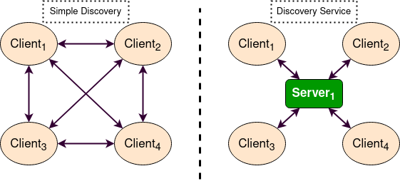
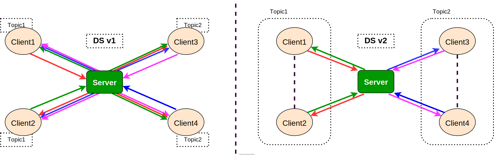
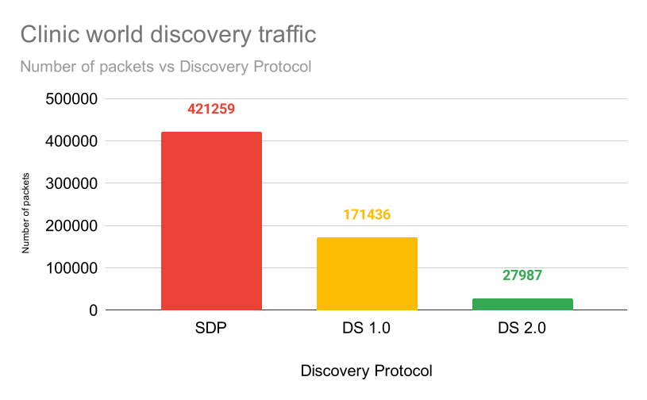
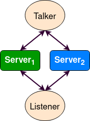
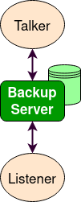
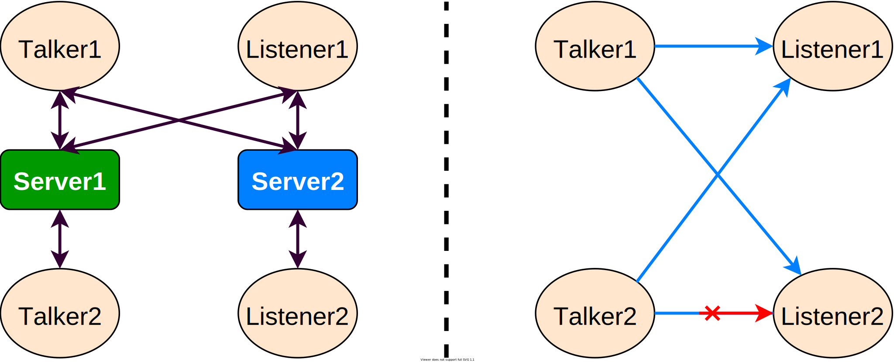
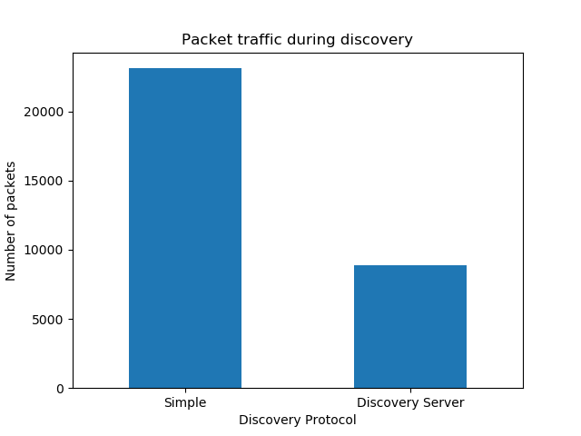

> Navigation: [Wiki index](../../../index.md) | [Summary](../../../SUMMARY.md) | [Tutorials hub](../../../wiki/tutorial-paths.md)
> Related: [Adding a frame (C++)](../intermediate/tf2/adding-a-frame-cpp.md) | [Adding a frame (Python)](../intermediate/tf2/adding-a-frame-py.md) | [Adding physical and collision properties](../intermediate/urdf/adding-physical-and-collision-properties-to-a-urdf-model.md) | [Building a movable robot model](../intermediate/urdf/building-a-movable-robot-model-with-urdf.md) | [Building a visual robot model from scratch](../intermediate/urdf/building-a-visual-robot-model-with-urdf-from-scratch.md)

<a id="using-fast-dds-discovery-server-as-discovery-protocol-community-contributed"></a>

# Using Fast DDS Discovery Server as discovery protocol [community-contributed]

**Goal:** This tutorial will show how to launch ROS 2 Nodes using the **Fast DDS Discovery Server** discovery protocol.

**Tutorial level:** Advanced

**Time:** 20 minutes

Table of Contents

- [Background](#background)
- [Fast DDS Discovery Server v2](#fast-dds-discovery-server-v2)
- [Prerequisites](#prerequisites)
- [Run this tutorial](#run-this-tutorial)

  - [Setup Discovery Server](#setup-discovery-server)
  - [Launch listener node](#launch-listener-node)
  - [Launch talker node](#launch-talker-node)
  - [Demonstrate Discovery Server execution](#demonstrate-discovery-server-execution)
  - [Visualization tool `rqt_graph`](#visualization-tool-rqt-graph)
- [Advanced use cases](#advanced-use-cases)

  - [Server Redundancy](#server-redundancy)
  - [Backup Server](#backup-server)
  - [Discovery partitions](#discovery-partitions)
  - [Large number of participants](#large-number-of-participants)
- [ROS 2 Introspection](#ros-2-introspection)

  - [Daemon’s related tools](#daemon-s-related-tools)
  - [No Daemon tools](#no-daemon-tools)
- [Compare Fast DDS Discovery Server with Simple Discovery Protocol](#compare-fast-dds-discovery-server-with-simple-discovery-protocol)

<a id="background"></a>

## Background

Starting from ROS 2 Eloquent Elusor, the **Fast DDS Discovery Server** protocol is a feature that offers a centralized dynamic discovery mechanism, as opposed to the distributed mechanism used in DDS by default.
This tutorial explains how to run some ROS 2 examples using the Fast DDS Discovery Server feature as discovery communication.

In order to get more information about the available discovery configuration, please check the [following documentation](https://fast-dds.docs.eprosima.com/en/v2.1.0/fastdds/discovery/discovery.html) or read the [Fast DDS Discovery Server specific documentation](https://fast-dds.docs.eprosima.com/en/v2.1.0/fastdds/discovery/discovery_server.html#discovery-server).

The [Simple Discovery Protocol](https://fast-dds.docs.eprosima.com/en/v2.1.0/fastdds/discovery/simple.html) is the standard protocol defined in the [DDS standard](https://www.omg.org/omg-dds-portal/).
However, it has known disadvantages in some scenarios.

- It does not **scale** efficiently, as the number of exchanged packets increases significantly as new nodes are added.
- It requires **multicasting** capabilities that may not work reliably in some scenarios, e.g. WiFi.

The **Fast DDS Discovery Server** provides a Client-Server Architecture that allows nodes to connect with each other using an intermediate server.
Each node functions as a *discovery client*, sharing its info with one or more *discovery servers* and receiving discovery information from it.
This reduces discovery-related network traffic and it does not require multicasting capabilities.



These discovery servers can be independent, duplicated or connected with each other in order to create redundancy over the network and avoid having a single point of failure.

<a id="fast-dds-discovery-server-v2"></a>

## Fast DDS Discovery Server v2

The latest ROS 2 Foxy Fitzroy release (December 2020) included a new version, version 2 of the Fast DDS Discovery Server.
This version includes a new filter feature that further reduces the number of discovery messages sent.
This version uses the topic of the different nodes to decide if two nodes wish to communicate, or if they can be left unmatched (i.e. not discovering each other).
The following figure shows the decrease in discovery messages:



This architecture reduces the number of messages sent between the server and clients dramatically.
In the following graph, the reduction in network traffic over the discovery phase for the [RMF Clinic demonstration](https://github.com/open-rmf/rmf_demos#Clinic-World) is shown:



In order to use this functionality, the discovery server can be configured using the [XML configuration for Participants](https://fast-dds.docs.eprosima.com/en/v2.1.0/fastdds/discovery/discovery_server.html#discovery-server).
It is also possible to configure the discovery server using the `fastdds` [tool](https://fast-dds.docs.eprosima.com/en/v2.1.0/fastddscli/cli/cli.html#discovery) and an [environment variable](https://fast-dds.docs.eprosima.com/en/v2.1.0/fastdds/env_vars/env_vars.html), which is the approach used in this tutorial.
For a more detailed explanation about the configuration of the discovery server, visit [the Fast DDS Discovery Server documentation](https://fast-dds.docs.eprosima.com/en/v2.1.0/fastdds/discovery/discovery_server.html#discovery-server).

<a id="prerequisites"></a>

## Prerequisites

This tutorial assumes you have a ROS 2 Foxy (or newer) [installation](../../installation/overview.md).
If your installation is using a ROS 2 version lower than Foxy, you cannot use the `fastdds` tool.
Thus, in order to use the Discovery Server, you can update your repository to use a different Fast DDS version, or configure the discovery server using the [Fast DDS XML QoS configuration](https://fast-dds.docs.eprosima.com/en/v2.1.0/fastdds/discovery/discovery_server.html#discovery-server).

<a id="run-this-tutorial"></a>

## Run this tutorial

The `talker-listener` ROS 2 demo creates a `talker` node that publishes a “hello world” message every second, and a `listener` node that listens to these messages.

By [sourcing ROS 2](../beginner-cli-tools/configuring-ros2-environment.md) you will get access to the CLI tool `fastdds`.
This tool gives access to the [discovery tool](https://fast-dds.docs.eprosima.com/en/v2.1.0/fastddscli/cli/cli.html#discovery), which can be used to launch a discovery server.
This server will manage the discovery process for the nodes that connect to it.

> [!IMPORTANT]
>
> Do not forget to [source ROS 2](../beginner-cli-tools/configuring-ros2-environment.md) in every new terminal opened.

<a id="setup-discovery-server"></a>

### Setup Discovery Server

Start by launching a discovery server with id 0, port 11811 (default port) and listening on all available interfaces.

Open a new terminal and run:

```
$ fastdds discovery --server-id 0
```

<a id="launch-listener-node"></a>

### Launch listener node

Execute the listener demo, to listen to the `/chatter` topic.

In a new terminal, set the environment variable `ROS_DISCOVERY_SERVER` to the location of the discovery server.
(Do not forget to source ROS 2 in every new terminal)

Linux

```
$ export ROS_DISCOVERY_SERVER=127.0.0.1:11811
```

Windows

```
$ set ROS_DISCOVERY_SERVER=127.0.0.1:11811
```

Launch the listener node.
Use the argument `--remap __node:=listener_discovery_server` to change the node’s name for this tutorial.

```
$ ros2 run demo_nodes_cpp listener --ros-args --remap __node:=listener_discovery_server
```

This will create a ROS 2 node, that will automatically create a client for the discovery server and connect to the server created previously to perform discovery, rather than using multicast.

<a id="launch-talker-node"></a>

### Launch talker node

Open a new terminal and set the `ROS_DISCOVERY_SERVER` environment variable as before so that the node starts a discovery client.

Linux

```
$ export ROS_DISCOVERY_SERVER=127.0.0.1:11811
```

Windows

```
$ set ROS_DISCOVERY_SERVER=127.0.0.1:11811
```

```
$ ros2 run demo_nodes_cpp talker --ros-args --remap __node:=talker_discovery_server
```

You should now see the talker publishing “hello world” messages, and the listener receiving these messages.

<a id="demonstrate-discovery-server-execution"></a>

### Demonstrate Discovery Server execution

So far, there is no evidence that this example and the standard talker-listener example are running differently.
To clearly demonstrate this, run another node that is not connected to the discovery server.
Run a new listener (listening in `/chatter` topic by default) in a new terminal and check that it is not connected to the talker already running.

```
$ ros2 run demo_nodes_cpp listener --ros-args --remap __node:=simple_listener
```

The new listener node should not be receiving the “hello world” messages.

To finally verify that everything is running correctly, a new talker can be created using the simple discovery protocol (the default DDS distributed discovery mechanism) for discovery.

```
$ ros2 run demo_nodes_cpp talker --ros-args --remap __node:=simple_talker
```

Now you should see the `simple_listener` node receiving the “hello world” messages from `simple_talker` but not the other messages from `talker_discovery_server`.

<a id="visualization-tool-rqt-graph"></a>

### Visualization tool `rqt_graph`

The `rqt_graph` tool can be used to verify the nodes and structure of this example.
Remember, in order to use `rqt_graph` with the discovery server protocol (i.e., to see the `listener_discovery_server` and `talker_discovery_server` nodes) the `ROS_DISCOVERY_SERVER` environment variable must be set before launching it.

<a id="advanced-use-cases"></a>

## Advanced use cases

The following sections show different features of the discovery server that allow you to build a robust discovery server over the network.

<a id="server-redundancy"></a>

### Server Redundancy

By using `fastdds` tool, multiple discovery servers can be created.
Discovery clients (ROS nodes) can connect to as many servers as desired.
This allows us to have a redundant network that will work even if some servers or nodes shut down unexpectedly.
The figure below shows a simple architecture that provides server redundancy.



In several terminals, run the following code to establish a communication with redundant servers.

```
$ fastdds discovery --server-id 0 --udp-address 127.0.0.1 --udp-port 11811
```

```
$ fastdds discovery --server-id 1 --udp-address 127.0.0.1 --udp-port 11888
```

> [!IMPORTANT]
>
> **Understanding Server ID Mapping**
>
> The `ROS_DISCOVERY_SERVER` environment variable uses a **semicolon-separated list** where each position corresponds to a server ID.
> The server ID is determined by the **index position** (0-based) in this semicolon-delimited list, NOT by the order servers appear.
>
> - Server with `--server-id 0`: First position (no leading semicolon needed)
> - Server with `--server-id 1`: Second position (one leading semicolon)
> - Server with `--server-id 2`: Third position (two leading semicolons)
>
> **Examples:**
>
> - For `--server-id 0`: `ROS_DISCOVERY_SERVER="127.0.0.1:11811"`
> - For `--server-id 1`: `ROS_DISCOVERY_SERVER=";127.0.0.1:11888"`
> - For `--server-id 2`: `ROS_DISCOVERY_SERVER=";;127.0.0.1:11999"`
> - For multiple servers (0 and 1): `ROS_DISCOVERY_SERVER="127.0.0.1:11811;127.0.0.1:11888"`
>
> If the server ID doesn’t match the position in the environment variable, clients will not be able to connect to the server.

Linux

```
$ export ROS_DISCOVERY_SERVER="127.0.0.1:11811;127.0.0.1:11888"
```

Windows

```
$ set ROS_DISCOVERY_SERVER="127.0.0.1:11811;127.0.0.1:11888"
```

```
$ ros2 run demo_nodes_cpp talker --ros-args --remap __node:=talker
```

Linux

```
$ export ROS_DISCOVERY_SERVER="127.0.0.1:11811;127.0.0.1:11888"
```

Windows

```
$ set ROS_DISCOVERY_SERVER="127.0.0.1:11811;127.0.0.1:11888"
```

```
$ ros2 run demo_nodes_cpp listener --ros-args --remap __node:=listener
```

Now, if one of these servers fails, there will still be discovery capability available and nodes will still discover each other.

<a id="backup-server"></a>

### Backup Server

The Fast DDS Discovery Server allows creating a server with backup functionality.
This allows the server to restore the last state it saved in case of a shutdown.



In different terminals, run the following code to establish a communication with a backed-up server.

```
$ fastdds discovery --server-id 0 --udp-address 127.0.0.1 --udp-port 11811 --backup
```

Linux

```
$ export ROS_DISCOVERY_SERVER="127.0.0.1:11811"
```

Windows

```
$ set ROS_DISCOVERY_SERVER="127.0.0.1:11811"
```

```
$ ros2 run demo_nodes_cpp talker --ros-args --remap __node:=talker
```

Linux

```
$ export ROS_DISCOVERY_SERVER="127.0.0.1:11811"
```

Windows

```
$ set ROS_DISCOVERY_SERVER="127.0.0.1:11811"
```

```
$ ros2 run demo_nodes_cpp listener --ros-args --remap __node:=listener
```

Several backup files are created in the discovery server’s working directory (the directory it was launched in).
The two `SQLite` files and two `json` files contain the information required to start a new server and restore the failed server’s state in case of failure, avoiding the need for the discovery process to happen again, and without losing information.

<a id="discovery-partitions"></a>

### Discovery partitions

Communication with discovery servers can be split to create virtual partitions in the discovery information.
This means that two endpoints will only know about each other if there is a shared discovery server or a network of discovery servers between them.
We are going to execute an example with two independent servers.
The following figure shows the architecture.



With this schema `Listener 1` will be connected to `Talker 1` and `Talker 2`, as they share `Server 1`.
`Listener 2` will connect with `Talker 1` as they share `Server 2`.
But `Listener 2` will not hear the messages from `Talker 2` because they do not share any discovery server or discovery servers, including indirectly via connections between redundant discovery servers.

Run the first server listening on localhost with the default port of 11811.

```
$ fastdds discovery --server-id 0 --udp-address 127.0.0.1 --udp-port 11811
```

In another terminal run the second server listening on localhost using another port, in this case port 11888.

```
$ fastdds discovery --server-id 1 --udp-address 127.0.0.1 --udp-port 11888
```

Now, run each node in a different terminal.
Use `ROS_DISCOVERY_SERVER` environment variable to decide which server they are connected to.
Be aware that the [ids must match](https://fast-dds.docs.eprosima.com/en/v2.1.0/fastdds/env_vars/env_vars.html).

Linux

```
$ export ROS_DISCOVERY_SERVER="127.0.0.1:11811;127.0.0.1:11888"
```

Windows

```
$ set ROS_DISCOVERY_SERVER="127.0.0.1:11811;127.0.0.1:11888"
```

```
$ ros2 run demo_nodes_cpp talker --ros-args --remap __node:=talker_1
```

Linux

```
$ export ROS_DISCOVERY_SERVER="127.0.0.1:11811;127.0.0.1:11888"
```

Windows

```
$ set ROS_DISCOVERY_SERVER="127.0.0.1:11811;127.0.0.1:11888"
```

```
$ ros2 run demo_nodes_cpp listener --ros-args --remap __node:=listener_1
```

Linux

```
$ export ROS_DISCOVERY_SERVER="127.0.0.1:11811"
```

Windows

```
$ set ROS_DISCOVERY_SERVER="127.0.0.1:11811"
```

```
$ ros2 run demo_nodes_cpp talker --ros-args --remap __node:=talker_2
```

Linux

```
$ export ROS_DISCOVERY_SERVER=";127.0.0.1:11888"
```

Windows

```
$ set ROS_DISCOVERY_SERVER=";127.0.0.1:11888"
```

```
$ ros2 run demo_nodes_cpp listener --ros-args --remap __node:=listener_2
```

We should see how `Listener 1` is receiving messages from both talker nodes, while `Listener 2` is in a different partition from `Talker 2` and so does not receive messages from it.

> [!NOTE]
>
> Once two endpoints (ROS nodes) have discovered each other, they do not need the discovery server network between them to listen to each other’s messages.

<a id="large-number-of-participants"></a>

### Large number of participants

When running more than 100 DDS participants on a single host (e.g., launching more than 100 ROS 2 [contexts](http://design.ros2.org/articles/Node_to_Participant_mapping.html) simultaneously), participants may fail to discover each other and become unresponsive.
This applies to both the Discovery Server protocol and the Simple Discovery Protocol.

> [!NOTE]
>
> Each DDS *Participant* corresponds to a ROS 2 *Context*, not a ROS 2 *Node*.
> Multiple nodes can share a single context, and each process typically creates one context by default.
> Therefore, the number of participants depends on the number of processes (contexts), not the number of nodes.

The root cause is the `mutation_tries` parameter in Fast DDS, which defaults to `100`.
This parameter controls how many attempts Fast DDS makes to find a unique unicast listening port for each participant.
When the number of participants exceeds `mutation_tries`, port allocation is exhausted and new participants cannot listen for incoming traffic, effectively becoming deaf.

> [!WARNING]
>
> Having more than 119 participants on the same host within a single domain will cause their listening ports to collide with those of the next domain ID.

To support more participants, increase `mutation_tries` by applying the following XML configuration via the `FASTDDS_DEFAULT_PROFILES_FILE` environment variable:

```
<?xml version="1.0" encoding="UTF-8" ?>
<dds xmlns="http://www.eprosima.com">
    <profiles>
        <participant profile_name="participant_profile" is_default_profile="true">
            <rtps>
                <builtin>
                    <mutation_tries>1000</mutation_tries>
                </builtin>
            </rtps>
        </participant>
    </profiles>
</dds>
```

Save this file (e.g. as `large_scale_configuration.xml`) and set the environment variable before launching your nodes:

Linux

```
$ export FASTDDS_DEFAULT_PROFILES_FILE=large_scale_configuration.xml
```

Windows

```
$ set FASTDDS_DEFAULT_PROFILES_FILE=large_scale_configuration.xml
```

> [!NOTE]
>
> The `mutation_tries` value should be set to at least the number of participants you intend to run on a single host.
> Increasing it beyond what is needed has no negative side effects.
> This configuration must be applied to **all** participants in the system, except the discovery server, for which a specific unicast port is already configured at launch.

For more details, see the [Fast DDS documentation on participant configuration](https://fast-dds.docs.eprosima.com/en/latest/fastdds/xml_configuration/xml_configuration.html).

<a id="ros-2-introspection"></a>

## ROS 2 Introspection

The [ROS 2 Command Line Interface](https://github.com/ros2/ros2cli) supports several introspection tools to analyze the behavior of a ROS 2 network.
These tools (i.e. `ros2 bag record`, `ros2 topic list`, etc.) are very helpful to understand a ROS 2 working network.

Most of these tools use DDS simple discovery to exchange topic information with every existing participant (using simple discovery, every participant in the network is connected with each other).
However, the new Discovery Server v2 implements a network traffic reduction scheme that limits the discovery data between participants that do not share a topic.
This means that nodes will only receive topic’s discovery data if it has a writer or a reader for that topic.
As most ROS 2 CLIs need a node in the network (some of them rely on a running ROS 2 daemon, and some create their own nodes), using the Discovery Server v2 these nodes will not have all the network information, and thus their functionality will be limited.

The Discovery Server v2 functionality allows every Participant to run as a **Super Client**, a kind of **Client** that connects to a **Server**, from which it receives all the available discovery information (instead of just what it needs).
In this sense, ROS 2 introspection tools can be configured as **Super Client**, thus being able to discover every entity that is using the Discovery Server protocol within the network.

> [!NOTE]
>
> In this section we use the term *Participant* as a DDS entity.
> Each DDS *Participant* corresponds with a ROS 2 *Context*, a ROS 2 abstraction over DDS.
> [Nodes](../beginner-cli-tools/understanding-ros2-nodes.md#ros2nodes) are ROS 2 entities that rely on DDS communication interfaces: `DataWriter` and `DataReader`.
> Each *Participant* can hold multiple ROS 2 Nodes.
> For further details about these concepts, please visit the [Node to Participant mapping design document](http://design.ros2.org/articles/Node_to_Participant_mapping.html)

<a id="daemon-s-related-tools"></a>

### Daemon’s related tools

The ROS 2 Daemon is used in several ROS 2 CLI introspection tools.
It creates its own Participant to add a ROS 2 Node to the network graph, in order to receive all the data sent.
In order for the ROS 2 CLI to work when using the Discovery Server mechanism, the ROS 2 Daemon needs to be
configured as **Super Client**.
Therefore, this section is devoted to explain how to use ROS 2 CLI with ROS 2 Daemon running as a **Super Client**.
This will allow the Daemon to discover the entire Node graph, and to receive all topic and endpoint information.
To do so, a Fast DDS XML configuration file is used to configure the ROS 2 Daemon and CLI tools.

Below you can find a XML configuration profile, which for this tutorial should be saved in the working directory as `` `super_client_configuration_file.xml` `` file.
This file will configure every new participant using it, as a **Super Client**.

```
<?xml version="1.0" encoding="UTF-8" ?>
 <dds>
     <profiles xmlns="http://www.eprosima.com/XMLSchemas/fastRTPS_Profiles">
         <participant profile_name="super_client_profile" is_default_profile="true">
             <rtps>
                 <builtin>
                     <discovery_config>
                         <discoveryProtocol>SUPER_CLIENT</discoveryProtocol>
                         <discoveryServersList>
                             <RemoteServer prefix="44.53.00.5f.45.50.52.4f.53.49.4d.41">
                                 <metatrafficUnicastLocatorList>
                                     <locator>
                                         <udpv4>
                                             <address>127.0.0.1</address>
                                             <port>11811</port>
                                         </udpv4>
                                     </locator>
                                 </metatrafficUnicastLocatorList>
                             </RemoteServer>
                         </discoveryServersList>
                     </discovery_config>
                 </builtin>
             </rtps>
         </participant>
     </profiles>
 </dds>
```

> [!NOTE]
>
> Under the *RemoteServer* tag, the *prefix* attribute value should be updated according to the server ID passed on the CLI (see [Fast DDS CLI](https://fast-dds.docs.eprosima.com/en/latest/fastddscli/cli/cli.html#discovery)).
> The value specified in the shown XML snippet corresponds to an ID of value 0.

First of all, instantiate a Discovery Server using [Fast DDS CLI](https://fast-dds.docs.eprosima.com/en/latest/fastddscli/cli/cli.html#discovery) specifying an ID of value 0.

```
$ fastdds discovery -i 0 -l 127.0.0.1 -p 11811
```

Run a talker and a listener that will discover each other through the Server (notice that `ROS_DISCOVERY_SERVER` configuration is the same as the one in `super_client_configuration_file.xml`).

Linux

```
$ export ROS_DISCOVERY_SERVER="127.0.0.1:11811"
```

Windows

```
$ set ROS_DISCOVERY_SERVER="127.0.0.1:11811"
```

```
$ ros2 run demo_nodes_cpp listener --ros-args --remap __node:=listener
```

Linux

```
$ export ROS_DISCOVERY_SERVER="127.0.0.1:11811"
```

Windows

```
$ set ROS_DISCOVERY_SERVER="127.0.0.1:11811"
```

```
$ ros2 run demo_nodes_cpp talker --ros-args --remap __node:=talker
```

Then, instantiate a ROS 2 Daemon using the **Super Client** configuration (remember to source ROS 2 installation in every new terminal).

Linux

```
$ export FASTRTPS_DEFAULT_PROFILES_FILE=super_client_configuration_file.xml
```

Windows

```
$ set FASTRTPS_DEFAULT_PROFILES_FILE=super_client_configuration_file.xml
```

```
$ ros2 daemon stop
$ ros2 daemon start
$ ros2 topic list
$ ros2 node info /talker
$ ros2 topic info /chatter
$ ros2 topic echo /chatter
```

We can also see the Node’s Graph using the ROS 2 tool `rqt_graph` as follows (you may need to press the refresh button):

Linux

```
$ export FASTRTPS_DEFAULT_PROFILES_FILE=super_client_configuration_file.xml
```

Windows

```
$ set FASTRTPS_DEFAULT_PROFILES_FILE=super_client_configuration_file.xml
```

```
$ ros2 run rqt_graph rqt_graph
```

<a id="no-daemon-tools"></a>

### No Daemon tools

Some ROS 2 CLI tools do not use the ROS 2 Daemon.
In order for these tools to connect with a Discovery Server and receive all the topic information they need to be instantiated as a **Super Client** that connects to the **Server**.

Following the previous configuration, build a simple system with a talker and a listener.
First, run a **Server**:

```
$ fastdds discovery -i 0 -l 127.0.0.1 -p 11811
```

Then, run the talker and listener in separate terminals:

Linux

```
$ export ROS_DISCOVERY_SERVER="127.0.0.1:11811"
```

Windows

```
$ set ROS_DISCOVERY_SERVER="127.0.0.1:11811"
```

```
$ ros2 run demo_nodes_cpp listener --ros-args --remap __node:=listener
```

Linux

```
$ export ROS_DISCOVERY_SERVER="127.0.0.1:11811"
```

Windows

```
$ set ROS_DISCOVERY_SERVER="127.0.0.1:11811"
```

```
$ ros2 run demo_nodes_cpp talker --ros-args --remap __node:=talker
```

Continue using the ROS 2 CLI with `--no-daemon` option with the new configuration.
New nodes will connect with the existing Server and will know every topic.
Exporting `ROS_DISCOVERY_SERVER` is not needed as the ROS 2 tools will be configured through the `FASTRTPS_DEFAULT_PROFILES_FILE`.

Linux

```
$ export FASTRTPS_DEFAULT_PROFILES_FILE=super_client_configuration_file.xml
```

Windows

```
$ set FASTRTPS_DEFAULT_PROFILES_FILE=super_client_configuration_file.xml
```

```
$ ros2 topic list --no-daemon
$ ros2 node info /talker --no-daemon --spin-time 2
```

<a id="compare-fast-dds-discovery-server-with-simple-discovery-protocol"></a>

## Compare Fast DDS Discovery Server with Simple Discovery Protocol

In order to compare executing nodes using the *Simple Discovery* Protocol (the default DDS mechanism for distributed discovery) or the *Discovery Server*, two scripts that execute a talker and many listeners and analyze the network traffic during this time are provided.
For this experiment, `tshark` is required to be installed on your system.
The configuration file is mandatory in order to avoid using intraprocess mode.

> [!NOTE]
>
> These scripts are only supported on Linux, and require a discovery server closure feature that is only available from versions newer than the version provided in ROS 2 Foxy.
> In order to use this functionality, compile ROS 2 with Fast DDS v2.1.0 or higher.

These scripts’ features are references for advanced purposes and their study is left to the user.

- [`bash network traffic generator`](../../../assets/downloads/generate_discovery_packages.bash)
- [`python3 graph generator`](../../../assets/downloads/discovery_packets.py)
- [`XML configuration`](../../../assets/downloads/no_intraprocess_configuration.xml)

Run the bash script with the path to `setup.bash` file to source ROS 2 as an argument.
This will generate the traffic trace for simple discovery.
Execute the same script with second argument `SERVER`.
It will generate the trace for using the discovery server.

> [!NOTE]
>
> Depending on your configuration of `tcpdump`, this script may require `sudo` privileges to read traffic across your network device.

After both executions are done, run the Python script to generate a graph similar to the one below.

```
$ export FASTRTPS_DEFAULT_PROFILES_FILE="no_intraprocess_configuration.xml"
$ sudo bash generate_discovery_packages.bash ~/ros2/install/local_setup.bash
$ sudo bash generate_discovery_packages.bash ~/ros2/install/local_setup.bash SERVER
$ python3 discovery_packets.py
```



This graph is the result of a specific run of the experiment.
The reader can execute the scripts and generate their own results for comparison.
It can easily be seen that network traffic is reduced when using the discovery service.

The reduction in traffic is a result of avoiding every node announcing itself and waiting for a response from every other node on the network.
This creates a huge amount of traffic in large architectures.
The reduction from this method increases with the number of nodes, making this architecture more scalable than the Simple Discovery Protocol approach.

The new Fast DDS Discovery Server v2 is available since *Fast DDS* v2.0.2, replacing the old discovery server.
In this new version, those nodes that do not share topics will automatically not discover each other, saving the whole discovery data required to connect them and their endpoints.
The experiment above does not show this case, but even so the massive reduction in traffic can be appreciated due to the hidden infrastructure topics of ROS 2 nodes.
