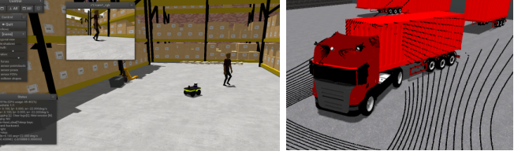
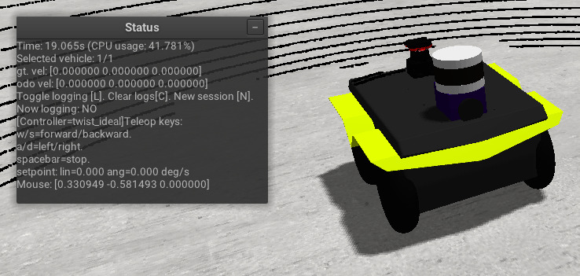
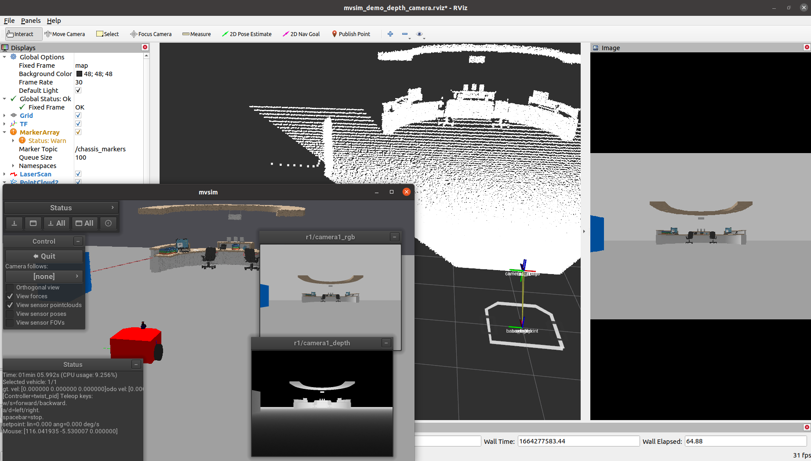

> Navigation: [Wiki index](../../../../../index.md) | [Summary](../../../../../SUMMARY.md) | [Tutorials hub](../../../../../wiki/tutorial-paths.md)
> Related: [Building a Custom RViz Display](../../../intermediate/rviz/rviz-custom-display.md) | [Building a Custom RViz Panel](../../../intermediate/rviz/rviz-custom-panel.md) | [Defining worlds, robots, and sensors](defining-worlds-mvsim.md) | [Gazebo](../gazebo/simulation-gazebo.md) | [Installation (macOS)](../webots/installation-mac-os.md)

<a id="getting-started-with-mvsim"></a>

# Getting started with MVSim

**Goal:** Launch MVSim demo worlds both standalone and with ROS 2, and learn how to interact with simulated robots.

**Tutorial level:** Advanced

**Time:** 20 minutes

Contents

- [Background](#background)
- [Prerequisites](#prerequisites)
- [Tasks](#tasks)

  - [1 Launch demo worlds with the standalone CLI](#launch-demo-worlds-with-the-standalone-cli)
  - [2 Controlling the robot](#controlling-the-robot)
  - [3 Launch with ROS 2](#launch-with-ros-2)
  - [4 Inspect ROS 2 topics](#inspect-ros-2-topics)
  - [5 Visualize in RViz2](#visualize-in-rviz2)
  - [6 Headless mode](#headless-mode)
- [Summary](#summary)

<a id="background"></a>

## Background

MVSim ships with a collection of demo worlds that showcase different features such as multi-robot simulation,
sensor configurations, terrain types, human actors, articulated vehicles and environment layouts.
You can run these demos either as a standalone application using the `mvsim` CLI,
or as a ROS 2 node that publishes sensor data and accepts velocity commands through standard ROS 2 topics.



<a id="prerequisites"></a>

## Prerequisites

You should have MVSim installed following the [Installation (Ubuntu)](installation-ubuntu.md) tutorial.

<a id="tasks"></a>

## Tasks

<a id="launch-demo-worlds-with-the-standalone-cli"></a>

### 1 Launch demo worlds with the standalone CLI

MVSim includes a standalone launcher that does not require ROS 2.
This is useful for quickly testing world files or for non-ROS use cases.

To launch the warehouse demo:

```
$ mvsim launch ~/ros2_ws/src/mvsim/mvsim_tutorial/demo_warehouse.world.xml
```

If you installed from binary packages, the demo files are typically found under
`/opt/ros/jazzy/share/mvsim/mvsim_tutorial/`.

Some other demo worlds you can try:

- `demo_turtlebot_world.world.xml` – A TurtleBot3 in a classic ROS-style environment with obstacles.
- `demo_2robots.world.xml` – Two robots navigating among furniture blocks.
- `demo_elevation_map.world.xml` – A Jackal robot driving over terrain with elevation data.
- `demo_greenhouse.world.xml` – A complex greenhouse environment demonstrating XML loops for procedural content.

<a id="controlling-the-robot"></a>

### 2 Controlling the robot

Once a world is running, you can control the robot using:

- **Keyboard:** Press W/S to move forward/backward, A/D to turn left/right, and spacebar to stop.
  If the world has multiple robots, click on a robot in the GUI to select it before using keyboard controls.
- **Joystick:** If a gamepad is connected, it will be automatically detected.



The GUI also provides controls for camera view, simulation speed, and visualization options.
You can toggle orthographic/perspective view and enable visualization of sensor data directly in the 3D window.

<a id="launch-with-ros-2"></a>

### 3 Launch with ROS 2

To launch MVSim as a ROS 2 node, use the provided launch files:

```
$ source /opt/ros/jazzy/setup.bash
$ ros2 launch mvsim demo_warehouse.launch.py
```

This starts the simulator and creates ROS 2 topics for each vehicle and sensor.

<a id="inspect-ros-2-topics"></a>

### 4 Inspect ROS 2 topics

With the demo running, open a new terminal and list the available topics:

```
$ ros2 topic list
```

You should see topics such as:

- `/robot1/cmd_vel` – Send `geometry_msgs/msg/Twist` commands to control the robot.
- `/robot1/odom` – Odometry from wheel encoders (`nav_msgs/msg/Odometry`).
- `/robot1/base_pose_ground_truth` – Perfect ground truth pose.
- `/robot1/<sensor_name>` – Sensor-specific topics (e.g., `/robot1/lidar1_points` for 3D LiDAR point clouds, `/robot1/laser1` for 2D scans).
- `/tf` and `/tf_static` – TF2 transforms following [REP-105](https://www.ros.org/reps/rep-0105.html) (`map` → `odom` → `base_link`).

You can send velocity commands from the command line:

```
$ ros2 topic pub /robot1/cmd_vel geometry_msgs/msg/Twist "{linear: {x: 0.5}, angular: {z: 0.3}}"
```

Or use `teleop_twist_keyboard` for interactive control:

```
$ ros2 run teleop_twist_keyboard teleop_twist_keyboard --ros-args -r cmd_vel:=/robot1/cmd_vel
```

<a id="visualize-in-rviz2"></a>

### 5 Visualize in RViz2

You can visualize MVSim sensor data in RViz2.
Some launch files include an `use_rviz` option:

```
$ ros2 launch mvsim demo_warehouse.launch.py use_rviz:=True
```

Alternatively, open RViz2 manually and add displays for the topics of interest (e.g., `LaserScan`, `PointCloud2`, `Image`, `Odometry`).



<a id="headless-mode"></a>

### 6 Headless mode

For CI pipelines or remote servers without a display, MVSim supports headless operation:

```
$ ros2 launch mvsim demo_warehouse.launch.py headless:=True
```

This runs the full simulation without opening a GUI window.

<a id="summary"></a>

## Summary

In this tutorial, you launched MVSim demo worlds both standalone and with ROS 2.
You learned how to control robots with keyboard and ROS 2 topics, inspect the published topics, and visualize data in RViz2.
The next tutorial covers how to define your own worlds with custom robots and sensors.
