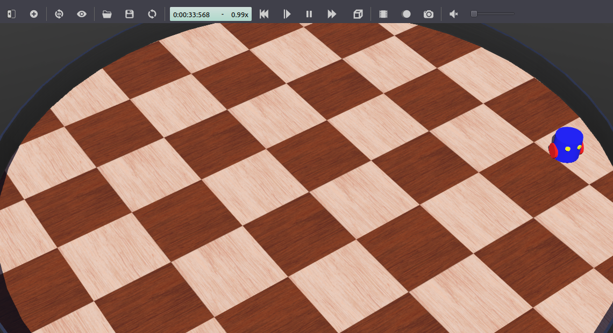

> Navigation: [Wiki index](../../../../../index.md) | [Summary](../../../../../SUMMARY.md) | [Tutorials hub](../../../../../wiki/tutorial-paths.md)
> Related: [Building a Custom RViz Display](../../../intermediate/rviz/rviz-custom-display.md) | [Building a Custom RViz Panel](../../../intermediate/rviz/rviz-custom-panel.md) | [Defining worlds, robots, and sensors](../mvsim/defining-worlds-mvsim.md) | [Gazebo](../gazebo/simulation-gazebo.md) | [Getting started with MVSim](../mvsim/getting-started-mvsim.md)

<a id="setting-up-a-robot-simulation-advanced"></a>

# Setting up a robot simulation (Advanced)

**Goal:** Extend a robot simulation with an obstacle avoider node.

**Tutorial level:** Advanced

**Time:** 20 minutes

Contents

- [Background](#background)
- [Prerequisites](#prerequisites)
- [Tasks](#tasks)

  - [1 Updating `my_robot.urdf`](#updating-my-robot-urdf)
  - [2 Creating a ROS node to avoid obstacles](#creating-a-ros-node-to-avoid-obstacles)
  - [3 Updating additional files](#updating-additional-files)
  - [4 Test the obstacle avoidance code](#test-the-obstacle-avoidance-code)
- [Summary](#summary)
- [Next steps](#next-steps)

<a id="background"></a>

## Background

In this tutorial you will extend the package created in the first part of the tutorial: [Setting up a robot simulation (Basic)](setting-up-simulation-webots-basic.md).
The aim is to implement a ROS 2 node that avoids obstacles using the robot’s distance sensors.
This tutorial focuses on using robot devices with the `webots_ros2_driver` interface.

<a id="prerequisites"></a>

## Prerequisites

This is a continuation of the first part of the tutorial: [Setting up a robot simulation (Basic)](setting-up-simulation-webots-basic.md).
It is mandatory to start with the first part to set up the custom packages and necessary files.

This tutorial is compatible with version 2023.1.0 of `webots_ros2` and Webots R2023b, as well as upcoming versions.

<a id="tasks"></a>

## Tasks

<a id="updating-my-robot-urdf"></a>

### 1 Updating `my_robot.urdf`

As mentioned in [Setting up a robot simulation (Basic)](setting-up-simulation-webots-basic.md), `webots_ros2_driver` contains plugins to interface most of Webots devices with ROS 2 directly.
These plugins can be loaded using the `<device>` tag in the URDF file of the robot.
The `reference` attribute should match the Webots device `name` parameter.
The list of all existing interfaces and the corresponding parameters can be found [on the devices reference page](https://github.com/cyberbotics/webots_ros2/wiki/References-Devices).
For available devices that are not configured in the URDF file, the interface will be automatically created and default values will be used for ROS parameters (e.g. `update rate`, `topic name`, and `frame name`).

In `my_robot.urdf` replace the whole contents with:

Python

```
<?xml version="1.0" ?>
<robot name="My robot">
    <webots>
        <device reference="ds0" type="DistanceSensor">
            <ros>
                <topicName>/left_sensor</topicName>
                <alwaysOn>true</alwaysOn>
            </ros>
        </device>
        <device reference="ds1" type="DistanceSensor">
            <ros>
                <topicName>/right_sensor</topicName>
                <alwaysOn>true</alwaysOn>
            </ros>
        </device>
        <plugin type="my_package.my_robot_driver.MyRobotDriver" />
    </webots>
</robot>
```

C++

```
<?xml version="1.0" ?>
<robot name="My robot">
    <webots>
        <device reference="ds0" type="DistanceSensor">
            <ros>
                <topicName>/left_sensor</topicName>
                <alwaysOn>true</alwaysOn>
            </ros>
        </device>
        <device reference="ds1" type="DistanceSensor">
            <ros>
                <topicName>/right_sensor</topicName>
                <alwaysOn>true</alwaysOn>
            </ros>
        </device>
        <plugin type="my_robot_driver::MyRobotDriver" />
    </webots>
</robot>
```

In addition to your custom plugin, the `webots_ros2_driver` will parse the `<device>` tags referring to the **DistanceSensor** nodes and use the standard parameters in the `<ros>` tags to enable the sensors and name their topics.

<a id="creating-a-ros-node-to-avoid-obstacles"></a>

### 2 Creating a ROS node to avoid obstacles

Python

The robot will use a standard ROS node to detect the wall and send motor commands to avoid it.
In the `my_package/my_package/` folder, create a file named `obstacle_avoider.py` with this code:

```
import rclpy
from rclpy.node import Node
from sensor_msgs.msg import Range
from geometry_msgs.msg import Twist

MAX_RANGE = 0.15

class ObstacleAvoider(Node):
    def __init__(self):
        super().__init__('obstacle_avoider')

        self.__publisher = self.create_publisher(Twist, 'cmd_vel', 1)

        self.create_subscription(Range, 'left_sensor', self.__left_sensor_callback, 1)
        self.create_subscription(Range, 'right_sensor', self.__right_sensor_callback, 1)

    def __left_sensor_callback(self, message):
        self.__left_sensor_value = message.range

    def __right_sensor_callback(self, message):
        self.__right_sensor_value = message.range

        command_message = Twist()

        command_message.linear.x = 0.1

        if self.__left_sensor_value < 0.9 * MAX_RANGE or self.__right_sensor_value < 0.9 * MAX_RANGE:
            command_message.angular.z = -2.0

        self.__publisher.publish(command_message)

def main(args=None):
    rclpy.init(args=args)
    avoider = ObstacleAvoider()
    rclpy.spin(avoider)
    # Destroy the node explicitly
    # (optional - otherwise it will be done automatically
    # when the garbage collector destroys the node object)
    avoider.destroy_node()
    rclpy.shutdown()

if __name__ == '__main__':
    main()
```

This node will create a publisher for the command and subscribe to the sensors topics here:

```
self.__publisher = self.create_publisher(Twist, 'cmd_vel', 1)

self.create_subscription(Range, 'left_sensor', self.__left_sensor_callback, 1)
self.create_subscription(Range, 'right_sensor', self.__right_sensor_callback, 1)
```

When a measurement is received from the left sensor it will be copied to a member field:

```
def __left_sensor_callback(self, message):
    self.__left_sensor_value = message.range
```

Finally, a message will be sent to the `/cmd_vel` topic when a measurement from the right sensor is received.
The `command_message` will register at least a forward speed in `linear.x` in order to make the robot move when no obstacle is detected.
If any of the two sensors detect an obstacle, `command_message` will also register a rotational speed in `angular.z` in order to make the robot turn right.

```
def __right_sensor_callback(self, message):
    self.__right_sensor_value = message.range

    command_message = Twist()

    command_message.linear.x = 0.1

    if self.__left_sensor_value < 0.9 * MAX_RANGE or self.__right_sensor_value < 0.9 * MAX_RANGE:
        command_message.angular.z = -2.0

    self.__publisher.publish(command_message)
```

C++

The robot will use a standard ROS node to detect the wall and send motor commands to avoid it.
In the `my_package/include/my_package` folder, create a header file named `ObstacleAvoider.hpp` with this code:

```
#include <memory>

#include "geometry_msgs/msg/twist.hpp"
#include "rclcpp/rclcpp.hpp"
#include "sensor_msgs/msg/range.hpp"

class ObstacleAvoider : public rclcpp::Node {
public:
  explicit ObstacleAvoider();

private:
  void leftSensorCallback(const sensor_msgs::msg::Range::ConstSharedPtr msg);
  void rightSensorCallback(const sensor_msgs::msg::Range::ConstSharedPtr msg);

  rclcpp::Publisher<geometry_msgs::msg::Twist>::SharedPtr publisher_;
  rclcpp::Subscription<sensor_msgs::msg::Range>::SharedPtr left_sensor_sub_;
  rclcpp::Subscription<sensor_msgs::msg::Range>::SharedPtr right_sensor_sub_;

  double left_sensor_value{0.0};
  double right_sensor_value{0.0};
};
```

In the `my_package/src` folder, create a source file named `ObstacleAvoider.cpp` with this code:

```
#include "my_package/ObstacleAvoider.hpp"

#define MAX_RANGE 0.15

ObstacleAvoider::ObstacleAvoider() : Node("obstacle_avoider") {
  publisher_ = create_publisher<geometry_msgs::msg::Twist>("/cmd_vel", 1);

  left_sensor_sub_ = create_subscription<sensor_msgs::msg::Range>(
      "/left_sensor", 1,
      [this](const sensor_msgs::msg::Range::ConstSharedPtr msg){
        return this->leftSensorCallback(msg);
      }
  );

  right_sensor_sub_ = create_subscription<sensor_msgs::msg::Range>(
      "/right_sensor", 1,
      [this](const sensor_msgs::msg::Range::ConstSharedPtr msg){
        return this->rightSensorCallback(msg);
      }
  );
}

void ObstacleAvoider::leftSensorCallback(
    const sensor_msgs::msg::Range::ConstSharedPtr msg) {
  left_sensor_value = msg->range;
}

void ObstacleAvoider::rightSensorCallback(
    const sensor_msgs::msg::Range::ConstSharedPtr msg) {
  right_sensor_value = msg->range;

  auto command_message = std::make_unique<geometry_msgs::msg::Twist>();

  command_message->linear.x = 0.1;

  if (left_sensor_value < 0.9 * MAX_RANGE ||
      right_sensor_value < 0.9 * MAX_RANGE) {
    command_message->angular.z = -2.0;
  }

  publisher_->publish(std::move(command_message));
}

int main(int argc, char *argv[]) {
  rclcpp::init(argc, argv);
  auto avoider = std::make_shared<ObstacleAvoider>();
  rclcpp::spin(avoider);
  rclcpp::shutdown();
  return 0;
}
```

This node will create a publisher for the command and subscribe to the sensors topics here:

```
  publisher_ = create_publisher<geometry_msgs::msg::Twist>("/cmd_vel", 1);

  left_sensor_sub_ = create_subscription<sensor_msgs::msg::Range>(
      "/left_sensor", 1,
      [this](const sensor_msgs::msg::Range::ConstSharedPtr msg){
        return this->leftSensorCallback(msg);
      }
  );

  right_sensor_sub_ = create_subscription<sensor_msgs::msg::Range>(
      "/right_sensor", 1,
      [this](const sensor_msgs::msg::Range::ConstSharedPtr msg){
        return this->rightSensorCallback(msg);
      }
  );
```

When a measurement is received from the left sensor it will be copied to a member field:

```
void ObstacleAvoider::leftSensorCallback(
    const sensor_msgs::msg::Range::ConstSharedPtr msg) {
  left_sensor_value = msg->range;
}
```

Finally, a message will be sent to the `/cmd_vel` topic when a measurement from the right sensor is received.
The `command_message` will register at least a forward speed in `linear.x` in order to make the robot move when no obstacle is detected.
If any of the two sensors detect an obstacle, `command_message` will also register a rotational speed in `angular.z` in order to make the robot turn right.

```
void ObstacleAvoider::rightSensorCallback(
    const sensor_msgs::msg::Range::ConstSharedPtr msg) {
  right_sensor_value = msg->range;

  auto command_message = std::make_unique<geometry_msgs::msg::Twist>();

  command_message->linear.x = 0.1;

  if (left_sensor_value < 0.9 * MAX_RANGE ||
      right_sensor_value < 0.9 * MAX_RANGE) {
    command_message->angular.z = -2.0;
  }

  publisher_->publish(std::move(command_message));
}
```

<a id="updating-additional-files"></a>

### 3 Updating additional files

You have to modify these two other files to launch your new node.

Python

Edit `setup.py` and replace `'console_scripts'` with:

```
'console_scripts': [
    'my_robot_driver = my_package.my_robot_driver:main',
    'obstacle_avoider = my_package.obstacle_avoider:main'
],
```

This will add an entry point for the `obstacle_avoider` node.

C++

Edit `CMakeLists.txt` and add the compilation and installation of the `obstacle_avoider`:

```
cmake_minimum_required(VERSION 3.5)
project(my_package)

if(NOT CMAKE_CXX_STANDARD)
  set(CMAKE_CXX_STANDARD 14)
endif()

# Besides the package specific dependencies we also need the `pluginlib` and `webots_ros2_driver`
find_package(ament_cmake REQUIRED)
find_package(rclcpp REQUIRED)
find_package(std_msgs REQUIRED)
find_package(geometry_msgs REQUIRED)
find_package(pluginlib REQUIRED)
find_package(webots_ros2_driver REQUIRED)

# Export the plugin configuration file
pluginlib_export_plugin_description_file(webots_ros2_driver my_robot_driver.xml)

# Obstacle avoider
include_directories(
  include
)
add_executable(obstacle_avoider
  src/ObstacleAvoider.cpp
)
ament_target_dependencies(obstacle_avoider
  rclcpp
  geometry_msgs
  sensor_msgs
)
install(TARGETS
  obstacle_avoider
  DESTINATION lib/${PROJECT_NAME}
)
install(
  DIRECTORY include/
  DESTINATION include
)

# MyRobotDriver library
add_library(
  ${PROJECT_NAME}
  SHARED
  src/MyRobotDriver.cpp
)
target_include_directories(
  ${PROJECT_NAME}
  PRIVATE
  include
)
ament_target_dependencies(
  ${PROJECT_NAME}
  pluginlib
  rclcpp
  webots_ros2_driver
)
install(TARGETS
  ${PROJECT_NAME}
  ARCHIVE DESTINATION lib
  LIBRARY DESTINATION lib
  RUNTIME DESTINATION bin
)
# Install additional directories.
install(DIRECTORY
  launch
  resource
  worlds
  DESTINATION share/${PROJECT_NAME}/
)

ament_export_include_directories(
  include
)
ament_export_libraries(
  ${PROJECT_NAME}
)
ament_package()
```

Go to the file `robot_launch.py` and replace it with:

```
import os
import launch
from launch_ros.actions import Node
from launch import LaunchDescription
from ament_index_python.packages import get_package_share_directory
from webots_ros2_driver.webots_launcher import WebotsLauncher
from webots_ros2_driver.webots_controller import WebotsController

def generate_launch_description():
    package_dir = get_package_share_directory('my_package')
    robot_description_path = os.path.join(package_dir, 'resource', 'my_robot.urdf')

    webots = WebotsLauncher(
        world=os.path.join(package_dir, 'worlds', 'my_world.wbt')
    )

    my_robot_driver = WebotsController(
        robot_name='my_robot',
        parameters=[
            {'robot_description': robot_description_path},
        ]
    )

    obstacle_avoider = Node(
        package='my_package',
        executable='obstacle_avoider',
    )

    return LaunchDescription([
        webots,
        my_robot_driver,
        obstacle_avoider,
        launch.actions.RegisterEventHandler(
            event_handler=launch.event_handlers.OnProcessExit(
                target_action=webots,
                on_exit=[launch.actions.EmitEvent(event=launch.events.Shutdown())],
            )
        )
    ])
```

This will create an `obstacle_avoider` node that will be included in the `LaunchDescription`.

<a id="test-the-obstacle-avoidance-code"></a>

### 4 Test the obstacle avoidance code

Launch the simulation from a terminal in your ROS 2 workspace:

Linux

From a terminal in your ROS 2 workspace run:

```
$ colcon build
$ source install/local_setup.bash
$ ros2 launch my_package robot_launch.py
```

Windows

From a terminal in your WSL ROS 2 workspace run:

```
$ colcon build
$ export WEBOTS_HOME=/mnt/c/Program\ Files/Webots
$ source install/local_setup.bash
$ ros2 launch my_package robot_launch.py
```

Be sure to use the `/mnt` prefix in front of your path to the Webots installation folder to access the Windows file system from WSL.

macOS

In a terminal of the host machine (not in the VM), if not done already, specify the Webots installation folder (e.g. `/Applications/Webots.app`) and start the server using the following commands:

```
$ export WEBOTS_HOME=/Applications/Webots.app
$ python3 local_simulation_server.py
```

Note that the server keeps running once the ROS 2 nodes are ended.
You don’t need to restart it every time you want to launch a new simulation.
From a terminal in the Linux VM in your ROS 2 workspace, build and launch your custom package with:

```
$ cd ~/ros2_ws
$ colcon build
$ source install/local_setup.bash
$ ros2 launch my_package robot_launch.py
```

Your robot should go forward and before hitting the wall it should turn clockwise.
You can press `Ctrl+F10` in Webots or go to the `View` menu, `Optional Rendering` and `Show DistanceSensor Rays` to display the range of the distance sensors of the robot.



<a id="summary"></a>

## Summary

In this tutorial, you extended the basic simulation with a obstacle avoider ROS 2 node that publishes velocity commands based on the distance sensor values of the robot.

<a id="next-steps"></a>

## Next steps

You might want to improve the plugin or create new nodes to change the behavior of the robot.
You can also implement a reset handler to automatically restart your ROS nodes when the simulation is reset from the Webots interface:

- [Setting up a Reset Handler](simulation-reset-handler.md).
