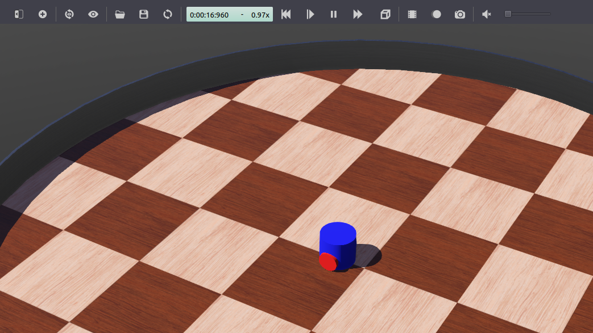
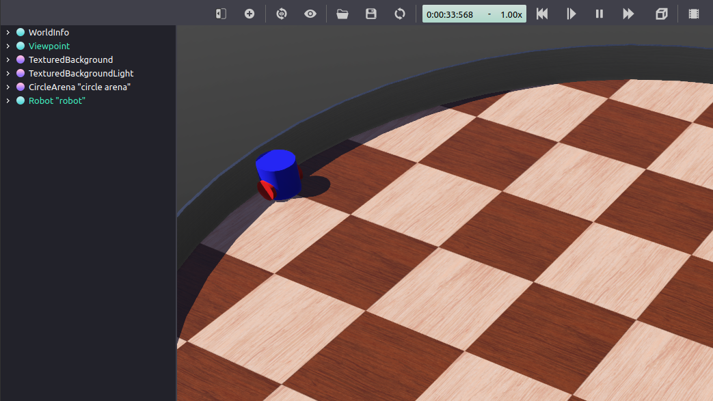

> Navigation: [Wiki index](../../../../../index.md) | [Summary](../../../../../SUMMARY.md) | [Tutorials hub](../../../../../wiki/tutorial-paths.md)
> Related: [Building a Custom RViz Display](../../../intermediate/rviz/rviz-custom-display.md) | [Building a Custom RViz Panel](../../../intermediate/rviz/rviz-custom-panel.md) | [Defining worlds, robots, and sensors](../mvsim/defining-worlds-mvsim.md) | [Gazebo](../gazebo/simulation-gazebo.md) | [Getting started with MVSim](../mvsim/getting-started-mvsim.md)

<a id="setting-up-a-robot-simulation-basic"></a>

# Setting up a robot simulation (Basic)

**Goal:** Setup a robot simulation and control it from ROS 2.

**Tutorial level:** Advanced

**Time:** 30 minutes

Contents

- [Background](#background)
- [Prerequisites](#prerequisites)
- [Tasks](#tasks)

  - [1 Create the package structure](#create-the-package-structure)
  - [2 Setup the simulation world](#setup-the-simulation-world)
  - [3 Edit the `my_robot_driver` plugin](#edit-the-my-robot-driver-plugin)
  - [4 Create the `my_robot.urdf` file](#create-the-my-robot-urdf-file)
  - [5 Create the launch file](#create-the-launch-file)
  - [6 Edit additional files](#edit-additional-files)
  - [7 Test the code](#test-the-code)
- [Summary](#summary)
- [Next steps](#next-steps)

<a id="background"></a>

## Background

In this tutorial, you are going to use the Webots robot simulator to set-up and run a very simple ROS 2 simulation scenario.

The `webots_ros2` package provides an interface between ROS 2 and Webots.
It includes several sub-packages, but in this tutorial, you are going to use only the `webots_ros2_driver` sub-package to implement a Python or C++ plugin controlling a simulated robot.
Some other sub-packages contain demos with different robots such as the TurtleBot3.
They are documented in the [Webots ROS 2 examples](https://github.com/cyberbotics/webots_ros2/wiki/Examples) page.

<a id="prerequisites"></a>

## Prerequisites

It is recommended to understand basic ROS principles covered in the beginner [Tutorials](../../../overview.md).
In particular, [Using turtlesim, ros2, and rqt](../../../beginner-cli-tools/introducing-turtlesim.md), [Understanding topics](../../../beginner-cli-tools/understanding-ros2-topics.md), [Creating a workspace](../../../beginner-client-libraries/creating-a-workspace.md), [Creating a package](../../../beginner-client-libraries/creating-your-first-ros2-package.md) and [Creating a launch file](../../../intermediate/launch/creating-launch-files.md) are useful prerequisites.

Linux

The Linux and ROS commands of this tutorial can be run in a standard Linux terminal.
The following page [Installation (Ubuntu)](installation-ubuntu.md) explains how to install the `webots_ros2` package on Linux.

Windows

The Linux and ROS commands of this tutorial must be run in a WSL (Windows Subsystem for Linux) environment.
The following page [Installation (Windows)](installation-windows.md) explains how to install the `webots_ros2` package on Windows.

macOS

The Linux and ROS commands of this tutorial must be run in a pre-configured Linux Virtual Machine (VM).
The following page [Installation (macOS)](installation-mac-os.md) explains how to install the `webots_ros2` package on macOS.

This tutorial is compatible with version 2023.1.0 of `webots_ros2` and Webots R2023b, as well as upcoming versions.

<a id="tasks"></a>

## Tasks

<a id="create-the-package-structure"></a>

### 1 Create the package structure

Let’s organize the code in a custom ROS 2 package.
Create a new package named `my_package` from the `src` folder of your ROS 2 workspace.
Change the current directory of your terminal to `ros2_ws/src` and run:

Python

```
$ ros2 pkg create --build-type ament_python --license Apache-2.0 --node-name my_robot_driver my_package --dependencies rclpy geometry_msgs webots_ros2_driver
```

The `--node-name my_robot_driver` option will create a `my_robot_driver.py` template Python plugin in the `my_package` subfolder that you will modify later.
The `--dependencies rclpy geometry_msgs webots_ros2_driver` option specifies the packages needed by the `my_robot_driver.py` plugin in the `package.xml` file.

Let’s add a `launch` and a `worlds` folder inside the `my_package` folder.

```
$ cd my_package
$ mkdir launch
$ mkdir worlds
```

You should end up with the following folder structure:

```
src/
└── my_package/
    ├── launch/
    ├── my_package/
    │   ├── __init__.py
    │   └── my_robot_driver.py
    ├── resource/
    │   └── my_package
    ├── test/
    │   ├── test_copyright.py
    │   ├── test_flake8.py
    │   └── test_pep257.py
    ├── worlds/
    ├── package.xml
    ├── setup.cfg
    └── setup.py
```

C++

```
$ ros2 pkg create --build-type ament_cmake --license Apache-2.0 --node-name MyRobotDriver my_package --dependencies rclcpp geometry_msgs webots_ros2_driver pluginlib
```

The `--node-name MyRobotDriver` option will create a `MyRobotDriver.cpp` template C++ plugin in the `my_package/src` subfolder that you will modify later.
The `--dependencies rclcpp geometry_msgs webots_ros2_driver pluginlib` option specifies the packages needed by the `MyRobotDriver` plugin in the `package.xml` file.

Let’s add a `launch`, a `worlds` and a `resource` folder inside the `my_package` folder.

```
$ cd my_package
$ mkdir launch
$ mkdir worlds
$ mkdir resource
```

Two additional files must be created: the header file for `MyRobotDriver` and the `my_robot_driver.xml` pluginlib description file.

```
$ touch my_robot_driver.xml
$ touch include/my_package/MyRobotDriver.hpp
```

You should end up with the following folder structure:

```
src/
└── my_package/
    ├── include/
    │   └── my_package/
    │       └── MyRobotDriver.hpp
    ├── launch/
    ├── resource/
    ├── src/
    │   └── MyRobotDriver.cpp
    ├── worlds/
    ├── CMakeList.txt
    ├── my_robot_driver.xml
    └── package.xml
```

<a id="setup-the-simulation-world"></a>

### 2 Setup the simulation world

You will need a world file containing a robot to launch your simulation.
[`Download this world file`](../../../../../assets/downloads/my_world.wbt) and move it inside `my_package/worlds/`.

This is actually a fairly simple text file you can visualize in a text editor.
A simple robot is already included in this `my_world.wbt` world file.

> [!NOTE]
>
> In case you want to learn how to create your own robot model in Webots, you can check this [tutorial](https://cyberbotics.com/doc/guide/tutorial-6-4-wheels-robot).

<a id="edit-the-my-robot-driver-plugin"></a>

### 3 Edit the `my_robot_driver` plugin

The `webots_ros2_driver` sub-package automatically creates a ROS 2 interface for most sensors.
More details on existing device interfaces and how to configure them is given in the second part of the tutorial: [Setting up a robot simulation (Advanced)](setting-up-simulation-webots-advanced.md).
In this task, you will extend this interface by creating your own custom plugin.
This custom plugin is a ROS node equivalent to a robot controller.
You can use it to access the [Webots robot API](https://cyberbotics.com/doc/reference/robot?tab-language=python) and create your own topics and services to control your robot.

> [!NOTE]
>
> The purpose of this tutorial is to show a basic example with a minimum number of dependencies.
> However, you could avoid the use of this plugin by using another `webots_ros2` sub-package named `webots_ros2_control`, introducing a new dependency.
> This other sub-package creates an interface with the `ros2_control` package that facilitates the control of a differential wheeled robot.

Python

Open `my_package/my_package/my_robot_driver.py` in your favorite editor and replace its contents with the following:

```
import rclpy
from geometry_msgs.msg import Twist

HALF_DISTANCE_BETWEEN_WHEELS = 0.045
WHEEL_RADIUS = 0.025

class MyRobotDriver:
    def init(self, webots_node, properties):
        self.__robot = webots_node.robot

        self.__left_motor = self.__robot.getDevice('left wheel motor')
        self.__right_motor = self.__robot.getDevice('right wheel motor')

        self.__left_motor.setPosition(float('inf'))
        self.__left_motor.setVelocity(0)

        self.__right_motor.setPosition(float('inf'))
        self.__right_motor.setVelocity(0)

        self.__target_twist = Twist()

        rclpy.init(args=None)
        self.__node = rclpy.create_node('my_robot_driver')
        self.__node.create_subscription(Twist, 'cmd_vel', self.__cmd_vel_callback, 1)

    def __cmd_vel_callback(self, twist):
        self.__target_twist = twist

    def step(self):
        rclpy.spin_once(self.__node, timeout_sec=0)

        forward_speed = self.__target_twist.linear.x
        angular_speed = self.__target_twist.angular.z

        command_motor_left = (forward_speed - angular_speed * HALF_DISTANCE_BETWEEN_WHEELS) / WHEEL_RADIUS
        command_motor_right = (forward_speed + angular_speed * HALF_DISTANCE_BETWEEN_WHEELS) / WHEEL_RADIUS

        self.__left_motor.setVelocity(command_motor_left)
        self.__right_motor.setVelocity(command_motor_right)
```

As you can see, the `MyRobotDriver` class implements three methods.

The first method, named `init(self, ...)`, is actually the ROS node counterpart of the Python `__init__(self, ...)` constructor.
The `init` method always takes two arguments:

- The `webots_node` argument contains a reference on the Webots instance.
- The `properties` argument is a dictionary created from the XML tags given in the URDF files ([4 Create the my\_robot.urdf file](#create-the-my-robot-urdf-file)) and allows you to pass parameters to the controller.

The robot instance from the simulation `self.__robot` can be used to access the [Webots robot API](https://cyberbotics.com/doc/reference/robot?tab-language=python).
Then, it gets the two motor instances and initializes them with a target position and a target velocity.
Finally a ROS node is created and a callback method is registered for a ROS topic named `/cmd_vel` that will handle `Twist` messages.

```
def init(self, webots_node, properties):
    self.__robot = webots_node.robot

    self.__left_motor = self.__robot.getDevice('left wheel motor')
    self.__right_motor = self.__robot.getDevice('right wheel motor')

    self.__left_motor.setPosition(float('inf'))
    self.__left_motor.setVelocity(0)

    self.__right_motor.setPosition(float('inf'))
    self.__right_motor.setVelocity(0)

    self.__target_twist = Twist()

    rclpy.init(args=None)
    self.__node = rclpy.create_node('my_robot_driver')
    self.__node.create_subscription(Twist, 'cmd_vel', self.__cmd_vel_callback, 1)
```

Then comes the implementation of the `__cmd_vel_callback(self, twist)` callback private method that will be called for each `Twist` message received on the `/cmd_vel` topic and will save it in the `self.__target_twist` member variable.

```
def __cmd_vel_callback(self, twist):
    self.__target_twist = twist
```

Finally, the `step(self)` method is called at every time step of the simulation.
The call to `rclpy.spin_once()` is needed to keep the ROS node running smoothly.
At each time step, the method will retrieve the desired `forward_speed` and `angular_speed` from `self.__target_twist`.
As the motors are controlled with angular velocities, the method will then convert the `forward_speed` and `angular_speed` into individual commands for each wheel.
This conversion depends on the structure of the robot, more specifically on the radius of the wheel and the distance between them.

```
def step(self):
    rclpy.spin_once(self.__node, timeout_sec=0)

    forward_speed = self.__target_twist.linear.x
    angular_speed = self.__target_twist.angular.z

    command_motor_left = (forward_speed - angular_speed * HALF_DISTANCE_BETWEEN_WHEELS) / WHEEL_RADIUS
    command_motor_right = (forward_speed + angular_speed * HALF_DISTANCE_BETWEEN_WHEELS) / WHEEL_RADIUS

    self.__left_motor.setVelocity(command_motor_left)
    self.__right_motor.setVelocity(command_motor_right)
```

C++

Open `my_package/include/my_package/MyRobotDriver.hpp` in your favorite editor and replace its contents with the following:

```
#ifndef WEBOTS_ROS2_PLUGIN_EXAMPLE_HPP
#define WEBOTS_ROS2_PLUGIN_EXAMPLE_HPP

#include "rclcpp/macros.hpp"
#include "webots_ros2_driver/PluginInterface.hpp"
#include "webots_ros2_driver/WebotsNode.hpp"

#include "geometry_msgs/msg/twist.hpp"
#include "rclcpp/rclcpp.hpp"

namespace my_robot_driver {
class MyRobotDriver : public webots_ros2_driver::PluginInterface {
public:
  void step() override;
  void init(webots_ros2_driver::WebotsNode *node,
            std::unordered_map<std::string, std::string> &parameters) override;

private:

  rclcpp::Subscription<geometry_msgs::msg::Twist>::SharedPtr
      cmd_vel_subscription_;
  geometry_msgs::msg::Twist cmd_vel_msg;

  WbDeviceTag right_motor;
  WbDeviceTag left_motor;
};
} // namespace my_robot_driver
#endif
```

The class `MyRobotDriver` is defined, which inherits from the `webots_ros2_driver::PluginInterface` class.
The plugin has to override `step(...)` and `init(...)` functions.
More details are given in the `MyRobotDriver.cpp` file.
Several helper methods, callbacks and member variables that will be used internally by the plugin are declared privately.

Then, open `my_package/src/MyRobotDriver.cpp` in your favorite editor and replace its contents with the following:

```
#include "my_package/MyRobotDriver.hpp"

#include "rclcpp/rclcpp.hpp"
#include <cstdio>
#include <functional>
#include <webots/motor.h>
#include <webots/robot.h>

#define HALF_DISTANCE_BETWEEN_WHEELS 0.045
#define WHEEL_RADIUS 0.025

namespace my_robot_driver {
void MyRobotDriver::init(
    webots_ros2_driver::WebotsNode *node,
    std::unordered_map<std::string, std::string> &parameters) {

  right_motor = wb_robot_get_device("right wheel motor");
  left_motor = wb_robot_get_device("left wheel motor");

  wb_motor_set_position(left_motor, INFINITY);
  wb_motor_set_velocity(left_motor, 0.0);

  wb_motor_set_position(right_motor, INFINITY);
  wb_motor_set_velocity(right_motor, 0.0);

  cmd_vel_subscription_ = node->create_subscription<geometry_msgs::msg::Twist>(
      "/cmd_vel", rclcpp::SensorDataQoS().reliable(),
      [this](const geometry_msgs::msg::Twist::ConstSharedPtr msg){
        this->cmd_vel_msg.linear = msg->linear;
        this->cmd_vel_msg.angular = msg->angular;
      }
  );
}

void MyRobotDriver::step() {
  auto forward_speed = cmd_vel_msg.linear.x;
  auto angular_speed = cmd_vel_msg.angular.z;

  auto command_motor_left =
      (forward_speed - angular_speed * HALF_DISTANCE_BETWEEN_WHEELS) /
      WHEEL_RADIUS;
  auto command_motor_right =
      (forward_speed + angular_speed * HALF_DISTANCE_BETWEEN_WHEELS) /
      WHEEL_RADIUS;

  wb_motor_set_velocity(left_motor, command_motor_left);
  wb_motor_set_velocity(right_motor, command_motor_right);
}
} // namespace my_robot_driver

#include "pluginlib/class_list_macros.hpp"
PLUGINLIB_EXPORT_CLASS(my_robot_driver::MyRobotDriver,
                       webots_ros2_driver::PluginInterface)
```

The `MyRobotDriver::init` method is executed once the plugin is loaded by the `webots_ros2_driver` package.
It takes two arguments:

- A pointer to the `WebotsNode` defined by `webots_ros2_driver`, which allows to access the ROS 2 node functions.
- The `parameters` argument is an unordered map of strings, created from the XML tags given in the URDF files ([4 Create the my\_robot.urdf file](#create-the-my-robot-urdf-file)) and allows to pass parameters to the controller.
  It is not used in this example.

It initializes the plugin by setting up the robot motors, setting their positions and velocities, and subscribing to the `/cmd_vel` topic.

```
void MyRobotDriver::init(
    webots_ros2_driver::WebotsNode *node,
    std::unordered_map<std::string, std::string> &parameters) {

  right_motor = wb_robot_get_device("right wheel motor");
  left_motor = wb_robot_get_device("left wheel motor");

  wb_motor_set_position(left_motor, INFINITY);
  wb_motor_set_velocity(left_motor, 0.0);

  wb_motor_set_position(right_motor, INFINITY);
  wb_motor_set_velocity(right_motor, 0.0);

  cmd_vel_subscription_ = node->create_subscription<geometry_msgs::msg::Twist>(
      "/cmd_vel", rclcpp::SensorDataQoS().reliable(),
      [this](const geometry_msgs::msg::Twist::ConstSharedPtr msg){
        this->cmd_vel_msg.linear = msg->linear;
        this->cmd_vel_msg.angular = msg->angular;
      }
  );
}
```

The subscription callback is declared as a lambda function, that will be called for each Twist message received on the `/cmd_vel` topic and will save it in the `cmd_vel_msg` member variable.

```
      [this](const geometry_msgs::msg::Twist::ConstSharedPtr msg){
        this->cmd_vel_msg.linear = msg->linear;
        this->cmd_vel_msg.angular = msg->angular;
      }
```

The `step()` method is called at every time step of the simulation.
At each time step, the method will retrieve the desired `forward_speed` and `angular_speed` from `cmd_vel_msg`.
As the motors are controlled with angular velocities, the method will then convert the `forward_speed` and `angular_speed` into individual commands for each wheel.
This conversion depends on the structure of the robot, more specifically on the radius of the wheel and the distance between them.

```
void MyRobotDriver::step() {
  auto forward_speed = cmd_vel_msg.linear.x;
  auto angular_speed = cmd_vel_msg.angular.z;

  auto command_motor_left =
      (forward_speed - angular_speed * HALF_DISTANCE_BETWEEN_WHEELS) /
      WHEEL_RADIUS;
  auto command_motor_right =
      (forward_speed + angular_speed * HALF_DISTANCE_BETWEEN_WHEELS) /
      WHEEL_RADIUS;

  wb_motor_set_velocity(left_motor, command_motor_left);
  wb_motor_set_velocity(right_motor, command_motor_right);
}
```

The final lines of the file define the end of the `my_robot_driver` namespace and include a macro to export the `MyRobotDriver` class as a plugin using the `PLUGINLIB_EXPORT_CLASS` macro.
This allows the plugin to be loaded by the Webots ROS2 driver at runtime.

```
#include "pluginlib/class_list_macros.hpp"
PLUGINLIB_EXPORT_CLASS(my_robot_driver::MyRobotDriver,
                       webots_ros2_driver::PluginInterface)
```

> [!NOTE]
>
> While the plugin is implemented in C++, the C API must be used to interact with the Webots controller library.

<a id="create-the-my-robot-urdf-file"></a>
<a id="id3"></a>

### 4 Create the `my_robot.urdf` file

You now have to create a URDF file to declare the `MyRobotDriver` plugin.
This will allow the `webots_ros2_driver` ROS node to launch the plugin and connect it to the target robot.

In the `my_package/resource` folder create a text file named `my_robot.urdf` with this content:

Python

```
<?xml version="1.0" ?>
<robot name="My robot">
    <webots>
        <plugin type="my_package.my_robot_driver.MyRobotDriver" />
    </webots>
</robot>
```

The `type` attribute specifies the path to the class given by the hierarchical structure of files.
`webots_ros2_driver` is responsible for loading the class based on the specified package and modules.

C++

```
<?xml version="1.0" ?>
<robot name="My robot">
    <webots>
        <plugin type="my_robot_driver::MyRobotDriver" />
    </webots>
</robot>
```

The `type` attribute specifies the namespace and class name to load.
`pluginlib` is responsible for loading the class based on the specified information.

> [!NOTE]
>
> This simple URDF file doesn’t contain any link or joint information about the robot as it is not needed in this tutorial.
> However, URDF files usually contain much more information as explained in the [URDF](../../../intermediate/urdf/urdf-main.md) tutorial.

> [!NOTE]
>
> Here the plugin does not take any input parameter, but this can be achieved with a tag containing the parameter name.
>
> Python
>
> ```
> <plugin type="my_package.my_robot_driver.MyRobotDriver">
>     <parameterName>someValue</parameterName>
> </plugin>
> ```
>
> C++
>
> ```
> <plugin type="my_robot_driver::MyRobotDriver">
>     <parameterName>someValue</parameterName>
> </plugin>
> ```
>
> This is namely used to pass parameters to existing Webots device plugins (see [Setting up a robot simulation (Advanced)](setting-up-simulation-webots-advanced.md)).

<a id="create-the-launch-file"></a>

### 5 Create the launch file

Let’s create the launch file to easily launch the simulation and the ROS controller with a single command.
In the `my_package/launch` folder create a new text file named `robot_launch.py` with this code:

```
import os
import launch
from launch import LaunchDescription
from ament_index_python.packages import get_package_share_directory
from webots_ros2_driver.webots_launcher import WebotsLauncher
from webots_ros2_driver.webots_controller import WebotsController

def generate_launch_description():
    package_dir = get_package_share_directory('my_package')
    robot_description_path = os.path.join(package_dir, 'resource', 'my_robot.urdf')

    webots = WebotsLauncher(
        world=os.path.join(package_dir, 'worlds', 'my_world.wbt')
    )

    my_robot_driver = WebotsController(
        robot_name='my_robot',
        parameters=[
            {'robot_description': robot_description_path},
        ]
    )

    return LaunchDescription([
        webots,
        my_robot_driver,
        launch.actions.RegisterEventHandler(
            event_handler=launch.event_handlers.OnProcessExit(
                target_action=webots,
                on_exit=[launch.actions.EmitEvent(event=launch.events.Shutdown())],
            )
        )
    ])
```

The `WebotsLauncher` object is a custom action that allows you to start a Webots simulation instance.
You have to specify in the constructor which world file the simulator will open.

```
webots = WebotsLauncher(
    world=os.path.join(package_dir, 'worlds', 'my_world.wbt')
)
```

Then, the ROS node interacting with the simulated robot is created.
This node, named `WebotsController`, is located in the `webots_ros2_driver` package.

Linux

The node will be able to communicate with the simulated robot by using a custom protocol based on IPC and shared memory.

Windows

The node (in WSL) will be able to communicate with the simulated robot (in Webots on native Windows) through a TCP connection.

macOS

The node (in the docker container) will be able to communicate with the simulated robot (in Webots on native macOS) through a TCP connection.

In your case, you need to run a single instance of this node, because you have a single robot in the simulation.
But if you had more robots in the simulation, you would have to run one instance of this node per robot.
The `robot_name` parameter is used to define the name of the robot the driver should connect to.
The `robot_description` parameter holds the path to the URDF file which refers to the `MyRobotDriver` plugin.
You can see the `WebotsController` node as the interface that connects your controller plugin to the target robot.

```
my_robot_driver = WebotsController(
    robot_name='my_robot',
    parameters=[
        {'robot_description': robot_description_path},
    ]
)
```

After that, the two nodes are set to be launched in the `LaunchDescription` constructor:

```
return LaunchDescription([
    webots,
    my_robot_driver,
```

Finally, an optional part is added in order to shutdown all the nodes once Webots terminates (e.g. when it gets closed from the graphical user interface).

```
launch.actions.RegisterEventHandler(
    event_handler=launch.event_handlers.OnProcessExit(
        target_action=webots,
        on_exit=[launch.actions.EmitEvent(event=launch.events.Shutdown())],
    )
)
```

> [!NOTE]
>
> More details on `WebotsController` and `WebotsLauncher` arguments can be found [on the nodes reference page](https://github.com/cyberbotics/webots_ros2/wiki/References-Nodes).

<a id="edit-additional-files"></a>

### 6 Edit additional files

Python

Before you can start the launch file, you have to modify the `setup.py` file to include the extra files you added.
Open `my_package/setup.py` and replace its contents with:

```
from setuptools import find_packages, setup

package_name = 'my_package'
data_files = []
data_files.append(('share/ament_index/resource_index/packages', ['resource/' + package_name]))
data_files.append(('share/' + package_name + '/launch', ['launch/robot_launch.py']))
data_files.append(('share/' + package_name + '/worlds', ['worlds/my_world.wbt']))
data_files.append(('share/' + package_name + '/resource', ['resource/my_robot.urdf']))
data_files.append(('share/' + package_name, ['package.xml']))

setup(
    name=package_name,
    version='0.0.0',
    packages=find_packages(exclude=['test']),
    data_files=data_files,
    install_requires=['setuptools'],
    zip_safe=True,
    maintainer='user',
    maintainer_email='user.name@mail.com',
    description='TODO: Package description',
    license='TODO: License declaration',
    tests_require=['pytest'],
    entry_points={
        'console_scripts': [
            'my_robot_driver = my_package.my_robot_driver:main',
        ],
    },
)
```

This sets-up the package and adds in the `data_files` variable the newly added files: `my_world.wbt`, `my_robot.urdf` and `robot_launch.py`.

C++

Before you can start the launch file, you have to modify `CMakeLists.txt` and `my_robot_driver.xml` files:

- `CMakeLists.txt` defines the compilation rules of your plugin.
- `my_robot_driver.xml` is necessary for the pluginlib to find your Webots ROS 2 plugin.

Open `my_package/my_robot_driver.xml` and replace its contents with:

```
<library path="my_package">
  <!-- The `type` attribute is a reference to the plugin class. -->
  <!-- The `base_class_type` attribute is always `webots_ros2_driver::PluginInterface`. -->
  <class type="my_robot_driver::MyRobotDriver" base_class_type="webots_ros2_driver::PluginInterface">
    <description>
      This is a Webots ROS 2 plugin example
    </description>
  </class>
</library>
```

Open `my_package/CMakeLists.txt` and replace its contents with:

```
cmake_minimum_required(VERSION 3.5)
project(my_package)

if(NOT CMAKE_CXX_STANDARD)
  set(CMAKE_CXX_STANDARD 14)
endif()

# Besides the package specific dependencies we also need the `pluginlib` and `webots_ros2_driver`
find_package(ament_cmake REQUIRED)
find_package(rclcpp REQUIRED)
find_package(std_msgs REQUIRED)
find_package(geometry_msgs REQUIRED)
find_package(pluginlib REQUIRED)
find_package(webots_ros2_driver REQUIRED)

# Export the plugin configuration file
pluginlib_export_plugin_description_file(webots_ros2_driver my_robot_driver.xml)

# MyRobotDriver library
add_library(
  ${PROJECT_NAME}
  SHARED
  src/MyRobotDriver.cpp
)
target_include_directories(
  ${PROJECT_NAME}
  PRIVATE
  include
)
ament_target_dependencies(
  ${PROJECT_NAME}
  pluginlib
  rclcpp
  webots_ros2_driver
)
install(TARGETS
  ${PROJECT_NAME}
  ARCHIVE DESTINATION lib
  LIBRARY DESTINATION lib
  RUNTIME DESTINATION bin
)
# Install additional directories.
install(DIRECTORY
  launch
  resource
  worlds
  DESTINATION share/${PROJECT_NAME}/
)
ament_export_include_directories(
  include
)
ament_export_libraries(
  ${PROJECT_NAME}
)
ament_package()
```

The CMakeLists.txt exports the plugin configuration file with the `pluginlib_export_plugin_description_file()`, defines a shared library of the C++ plugin `src/MyRobotDriver.cpp`, and sets the include and library dependencies using `ament_target_dependencies()`.

The file then installs the library, the directories `launch`, `resource`, and `worlds` to the `share/my_package` directory.
Finally, it exports the include directories and libraries using `ament_export_include_directories()` and `ament_export_libraries()`, respectively, and declares the package using `ament_package()`.

<a id="test-the-code"></a>

### 7 Test the code

Linux

From a terminal in your ROS 2 workspace run:

```
$ colcon build
$ source install/local_setup.bash
$ ros2 launch my_package robot_launch.py
```

This will launch the simulation.
Webots will be automatically installed on the first run in case it was not already installed.

Windows

From a terminal in your WSL ROS 2 workspace run:

```
$ colcon build
$ export WEBOTS_HOME=/mnt/c/Program\ Files/Webots
$ source install/local_setup.bash
$ ros2 launch my_package robot_launch.py
```

Be sure to use the `/mnt` prefix in front of your path to the Webots installation folder to access the Windows file system from WSL.

This will launch the simulation.
Webots will be automatically installed on the first run in case it was not already installed.

macOS

On macOS, a local server must be started on the host to start Webots from the VM.
The local server can be downloaded [on the webots-server repository](https://github.com/cyberbotics/webots-server/blob/main/local_simulation_server.py).

In a terminal of the host machine (not in the VM), specify the Webots installation folder (e.g. `/Applications/Webots.app`) and start the server using the following commands:

```
$ export WEBOTS_HOME=/Applications/Webots.app
$ python3 local_simulation_server.py
```

From a terminal in the Linux VM in your ROS 2 workspace, build and launch your custom package with:

```
$ colcon build
$ source install/local_setup.bash
$ ros2 launch my_package robot_launch.py
```

> [!NOTE]
>
> If you want to install Webots manually, you can download it [here](https://github.com/cyberbotics/webots/releases/latest).

Then, open a second terminal and send a command with:

```
$ ros2 topic pub /cmd_vel geometry_msgs/Twist  "linear: { x: 0.1 }"
```

The robot is now moving forward.



At this point, the robot is able to blindly follow your motor commands.
But it will eventually bump into the wall as you order it to move forwards.



Close the Webots window, this should also shutdown your ROS nodes started from the launcher.
Close also the topic command with `Ctrl+C` in the second terminal.

<a id="summary"></a>

## Summary

In this tutorial, you set-up a realistic robot simulation with Webots and implemented a custom plugin to control the motors of the robot.

<a id="next-steps"></a>

## Next steps

To improve the simulation, the robot’s sensors can be used to detect obstacles and avoid them.
The second part of the tutorial shows how to implement such behaviour:

- [Setting up a robot simulation (Advanced)](setting-up-simulation-webots-advanced.md).
