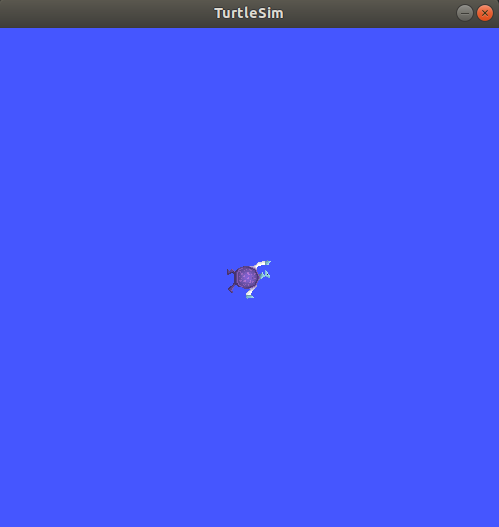
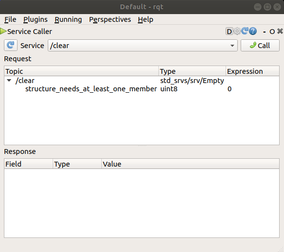
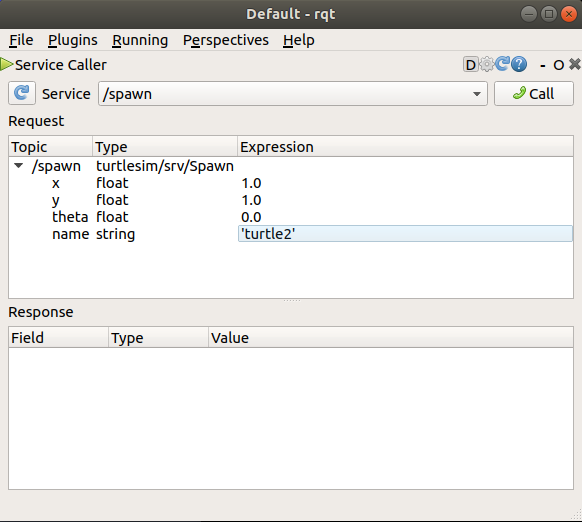
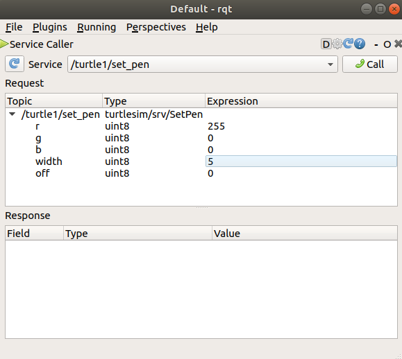
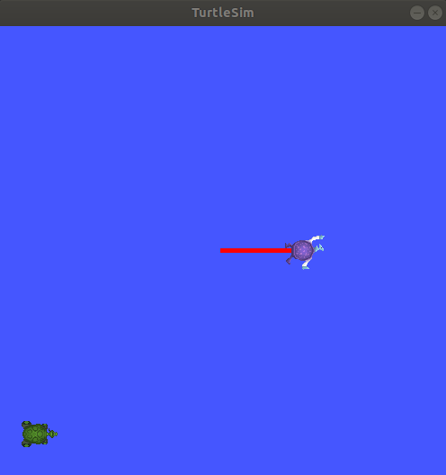
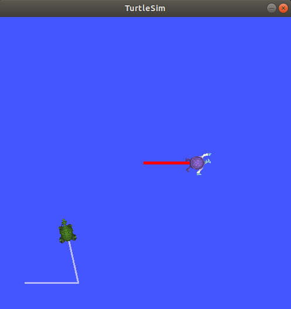

> Navigation: [Wiki index](../../../index.md) | [Summary](../../../SUMMARY.md) | [Tutorials hub](../../../wiki/tutorial-paths.md)
> Related: [Adding a frame (C++)](../intermediate/tf2/adding-a-frame-cpp.md) | [Adding a frame (Python)](../intermediate/tf2/adding-a-frame-py.md) | [Adding physical and collision properties](../intermediate/urdf/adding-physical-and-collision-properties-to-a-urdf-model.md) | [Building a movable robot model](../intermediate/urdf/building-a-movable-robot-model-with-urdf.md) | [Building a visual robot model from scratch](../intermediate/urdf/building-a-visual-robot-model-with-urdf-from-scratch.md)

<a id="using-turtlesim-ros2-and-rqt"></a>
<a id="turtlesim"></a>

# Using `turtlesim`, `ros2`, and `rqt`

**Goal:** Install and use the turtlesim package and rqt tools to prepare for upcoming tutorials.

**Tutorial level:** Beginner

**Time:** 15 minutes

Contents

- [Background](#background)
- [Prerequisites](#prerequisites)
- [Tasks](#tasks)

  - [1 Install turtlesim](#install-turtlesim)
  - [2 Start turtlesim](#start-turtlesim)
  - [3 Use turtlesim](#use-turtlesim)
  - [4 Install rqt](#install-rqt)
  - [5 Use rqt](#use-rqt)
  - [6 Remapping](#remapping)
  - [7 Close turtlesim](#close-turtlesim)
- [Summary](#summary)
- [Next steps](#next-steps)
- [Related content](#related-content)

<a id="background"></a>

## Background

Turtlesim is a lightweight simulator for learning ROS 2.
It illustrates what ROS 2 does at the most basic level to give you an idea of what you will do with a real robot or a robot simulation later on.

The ros2 tool is how the user manages, introspects, and interacts with a ROS system.
It supports multiple commands that target different aspects of the system and its operation.
One might use it to start a node, set a parameter, listen to a topic, and many more.
The ros2 tool is part of the core ROS 2 installation.

rqt is a graphical user interface (GUI) tool for ROS 2.
Everything done in rqt can be done on the command line, but rqt provides a more user-friendly way to manipulate ROS 2 elements.

This tutorial touches upon core ROS 2 concepts, like nodes, topics, and services.
All of these concepts will be elaborated on in later tutorials; for now, you will simply set up the tools and get a feel for them.

<a id="prerequisites"></a>

## Prerequisites

The previous tutorial, [Configuring environment](configuring-ros2-environment.md), will show you how to set up your environment.

<a id="tasks"></a>

## Tasks

<a id="install-turtlesim"></a>

### 1 Install turtlesim

As always, start by sourcing your setup files in a new terminal, as described in the [previous tutorial](configuring-ros2-environment.md).

Install the turtlesim package for your ROS 2 distro:

Linux

```
$ sudo apt update
$ sudo apt install ros-jazzy-turtlesim
```

macOS

As long as the archive you installed ROS 2 from contains the `ros_tutorials` repository, you should already have turtlesim installed.

Windows

As long as the archive you installed ROS 2 from contains the `ros_tutorials` repository, you should already have turtlesim installed.

To check if the package is installed, run the following command, which should return a list of turtlesim’s executables:

```
$ ros2 pkg executables turtlesim
turtlesim draw_square
turtlesim mimic
turtlesim turtle_teleop_key
turtlesim turtlesim_node
```

<a id="start-turtlesim"></a>

### 2 Start turtlesim

To start turtlesim, enter the following command in your terminal:

```
$ ros2 run turtlesim turtlesim_node
[INFO] [turtlesim]: Starting turtlesim with node name /turtlesim
[INFO] [turtlesim]: Spawning turtle [turtle1] at x=[5.544445], y=[5.544445], theta=[0.000000]
```

Under the command, you will see messages from the node.
There you can see the default turtle’s name and the coordinates where it spawns.

The simulator window should appear, with a random turtle in the center.



<a id="use-turtlesim"></a>

### 3 Use turtlesim

Open a new terminal and source ROS 2 again.

Now you will run a new node to control the turtle in the first node:

```
$ ros2 run turtlesim turtle_teleop_key
```

At this point you should have three windows open: a terminal running `turtlesim_node`, a terminal running `turtle_teleop_key` and the turtlesim window.
Arrange these windows so that you can see the turtlesim window, but also have the terminal running `turtle_teleop_key` active so that you can control the turtle in turtlesim.

Use the arrow keys on your keyboard to control the turtle.
It will move around the screen, using its attached “pen” to draw the path it followed so far.

> [!NOTE]
>
> Pressing an arrow key will only cause the turtle to move a short distance and then stop.
> This is because, realistically, you wouldn’t want a robot to continue carrying on an instruction if, for example, the operator lost the connection to the robot.

You can see the nodes, and their associated topics, services, and actions, using the `list` subcommands of the respective commands:

```
$ ros2 node list
$ ros2 topic list
$ ros2 service list
$ ros2 action list
```

You will learn more about these concepts in the coming tutorials.
Since the goal of this tutorial is only to get a general overview of turtlesim, you will use rqt to call some of the turtlesim services and interact with `turtlesim_node`.

<a id="install-rqt"></a>

### 4 Install rqt

Open a new terminal to install `rqt` and its plugins:

Ubuntu

```
$ sudo apt update
$ sudo apt install ros-jazzy-rqt ros-jazzy-rqt-common-plugins
```

RHEL

```
$ sudo dnf install 'ros-jazzy-rqt*'
```

macOS

The standard archive for installing ROS 2 on macOS contains `rqt` and its plugins, so you should already have `rqt` installed.

Windows

The standard archive for installing ROS 2 on Windows contains `rqt` and its plugins, so you should already have `rqt` installed.

To run rqt:

```
$ rqt
```

<a id="use-rqt"></a>

### 5 Use rqt

When running rqt for the first time, the window will be blank.
No worries; just select **Plugins** > **Services** > **Service Caller** from the menu bar at the top.

> [!NOTE]
>
> It may take some time for rqt to locate all the plugins.
> If you click on **Plugins** but don’t see **Services** or any other options, you should close rqt and enter the command `rqt --force-discover` in your terminal.



Use the refresh button to the left of the **Service** dropdown list to ensure all the services of your turtlesim node are available.

Click on the **Service** dropdown list to see turtlesim’s services, and select the `/spawn` service.

<a id="try-the-spawn-service"></a>

#### 5.1 Try the spawn service

Let’s use rqt to call the `/spawn` service.
You can guess from its name that `/spawn` will create another turtle in the turtlesim window.

Give the new turtle a unique name, like `turtle2`, by double-clicking between the empty single quotes in the **Expression** column.
You can see that this expression corresponds to the value of **name** and is of type **string**.

Next enter some valid coordinates at which to spawn the new turtle, like `x = 1.0` and `y = 1.0`.


> [!NOTE]
>
> If you try to spawn a new turtle with the same name as an existing turtle, like the default `turtle1`, you will get an error message in the terminal running `turtlesim_node`:
>
> ```
> [ERROR] [turtlesim]: A turtle named [turtle1] already exists
> ```

To spawn `turtle2`, you then need to call the service by clicking the **Call** button on the upper right side of the rqt window.

If the service call was successful, you should see a new turtle (again with a random design) spawn at the coordinates you input for **x** and **y**.

If you refresh the service list in rqt, you will also see that now there are services related to the new turtle, `/turtle2/...`, in addition to `/turtle1/...`.

<a id="try-the-set-pen-service"></a>

#### 5.2 Try the set\_pen service

Now let’s give `turtle1` a unique pen using the `/set_pen` service:



The values for **r**, **g** and **b**, which are between 0 and 255, set the color of the pen `turtle1` draws with, and **width** sets the thickness of the line.

To have `turtle1` draw with a distinct red line, change the value of **r** to 255, and the value of **width** to 5.
Don’t forget to call the service after updating the values.

If you return to the terminal where `turtle_teleop_key` is running and press the arrow keys, you will see `turtle1`’s pen has changed.



You’ve probably also noticed that there’s no way to move `turtle2`.
That’s because there is no teleop node for `turtle2`.

<a id="remapping"></a>

### 6 Remapping

You need a second teleop node in order to control `turtle2`.
However, if you try to run the same command as before, you will notice that this one also controls `turtle1`.
The way to change this behavior is by remapping the `cmd_vel` topic and the `rotate_absolute` action.

In a new terminal, source ROS 2, and run:

```
$ ros2 run turtlesim turtle_teleop_key --ros-args --remap turtle1/cmd_vel:=turtle2/cmd_vel --remap turtle1/rotate_absolute:=turtle2/rotate_absolute
```

Now, you can move `turtle2` when this terminal is active, and `turtle1` when the other terminal running `turtle_teleop_key` is active.



<a id="close-turtlesim"></a>

### 7 Close turtlesim

To stop the simulation, you can enter `Ctrl + C` in the `turtlesim_node` terminal, and `q` in the `turtle_teleop_key` terminals.

<a id="summary"></a>

## Summary

Using turtlesim and rqt is a great way to learn the core concepts of ROS 2.

<a id="next-steps"></a>

## Next steps

Now that you have turtlesim and rqt up and running, and an idea of how they work, let’s dive into the first core ROS 2 concept with the next tutorial, [Understanding nodes](understanding-ros2-nodes.md).

<a id="related-content"></a>

## Related content

The turtlesim package can be found in the [ros\_tutorials](https://github.com/ros/ros_tutorials/tree/jazzy/turtlesim) repo.
