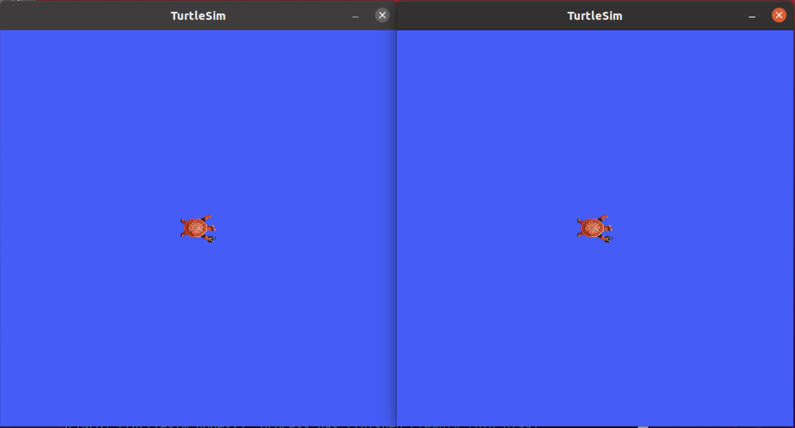
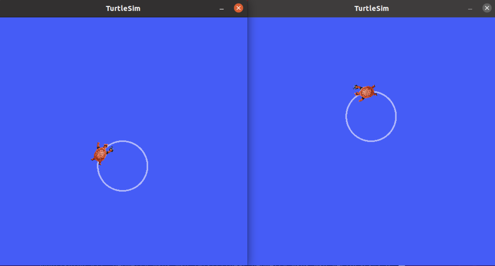

> Navigation: [Wiki index](../../../index.md) | [Summary](../../../SUMMARY.md) | [Tutorials hub](../../../wiki/tutorial-paths.md)
> Related: [Adding a frame (C++)](../intermediate/tf2/adding-a-frame-cpp.md) | [Adding a frame (Python)](../intermediate/tf2/adding-a-frame-py.md) | [Adding physical and collision properties](../intermediate/urdf/adding-physical-and-collision-properties-to-a-urdf-model.md) | [Building a movable robot model](../intermediate/urdf/building-a-movable-robot-model-with-urdf.md) | [Building a visual robot model from scratch](../intermediate/urdf/building-a-visual-robot-model-with-urdf-from-scratch.md)

<a id="launching-nodes"></a>
<a id="ros2launch"></a>

# Launching nodes

**Goal:** Use a command line tool to launch multiple nodes at once.

**Tutorial Level:** Beginner

**Time:** 5 minutes

Contents

- [Background](#background)
- [Prerequisites](#prerequisites)
- [Tasks](#tasks)

  - [Running a Launch File](#running-a-launch-file)
  - [(Optional) Control the Turtlesim Nodes](#optional-control-the-turtlesim-nodes)
- [Summary](#summary)
- [Next steps](#next-steps)

<a id="background"></a>

## Background

In most of the introductory tutorials, you have been opening new terminals for every new node you run.
As you create more complex systems with more and more nodes running simultaneously, opening terminals and reentering configuration details becomes tedious.

Launch files allow you to start up and configure a number of executables containing ROS 2 nodes simultaneously.

Running a single launch file with the `ros2 launch` command will start up your entire system - all nodes and their configurations - at once.

<a id="prerequisites"></a>

## Prerequisites

Before starting these tutorials, install ROS 2 by following the instructions on the ROS 2 [Installation](../../installation/overview.md) page.

The commands used in this tutorial assume you followed the binary packages installation guide for your operating system (deb packages for Linux).
You can still follow along if you built from source, but the path to your setup files will likely be different.
You also won’t be able to use the `sudo apt install ros-<distro>-<package>` command (used frequently in the beginner level tutorials) if you install from source.

If you are using Linux and are not already familiar with the shell, [this tutorial](https://www.linux.com/training-tutorials/bash-101-working-cli/) will help.

As always, don’t forget to source ROS 2 in [every new terminal you open](configuring-ros2-environment.md).

<a id="tasks"></a>

## Tasks

<a id="running-a-launch-file"></a>

### Running a Launch File

Open a new terminal and run:

```
$ ros2 launch turtlesim multisim.launch.py
```

This command will run the following launch file:

```
from launch import LaunchDescription
import launch_ros.actions

def generate_launch_description():
    return LaunchDescription([
        launch_ros.actions.Node(
            namespace='turtlesim1', package='turtlesim',
            executable='turtlesim_node', output='screen'),
        launch_ros.actions.Node(
            namespace='turtlesim2', package='turtlesim',
            executable='turtlesim_node', output='screen'),
    ])
```

> [!NOTE]
>
> The launch file above is written in Python, but you can also use XML and YAML to create launch files.
> You can see a comparison of these different ROS 2 launch formats in [Using XML, YAML, and Python for ROS 2 Launch Files](../../how-to/launch-file-different-formats.md).

This will run two turtlesim nodes:



For now, don’t worry about the contents of this launch file.
You can find more information on ROS 2 launch in the [ROS 2 launch tutorials](../intermediate/launch/launch-main.md).

<a id="optional-control-the-turtlesim-nodes"></a>

### (Optional) Control the Turtlesim Nodes

Now that these nodes are running, you can control them like any other ROS 2 nodes.
For example, you can make the turtles drive in opposite directions by opening up two additional terminals and running the following commands:

In the second terminal:

```
$ ros2 topic pub  /turtlesim1/turtle1/cmd_vel geometry_msgs/msg/Twist "{linear: {x: 2.0, y: 0.0, z: 0.0}, angular: {x: 0.0, y: 0.0, z: 1.8}}"
```

In the third terminal:

```
$ ros2 topic pub  /turtlesim2/turtle1/cmd_vel geometry_msgs/msg/Twist "{linear: {x: 2.0, y: 0.0, z: 0.0}, angular: {x: 0.0, y: 0.0, z: -1.8}}"
```

After running these commands, you should see something like the following:



<a id="summary"></a>

## Summary

The significance of what you’ve done so far is that you’ve run two turtlesim nodes with one command.
Once you learn to write your own launch files, you’ll be able to run multiple nodes - and set up their configuration - in a similar way, with the `ros2 launch` command.

For more tutorials on ROS 2 launch files, see the [main launch file tutorial page](../intermediate/launch/launch-main.md).

<a id="next-steps"></a>

## Next steps

In the next tutorial, [Recording and playing back data](recording-and-playing-back-data.md), you’ll learn about another helpful tool, `ros2 bag`.
