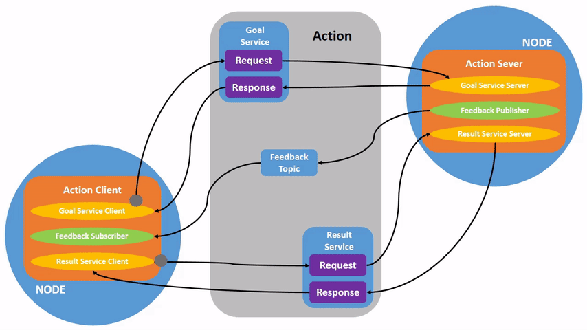

> Navigation: [Wiki index](../../../index.md) | [Summary](../../../SUMMARY.md) | [Tutorials hub](../../../wiki/tutorial-paths.md)
> Related: [Adding a frame (C++)](../intermediate/tf2/adding-a-frame-cpp.md) | [Adding a frame (Python)](../intermediate/tf2/adding-a-frame-py.md) | [Adding physical and collision properties](../intermediate/urdf/adding-physical-and-collision-properties-to-a-urdf-model.md) | [Building a movable robot model](../intermediate/urdf/building-a-movable-robot-model-with-urdf.md) | [Building a visual robot model from scratch](../intermediate/urdf/building-a-visual-robot-model-with-urdf-from-scratch.md)

<a id="understanding-actions"></a>
<a id="ros2actions"></a>

# Understanding actions

**Goal:** Introspect actions in ROS 2.

**Tutorial level:** Beginner

**Time:** 15 minutes

Contents

- [Background](#background)
- [Prerequisites](#prerequisites)
- [Tasks](#tasks)

  - [1 Setup](#setup)
  - [2 Use actions](#use-actions)
  - [3 ros2 node info](#ros2-node-info)
  - [4 ros2 action list](#ros2-action-list)
  - [5 ros2 action type](#ros2-action-type)
  - [6 ros2 action info](#ros2-action-info)
  - [7 ros2 interface show](#ros2-interface-show)
  - [8 ros2 action send\_goal](#ros2-action-send-goal)
- [Summary](#summary)
- [Next steps](#next-steps)
- [Related content](#related-content)

<a id="background"></a>

## Background

Actions are one of the communication types in ROS 2 and are intended for long running tasks.
They consist of three parts: a goal, feedback, and a result.

Actions are built on topics and services.
Their functionality is similar to services, except actions can be canceled.
They also provide steady feedback, as opposed to services which return a single response.

Actions use a client-server model, similar to the publisher-subscriber model (described in the [topics tutorial](understanding-ros2-topics.md)).
An “action client” node sends a goal to an “action server” node that acknowledges the goal and returns a stream of feedback and a result.



<a id="prerequisites"></a>

## Prerequisites

This tutorial builds off concepts, like [nodes](understanding-ros2-nodes.md) and [topics](understanding-ros2-topics.md), covered in previous tutorials.

This tutorial uses the [turtlesim package](introducing-turtlesim.md).

As always, don’t forget to source ROS 2 in [every new terminal you open](configuring-ros2-environment.md).

<a id="tasks"></a>

## Tasks

<a id="setup"></a>

### 1 Setup

Start up the two turtlesim nodes, `/turtlesim` and `/teleop_turtle`.

Open a new terminal and run:

```
$ ros2 run turtlesim turtlesim_node
```

Open another terminal and run:

```
$ ros2 run turtlesim turtle_teleop_key
```

<a id="use-actions"></a>

### 2 Use actions

When you launch the `/teleop_turtle` node, you will see the following message in your terminal:

```
Use arrow keys to move the turtle.
Use G|B|V|C|D|E|R|T keys to rotate to absolute orientations. 'F' to cancel a rotation.
```

Let’s focus on the second line, which corresponds to an action.
(The first instruction corresponds to the “cmd\_vel” topic, discussed previously in the [topics tutorial](understanding-ros2-topics.md).)

Notice that the letter keys `G|B|V|C|D|E|R|T` form a “box” around the `F` key on a US QWERTY keyboard (if you are not using a QWERTY keyboard, see [this link](https://upload.wikimedia.org/wikipedia/commons/d/da/KB_United_States.svg) to follow along).
Each key’s position around `F` corresponds to that orientation in turtlesim.
For example, the `E` will rotate the turtle’s orientation to the upper left corner.

Pay attention to the terminal where the `/turtlesim` node is running.
Each time you press one of these keys, you are sending a goal to an action server that is part of the `/turtlesim` node.
The goal is to rotate the turtle to face a particular direction.
A message relaying the result of the goal should display once the turtle completes its rotation:

```
[INFO] [turtlesim]: Rotation goal completed successfully
```

The `F` key will cancel a goal mid-execution.

Try pressing the `C` key, and then pressing the `F` key before the turtle can complete its rotation.
In the terminal where the `/turtlesim` node is running, you will see the message:

```
[INFO] [turtlesim]: Rotation goal canceled
```

Not only can the client-side (your input in the teleop) stop a goal, but the server-side (the `/turtlesim` node) can as well.
When the server-side chooses to stop processing a goal, it is said to “abort” the goal.

Try hitting the `D` key, then the `G` key before the first rotation can complete.
In the terminal where the `/turtlesim` node is running, you will see the message:

```
[WARN] [turtlesim]: Rotation goal received before a previous goal finished. Aborting previous goal
```

This action server chose to abort the first goal because it got a new one.
It could have chosen something else, like reject the new goal or execute the second goal after the first one finished.
Don’t assume every action server will choose to abort the current goal when it gets a new one.

<a id="ros2-node-info"></a>

### 3 ros2 node info

To see the list of actions a node provides, `/turtlesim` in this case, open a new terminal and run the command:

```
$ ros2 node info /turtlesim
/turtlesim
  Subscribers:
    /parameter_events: rcl_interfaces/msg/ParameterEvent
    /turtle1/cmd_vel: geometry_msgs/msg/Twist
  Publishers:
    /parameter_events: rcl_interfaces/msg/ParameterEvent
    /rosout: rcl_interfaces/msg/Log
    /turtle1/color_sensor: turtlesim/msg/Color
    /turtle1/pose: turtlesim/msg/Pose
  Service Servers:
    /clear: std_srvs/srv/Empty
    /kill: turtlesim/srv/Kill
    /reset: std_srvs/srv/Empty
    /spawn: turtlesim/srv/Spawn
    /turtle1/set_pen: turtlesim/srv/SetPen
    /turtle1/teleport_absolute: turtlesim/srv/TeleportAbsolute
    /turtle1/teleport_relative: turtlesim/srv/TeleportRelative
    /turtlesim/describe_parameters: rcl_interfaces/srv/DescribeParameters
    /turtlesim/get_parameter_types: rcl_interfaces/srv/GetParameterTypes
    /turtlesim/get_parameters: rcl_interfaces/srv/GetParameters
    /turtlesim/list_parameters: rcl_interfaces/srv/ListParameters
    /turtlesim/set_parameters: rcl_interfaces/srv/SetParameters
    /turtlesim/set_parameters_atomically: rcl_interfaces/srv/SetParametersAtomically
  Service Clients:

  Action Servers:
    /turtle1/rotate_absolute: turtlesim/action/RotateAbsolute
  Action Clients:
```

The command returns a list of `/turtlesim`’s subscribers, publishers, services, action servers and action clients.

Notice that the `/turtle1/rotate_absolute` action for `/turtlesim` is under `Action Servers`.
This means `/turtlesim` responds to and provides feedback for the `/turtle1/rotate_absolute` action.

The `/teleop_turtle` node has the name `/turtle1/rotate_absolute` under `Action Clients` meaning that it sends goals for that action name.
To see that, run:

```
$ ros2 node info /teleop_turtle
/teleop_turtle
  Subscribers:
    /parameter_events: rcl_interfaces/msg/ParameterEvent
  Publishers:
    /parameter_events: rcl_interfaces/msg/ParameterEvent
    /rosout: rcl_interfaces/msg/Log
    /turtle1/cmd_vel: geometry_msgs/msg/Twist
  Service Servers:
    /teleop_turtle/describe_parameters: rcl_interfaces/srv/DescribeParameters
    /teleop_turtle/get_parameter_types: rcl_interfaces/srv/GetParameterTypes
    /teleop_turtle/get_parameters: rcl_interfaces/srv/GetParameters
    /teleop_turtle/list_parameters: rcl_interfaces/srv/ListParameters
    /teleop_turtle/set_parameters: rcl_interfaces/srv/SetParameters
    /teleop_turtle/set_parameters_atomically: rcl_interfaces/srv/SetParametersAtomically
  Service Clients:

  Action Servers:

  Action Clients:
    /turtle1/rotate_absolute: turtlesim/action/RotateAbsolute
```

<a id="ros2-action-list"></a>

### 4 ros2 action list

To identify all the actions in the ROS graph, run the command:

```
$ ros2 action list
/turtle1/rotate_absolute
```

This is the only action in the ROS graph right now.
It controls the turtle’s rotation, as you saw earlier.
You also already know that there is one action client (part of `/teleop_turtle`) and one action server (part of `/turtlesim`) for this action from using the `ros2 node info <node_name>` command.

<a id="ros2-action-list-t"></a>

#### 4.1 ros2 action list -t

Actions have types, similar to topics and services.
To find `/turtle1/rotate_absolute`’s type, run the command:

```
$ ros2 action list -t
/turtle1/rotate_absolute [turtlesim/action/RotateAbsolute]
```

In brackets to the right of each action name (in this case only `/turtle1/rotate_absolute`) is the action type, `turtlesim/action/RotateAbsolute`.
You will need this when you want to execute an action from the command line or from code.

<a id="ros2-action-type"></a>

### 5 ros2 action type

If you want to check the action type for the action, run the command:

```
$ ros2 action type /turtle1/rotate_absolute
turtlesim/action/RotateAbsolute
```

<a id="ros2-action-info"></a>

### 6 ros2 action info

You can further introspect the `/turtle1/rotate_absolute` action with the command:

```
$ ros2 action info /turtle1/rotate_absolute
Action: /turtle1/rotate_absolute
Action clients: 1
    /teleop_turtle
Action servers: 1
    /turtlesim
```

This tells us what we learned earlier from running `ros2 node info` on each node:
The `/teleop_turtle` node has an action client and the `/turtlesim` node has an action server for the `/turtle1/rotate_absolute` action.

<a id="ros2-interface-show"></a>

### 7 ros2 interface show

One more piece of information you will need before sending or executing an action goal yourself is the structure of the action type.

Recall that you identified `/turtle1/rotate_absolute`’s type when running the command `ros2 action list -t`.
Enter the following command with the action type in your terminal:

```
$ ros2 interface show turtlesim/action/RotateAbsolute
```

Which will return:

```
# The desired heading in radians
float32 theta
---
# The angular displacement in radians to the starting position
float32 delta
---
# The remaining rotation in radians
float32 remaining
```

The section of this message above the first `---` is the structure (data type and name) of the goal request.
The next section is the structure of the result.
The last section is the structure of the feedback.

<a id="ros2-action-send-goal"></a>

### 8 ros2 action send\_goal

Now let’s send an action goal from the command line with the following syntax:

```
$ ros2 action send_goal <action_name> <action_type> <values>
```

`<values>` need to be in YAML format.

Keep an eye on the turtlesim window, and enter the following command into your terminal:

```
$ ros2 action send_goal /turtle1/rotate_absolute turtlesim/action/RotateAbsolute "{theta: 1.57}"
Waiting for an action server to become available...
Sending goal:
   theta: 1.57

Goal accepted with ID: f8db8f44410849eaa93d3feb747dd444

Result:
  delta: -1.568000316619873

Goal finished with status: SUCCEEDED
```

You should see the turtle rotating.

All goals have a unique ID, shown in the return message.
You can also see the result, a field with the name `delta`, which is the displacement to the starting position.

To see the feedback of this goal, add `--feedback` to the `ros2 action send_goal` command:

```
$ ros2 action send_goal /turtle1/rotate_absolute turtlesim/action/RotateAbsolute "{theta: -1.57}" --feedback
Sending goal:
   theta: -1.57

Goal accepted with ID: e6092c831f994afda92f0086f220da27

Feedback:
  remaining: -3.1268222332000732

Feedback:
  remaining: -3.1108222007751465

…

Result:
  delta: 3.1200008392333984

Goal finished with status: SUCCEEDED
```

You will continue to receive feedback, the remaining radians, until the goal is complete.

<a id="summary"></a>

## Summary

Actions are like services that allow you to execute long running tasks, provide regular feedback, and are cancelable.

A robot system would likely use actions for navigation.
An action goal could tell a robot to travel to a position.
While the robot navigates to the position, it can send updates along the way (i.e. feedback), and then a final result message once it’s reached its destination.

Turtlesim has an action server that action clients can send goals to for rotating turtles.
In this tutorial, you introspected that action, `/turtle1/rotate_absolute`, to get a better idea of what actions are and how they work.

<a id="next-steps"></a>

## Next steps

Now you’ve covered all of the core ROS 2 concepts.
The last few tutorials in this set will introduce you to some tools and techniques that will make using ROS 2 easier, starting with [Using rqt\_console to view logs](using-rqt-console.md).

<a id="related-content"></a>

## Related content

You can read more about the design decisions behind actions in ROS 2 [here](https://design.ros2.org/articles/actions.html).
