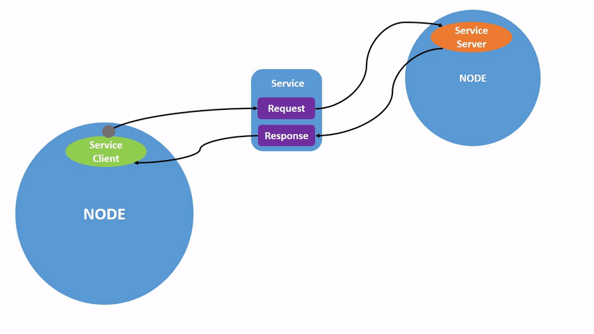
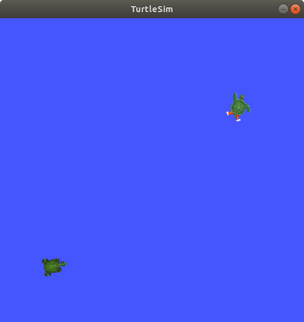

> Navigation: [Wiki index](../../../index.md) | [Summary](../../../SUMMARY.md) | [Tutorials hub](../../../wiki/tutorial-paths.md)
> Related: [Adding a frame (C++)](../intermediate/tf2/adding-a-frame-cpp.md) | [Adding a frame (Python)](../intermediate/tf2/adding-a-frame-py.md) | [Adding physical and collision properties](../intermediate/urdf/adding-physical-and-collision-properties-to-a-urdf-model.md) | [Building a movable robot model](../intermediate/urdf/building-a-movable-robot-model-with-urdf.md) | [Building a visual robot model from scratch](../intermediate/urdf/building-a-visual-robot-model-with-urdf-from-scratch.md)

<a id="understanding-services"></a>
<a id="ros2services"></a>

# Understanding services

**Goal:** Learn about services in ROS 2 using command line tools.

**Tutorial level:** Beginner

**Time:** 10 minutes

Contents

- [Background](#background)
- [Prerequisites](#prerequisites)
- [Tasks](#tasks)

  - [1 Setup](#setup)
  - [2 ros2 service list](#ros2-service-list)
  - [3 ros2 service type](#ros2-service-type)
  - [4 ros2 service info](#ros2-service-info)
  - [5 ros2 service find](#ros2-service-find)
  - [6 ros2 interface show](#ros2-interface-show)
  - [7 ros2 service call](#ros2-service-call)
  - [8 ros2 service echo](#ros2-service-echo)
- [Summary](#summary)
- [Next steps](#next-steps)
- [Related content](#related-content)

<a id="background"></a>

## Background

Services are another method of communication for nodes in the ROS graph.
Services are based on a call-and-response model versus the publisher-subscriber model of topics.
While topics allow nodes to subscribe to data streams and get continual updates, services only provide data when they are specifically called by a client.




<a id="prerequisites"></a>

## Prerequisites

Some concepts mentioned in this tutorial, like [Nodes](understanding-ros2-nodes.md) and [Topics](understanding-ros2-topics.md), were covered in previous tutorials in the series.

You will need the [turtlesim package](introducing-turtlesim.md).

As always, don’t forget to source ROS 2 in [every new terminal you open](configuring-ros2-environment.md).

<a id="tasks"></a>

## Tasks

<a id="setup"></a>

### 1 Setup

Start up the two turtlesim nodes, `/turtlesim` and `/teleop_turtle`.

Open a new terminal and run:

```
$ ros2 run turtlesim turtlesim_node
```

Open another terminal and run:

```
$ ros2 run turtlesim turtle_teleop_key
```

<a id="ros2-service-list"></a>

### 2 ros2 service list

Running the `ros2 service list` command in a new terminal will return a list of all the services currently active in the system:

```
$ ros2 service list
/clear
/kill
/reset
/spawn
/teleop_turtle/describe_parameters
/teleop_turtle/get_parameter_types
/teleop_turtle/get_parameters
/teleop_turtle/list_parameters
/teleop_turtle/set_parameters
/teleop_turtle/set_parameters_atomically
/turtle1/set_pen
/turtle1/teleport_absolute
/turtle1/teleport_relative
/turtlesim/describe_parameters
/turtlesim/get_parameter_types
/turtlesim/get_parameters
/turtlesim/list_parameters
/turtlesim/set_parameters
/turtlesim/set_parameters_atomically
```

You will see that both nodes have the same six services with `parameters` in their names.
Nearly every node in ROS 2 has these infrastructure services that parameters are built off of.
There will be more about parameters in the next tutorial.
In this tutorial, the parameter services will be omitted from the discussion.

For now, let’s focus on the turtlesim-specific services, `/clear`, `/kill`, `/reset`, `/spawn`, `/turtle1/set_pen`, `/turtle1/teleport_absolute`, and `/turtle1/teleport_relative`.
You may recall interacting with some of these services using rqt in the [Use turtlesim, ros2, and rqt](introducing-turtlesim.md) tutorial.

<a id="ros2-service-type"></a>

### 3 ros2 service type

Services have types that describe how the request and response data of a service is structured.
Service types are defined similarly to topic types, except service types have two parts: one message for the request and another for the response.

To find out the type of a service, use the command:

```
$ ros2 service type <service_name>
```

Let’s take a look at turtlesim’s `/clear` service.
In a new terminal, enter the command:

```
$ ros2 service type /clear
std_srvs/srv/Empty
```

The `Empty` type means the service call sends no data when making a request and receives no data when receiving a response.

<a id="ros2-service-list-t"></a>

#### 3.1 ros2 service list -t

To see the types of all the active services at the same time, you can append the `--show-types` option, abbreviated as `-t`, to the `list` command:

```
$ ros2 service list -t
/clear [std_srvs/srv/Empty]
/kill [turtlesim/srv/Kill]
/reset [std_srvs/srv/Empty]
/spawn [turtlesim/srv/Spawn]
...
/turtle1/set_pen [turtlesim/srv/SetPen]
/turtle1/teleport_absolute [turtlesim/srv/TeleportAbsolute]
/turtle1/teleport_relative [turtlesim/srv/TeleportRelative]
...
```

<a id="ros2-service-info"></a>

### 4 ros2 service info

To see information of a particular service, use the command:

```
$ ros2 service info <service_name>
```

This returns the service type and the count of service clients and servers.

For example, you can find the count of clients and servers for the `/clear` service:

```
$ ros2 service info /clear
Type: std_srvs/srv/Empty
Clients count: 0
Services count: 1
```

<a id="ros2-service-find"></a>

### 5 ros2 service find

If you want to find all the services of a specific type, you can use the command:

```
$ ros2 service find <type_name>
```

For example, you can find all the `Empty` typed services like this:

```
$ ros2 service find std_srvs/srv/Empty
/clear
/reset
```

<a id="ros2-interface-show"></a>

### 6 ros2 interface show

You can call services from the command line, but first you need to know the structure of the input arguments.

```
$ ros2 interface show <type_name>
```

Try this on the `/clear` service’s type, `Empty`:

```
$ ros2 interface show std_srvs/srv/Empty
---
```

The `---` separates the request structure (above) from the response structure (below).
But, as you learned earlier, the `Empty` type doesn’t send or receive any data.
So, naturally, its structure is blank.

Let’s introspect a service with a type that sends and receives data, like `/spawn`.
From the results of `ros2 service list -t`, we know `/spawn`’s type is `turtlesim/srv/Spawn`.

To see the request and response arguments of the `/spawn` service, run the command:

```
$ ros2 interface show turtlesim/srv/Spawn
float32 x
float32 y
float32 theta
string name # Optional.  A unique name will be created and returned if this is empty
---
string name
```

The information above the `---` line tells us the arguments needed to call `/spawn`.
`x`, `y` and `theta` determine the 2D pose of the spawned turtle, and `name` is clearly optional.

The information below the line isn’t something you need to know in this case, but it can help you understand the data type of the response you get from the call.

<a id="ros2-service-call"></a>

### 7 ros2 service call

Now that you know what a service type is, how to find a service’s type, and how to find the structure of that type’s arguments, you can call a service using:

```
$ ros2 service call <service_name> <service_type> <arguments>
```

The `<arguments>` part is optional.
For example, you know that `Empty` typed services don’t have any arguments:

```
$ ros2 service call /clear std_srvs/srv/Empty
```

This command will clear the turtlesim window of any lines your turtle has drawn.


Now let’s spawn a new turtle by calling `/spawn` and setting arguments.
Input `<arguments>` in a service call from the command-line need to be in YAML syntax.

Enter the command:

```
$ ros2 service call /spawn turtlesim/srv/Spawn "{x: 2, y: 2, theta: 0.2, name: ''}"
requester: making request: turtlesim.srv.Spawn_Request(x=2.0, y=2.0, theta=0.2, name='')

response:
turtlesim.srv.Spawn_Response(name='turtle2')
```

You will get this method-style view of what’s happening, and then the service response.

Your turtlesim window will update with the newly spawned turtle right away:



<a id="ros2-service-echo"></a>

### 8 ros2 service echo

To see the data communication between a service client and a service server you can `echo` the service using:

```
$ ros2 service echo <service_name | service_type> <arguments>
```

`ros2 service echo` depends on service introspection of a service client and server, that is disabled by default.
To enable it, users must call `configure_introspection` after creating a service client or server.

Start up the `introspection_client` and `introspection_service` service introspection demo.

```
$ ros2 launch demo_nodes_cpp introspect_services_launch.py
```

Open another terminal and run the following to enable service introspection for `introspection_client` and `introspection_service`.

```
$ ros2 param set /introspection_service service_configure_introspection contents
$ ros2 param set /introspection_client client_configure_introspection contents
```

Now we are able to see the service communication between `introspection_client` and `introspection_service` via `ros2 service echo`.

```
$ ros2 service echo --flow-style /add_two_ints
 info:
   event_type: REQUEST_SENT
   stamp:
     sec: 1709408301
     nanosec: 423227292
   client_gid: [1, 15, 0, 18, 250, 205, 12, 100, 0, 0, 0, 0, 0, 0, 21, 3]
   sequence_number: 618
 request: [{a: 2, b: 3}]
 response: []
 ---
 info:
   event_type: REQUEST_RECEIVED
   stamp:
     sec: 1709408301
     nanosec: 423601471
   client_gid: [1, 15, 0, 18, 250, 205, 12, 100, 0, 0, 0, 0, 0, 0, 20, 4]
   sequence_number: 618
 request: [{a: 2, b: 3}]
 response: []
 ---
 info:
   event_type: RESPONSE_SENT
   stamp:
     sec: 1709408301
     nanosec: 423900744
   client_gid: [1, 15, 0, 18, 250, 205, 12, 100, 0, 0, 0, 0, 0, 0, 20, 4]
   sequence_number: 618
 request: []
 response: [{sum: 5}]
 ---
 info:
   event_type: RESPONSE_RECEIVED
   stamp:
     sec: 1709408301
     nanosec: 424153133
   client_gid: [1, 15, 0, 18, 250, 205, 12, 100, 0, 0, 0, 0, 0, 0, 21, 3]
   sequence_number: 618
 request: []
 response: [{sum: 5}]
 ---
```

<a id="summary"></a>

## Summary

Nodes can communicate using services in ROS 2.
Unlike a topic - a one way communication pattern where a node publishes information that can be consumed by one or more subscribers - a service is a request/response pattern where a client makes a request to a node providing the service and the service processes the request and generates a response.

You generally don’t want to use a service for continuous calls; topics or even actions would be better suited.

In this tutorial you used command line tools to identify, introspect, and call services.

<a id="next-steps"></a>

## Next steps

In the next tutorial, [Understanding parameters](understanding-ros2-parameters.md), you will learn about configuring node settings.

<a id="related-content"></a>

## Related content

Check out [this tutorial](https://discourse.ubuntu.com/t/call-services-in-ros-2/15261); it’s an excellent realistic application of ROS services using a Robotis robot arm.
