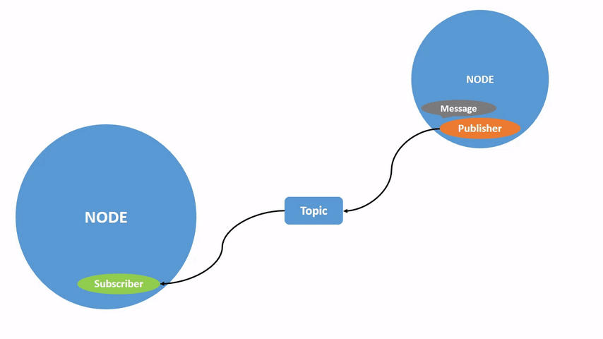
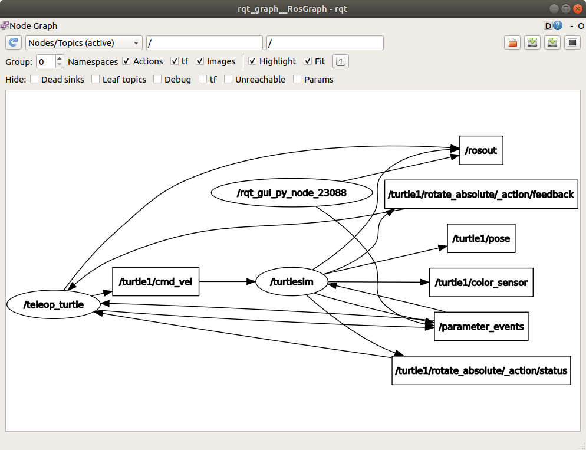
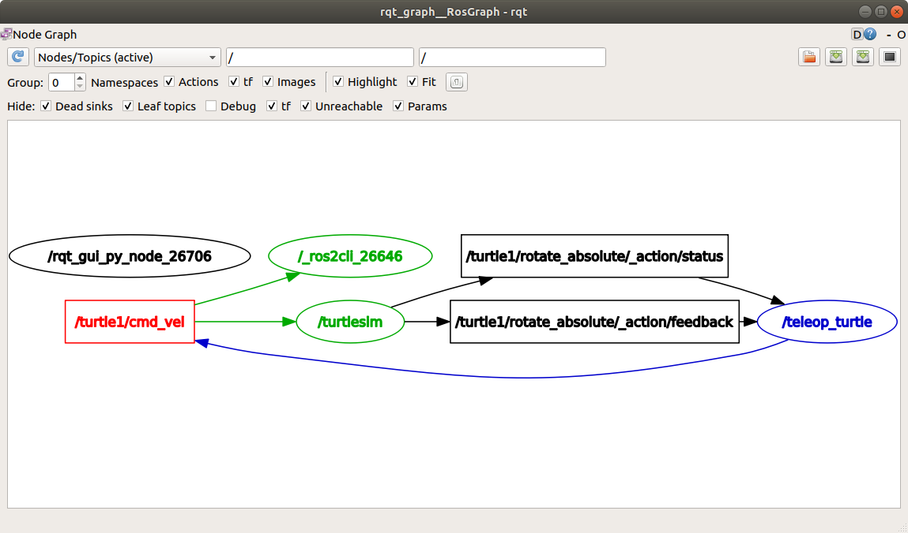
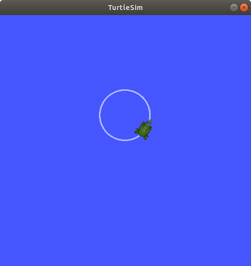
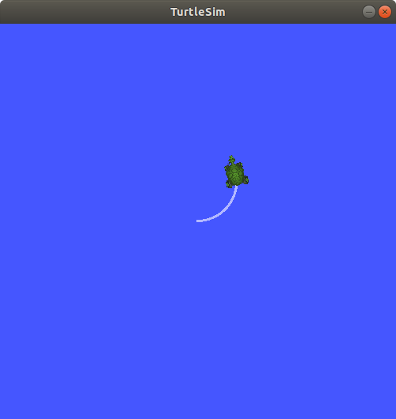
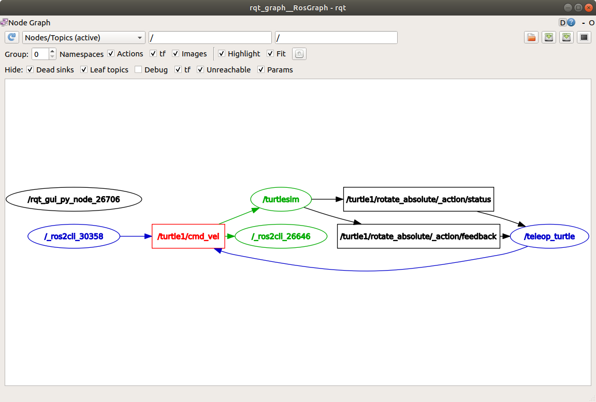
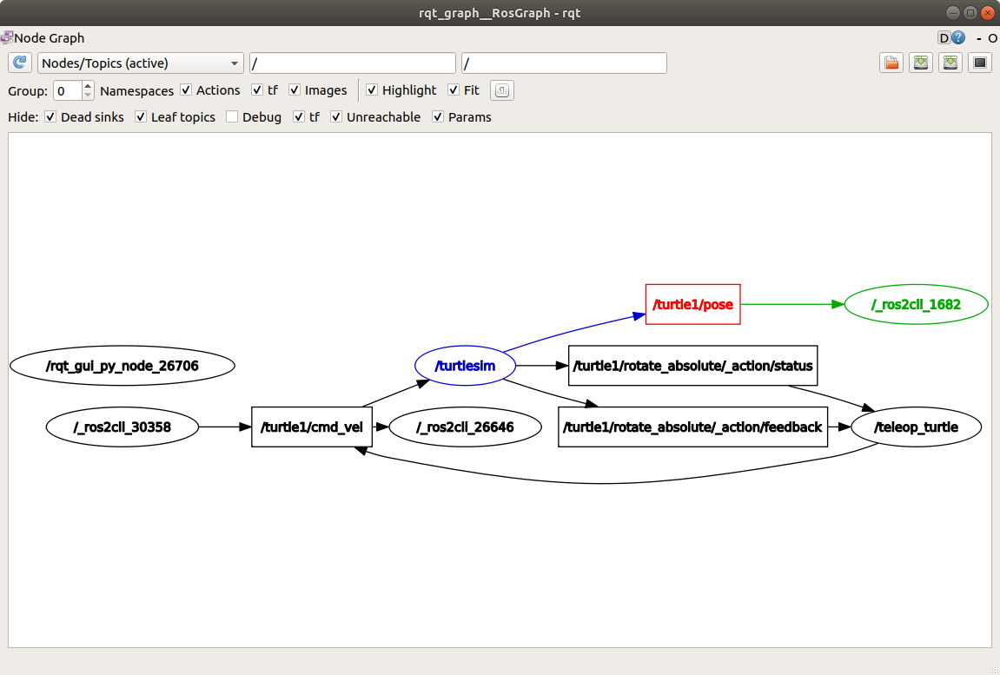

> Navigation: [Wiki index](../../../index.md) | [Summary](../../../SUMMARY.md) | [Tutorials hub](../../../wiki/tutorial-paths.md)
> Related: [Adding a frame (C++)](../intermediate/tf2/adding-a-frame-cpp.md) | [Adding a frame (Python)](../intermediate/tf2/adding-a-frame-py.md) | [Adding physical and collision properties](../intermediate/urdf/adding-physical-and-collision-properties-to-a-urdf-model.md) | [Building a movable robot model](../intermediate/urdf/building-a-movable-robot-model-with-urdf.md) | [Building a visual robot model from scratch](../intermediate/urdf/building-a-visual-robot-model-with-urdf-from-scratch.md)

<a id="understanding-topics"></a>
<a id="ros2topics"></a>

# Understanding topics

**Goal:** Use rqt\_graph and command line tools to introspect ROS 2 topics.

**Tutorial level:** Beginner

**Time:** 20 minutes

Contents

- [Background](#background)
- [Prerequisites](#prerequisites)
- [Tasks](#tasks)

  - [1 Setup](#setup)
  - [2 rqt\_graph](#rqt-graph)
  - [3 ros2 topic list](#ros2-topic-list)
  - [4 ros2 topic echo](#ros2-topic-echo)
  - [5 ros2 topic info](#ros2-topic-info)
  - [6 ros2 interface show](#ros2-interface-show)
  - [7 ros2 topic pub](#ros2-topic-pub)
  - [8 ros2 topic hz](#ros2-topic-hz)
  - [9 ros2 topic bw](#ros2-topic-bw)
  - [10 ros2 topic find](#ros2-topic-find)
  - [11 Clean up](#clean-up)
- [Summary](#summary)
- [Next steps](#next-steps)

<a id="background"></a>

## Background

ROS 2 breaks complex systems down into many modular nodes.
Topics are a vital element of the ROS graph that act as a bus for nodes to exchange messages.



A node may publish data to any number of topics and simultaneously have subscriptions to any number of topics.


Topics are one of the main ways in which data is moved between nodes and therefore between different parts of the system.

<a id="prerequisites"></a>

## Prerequisites

The [previous tutorial](understanding-ros2-nodes.md) provides some useful background information on nodes that is built upon here.

As always, don’t forget to source ROS 2 in [every new terminal you open](configuring-ros2-environment.md).

<a id="tasks"></a>

## Tasks

<a id="setup"></a>

### 1 Setup

By now you should be comfortable starting up turtlesim.

Open a new terminal and run:

```
$ ros2 run turtlesim turtlesim_node
```

Open another terminal and run:

```
$ ros2 run turtlesim turtle_teleop_key
```

Recall from the [previous tutorial](understanding-ros2-nodes.md) that the names of these nodes are `/turtlesim` and `/teleop_turtle` by default.

<a id="rqt-graph"></a>

### 2 rqt\_graph

Throughout this tutorial, we will use `rqt_graph` to visualize the changing nodes and topics, as well as the connections between them.

The [turtlesim tutorial](introducing-turtlesim.md) tells you how to install rqt and all its plugins, including `rqt_graph`.

To run rqt\_graph, open a new terminal and enter the command:

```
$ ros2 run rqt_graph rqt_graph
```

You can also open rqt\_graph by opening `rqt` and selecting **Plugins** > **Introspection** > **Node Graph**.


You should see the above nodes and topic, as well as two actions around the periphery of the graph (let’s ignore those for now).
If you hover your mouse over the topic in the center, you’ll see the color highlighting like in the image above.

The graph is depicting how the `/turtlesim` node and the `/teleop_turtle` node are communicating with each other over a topic.
The `/teleop_turtle` node is publishing data (the keystrokes you enter to move the turtle around) to the `/turtle1/cmd_vel` topic, and the `/turtlesim` node is subscribed to that topic to receive the data.

The highlighting feature of rqt\_graph is very helpful when examining more complex systems with many nodes and topics connected in many different ways.

rqt\_graph is a graphical introspection tool.
Now we’ll look at some command line tools for introspecting topics.

<a id="ros2-topic-list"></a>

### 3 ros2 topic list

Running the `ros2 topic list` command in a new terminal will return a list of all the topics currently active in the system:

```
$ ros2 topic list
/parameter_events
/rosout
/turtle1/cmd_vel
/turtle1/color_sensor
/turtle1/pose
```

`ros2 topic list -t` will return the same list of topics, this time with the topic type appended in brackets:

```
$ ros2 topic list -t
/parameter_events [rcl_interfaces/msg/ParameterEvent]
/rosout [rcl_interfaces/msg/Log]
/turtle1/cmd_vel [geometry_msgs/msg/Twist]
/turtle1/color_sensor [turtlesim/msg/Color]
/turtle1/pose [turtlesim/msg/Pose]
```

These attributes, particularly the type, are how nodes know they’re talking about the same information as it moves over topics.

If you’re wondering where all these topics are in rqt\_graph, you can uncheck all the boxes under **Hide:**



For now, though, leave those options checked to avoid confusion.

<a id="ros2-topic-echo"></a>

### 4 ros2 topic echo

To see the data being published on a topic, use:

```
$ ros2 topic echo <topic_name>
```

Since we know that `/teleop_turtle` publishes data to `/turtlesim` over the `/turtle1/cmd_vel` topic, let’s use `echo` to introspect that topic:

```
$ ros2 topic echo /turtle1/cmd_vel
```

At first, this command won’t return any data.
That’s because it’s waiting for `/teleop_turtle` to publish something.

Return to the terminal where `turtle_teleop_key` is running and use the arrows to move the turtle around.
Watch the terminal where your `echo` is running at the same time, and you’ll see position data being published for every movement you make:

```
linear:
  x: 2.0
  y: 0.0
  z: 0.0
angular:
  x: 0.0
  y: 0.0
  z: 0.0
  ---
```

Now return to rqt\_graph and uncheck the **Debug** box.



`/_ros2cli_26646` is the node created by the `echo` command we just ran (the number might be different).
Now you can see that the publisher is publishing data over the `cmd_vel` topic, and two subscribers are subscribed to it.

<a id="ros2-topic-info"></a>

### 5 ros2 topic info

Topics don’t have to only be one-to-one communication; they can be one-to-many, many-to-one, or many-to-many.

Another way to look at this is running:

```
$ ros2 topic info /turtle1/cmd_vel
Type: geometry_msgs/msg/Twist
Publisher count: 1
Subscription count: 2
```

<a id="ros2-topic-info-verbose"></a>

#### 5.1 ros2 topic info –verbose

For more detailed information about a topic, you can use the `--verbose` (or `-v`) flag:

```
$ ros2 topic info /turtle1/cmd_vel --verbose
```

This will return additional details including:

- Node names and namespaces of publishers and subscribers
- Topic type
- QoS profiles

```
Type: geometry_msgs/msg/Twist

Publisher count: 1

Node name: teleop_turtle
Node namespace: /
Topic type: geometry_msgs/msg/Twist
Topic type hash: RIHS01_9c45bf16fe0983d80e3cfe750d6835843d265a9a6c46bd2e609fcddde6fb8d2a
Endpoint type: PUBLISHER
GID: 24.ba.3e.e7.c1.51.bb.46.21.41.de.36.1b.14.73.5e
QoS profile:
  Reliability: RELIABLE
  History (Depth): KEEP_LAST (7)
  Durability: VOLATILE
  Lifespan: Infinite
  Deadline: Infinite
  Liveliness: AUTOMATIC
  Liveliness lease duration: Infinite

Subscription count: 2

Node name: _ros2cli_300492
Node namespace: /
Topic type: geometry_msgs/msg/Twist
Topic type hash: RIHS01_9c45bf16fe0983d80e3cfe750d6835843d265a9a6c46bd2e609fcddde6fb8d2a
Endpoint type: SUBSCRIPTION
GID: cc.4d.98.79.29.91.fe.25.8a.0a.c9.03.db.1a.ec.81
QoS profile:
  Reliability: RELIABLE
  History (Depth): KEEP_LAST (5)
  Durability: VOLATILE
  Lifespan: Infinite
  Deadline: Infinite
  Liveliness: AUTOMATIC
  Liveliness lease duration: Infinite

Node name: turtlesim
Node namespace: /
Topic type: geometry_msgs/msg/Twist
Topic type hash: RIHS01_9c45bf16fe0983d80e3cfe750d6835843d265a9a6c46bd2e609fcddde6fb8d2a
Endpoint type: SUBSCRIPTION
GID: 9c.33.59.38.b2.f2.42.47.69.1b.7f.0e.5e.1d.86.f5
QoS profile:
  Reliability: RELIABLE
  History (Depth): KEEP_LAST (7)
  Durability: VOLATILE
  Lifespan: Infinite
  Deadline: Infinite
  Liveliness: AUTOMATIC
  Liveliness lease duration: Infinite
```

<a id="ros2-interface-show"></a>

### 6 ros2 interface show

Nodes send data over topics using messages.
Publishers and subscribers must send and receive the same type of message to communicate.

The topic types we saw earlier after running `ros2 topic list -t` let us know what message type is used on each topic.
Recall that the `cmd_vel` topic has the type:

```
geometry_msgs/msg/Twist
```

This means that in the package `geometry_msgs` there is a `msg` called `Twist`.

Now we can run `ros2 interface show <msg_type>` on this type to learn its details.
Specifically, what structure of data the message expects.

```
$ ros2 interface show geometry_msgs/msg/Twist
```

Which will return:

```
# This expresses velocity in free space broken into its linear and angular parts.
    Vector3  linear
            float64 x
            float64 y
            float64 z
    Vector3  angular
            float64 x
            float64 y
            float64 z
```

This tells you that the `/turtlesim` node is expecting a message with two vectors, `linear` and `angular`, of three elements each.
If you recall the data we saw `/teleop_turtle` passing to `/turtlesim` with the `echo` command, it’s in the same structure:

```
linear:
  x: 2.0
  y: 0.0
  z: 0.0
angular:
  x: 0.0
  y: 0.0
  z: 0.0
  ---
```

<a id="ros2-topic-pub"></a>

### 7 ros2 topic pub

Now that you have the message structure, you can publish data to a topic directly from the command line using:

```
$ ros2 topic pub <topic_name> <msg_type> '<args>'
```

The `'<args>'` argument is the actual data you’ll pass to the topic, in the structure you just discovered in the previous section.

There are four main ways to use the `pub` command as shown below.
However, the autocomplete feature described in `c.` and `d.` is not supported in Windows.

1. **Publishing dictionary strings**:

> In order to publish data to a topic, you need to pass the data in the form of YAML strings.
>
> ```
> $ ros2 topic pub /turtle1/cmd_vel geometry_msgs/msg/Twist "{linear: {x: 2.0, y: 0.0, z: 0.0}, angular: {x: 0.0, y: 0.0, z: 1.8}}"
> ```
>
> However, you do not need to specify the entire message, if you are just changing the linear or angular velocity, you can just specify the values you want to change.
>
> For example, if you want to change the linear velocity to 2.0 and keep the angular velocity at 1.8, you can do the following:
>
> ```
> $ ros2 topic pub /turtle1/cmd_vel geometry_msgs/msg/Twist "{linear: {x: 2.0}, angular: {z: 1.8}}"
> ```

2. **Publishing an empty message**:

> ```
> $ ros2 topic pub /turtle1/cmd_vel geometry_msgs/msg/Twist
> ```
>
> This will publish the default values for the message type at 1 Hz.
> In this case, this equivalent to the following command:
>
> ```
> $ ros2 topic pub /turtle1/cmd_vel geometry_msgs/msg/Twist "{linear: {x: 0.0, y: 0.0, z: 0.0}, angular: {x: 0.0, y: 0.0, z: 0.0}}" --rate 1
> ```

3. **Using autocomplete**:

> You can trigger the autocomplete feature of your terminal by the following:
>
> ```
> $ ros2 topic pub /turtle1/cmd_vel geometry_msgs/msg/Twist <TAB>
> --keep-alive
> --max-wait-time-secs
> --node-name
> --once
> --print
> --qos-depth
> --qos-durability
> --qos-history
> --qos-liveliness
> --qos-liveliness-lease-duration-seconds
> --qos-profile
> --qos-reliability
> --rate
> --spin-time
> --stdin
> --times
> --use-sim-time
> --wait-matching-subscriptions
> --yaml-file
> -1
> -n
> -p
> -r
> -s
> -t
> -w
> \'linear:\^J\ \ x:\ 0.0\^J\ \ y:\ 0.0\^J\ \ z:\ 0.0\^Jangular:\^J\ \ x:\ 0.0\^J\ \ y:\ 0.0\^J\ \ z:\ 0.0\^J\'
> ```
>
> All the options will be autocompleted by pressing the `tab` key after the entering the first few characters of the option.
> However, the topic message prototype will only be autocompleted after `\'<TAB>` is entered.
>
> This is because the terminal does not recognize the single quote as part of the autocomplete string.
> Hence it needs to be escaped by using `\'` to be recognized as part of the string.
>
> The final autocompleted string will look like this:
>
> ```
> ros2 topic pub /turtle1/cmd_vel geometry_msgs/msg/Twist 'linear:
>   x: 0.0
>   y: 0.0
>   z: 0.0
> angular:
>   x: 0.0
>   y: 0.0
>   z: 0.0
> '
> ```
>
> This string is editable and you can change the values of the message type as required.

4. **Using the raw autocompleted string**:

> As mentioned above, the autocompleted string for `geometry_msgs/msg/Twist` looks like this:
>
> ```
> \'linear:\^J\ \ x:\ 0.0\^J\ \ y:\ 0.0\^J\ \ z:\ 0.0\^Jangular:\^J\ \ x:\ 0.0\^J\ \ y:\ 0.0\^J\ \ z:\ 0.0\^J\'
> ```
>
> This can be directly used in place of the yaml string in the command line.
>
> ```
> $ ros2 topic pub /turtle1/cmd_vel geometry_msgs/msg/Twist \'linear:\^J\ \ x:\ 0.0\^J\ \ y:\ 0.0\^J\ \ z:\ 0.0\^Jangular:\^J\ \ x:\ 0.0\^J\ \ y:\ 0.0\^J\ \ z:\ 0.0\^J\'
> ```

The turtle (and commonly the real robots which it is meant to emulate) require a steady stream of commands to operate continuously.
So, to get the turtle moving, and keep it moving, you can use the following dictionary string:

```
$ ros2 topic pub /turtle1/cmd_vel geometry_msgs/msg/Twist "{linear: {x: 2.0, y: 0.0, z: 0.0}, angular: {x: 0.0, y: 0.0, z: 1.8}}"
```



At times you may want to publish data to your topic only once (rather than continuously).
To publish your command just once add the `--once` option.

```
$ ros2 topic pub --once -w 2 /turtle1/cmd_vel geometry_msgs/msg/Twist "{linear: {x: 2.0, y: 0.0, z: 0.0}, angular: {x: 0.0, y: 0.0, z: 1.8}}"
```

`--once` is an optional argument meaning “publish one message then exit”.

`-w 2` is an optional argument meaning “wait for two matching subscriptions”.
This is needed because we have both turtlesim and the topic echo subscribed.

You will see the following output in the terminal:

```
Waiting for at least 2 matching subscription(s)...
publisher: beginning loop
publishing #1: geometry_msgs.msg.Twist(linear=geometry_msgs.msg.Vector3(x=2.0, y=0.0, z=0.0), angular=geometry_msgs.msg.Vector3(x=0.0, y=0.0, z=1.8))
```

And you will see your turtle move like so:



You can refresh rqt\_graph to see what’s happening graphically.
You will see that the `ros2 topic pub ...` node (`/_ros2cli_30358`) is publishing over the `/turtle1/cmd_vel` topic, which is being received by both the `ros2 topic echo ...` node (`/_ros2cli_26646`) and the `/turtlesim` node now.



Finally, you can run `echo` on the `pose` topic and recheck rqt\_graph:

```
$ ros2 topic echo /turtle1/pose
```



You can see that the `/turtlesim` node is also publishing to the `pose` topic, which the new `echo` node has subscribed to.

When publishing messages with timestamps, `pub` has two methods to automatically fill them out with the current time.
For messages with a `std_msgs/msg/Header`, the header field can be set to `auto` to fill out the `stamp` field.

```
$ ros2 topic pub /pose geometry_msgs/msg/PoseStamped '{header: "auto", pose: {position: {x: 1.0, y: 2.0, z: 3.0}}}'
```

If the message does not use a full header, but just has a field with type `builtin_interfaces/msg/Time`, that can be set to the value `now`.

```
$ ros2 topic pub /reference sensor_msgs/msg/TimeReference '{header: "auto", time_ref: "now", source: "dumy"}'
```

<a id="ros2-topic-hz"></a>

### 8 ros2 topic hz

You can also view the rate at which data is published using:

```
$ ros2 topic hz /turtle1/pose
average rate: 59.354
  min: 0.005s max: 0.027s std dev: 0.00284s window: 58
```

It will return data on the rate at which the `/turtlesim` node is publishing data to the `pose` topic.

Recall that you set the rate of `turtle1/cmd_vel` to publish at a steady 1 Hz using `ros2 topic pub --rate 1`.
If you run the above command with `turtle1/cmd_vel` instead of `turtle1/pose`, you will see an average reflecting that rate.

> [!NOTE]
>
> The rate reflects the receiving rate on the subscription created by the `ros2 topic hz` command, which might be affected by platform resources and QoS configuration, and may not exactly match the publisher rate.

<a id="ros2-topic-bw"></a>

### 9 ros2 topic bw

The bandwidth used by a topic can be viewed using:

```
$ ros2 topic bw /turtle1/pose
Subscribed to [/turtle1/pose]
1.51 KB/s from 62 messages
    Message size mean: 0.02 KB min: 0.02 KB max: 0.02 KB
```

It returns the bandwidth utilization and number of messages being published to the `/turtle1/pose` topic.

> [!NOTE]
>
> The bandwidth reflects the receiving rate on the subscription created by the `ros2 topic bw` command, which might be affected by platform resources and QoS configuration, and may not exactly match the publisher’s bandwidth.

<a id="ros2-topic-find"></a>

### 10 ros2 topic find

To list a list of available topics of a given type use:

```
$ ros2 topic find <topic_type>
```

Recall that the `cmd_vel` topic has the type:

```
geometry_msgs/msg/Twist
```

Using the `find` command outputs topics available when given the message type:

```
$ ros2 topic find geometry_msgs/msg/Twist
/turtle1/cmd_vel
```

<a id="clean-up"></a>

### 11 Clean up

At this point you’ll have a lot of nodes running.
Don’t forget to stop them by entering `Ctrl+C` in each terminal.

<a id="summary"></a>

## Summary

Nodes publish information over topics, which allows any number of other nodes to subscribe to and access that information.
In this tutorial you examined the connections between several nodes over topics using rqt\_graph and command line tools.
You should now have a good idea of how data moves around a ROS 2 system.

<a id="next-steps"></a>

## Next steps

Next you’ll learn about another communication type in the ROS graph with the tutorial [Understanding services](understanding-ros2-services.md).
