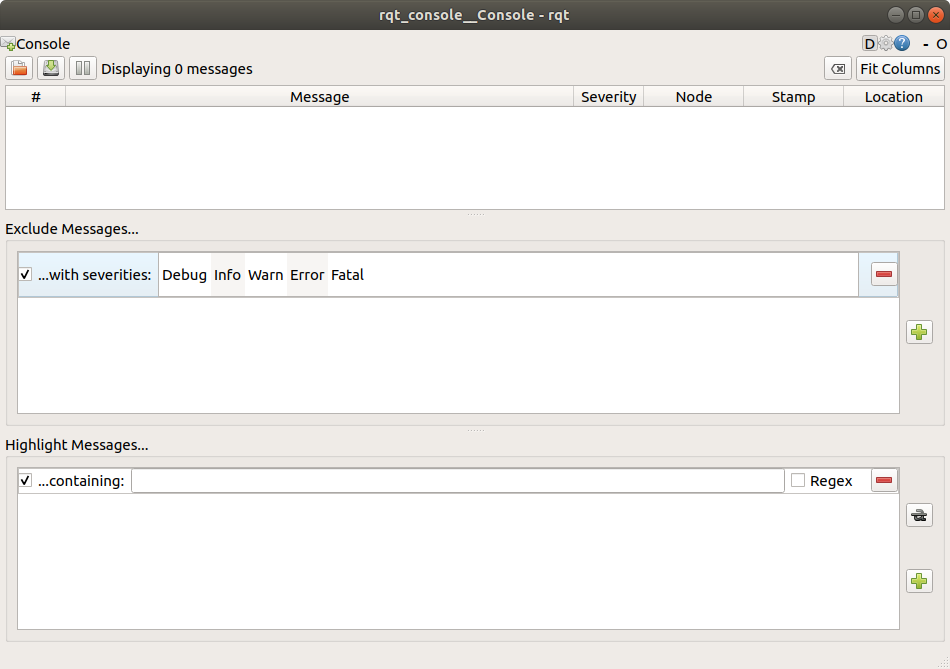
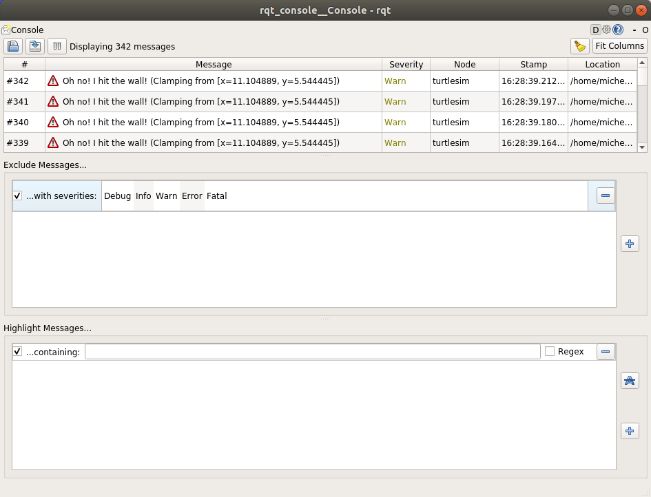

> Navigation: [Wiki index](../../../index.md) | [Summary](../../../SUMMARY.md) | [Tutorials hub](../../../wiki/tutorial-paths.md)
> Related: [Adding a frame (C++)](../intermediate/tf2/adding-a-frame-cpp.md) | [Adding a frame (Python)](../intermediate/tf2/adding-a-frame-py.md) | [Adding physical and collision properties](../intermediate/urdf/adding-physical-and-collision-properties-to-a-urdf-model.md) | [Building a movable robot model](../intermediate/urdf/building-a-movable-robot-model-with-urdf.md) | [Building a visual robot model from scratch](../intermediate/urdf/building-a-visual-robot-model-with-urdf-from-scratch.md)

<a id="using-rqt-console-to-view-logs"></a>
<a id="rqt-console"></a>

# Using `rqt_console` to view logs

**Goal:** Get to know `rqt_console`, a tool for introspecting log messages.

**Tutorial level:** Beginner

**Time:** 5 minutes

Contents

- [Background](#background)
- [Prerequisites](#prerequisites)
- [Tasks](#tasks)

  - [1 Setup](#setup)
  - [2 Messages on rqt\_console](#messages-on-rqt-console)
  - [3 Logger levels](#logger-levels)
- [Summary](#summary)
- [Next steps](#next-steps)

<a id="background"></a>

## Background

`rqt_console` is a GUI tool used to introspect log messages in ROS 2.
Typically, log messages show up in your terminal.
With `rqt_console`, you can collect those messages over time, view them closely and in a more organized manner, filter them, save them and even reload the saved files to introspect at a different time.

Nodes use logs to output messages concerning events and status in a variety of ways.
Their content is usually informational, for the sake of the user.

<a id="prerequisites"></a>

## Prerequisites

You will need [rqt\_console and turtlesim](introducing-turtlesim.md) installed.

As always, don’t forget to source ROS 2 in [every new terminal you open](configuring-ros2-environment.md).

<a id="tasks"></a>

## Tasks

<a id="setup"></a>

### 1 Setup

Start `rqt_console` in a new terminal with the following command:

```
$ ros2 run rqt_console rqt_console
```

The `rqt_console` window will open:



The first section of the console is where log messages from your system will display.

In the middle you have the option to filter messages by excluding severity levels.
You can also add more exclusion filters using the plus-sign button to the right.

The bottom section is for highlighting messages that include a string you input.
You can add more filters to this section as well.

Now start `turtlesim` in a new terminal with the following command:

```
$ ros2 run turtlesim turtlesim_node
```

<a id="messages-on-rqt-console"></a>

### 2 Messages on rqt\_console

To produce log messages for `rqt_console` to display, let’s have the turtle run into the wall.
In a new terminal, enter the `ros2 topic pub` command (discussed in detail in the [topics tutorial](understanding-ros2-topics.md)) below:

```
$ ros2 topic pub -r 1 /turtle1/cmd_vel geometry_msgs/msg/Twist "{linear: {x: 2.0, y: 0.0, z: 0.0}, angular: {x: 0.0,y: 0.0,z: 0.0}}"
```

Since the above command is publishing the topic at a steady rate, the turtle is continuously running into the wall.
In `rqt_console` you will see the same message with the `Warn` severity level displayed over and over, like so:



Press `Ctrl+C` in the terminal where you ran the `ros2 topic pub` command to stop your turtle from running into the wall.

<a id="logger-levels"></a>

### 3 Logger levels

ROS 2’s logger levels are ordered by severity:

> 1. Fatal
> 2. Error
> 3. Warn
> 4. Info
> 5. Debug

There is no exact standard for what each level indicates, but it’s safe to assume that:

- `Fatal` messages indicate the system is going to terminate to try to protect itself from detriment.
- `Error` messages indicate significant issues that won’t necessarily damage the system, but are preventing it from functioning properly.
- `Warn` messages indicate unexpected activity or non-ideal results that might represent a deeper issue, but don’t harm functionality outright.
- `Info` messages indicate event and status updates that serve as a visual verification that the system is running as expected.
- `Debug` messages detail the entire step-by-step process of the system execution.

The default level is `Info`.
You will only see messages of the default severity level and more-severe levels.

Normally, only `Debug` messages are hidden because they’re the only level less severe than `Info`.
For example, if you set the default level to `Warn`, you would only see messages of severity `Warn`, `Error`, and `Fatal`.

<a id="set-the-default-logger-level"></a>

#### 3.1 Set the default logger level

You can set the default logger level when you first run the `/turtlesim` node using remapping.
Enter the following command in your terminal:

```
$ ros2 run turtlesim turtlesim_node --ros-args --log-level WARN
```

Now you won’t see the initial `Info` level messages that came up in the console last time you started `turtlesim`.
That’s because `Info` messages are lower priority than the new default severity, `Warn`.

<a id="summary"></a>

## Summary

`rqt_console` can be very helpful if you need to closely examine the log messages from your system.
You might want to examine log messages for any number of reasons, usually to find out where something went wrong and the series of events leading up to that.

<a id="next-steps"></a>

## Next steps

The next tutorial will teach you about starting multiple nodes at once with [ROS 2 Launch](launching-multiple-nodes.md).
