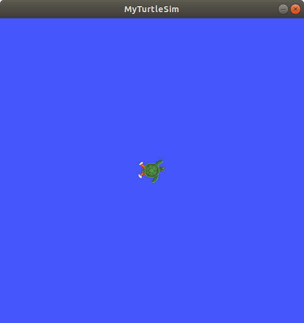
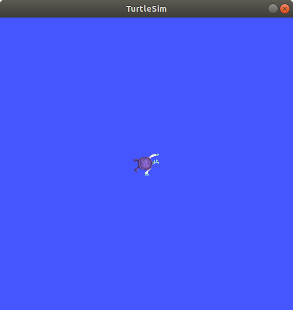

> Navigation: [Wiki index](../../../index.md) | [Summary](../../../SUMMARY.md) | [Tutorials hub](../../../wiki/tutorial-paths.md)
> Related: [Adding a frame (C++)](../intermediate/tf2/adding-a-frame-cpp.md) | [Adding a frame (Python)](../intermediate/tf2/adding-a-frame-py.md) | [Adding physical and collision properties](../intermediate/urdf/adding-physical-and-collision-properties-to-a-urdf-model.md) | [Building a movable robot model](../intermediate/urdf/building-a-movable-robot-model-with-urdf.md) | [Building a visual robot model from scratch](../intermediate/urdf/building-a-visual-robot-model-with-urdf-from-scratch.md)

<a id="creating-a-workspace"></a>
<a id="ros2workspace"></a>

# Creating a workspace

**Goal:** Create a workspace and learn how to set up an overlay for development and testing.

**Tutorial level:** Beginner

**Time:** 20 minutes

Contents

- [Background](#background)
- [Prerequisites](#prerequisites)
- [Tasks](#tasks)

  - [1 Source ROS 2 environment](#source-ros-2-environment)
  - [2 Create a new directory](#create-a-new-directory)
  - [3 Clone a sample repo](#clone-a-sample-repo)
  - [4 Resolve dependencies](#resolve-dependencies)
  - [5 Build the workspace with colcon](#build-the-workspace-with-colcon)
  - [6 Source the overlay](#source-the-overlay)
  - [7 Modify the overlay](#modify-the-overlay)
- [Summary](#summary)
- [Next steps](#next-steps)

<a id="background"></a>

## Background

A workspace is a directory containing ROS 2 packages.
Before using ROS 2, it’s necessary to source your ROS 2 installation workspace in the terminal you plan to work in.
This makes ROS 2’s packages available for you to use in that terminal.

You also have the option of sourcing an “overlay” - a secondary workspace where you can add new packages without interfering with the existing ROS 2 workspace that you’re extending, or “underlay”.
Your underlay must contain the dependencies of all the packages in your overlay.
Packages in your overlay will override packages in the underlay.
It’s also possible to have several layers of underlays and overlays, with each successive overlay using the packages of its parent underlays.

<a id="prerequisites"></a>

## Prerequisites

- [ROS 2 installation](../../installation/overview.md)
- [colcon installation](colcon-tutorial.md)
- [git installation](https://git-scm.com/book/en/v2/Getting-Started-Installing-Git)
- [turtlesim installation](../beginner-cli-tools/introducing-turtlesim.md)
- Have [rosdep installed](../intermediate/rosdep.md)
- Understanding of basic terminal commands ([here’s a guide for Linux](https://www2.cs.sfu.ca/~ggbaker/reference/unix/))
- Text editor of your choice

<a id="tasks"></a>

## Tasks

<a id="source-ros-2-environment"></a>

### 1 Source ROS 2 environment

Your main ROS 2 installation will be your underlay for this tutorial.
(Keep in mind that an underlay does not necessarily have to be the main ROS 2 installation.)

Depending on how you installed ROS 2 (from source or binaries), and which platform you’re on, your exact source command will vary:

Linux

```
$ source /opt/ros/jazzy/setup.bash
```

macOS

```
$ . ~/ros2_install/ros2-osx/setup.bash
```

Windows

Remember to use a `x64 Native Tools Command Prompt for VS 2019` for executing the following commands, as we are going to build a workspace.

```
$ call C:\dev\ros2\local_setup.bat
```

Consult the [installation guide](../../installation/overview.md) you followed if these commands don’t work for you.

<a id="create-a-new-directory"></a>
<a id="new-directory"></a>

### 2 Create a new directory

Best practice is to create a new directory for every new workspace.
The name doesn’t matter, but it is helpful to have it indicate the purpose of the workspace.
Let’s choose the directory name `ros2_ws`, for “development workspace”:

Linux

```
$ mkdir -p ~/ros2_ws/src
$ cd ~/ros2_ws/src
```

macOS

```
$ mkdir -p ~/ros2_ws/src
$ cd ~/ros2_ws/src
```

Windows

```
$ md \ros2_ws\src
$ cd \ros2_ws\src
```

Another best practice is to put any packages in your workspace into the `src` directory.
The above code creates a `src` directory inside `ros2_ws` and then navigates into it.

<a id="clone-a-sample-repo"></a>

### 3 Clone a sample repo

Ensure you’re still in the `ros2_ws/src` directory before you clone.

In the rest of the beginner developer tutorials, you will create your own packages, but for now you will practice putting a workspace together using existing packages.

If you went through the [Beginner: CLI Tools](../beginner-cli-tools.md) tutorials, you’ll be familiar with `turtlesim`, one of the packages in [ros\_tutorials](https://github.com/ros/ros_tutorials/).

A repo can have multiple branches.
You need to check out the one that targets your installed ROS 2 distro.
When you clone this repo, add the `-b` argument followed by that branch.

In the `ros2_ws/src` directory, run the following command:

```
$ git clone https://github.com/ros/ros_tutorials.git -b jazzy
```

Now `ros_tutorials` is cloned in your workspace.
The `ros_tutorials` repository contains the `turtlesim` package, which we’ll use in the rest of this tutorial.
The other packages in this repository are not built because they contain a `COLCON_IGNORE` file.

So far you have populated your workspace with a sample package, but it isn’t a fully-functional workspace yet.
You need to resolve the dependencies first and then build the workspace.

<a id="resolve-dependencies"></a>

### 4 Resolve dependencies

Before building the workspace, you need to resolve the package dependencies.
You may have all the dependencies already, but best practice is to check for dependencies every time you clone.
You wouldn’t want a build to fail after a long wait only to realize that you have missing dependencies.

From the root of your workspace (`ros2_ws`), run the following command:

Linux

If you’re still in the `src` directory with the `ros_tutorials` clone, make sure to run `cd ..` to move back up to the workspace (`ros2_ws`).

```
$ cd ..
$ rosdep install -i --from-path src --rosdistro jazzy -y
```

macOS

rosdep only runs on Linux, so you can skip ahead to section “5 Build the workspace with colcon”.

Windows

rosdep only runs on Linux, so you can skip ahead to section “5 Build the workspace with colcon”.

If you installed ROS 2 on Linux from source or the binary archive, you will need to use the rosdep command from their installation instructions.
Here are the [from-source rosdep section](../../installation/alternatives/ubuntu-development-setup.md#linux-development-setup-install-dependencies-using-rosdep) and the [binary archive rosdep section](../../installation/alternatives/ubuntu-install-binary.md#linux-install-binary-install-missing-dependencies).

If you already have all your dependencies, the console will return:

```
#All required rosdeps installed successfully
```

Packages declare their dependencies in the package.xml file (you will learn more about packages in the next tutorial).
This command walks through those declarations and installs the ones that are missing.
You can learn more about `rosdep` in another tutorial (coming soon).

<a id="build-the-workspace-with-colcon"></a>

### 5 Build the workspace with colcon

From the root of your workspace (`ros2_ws`), you can now build your packages using the command:

Linux

```
$ colcon build
Starting >>> turtlesim
Finished <<< turtlesim [5.49s]

Summary: 1 package finished [5.58s]
```

macOS

```
$ colcon build
Starting >>> turtlesim
Finished <<< turtlesim [5.49s]

Summary: 1 package finished [5.58s]
```

Windows

```
$ colcon build --merge-install
Starting >>> turtlesim
Finished <<< turtlesim [5.49s]

Summary: 1 package finished [5.58s]
```

Windows doesn’t allow long paths, so `merge-install` will combine all the paths into the `install` directory.

> [!NOTE]
>
> Other useful arguments for `colcon build`:
>
> - `--packages-up-to` builds the package you want, plus all its dependencies, but not the whole workspace (saves time)
> - `--symlink-install` saves you from having to rebuild every time you tweak python scripts
> - `--event-handlers console_direct+` shows console output while building (can otherwise be found in the `log` directory)
> - `--executor sequential` processes the packages one by one instead of using parallelism

Once the build is finished, enter the command in the workspace root (`~/ros2_ws`).
You will see that colcon has created new directories:

Linux

```
$ ls
build  install  log  src
```

macOS

```
$ ls
build  install  log  src
```

Windows

```
$ dir
build  install  log  src
```

The `install` directory is where your workspace’s setup files are, which you can use to source your overlay.

<a id="source-the-overlay"></a>

### 6 Source the overlay

Before sourcing the overlay, it is very important that you open a new terminal, separate from the one where you built the workspace.
Sourcing an overlay in the same terminal where you built, or likewise building where an overlay is sourced, may create complex issues.

In the new terminal, source your main ROS 2 environment as the “underlay”, so you can build the overlay “on top of” it:

Linux

```
$ source /opt/ros/jazzy/setup.bash
```

macOS

```
$ . ~/ros2_install/ros2-osx/setup.bash
```

Windows

In this case you can use a normal command prompt, as we are not going to build any workspace in this terminal.

```
$ call C:\dev\ros2\local_setup.bat
```

Go into the root of your workspace:

Linux

```
$ cd ~/ros2_ws
```

macOS

```
$ cd ~/ros2_ws
```

Windows

```
$ cd \ros2_ws
```

In the root, source your overlay:

Linux

```
$ source install/local_setup.bash
```

macOS

```
$ . install/local_setup.bash
```

Windows

```
$ call install\setup.bat
```

> [!NOTE]
>
> Sourcing the `local_setup` of the overlay will only add the packages available in the overlay to your environment.
> `setup` sources the overlay as well as the underlay it was created in, allowing you to utilize both workspaces.
>
> So, sourcing your main ROS 2 installation’s `setup` and then the `ros2_ws` overlay’s `local_setup`, like you just did,
> is the same as just sourcing `ros2_ws`’s `setup`, because that includes the environment of its underlay.

Now you can run the `turtlesim` package from the overlay:

```
$ ros2 run turtlesim turtlesim_node
```

But how can you tell that this is the overlay turtlesim running, and not your main installation’s turtlesim?

Let’s modify turtlesim in the overlay so you can see the effects:

- You can modify and rebuild packages in the overlay separately from the underlay.
- The overlay takes precedence over the underlay.

<a id="modify-the-overlay"></a>

### 7 Modify the overlay

You can modify `turtlesim` in your overlay by editing the title bar on the turtlesim window.
To do this, locate the `turtle_frame.cpp` file in `~/ros2_ws/src/ros_tutorials/turtlesim/src`.
Open `turtle_frame.cpp` with your preferred text editor.

Find the function `setWindowTitle("TurtleSim");`, change the value `"TurtleSim"` to `"MyTurtleSim"`, and save the file.

Return to the first terminal where you ran `colcon build` earlier and run it again.

Return to the second terminal (where the overlay is sourced) and run turtlesim again:

```
$ ros2 run turtlesim turtlesim_node
```

You will see the title bar on the turtlesim window now says “MyTurtleSim”.



Even though your main ROS 2 environment was sourced in this terminal earlier, the overlay of your `ros2_ws` environment takes precedence over the contents of the underlay.

To see that your underlay is still intact, open a brand new terminal and source only your ROS 2 installation.
Run turtlesim again:

```
$ ros2 run turtlesim turtlesim_node
```



You can see that modifications in the overlay did not actually affect anything in the underlay.

<a id="summary"></a>

## Summary

In this tutorial, you sourced your main ROS 2 distro install as your underlay, and created an overlay by cloning and building packages in a new workspace.
The overlay gets prepended to the path, and takes precedence over the underlay, as you saw with your modified turtlesim.

Using overlays is recommended for working on a small number of packages, so you don’t have to put everything in the same workspace and rebuild a huge workspace on every iteration.

<a id="next-steps"></a>

## Next steps

Now that you understand the details behind creating, building and sourcing your own workspace, you can learn how to [create your own packages](creating-your-first-ros2-package.md).
