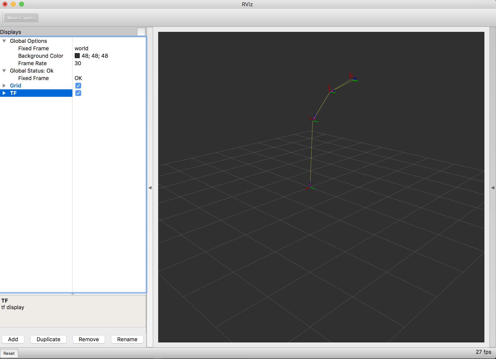

> Navigation: [Wiki index](../../../index.md) | [Summary](../../../SUMMARY.md) | [Tutorials hub](../../../wiki/tutorial-paths.md)
> Related: [Ament Lint CLI Utilities](../advanced/ament-lint-for-clean-code.md) | [Building a package with Eclipse 2021-06](../miscellaneous/building-ros2-package-with-eclipse-2021-06.md) | [Building a real-time Linux kernel [community-contributed]](../miscellaneous/building-realtime-rt-preempt-kernel-for-ros-2.md) | [Composing multiple nodes in a single process](../intermediate/composition.md) | [Configure service introspection](service-introspection.md)

<a id="experimenting-with-a-dummy-robot"></a>

# Experimenting with a dummy robot

In this demo, we present a simple demo robot with all components from publishing joint states over publishing fake laser data until visualizing the robot model on a map in RViz.

<a id="launching-the-demo"></a>

## Launching the demo

We assume your ROS 2 installation dir as `~/ros2_ws`.
Please change the directories according to your platform.

To start the demo, we execute the demo bringup launch file, which we are going to explain in more details in the next section.

Source Build

```
$ mkdir -p ~/ros2_ws/src
$ cd ~/ros2_ws/src
$ git clone -b ${ROS_DISTRO} https://github.com/ros2/demos
$ cd .. && colcon build --packages-up-to dummy_robot_bringup
$ source ~/ros2_ws/install/setup.bash
$ ros2 launch dummy_robot_bringup dummy_robot_bringup_launch.py
[INFO] [launch]: Default logging verbosity is set to INFO
[INFO] [dummy_map_server-1]: process started with pid [2922]
[INFO] [robot_state_publisher-2]: process started with pid [2923]
[INFO] [dummy_joint_states-3]: process started with pid [2924]
[INFO] [dummy_laser-4]: process started with pid [2925]
[dummy_laser-4] [INFO] [1714837459.645517297] [dummy_laser]: angle inc:    0.004363
[dummy_laser-4] [INFO] [1714837459.645613393] [dummy_laser]: scan size:    1081
[dummy_laser-4] [INFO] [1714837459.645626640] [dummy_laser]: scan time increment:     0.000000
[robot_state_publisher-2] [INFO] [1714837459.652977937] [robot_state_publisher]: Robot initialized
```

deb Package

```
$ sudo apt install ros-${ROS_DISTRO}-dummy-robot-bringup
$ ros2 launch dummy_robot_bringup dummy_robot_bringup_launch.py
[INFO] [launch]: Default logging verbosity is set to INFO
[INFO] [dummy_map_server-1]: process started with pid [2922]
[INFO] [robot_state_publisher-2]: process started with pid [2923]
[INFO] [dummy_joint_states-3]: process started with pid [2924]
[INFO] [dummy_laser-4]: process started with pid [2925]
[dummy_laser-4] [INFO] [1714837459.645517297] [dummy_laser]: angle inc:    0.004363
[dummy_laser-4] [INFO] [1714837459.645613393] [dummy_laser]: scan size:    1081
[dummy_laser-4] [INFO] [1714837459.645626640] [dummy_laser]: scan time increment:     0.000000
[robot_state_publisher-2] [INFO] [1714837459.652977937] [robot_state_publisher]: Robot initialized
```

If you now open RViz2 in a new terminal, you’ll see your robot.
🎉

```
$ source ~/ros2_ws/install/setup.bash
$ rviz2
```

This opens RViz2.
Assuming you have your dummy\_robot\_bringup still launched, you can now add the TF display plugin and configure your global frame to `world`.
Once you did that, you should see a similar picture:



<a id="what-s-happening"></a>

### What’s happening?

If you have a closer look at the launch file, we start a couple of nodes at the same time.

- dummy\_map\_server
- dummy\_laser
- dummy\_joint\_states
- robot\_state\_publisher

The first two packages are relatively simple.
The `dummy_map_server` constantly publishes an empty map with a periodic update.
The `dummy_laser` does basically the same; publishing dummy fake laser scans.

The `dummy_joint_states` node is publishing fake joint state data.
As we are publishing a simple RRbot with only two joints, this node publishes joint states values for these two joints.

The `robot_state_publisher` is doing the actual interesting work.
It parses the given URDF file, extracts the robot model and listens to the incoming joint states.
With this information, it publishes TF values for our robot which we visualize in RViz.

Hooray!
