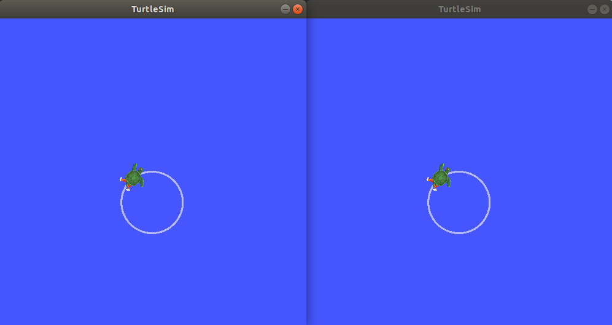
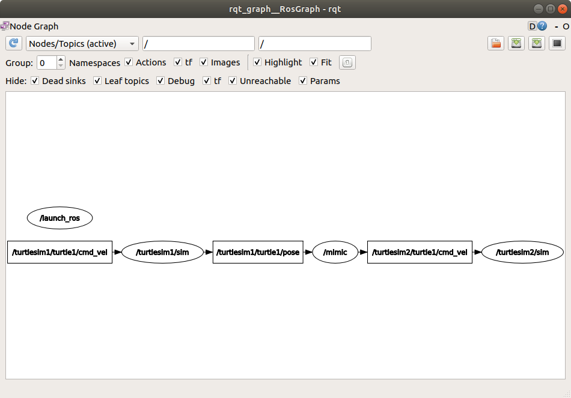

> Navigation: [Wiki index](../../../../index.md) | [Summary](../../../../SUMMARY.md) | [Tutorials hub](../../../../wiki/tutorial-paths.md)
> Related: [Adding a frame (C++)](../tf2/adding-a-frame-cpp.md) | [Adding a frame (Python)](../tf2/adding-a-frame-py.md) | [Adding physical and collision properties](../urdf/adding-physical-and-collision-properties-to-a-urdf-model.md) | [Building a movable robot model](../urdf/building-a-movable-robot-model-with-urdf.md) | [Building a visual robot model from scratch](../urdf/building-a-visual-robot-model-with-urdf-from-scratch.md)

<a id="creating-a-launch-file"></a>

# Creating a launch file

**Goal:** Create a launch file to run a complex ROS 2 system.

**Tutorial level:** Intermediate

**Time:** 10 minutes

Contents

- [Prerequisites](#prerequisites)
- [Background](#background)
- [Tasks](#tasks)

  - [1 Setup](#setup)
  - [2 Write the launch file](#write-the-launch-file)
  - [3 ros2 launch](#ros2-launch)
  - [4 Introspect the system with rqt\_graph](#introspect-the-system-with-rqt-graph)
- [Summary](#summary)

<a id="prerequisites"></a>

## Prerequisites

This tutorial uses the [rqt\_graph and turtlesim](../../beginner-cli-tools/introducing-turtlesim.md) packages.

You will also need to use a text editor of your preference.

As always, don’t forget to source ROS 2 in [every new terminal you open](../../beginner-cli-tools/configuring-ros2-environment.md).

<a id="background"></a>

## Background

The launch system in ROS 2 is responsible for helping the user describe the configuration of their system and then execute it as described.
The configuration of the system includes what programs to run, where to run them, what arguments to pass them, and ROS-specific conventions which make it easy to reuse components throughout the system by giving them each a different configuration.
It is also responsible for monitoring the state of the processes launched, and reporting and/or reacting to changes in the state of those processes.

Launch files written in XML, YAML, or Python can start and stop different nodes as well as trigger and act on various events.
See [Using XML, YAML, and Python for ROS 2 Launch Files](../../../how-to/launch-file-different-formats.md) for a description of the different formats.
The package providing this framework is `launch_ros`, which uses the non-ROS-specific `launch` framework underneath.

The [design document](https://design.ros2.org/articles/roslaunch.html) details the goal of the design of ROS 2’s launch system (not all functionality is currently available).

<a id="tasks"></a>

## Tasks

<a id="setup"></a>

### 1 Setup

Create a new directory to store your launch files:

```
$ mkdir launch
```

<a id="write-the-launch-file"></a>

### 2 Write the launch file

Let’s put together a ROS 2 launch file using the `turtlesim` package and its executables.
As mentioned above, this can either be in XML, YAML, or Python.

XML

Copy and paste the complete code into the `launch/turtlesim_mimic_launch.xml` file:

```
<?xml version="1.0" encoding="UTF-8"?>
<launch>
  <node pkg="turtlesim" exec="turtlesim_node" name="sim" namespace="turtlesim1" args="--ros-args --log-level info" />
  <node pkg="turtlesim" exec="turtlesim_node" name="sim" namespace="turtlesim2" ros_args="--log-level warn" />
  <node pkg="turtlesim" exec="mimic" name="mimic">
    <remap from="/input/pose" to="/turtlesim1/turtle1/pose" />
    <remap from="/output/cmd_vel" to="/turtlesim2/turtle1/cmd_vel" />
  </node>
</launch>
```

YAML

Copy and paste the complete code into the `launch/turtlesim_mimic_launch.yaml` file:

```
%YAML 1.2
---
launch:
  - node:
      pkg: "turtlesim"
      exec: "turtlesim_node"
      name: "sim"
      namespace: "turtlesim1"
      args: "--ros-args --log-level info"

  - node:
      pkg: "turtlesim"
      exec: "turtlesim_node"
      name: "sim"
      namespace: "turtlesim2"
      ros_args: "--log-level warn"

  - node:
      pkg: "turtlesim"
      exec: "mimic"
      name: "mimic"
      remap:
        - from: "/input/pose"
          to: "/turtlesim1/turtle1/pose"
        - from: "/output/cmd_vel"
          to: "/turtlesim2/turtle1/cmd_vel"
```

Python

Copy and paste the complete code into the `launch/turtlesim_mimic_launch.py` file:

```
from launch import LaunchDescription
from launch_ros.actions import Node

def generate_launch_description():
    return LaunchDescription([
        Node(
            package='turtlesim',
            namespace='turtlesim1',
            executable='turtlesim_node',
            name='sim',
            arguments=['--ros-args', '--log-level', 'info']
        ),
        Node(
            package='turtlesim',
            namespace='turtlesim2',
            executable='turtlesim_node',
            name='sim',
            ros_arguments=['--log-level', 'warn']
        ),
        Node(
            package='turtlesim',
            executable='mimic',
            name='mimic',
            remappings=[
                ('/input/pose', '/turtlesim1/turtle1/pose'),
                ('/output/cmd_vel', '/turtlesim2/turtle1/cmd_vel'),
            ]
        )
    ])
```

<a id="examine-the-launch-file"></a>

#### 2.1 Examine the launch file

All of the launch files above are launching a system of three nodes, all from the `turtlesim` package.
The goal of the system is to launch two turtlesim windows, and have one turtle mimic the movements of the other.

When launching the two turtlesim nodes, the primary difference between them is their namespace values.
Unique namespaces allow the system to start two nodes without node name or topic name conflicts.
Both turtles in this system receive commands over the same topic and publish their pose over the same topic.
With unique namespaces, messages meant for different turtles can be distinguished.

The two turtlesim nodes also demonstrate different ways to pass arguments to nodes.
The first node uses `args` to pass arguments directly to the executable, requiring the `--ros-args` flag for ROS-specific arguments.
The second node uses `ros_args` (`ros_arguments` in Python), designed specifically for ROS arguments.
Use `args` when mixing ROS and non-ROS arguments (e.g., `my_custom_arg --ros-args --log-level info`), or `ros_args` for cleaner syntax with only ROS arguments like remappings, parameters, or log levels.

The final node is also from the `turtlesim` package, but a different executable: `mimic`.
This node has added configuration details in the form of remappings.
`mimic`’s `/input/pose` topic is remapped to `/turtlesim1/turtle1/pose` and it’s `/output/cmd_vel` topic to `/turtlesim2/turtle1/cmd_vel`.
This means `mimic` will subscribe to `/turtlesim1/sim`’s pose topic and republish it for `/turtlesim2/sim`’s velocity command topic to subscribe to.
In other words, `turtlesim2` will mimic `turtlesim1`’s movements.

XML

The first two actions launch the two turtlesim windows with different argument passing approaches:

```
  <node pkg="turtlesim" exec="turtlesim_node" name="sim" namespace="turtlesim1" args="--ros-args --log-level info" />
  <node pkg="turtlesim" exec="turtlesim_node" name="sim" namespace="turtlesim2" ros_args="--log-level warn" />
```

The final action launches the mimic node with the remaps:

```
  <node pkg="turtlesim" exec="mimic" name="mimic">
    <remap from="/input/pose" to="/turtlesim1/turtle1/pose" />
    <remap from="/output/cmd_vel" to="/turtlesim2/turtle1/cmd_vel" />
  </node>
```

YAML

The first two actions launch the two turtlesim windows with different argument passing approaches:

```
  - node:
      pkg: "turtlesim"
      exec: "turtlesim_node"
      name: "sim"
      namespace: "turtlesim1"
      args: "--ros-args --log-level info"

  - node:
      pkg: "turtlesim"
      exec: "turtlesim_node"
      name: "sim"
      namespace: "turtlesim2"
      ros_args: "--log-level warn"
```

The final action launches the mimic node with the remaps:

```
  - node:
      pkg: "turtlesim"
      exec: "mimic"
      name: "mimic"
      remap:
        - from: "/input/pose"
          to: "/turtlesim1/turtle1/pose"
        - from: "/output/cmd_vel"
          to: "/turtlesim2/turtle1/cmd_vel"
```

Python

These import statements pull in some Python `launch` modules.

```
from launch import LaunchDescription
from launch_ros.actions import Node
```

Next, the launch description itself begins:

```
def generate_launch_description():
    return LaunchDescription([
    ])
```

The first two actions in the launch description launch the two turtlesim windows with different argument passing approaches:

```
        Node(
            package='turtlesim',
            namespace='turtlesim1',
            executable='turtlesim_node',
            name='sim',
            arguments=['--ros-args', '--log-level', 'info']
        ),
        Node(
            package='turtlesim',
            namespace='turtlesim2',
            executable='turtlesim_node',
            name='sim',
            ros_arguments=['--log-level', 'warn']
        ),
```

The final action launches the mimic node with the remaps:

```
        Node(
            package='turtlesim',
            executable='mimic',
            name='mimic',
            remappings=[
                ('/input/pose', '/turtlesim1/turtle1/pose'),
                ('/output/cmd_vel', '/turtlesim2/turtle1/cmd_vel'),
            ]
        )
```

<a id="ros2-launch"></a>

### 3 ros2 launch

To run the launch file created above, enter into the directory you created earlier and run the following command:

XML

```
$ cd launch
$ ros2 launch turtlesim_mimic_launch.xml
```

YAML

```
$ cd launch
$ ros2 launch turtlesim_mimic_launch.yaml
```

Python

```
$ cd launch
$ ros2 launch turtlesim_mimic_launch.py
```

> [!NOTE]
>
> It is possible to launch a launch file directly (as we do above), or provided by a package.
> When it is provided by a package, the syntax is:
>
> ```
> $ ros2 launch <package_name> <launch_file_name>
> ```
>
> You learned about creating packages in [Creating a package](../../beginner-client-libraries/creating-your-first-ros2-package.md).

> [!NOTE]
>
> For packages with launch files, it is a good idea to add an `exec_depend` dependency on the `ros2launch` package in your package’s `package.xml`:
>
> ```
> <exec_depend>ros2launch</exec_depend>
> ```
>
> This helps make sure that the `ros2 launch` command is available after building your package.
> It also ensures that all [launch file formats](../../../how-to/launch-file-different-formats.md) are recognized.

Two turtlesim windows will open, and you will see the following `[INFO]` messages telling you which nodes your launch file has started:

```
[INFO] [launch]: Default logging verbosity is set to INFO
[INFO] [turtlesim_node-1]: process started with pid [11714]
[INFO] [turtlesim_node-2]: process started with pid [11715]
[INFO] [mimic-3]: process started with pid [11716]
```

To see the system in action, open a new terminal and run the `ros2 topic pub` command on the `/turtlesim1/turtle1/cmd_vel` topic to get the first turtle moving:

```
$ ros2 topic pub -r 1 /turtlesim1/turtle1/cmd_vel geometry_msgs/msg/Twist "{linear: {x: 2.0, y: 0.0, z: 0.0}, angular: {x: 0.0, y: 0.0, z: -1.8}}"
```

You will see both turtles following the same path.



<a id="introspect-the-system-with-rqt-graph"></a>

### 4 Introspect the system with rqt\_graph

While the system is still running, open a new terminal and run `rqt_graph` to get a better idea of the relationship between the nodes in your launch file.

Run the command:

```
$ ros2 run rqt_graph rqt_graph
```



A hidden node (the `ros2 topic pub` command you ran) is publishing data to the `/turtlesim1/turtle1/cmd_vel` topic on the left, which the `/turtlesim1/sim` node is subscribed to.
The rest of the graph shows what was described earlier: `mimic` is subscribed to `/turtlesim1/sim`’s pose topic, and publishes to `/turtlesim2/sim`’s velocity command topic.

<a id="summary"></a>

## Summary

Launch files simplify running complex systems with many nodes and specific configuration details.
You can create launch files using XML, YAML, or Python, and run them using the `ros2 launch` command.
