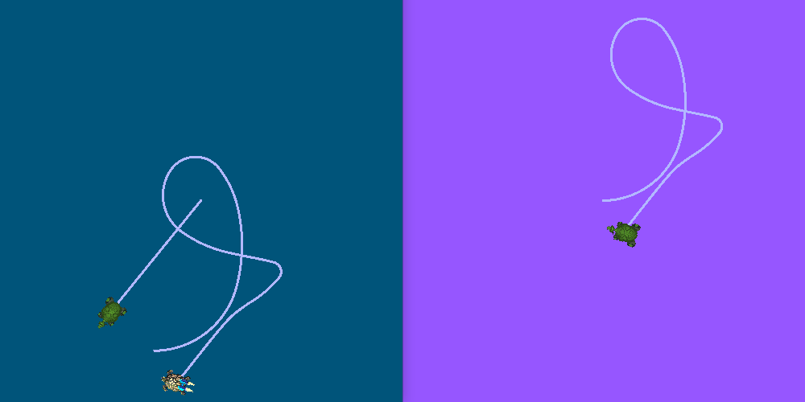
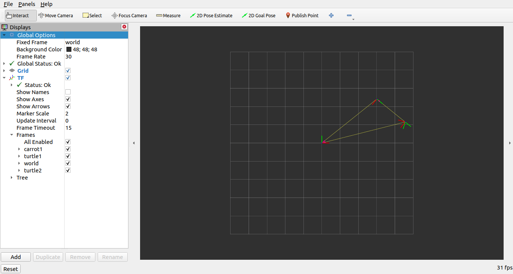

> Navigation: [Wiki index](../../../../index.md) | [Summary](../../../../SUMMARY.md) | [Tutorials hub](../../../../wiki/tutorial-paths.md)
> Related: [Adding a frame (C++)](../tf2/adding-a-frame-cpp.md) | [Adding a frame (Python)](../tf2/adding-a-frame-py.md) | [Adding physical and collision properties](../urdf/adding-physical-and-collision-properties-to-a-urdf-model.md) | [Building a movable robot model](../urdf/building-a-movable-robot-model-with-urdf.md) | [Building a visual robot model from scratch](../urdf/building-a-visual-robot-model-with-urdf-from-scratch.md)

<a id="managing-large-projects"></a>
<a id="usingros2launchforlargeprojects"></a>

# Managing large projects

**Goal:** Learn best practices of managing large projects using ROS 2 launch files.

**Tutorial level:** Intermediate

**Time:** 20 minutes

Contents

- [Background](#background)
- [Prerequisites](#prerequisites)
- [Introduction](#introduction)
- [Writing launch files](#writing-launch-files)

  - [1 Top-level organization](#top-level-organization)
  - [2 Parameters](#parameters)

    - [2.1 Setting parameters in the launch file](#setting-parameters-in-the-launch-file)
    - [2.2 Loading parameters from YAML file](#loading-parameters-from-yaml-file)
    - [2.3 Using wildcards in YAML files](#using-wildcards-in-yaml-files)
  - [3 Namespaces](#namespaces)
  - [4 Reusing nodes](#reusing-nodes)
  - [5 Parameter overrides](#parameter-overrides)
  - [6 Remapping](#remapping)
  - [7 Config files](#config-files)
  - [8 Environment Variables](#environment-variables)
- [Running launch files](#running-launch-files)

  - [1 Update setup.py](#update-setup-py)
  - [2 Build and run](#build-and-run)
- [Summary](#summary)

<a id="background"></a>

## Background

This tutorial describes some tips for writing launch files for large projects.
The focus is on how to structure launch files so they may be reused as much as possible in different situations.
Additionally, it covers usage examples of different ROS 2 launch tools, like parameters, YAML files, remappings, namespaces, default arguments, and RViz configs.

<a id="prerequisites"></a>

## Prerequisites

This tutorial uses the [turtlesim](../../beginner-cli-tools/introducing-turtlesim.md) and [turtle\_tf2\_py](../tf2/introduction-to-tf2.md) packages.
This tutorial also assumes you have [created a new package](../../beginner-client-libraries/creating-your-first-ros2-package.md) of build type `ament_python` called `launch_tutorial`.

<a id="introduction"></a>

## Introduction

Large applications on a robot typically involve several interconnected nodes, each of which can have many parameters.
Simulation of multiple turtles in the turtle simulator can serve as a good example.
The turtle simulation consists of multiple turtle nodes, the world configuration, and the TF broadcaster and listener nodes.
Between all of the nodes, there are a large number of ROS parameters that affect the behavior and appearance of these nodes.
ROS 2 launch files allow us to start all nodes and set corresponding parameters in one place.
By the end of a tutorial, you will build the `launch_turtlesim_launch` launch file in the `launch_tutorial` package.
This launch file will bring up different nodes responsible for the simulation of two turtlesim simulations, starting TF broadcasters and listener, loading parameters, and launching an RViz configuration.
In this tutorial, we’ll go over this launch file and all related features used.

> [!ATTENTION]
>
> Launch files can be written in XML, YAML, or Python format.
> Throughout this tutorial, launch files are shown in all three formats using tabs.
> You can choose whichever format you prefer - they are functionally equivalent.
> Wherever you see the file name `launch_turtlesim_launch` make sure to use the correct file extension for your launch file type (i.e. `launch_turtlesim_launch.py` for Python, `launch_turtlesim_launch.xml` for XML, and `launch_turtlesim_launch.yaml` for YAML.

<a id="writing-launch-files"></a>

## Writing launch files

<a id="top-level-organization"></a>

### 1 Top-level organization

One of the aims in the process of writing launch files should be making them as reusable as possible.
This could be done by clustering related nodes and configurations into separate launch files.
Afterwards, a top-level launch file dedicated to a specific configuration could be written.
This would allow moving between identical robots to be done without changing the launch files at all.
Even a change such as moving from a real robot to a simulated one can be done with only a few changes.

We will now go over the top-level launch file structure that makes this possible.
Firstly, we will create a launch file that will call separate launch files.
To do this, let’s create a `launch_turtlesim_launch` file in the `/launch` folder of our `launch_tutorial` package.

> [!ATTENTION]
>
> Earlier launch system versions may not support `let` inside `include` statements and require `arg` instead.
> The syntax is the same: `name` and `value` attributes remain unchanged (e.g., `<arg name="target_frame" value="carrot1" />`).

XML

Copy and paste the complete code into the `launch/launch_turtlesim_launch.xml` file:

```
<?xml version="1.0" encoding="UTF-8"?>
<launch>
  <include file="$(find-pkg-share launch_tutorial)/launch/turtlesim_world_1_launch.xml" />
  <include file="$(find-pkg-share launch_tutorial)/launch/turtlesim_world_2_launch.xml" />
  <include file="$(find-pkg-share launch_tutorial)/launch/broadcaster_listener_launch.xml">
    <let name="target_frame" value="carrot1" />
  </include>
  <include file="$(find-pkg-share launch_tutorial)/launch/mimic_launch.xml" />
  <include file="$(find-pkg-share launch_tutorial)/launch/fixed_broadcaster_launch.xml" />
  <include file="$(find-pkg-share launch_tutorial)/launch/turtlesim_rviz_launch.xml" />
</launch>
```

YAML

Copy and paste the complete code into the `launch/launch_turtlesim_launch.yaml` file:

```
%YAML 1.2
---
launch:
  - include:
      file: "$(find-pkg-share launch_tutorial)/launch/turtlesim_world_1_launch.yaml"
  - include:
      file: "$(find-pkg-share launch_tutorial)/launch/turtlesim_world_2_launch.yaml"
  - include:
      file: "$(find-pkg-share launch_tutorial)/launch/broadcaster_listener_launch.yaml"
      let:
        - name: "target_frame"
          value: "carrot1"
  - include:
      file: "$(find-pkg-share launch_tutorial)/launch/mimic_launch.yaml"
  - include:
      file: "$(find-pkg-share launch_tutorial)/launch/fixed_broadcaster_launch.yaml"
  - include:
      file: "$(find-pkg-share launch_tutorial)/launch/turtlesim_rviz_launch.yaml"
```

Python

Copy and paste the complete code into the `launch/launch_turtlesim_launch.py` file:

```
from launch import LaunchDescription
from launch.actions import IncludeLaunchDescription
from launch.substitutions import PathJoinSubstitution
from launch_ros.substitutions import FindPackageShare

def generate_launch_description():
    launch_dir = PathJoinSubstitution([FindPackageShare('launch_tutorial'), 'launch'])
    return LaunchDescription([
        IncludeLaunchDescription(
            PathJoinSubstitution([launch_dir, 'turtlesim_world_1_launch.py'])
        ),
        IncludeLaunchDescription(
            PathJoinSubstitution([launch_dir, 'turtlesim_world_2_launch.py'])
        ),
        IncludeLaunchDescription(
            PathJoinSubstitution([launch_dir, 'broadcaster_listener_launch.py']),
            launch_arguments={'target_frame': 'carrot1'}.items()
        ),
        IncludeLaunchDescription(
            PathJoinSubstitution([launch_dir, 'mimic_launch.py'])
        ),
        IncludeLaunchDescription(
            PathJoinSubstitution([launch_dir, 'fixed_broadcaster_launch.py'])
        ),
        IncludeLaunchDescription(
            PathJoinSubstitution([launch_dir, 'turtlesim_rviz_launch.py'])
        ),
    ])
```

This launch file includes a set of other launch files.
Each of these included launch files contains nodes, parameters, and possibly, nested includes, which pertain to one part of the system.
To be exact, we launch two turtlesim simulation worlds, TF broadcaster, TF listener, mimic, fixed frame broadcaster, and RViz nodes.

> [!NOTE]
>
> Design Tip: Top-level launch files should be short, consist of includes to other files corresponding to subcomponents of the application, and commonly changed parameters.

Writing launch files in the following manner makes it easy to swap out one piece of the system, as we’ll see later.
However, there are cases when some nodes or launch files have to be launched separately due to performance and usage reasons.

> [!NOTE]
>
> Design tip: Be aware of the tradeoffs when deciding how many top-level launch files your application requires.

<a id="parameters"></a>

### 2 Parameters

<a id="setting-parameters-in-the-launch-file"></a>

#### 2.1 Setting parameters in the launch file

We will begin by writing a launch file that will start our first turtlesim simulation.
First, create a new file called `turtlesim_world_1_launch`.

XML

Copy and paste the complete code into the `launch/turtlesim_world_1_launch.xml` file:

```
<?xml version="1.0" encoding="UTF-8"?>
<launch>
  <arg name="background_r" default="0" />
  <arg name="background_g" default="84" />
  <arg name="background_b" default="122" />
  <node pkg="turtlesim" exec="turtlesim_node" name="sim">
    <param name="background_r" value="$(var background_r)" />
    <param name="background_g" value="$(var background_g)" />
    <param name="background_b" value="$(var background_b)" />
  </node>
</launch>
```

YAML

Copy and paste the complete code into the `launch/turtlesim_world_1_launch.yaml` file:

```
%YAML 1.2
---
launch:
  - arg:
      name: "background_r"
      default: "0"
  - arg:
      name: "background_g"
      default: "84"
  - arg:
      name: "background_b"
      default: "122"
  - node:
      pkg: "turtlesim"
      exec: "turtlesim_node"
      name: "sim"
      param:
        - name: "background_r"
          value: "$(var background_r)"
        - name: "background_g"
          value: "$(var background_g)"
        - name: "background_b"
          value: "$(var background_b)"
```

Python

Copy and paste the complete code into the `launch/turtlesim_world_1_launch.py` file:

```
from launch import LaunchDescription
from launch.actions import DeclareLaunchArgument
from launch.substitutions import LaunchConfiguration
from launch_ros.actions import Node

def generate_launch_description():
    return LaunchDescription([
        DeclareLaunchArgument('background_r', default_value='0'),
        DeclareLaunchArgument('background_g', default_value='84'),
        DeclareLaunchArgument('background_b', default_value='122'),
        Node(
            package='turtlesim',
            executable='turtlesim_node',
            name='sim',
            parameters=[{
                'background_r': LaunchConfiguration('background_r'),
                'background_g': LaunchConfiguration('background_g'),
                'background_b': LaunchConfiguration('background_b'),
            }]
        ),
    ])
```

This launch file starts the `turtlesim_node` node, which starts the turtlesim simulation, with simulation configuration parameters that are defined and passed to the nodes.

<a id="loading-parameters-from-yaml-file"></a>

#### 2.2 Loading parameters from YAML file

In the second launch, we will start a second turtlesim simulation with a different configuration.
Now create a `turtlesim_world_2_launch` file.

XML

Copy and paste the complete code into the `launch/turtlesim_world_2_launch.xml` file:

```
<?xml version="1.0" encoding="UTF-8"?>
<launch>
  <node pkg="turtlesim" exec="turtlesim_node" namespace="turtlesim2" name="sim">
    <param from="$(find-pkg-share launch_tutorial)/config/turtlesim.yaml" />
  </node>
</launch>
```

YAML

Copy and paste the complete code into the `launch/turtlesim_world_2_launch.yaml` file:

```
%YAML 1.2
---
launch:
  - node:
      pkg: "turtlesim"
      exec: "turtlesim_node"
      namespace: "turtlesim2"
      name: "sim"
      param:
        - from: "$(find-pkg-share launch_tutorial)/config/turtlesim.yaml"
```

Python

Copy and paste the complete code into the `launch/turtlesim_world_2_launch.py` file:

```
from launch import LaunchDescription
from launch.substitutions import PathJoinSubstitution
from launch_ros.actions import Node
from launch_ros.substitutions import FindPackageShare

def generate_launch_description():
    return LaunchDescription([
        Node(
            package='turtlesim',
            executable='turtlesim_node',
            namespace='turtlesim2',
            name='sim',
            parameters=[PathJoinSubstitution([
                FindPackageShare('launch_tutorial'), 'config', 'turtlesim.yaml'])
            ],
        ),
    ])
```

This launch file will launch the same `turtlesim_node` with parameter values that are loaded directly from the YAML configuration file.
Defining arguments and parameters in YAML files make it easy to store and load a large number of variables.
It is also worth noting that this YAML file is not another launch file, it is a configuration file for the `turtlesim_node` that sets parameters for the node.
In addition, YAML files can be easily exported from the current `ros2 param` list.
To learn how to do that, refer to the [Understand parameters](../../beginner-cli-tools/understanding-ros2-parameters.md) tutorial.

Let’s now create a configuration file, `turtlesim.yaml`, in the `/config` folder of our package, which will be loaded by our launch file.

```
/turtlesim2/sim:
   ros__parameters:
      background_b: 255
      background_g: 86
      background_r: 150
```

To learn more about using parameters and using YAML files, take a look at the [Understand parameters](../../beginner-cli-tools/understanding-ros2-parameters.md) tutorial.

<a id="using-wildcards-in-yaml-files"></a>

#### 2.3 Using wildcards in YAML files

There are cases when we want to set the same parameters in more than one node.
These nodes could have different namespaces or names but still have the same parameters.
Defining separate YAML files that explicitly define namespaces and node names is not efficient.
A solution is to use wildcard characters, which act as substitutions for unknown characters in a text value, to apply parameters to several different nodes.

Now let’s create a new `turtlesim_world_3_launch` file similar to `turtlesim_world_2_launch` to include one more `turtlesim_node` node in a new namespace `turtlesim3`:

XML

Copy and paste the complete code into the `launch/turtlesim_world_3_launch.xml` file:

```
<?xml version="1.0" encoding="UTF-8"?>
<launch>
  <node pkg="turtlesim" exec="turtlesim_node" namespace="turtlesim3" name="sim">
    <param from="$(find-pkg-share launch_tutorial)/config/turtlesim.yaml" />
  </node>
</launch>
```

YAML

Copy and paste the complete code into the `launch/turtlesim_world_3_launch.yaml` file:

```
%YAML 1.2
---
launch:
  - node:
      pkg: "turtlesim"
      exec: "turtlesim_node"
      namespace: "turtlesim3"
      name: "sim"
      param:
        - from: "$(find-pkg-share launch_tutorial)/config/turtlesim.yaml"
```

Python

Copy and paste the complete code into the `launch/turtlesim_world_3_launch.py` file:

```
from launch import LaunchDescription
from launch.substitutions import PathJoinSubstitution
from launch_ros.actions import Node
from launch_ros.substitutions import FindPackageShare

def generate_launch_description():
    return LaunchDescription([
        Node(
            package='turtlesim',
            executable='turtlesim_node',
            namespace='turtlesim3',
            name='sim',
            parameters=[
                PathJoinSubstitution([
                    FindPackageShare('launch_tutorial'), 'config', 'turtlesim.yaml']),
            ],
        ),
    ])
```

Loading the same YAML file, however, will not affect the appearance of the third turtlesim world.
The reason is that its parameters are stored under another namespace as shown below:

```
/turtlesim3/sim:
   background_b
   background_g
   background_r
```

Therefore, instead of creating a new configuration for the same node that use the same parameters, we can use wildcards syntax.
`/**` will assign all the parameters in every node, despite differences in node names and namespaces.

We will now update the `turtlesim.yaml`, in the `/config` folder in the following manner:

```
/**:
   ros__parameters:
      background_b: 255
      background_g: 86
      background_r: 150
```

Now include the `turtlesim_world_3_launch` launch description in our main launch file.
Using that configuration file in our launch descriptions will assign `background_b`, `background_g`, and `background_r` parameters to specified values in `turtlesim3/sim` and `turtlesim2/sim` nodes.

<a id="namespaces"></a>

### 3 Namespaces

As you may have noticed, we have defined the namespace for the turtlesim world in the `turtlesim_world_2_launch` file.
Unique namespaces allow the system to start two similar nodes without node name or topic name conflicts.

```
namespace='turtlesim2',
```

However, if the launch file contains a large number of nodes, defining namespaces for each of them can become tedious.
To solve that issue, the `PushROSNamespace` action can be used to define the global namespace for each launch file description.
Every nested node will inherit that namespace automatically.

> [!ATTENTION]
>
> `PushROSNamespace` has to be the first action in the list for the following actions to apply the namespace.

To do that, firstly, we need to remove the `namespace='turtlesim2'` line from the `turtlesim_world_2_launch` file.
Afterwards, we need to update the `launch_turtlesim_launch` to change the include statement to the following:

XML

```
<group>
  <push_ros_namespace namespace="turtlesim2" />
  <include file="$(find-pkg-share launch_tutorial)/launch/turtlesim_world_2_launch.xml" />
</group>
```

YAML

```
- group:
    - push_ros_namespace:
        namespace: "turtlesim2"
    - include:
        file: "$(find-pkg-share launch_tutorial)/launch/turtlesim_world_2_launch.yaml"
```

Python

```
from launch.actions import GroupAction
from launch_ros.actions import PushROSNamespace

   ...
   GroupAction(
     actions=[
         PushROSNamespace('turtlesim2'),
         IncludeLaunchDescription(PathJoinSubstitution([launch_dir, 'turtlesim_world_2_launch.py'])),
      ]
   ),
```

As a result, each node in the `turtlesim_world_2_launch` launch description will have a `turtlesim2` namespace.

<a id="reusing-nodes"></a>

### 4 Reusing nodes

Now create a `broadcaster_listener_launch` file.

XML

Copy and paste the complete code into the `launch/broadcaster_listener_launch.xml` file:

```
<?xml version="1.0" encoding="UTF-8"?>
<launch>
  <arg name="target_frame" default="turtle1" description="Target frame name." />
  <node pkg="turtle_tf2_py" exec="turtle_tf2_broadcaster" name="broadcaster1">
    <param name="turtlename" value="turtle1" />
  </node>
  <node pkg="turtle_tf2_py" exec="turtle_tf2_broadcaster" name="broadcaster2">
    <param name="turtlename" value="turtle2" />
  </node>
  <node pkg="turtle_tf2_py" exec="turtle_tf2_listener" name="listener">
    <param name="target_frame" value="$(var target_frame)" />
  </node>
</launch>
```

YAML

Copy and paste the complete code into the `launch/broadcaster_listener_launch.yaml` file:

```
%YAML 1.2
---
launch:
  - arg:
      name: "target_frame"
      default: "turtle1"
      description: "Target frame name."
  - node:
      pkg: "turtle_tf2_py"
      exec: "turtle_tf2_broadcaster"
      name: "broadcaster1"
      param:
        - name: "turtlename"
          value: "turtle1"
  - node:
      pkg: "turtle_tf2_py"
      exec: "turtle_tf2_broadcaster"
      name: "broadcaster2"
      param:
        - name: "turtlename"
          value: "turtle2"
  - node:
      pkg: "turtle_tf2_py"
      exec: "turtle_tf2_listener"
      name: "listener"
      param:
        - name: "target_frame"
          value: "$(var target_frame)"
```

Python

Copy and paste the complete code into the `launch/broadcaster_listener_launch.py` file:

```
from launch import LaunchDescription
from launch.actions import DeclareLaunchArgument
from launch.substitutions import LaunchConfiguration

from launch_ros.actions import Node

def generate_launch_description():
    return LaunchDescription([
        DeclareLaunchArgument(
            'target_frame', default_value='turtle1',
            description='Target frame name.',
        ),
        Node(
            package='turtle_tf2_py',
            executable='turtle_tf2_broadcaster',
            name='broadcaster1',
            parameters=[
                {'turtlename': 'turtle1'}
            ],
        ),
        Node(
            package='turtle_tf2_py',
            executable='turtle_tf2_broadcaster',
            name='broadcaster2',
            parameters=[
                {'turtlename': 'turtle2'}
            ],
        ),
        Node(
            package='turtle_tf2_py',
            executable='turtle_tf2_listener',
            name='listener',
            parameters=[
                {'target_frame': LaunchConfiguration('target_frame')}
            ],
        ),
    ])
```

In this file, we have declared the `target_frame` launch argument with a default value of `turtle1`.
The default value means that the launch file can receive an argument to forward to its nodes, or in case the argument is not provided, it will pass the default value to its nodes.

Afterwards, we use the `turtle_tf2_broadcaster` node two times using different names and parameters during launch.
This allows us to duplicate the same node without conflicts.

We also start a `turtle_tf2_listener` node and set its `target_frame` parameter that we declared and acquired above.

<a id="parameter-overrides"></a>

### 5 Parameter overrides

Recall that we called the `broadcaster_listener_launch` file in our top-level launch file.
In addition to that, we have passed it `target_frame` launch argument as shown below:

XML

```
  <include file="$(find-pkg-share launch_tutorial)/launch/broadcaster_listener_launch.xml">
    <let name="target_frame" value="carrot1" />
  </include>
```

YAML

```
  - include:
      file: "$(find-pkg-share launch_tutorial)/launch/broadcaster_listener_launch.yaml"
      let:
        - name: "target_frame"
          value: "carrot1"
```

Python

```
        IncludeLaunchDescription(
            PathJoinSubstitution([launch_dir, 'broadcaster_listener_launch.py']),
            launch_arguments={'target_frame': 'carrot1'}.items()
        ),
```

This syntax allows us to change the default goal target frame to `carrot1`.
If you would like `turtle2` to follow `turtle1` instead of the `carrot1`, just remove the line that passes the `target_frame` argument.
This will assign `target_frame` its default value, which is `turtle1`.

<a id="remapping"></a>

### 6 Remapping

Now create a `mimic_launch` file.

XML

Copy and paste the complete code into the `launch/mimic_launch.xml` file:

```
<?xml version="1.0" encoding="UTF-8"?>
<launch>
  <node pkg="turtlesim" exec="mimic" name="mimic">
    <remap from="/input/pose" to="/turtle2/pose" />
    <remap from="/output/cmd_vel" to="/turtlesim2/turtle1/cmd_vel" />
  </node>
</launch>
```

YAML

Copy and paste the complete code into the `launch/mimic_launch.yaml` file:

```
%YAML 1.2
---
launch:
  - node:
      pkg: "turtlesim"
      exec: "mimic"
      name: "mimic"
      remap:
        - from: "/input/pose"
          to: "/turtle2/pose"
        - from: "/output/cmd_vel"
          to: "/turtlesim2/turtle1/cmd_vel"
```

Python

Copy and paste the complete code into the `launch/mimic_launch.py` file:

```
from launch import LaunchDescription
from launch_ros.actions import Node

def generate_launch_description():
    return LaunchDescription([
        Node(
            package='turtlesim',
            executable='mimic',
            name='mimic',
            remappings=[
                ('/input/pose', '/turtle2/pose'),
                ('/output/cmd_vel', '/turtlesim2/turtle1/cmd_vel'),
            ]
        )
    ])
```

This launch file will start the `mimic` node, which will give commands to one turtlesim to follow the other.
The node is designed to receive the target pose on the topic `/input/pose`.
In our case, we want to remap the target pose from `/turtle2/pose` topic.
Finally, we remap the `/output/cmd_vel` topic to `/turtlesim2/turtle1/cmd_vel`.
This way `turtle1` in our `turtlesim2` simulation world will follow `turtle2` in our initial turtlesim world.

<a id="config-files"></a>

### 7 Config files

Let’s now create a file called `turtlesim_rviz_launch`.

XML

Copy and paste the complete code into the `launch/turtlesim_rviz_launch.xml` file:

```
<?xml version="1.0" encoding="UTF-8"?>
<launch>
  <node pkg="rviz2" exec="rviz2" name="rviz2"
        args="-d $(find-pkg-share turtle_tf2_py)/rviz/turtle_rviz.rviz" />
</launch>
```

YAML

Copy and paste the complete code into the `launch/turtlesim_rviz_launch.yaml` file:

```
%YAML 1.2
---
launch:
  - node:
      pkg: "rviz2"
      exec: "rviz2"
      name: "rviz2"
      args: "-d $(find-pkg-share turtle_tf2_py)/rviz/turtle_rviz.rviz"
```

Python

Copy and paste the complete code into the `launch/turtlesim_rviz_launch.py` file:

```
from launch import LaunchDescription
from launch.substitutions import PathJoinSubstitution
from launch_ros.actions import Node
from launch_ros.substitutions import FindPackageShare

def generate_launch_description():
    return LaunchDescription([
        Node(
            package='rviz2',
            executable='rviz2',
            name='rviz2',
            arguments=['-d', PathJoinSubstitution([
                FindPackageShare('turtle_tf2_py'), 'rviz', 'turtle_rviz.rviz'])],
        ),
    ])
```

This launch file will start the RViz with the configuration file defined in the `turtle_tf2_py` package.
This RViz configuration will set the world frame, enable TF visualization, and start RViz with a top-down view.

<a id="environment-variables"></a>

### 8 Environment Variables

Let’s now create the last launch file called `fixed_broadcaster_launch` in our package.

XML

Copy and paste the complete code into the `launch/fixed_broadcaster_launch.xml` file:

```
<?xml version="1.0" encoding="UTF-8"?>
<launch>
  <arg name="node_prefix" default="$(env USER '')_" description="prefix for node name" />
  <node pkg="turtle_tf2_py" exec="fixed_frame_tf2_broadcaster" name="$(var node_prefix)fixed_broadcaster" />
</launch>
```

YAML

Copy and paste the complete code into the `launch/fixed_broadcaster_launch.yaml` file:

```
%YAML 1.2
---
launch:
  - arg:
      name: "node_prefix"
      default: "$(env USER '')_"
      description: "prefix for node name"
  - node:
      pkg: "turtle_tf2_py"
      exec: "fixed_frame_tf2_broadcaster"
      name: "$(var node_prefix)fixed_broadcaster"
```

Python

Copy and paste the complete code into the `launch/fixed_broadcaster_launch.py` file:

```
from launch import LaunchDescription
from launch.actions import DeclareLaunchArgument
from launch.substitutions import EnvironmentVariable, LaunchConfiguration
from launch_ros.actions import Node

def generate_launch_description():
    return LaunchDescription([
        DeclareLaunchArgument(
            'node_prefix',
            default_value=[EnvironmentVariable('USER'), '_'],
            description='prefix for node name'
        ),
        Node(
            package='turtle_tf2_py',
            executable='fixed_frame_tf2_broadcaster',
            name=[LaunchConfiguration('node_prefix'), 'fixed_broadcaster'],
        ),
    ])
```

This launch file shows the way environment variables can be called inside the launch files.
Environment variables can be used to define or push namespaces for distinguishing nodes on different computers or robots.

> [!NOTE]
>
> If you are running the launch file where the `USER` environment variable is not defined (like in the ROS docker file), then you can replace the environment variable reference above with any other word of your liking.

<a id="running-launch-files"></a>

## Running launch files

<a id="update-setup-py"></a>

### 1 Update setup.py

Open `setup.py` and add the following lines so that the launch files from the `launch/` folder and configuration file from the `config/` would be installed.
The `data_files` field should now look like this:

```
import os
from glob import glob
from setuptools import setup
...

data_files=[
      ...
      (os.path.join('share', package_name, 'launch'),
         glob('launch/*')),
      (os.path.join('share', package_name, 'config'),
         glob('config/*.yaml')),
      (os.path.join('share', package_name, 'rviz'),
         glob('config/*.rviz')),
   ],
```

<a id="build-and-run"></a>

### 2 Build and run

To finally see the result of our code, build the package and launch the top-level launch file using the following command:

XML

```
$ ros2 launch launch_tutorial launch_turtlesim_launch.xml
```

YAML

```
$ ros2 launch launch_tutorial launch_turtlesim_launch.yaml
```

Python

```
$ ros2 launch launch_tutorial launch_turtlesim_launch.py
```

You will now see the two turtlesim simulations started.
There are two turtles in the first one and one in the second one.
In the first simulation, `turtle2` is spawned in the bottom-left part of the world.
Its aim is to reach the `carrot1` frame which is five meters away on the x-axis relative to the `turtle1` frame.

The `turtlesim2/turtle1` in the second is designed to mimic the behavior of the `turtle2`.

If you want to control the `turtle1`, run the teleop node.

```
$ ros2 run turtlesim turtle_teleop_key
```

As a result, you will see a similar picture:



In addition to that, the RViz should have started.
It will show all turtle frames relative to the `world` frame, whose origin is at the bottom-left corner.



<a id="summary"></a>

## Summary

In this tutorial, you learned about various tips and practices of managing large projects using ROS 2 launch files.
