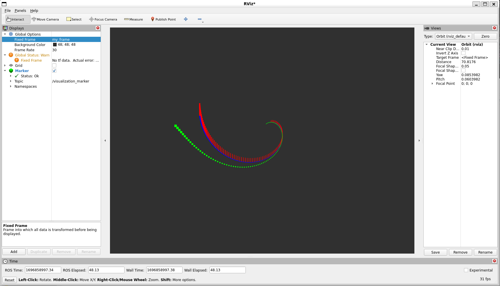

> Navigation: [Wiki index](../../../../index.md) | [Summary](../../../../SUMMARY.md) | [Tutorials hub](../../../../wiki/tutorial-paths.md)
> Related: [Building a Custom RViz Display](rviz-custom-display.md) | [Building a Custom RViz Panel](rviz-custom-panel.md) | [Defining worlds, robots, and sensors](../../advanced/simulators/mvsim/defining-worlds-mvsim.md) | [Gazebo](../../advanced/simulators/gazebo/simulation-gazebo.md) | [Getting started with MVSim](../../advanced/simulators/mvsim/getting-started-mvsim.md)

<a id="marker-points-and-lines-c"></a>

# Marker: Points and Lines (C++)

**Goal:** Show how to use `visualization_msgs/msg/Marker` messages to send points and lines to RViz.

**Tutorial level:** Intermediate

**Time:** 15 Minutes

Contents

- [Intro](#intro)
- [Using Points, Line Strips, and Line Lists](#using-points-line-strips-and-line-lists)

  - [The code](#the-code)
  - [The code explained](#the-code-explained)
  - [Viewing the markers](#viewing-the-markers)
- [Next steps](#next-steps)
> [!NOTE]
>
> This tutorial assumes that you have completed [Marker: Sending Basic Shapes](marker-sending-basic-shapes.md).

<a id="intro"></a>

## Intro

In [Marker: Sending Basic Shapes](marker-sending-basic-shapes.md) you learned how to send simple shapes to RViz using visualization markers.
You can send more than just simple shapes, and this tutorial introduces the `POINTS`, `LINE_STRIP`, and `LINE_LIST` marker types.
For a full list of types, see [Marker: Display types](marker-display-types.md).

<a id="using-points-line-strips-and-line-lists"></a>

## Using Points, Line Strips, and Line Lists

The `POINTS`, `LINE_STRIP`, and `LINE_LIST` markers all use the `points` member of the `visualization_msgs/msg/Marker` message.
The `POINTS` type places a point at each point added.
The `LINE_STRIP` type uses each point as a vertex in a connected set of lines, where point 0 is connected to point 1, 1 to 2, 2 to 3, and so on.
The `LINE_LIST` type creates unconnected lines out of each pair of points, such as point 0 to 1, 2 to 3, and so on.

<a id="the-code"></a>

### The code

Get the package from the [visualization\_tutorials repository](https://github.com/ros-visualization/visualization_tutorials).
The code for this tutorial lives in the `visualization_marker_tutorials` package.
You can read it in [points\_and\_lines.cpp](https://github.com/ros-visualization/visualization_tutorials/blob/ros2/visualization_marker_tutorials/src/points_and_lines.cpp).

<a id="the-code-explained"></a>

### The code explained

Now let’s break down the code, skipping things that were explained in the previous tutorial.
The overall effect created is a rotating helix with lines sticking upwards from each vertex.

We start with the headers used by the node, including `cmath` for the helix and the messages used for markers and points.

```
#define _USE_MATH_DEFINES

#include <chrono>
#include <cmath>
#include <memory>

#include "rclcpp/rclcpp.hpp"
#include "geometry_msgs/msg/point.hpp"
#include "visualization_msgs/msg/marker.hpp"
```

This should look familiar.
We initialize ROS 2, create a node, create a publisher on the `visualization_marker` topic, and set the loop rate.

```
rclcpp::init(argc, argv);
auto node = rclcpp::Node::make_shared("points_and_lines");
auto marker_pub = node->create_publisher<visualization_msgs::msg::Marker>(
  "visualization_marker", 10);
rclcpp::Rate loop_rate(30);
```

We also create a floating-point variable that will be used to animate the helix over time.

```
float f = 0.0f;
```

Inside the main loop, we create three `visualization_msgs/msg/Marker` messages and initialize all of their shared data.
By default, a marker message contains a pose whose quaternion is initialized to the identity orientation, so we only need to set the fields that matter for this tutorial.

```
visualization_msgs::msg::Marker points, line_strip, line_list;
points.header.frame_id = line_strip.header.frame_id = line_list.header.frame_id = "my_frame";
points.header.stamp = line_strip.header.stamp = line_list.header.stamp = rclcpp::Clock().now();
points.ns = line_strip.ns = line_list.ns = "points_and_lines";
points.action = line_strip.action = line_list.action = visualization_msgs::msg::Marker::ADD;
```

Here we assign three different IDs to the three markers.
The use of the `points_and_lines` namespace ensures they will not collide with other marker publishers.

```
points.id = 0;
line_strip.id = 1;
line_list.id = 2;
```

Here we set the marker types to `POINTS`, `LINE_STRIP`, and `LINE_LIST`.

```
points.type = visualization_msgs::msg::Marker::POINTS;
line_strip.type = visualization_msgs::msg::Marker::LINE_STRIP;
line_list.type = visualization_msgs::msg::Marker::LINE_LIST;
```

The `scale` member means different things for these marker types.
`POINTS` markers use the `x` and `y` members for width and height respectively, while `LINE_STRIP` and `LINE_LIST` markers use only the `x` component, which defines the line width.
Scale values are in meters.

```
points.scale.x = 0.2;
points.scale.y = 0.2;

line_strip.scale.x = 0.1;
line_list.scale.x = 0.1;
```

Here we set the points to green, the line strip to blue, and the line list to red.
As with other markers, the alpha channel must be non-zero.

```
points.color.g = 1.0f;
points.color.a = 1.0;

line_strip.color.b = 1.0;
line_strip.color.a = 1.0;

line_list.color.r = 1.0;
line_list.color.a = 1.0;
```

Now we create the vertices for the points and lines.
We use sine and cosine to generate a helix.
The `POINTS` and `LINE_STRIP` markers both require only one point for each vertex, while the `LINE_LIST` marker requires two points for each line segment.

```
for (uint32_t i = 0; i < 100; ++i) {
  float y = 5 * sin(f + i / 100.0f * 2 * M_PI);
  float z = 5 * cos(f + i / 100.0f * 2 * M_PI);

  geometry_msgs::msg::Point p;
  p.x = static_cast<int32_t>(i) - 50;
  p.y = y;
  p.z = z;

  points.points.push_back(p);
  line_strip.points.push_back(p);

  // The line list needs two points for each line
  line_list.points.push_back(p);
  p.z += 1.0;
  line_list.points.push_back(p);
}
```

Once the marker messages are filled out, we publish all three of them.

```
marker_pub->publish(points);
marker_pub->publish(line_strip);
marker_pub->publish(line_list);
```

Then we sleep, advance the animation phase, and loop back to the top.

```
loop_rate.sleep();
f += 0.04f;
```

<a id="viewing-the-markers"></a>

### Viewing the markers

Build the package in your workspace:

```
$ colcon build --packages-select visualization_marker_tutorials
```

Then source your workspace and run the node:

```
$ source install/setup.bash
$ ros2 run visualization_marker_tutorials points_and_lines
```

Now run RViz:

```
$ source install/setup.bash
$ ros2 run rviz2 rviz2
```

If you have never used RViz before, start with the [RViz User Guide](rviz-user-guide.md).

Set up RViz the same way you did in the last tutorial.
Because we do not have any transforms set up, set the `Fixed Frame` to `my_frame`.
Then add a `Marker` display.
The default topic, `visualization_marker`, is the same one being published by the node.

You should see a rotating helix that looks something like this:



<a id="next-steps"></a>

## Next steps

For more information about the markers and options supported by RViz, continue with [Marker: Display types](marker-display-types.md).
Try out some of the other marker types.
