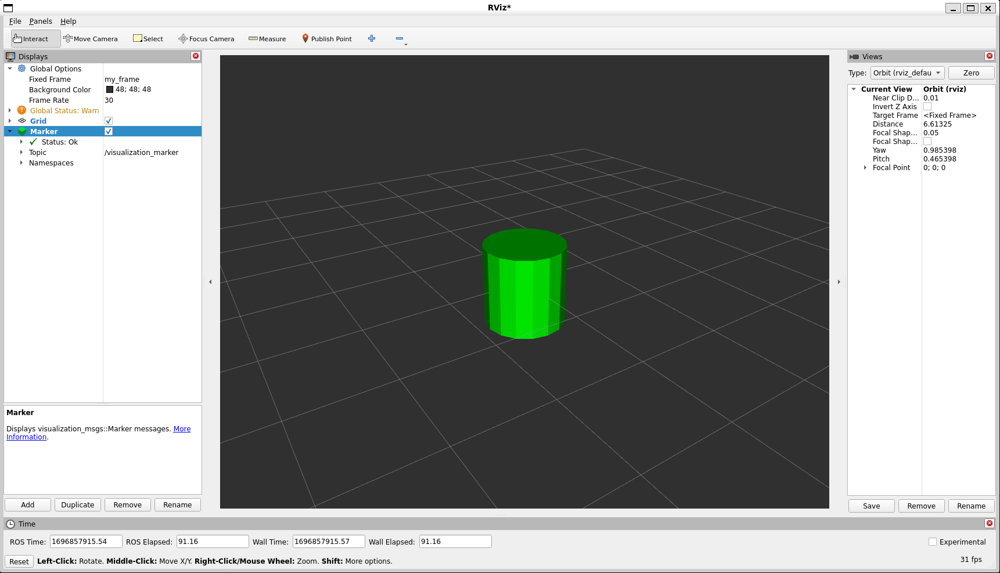

> Navigation: [Wiki index](../../../../index.md) | [Summary](../../../../SUMMARY.md) | [Tutorials hub](../../../../wiki/tutorial-paths.md)
> Related: [Building a Custom RViz Display](rviz-custom-display.md) | [Building a Custom RViz Panel](rviz-custom-panel.md) | [Defining worlds, robots, and sensors](../../advanced/simulators/mvsim/defining-worlds-mvsim.md) | [Gazebo](../../advanced/simulators/gazebo/simulation-gazebo.md) | [Getting started with MVSim](../../advanced/simulators/mvsim/getting-started-mvsim.md)

<a id="marker-sending-basic-shapes-c"></a>

# Marker: Sending Basic Shapes (C++)

**Goal:** Show how to use `visualization_msgs/msg/Marker` messages to send basic shapes to RViz.

**Tutorial level:** Intermediate

**Time:** 15 Minutes

Contents

- [Intro](#intro)
- [Create a package](#create-a-package)
- [Sending markers](#sending-markers)

  - [The code](#the-code)
  - [The code explained](#the-code-explained)
  - [Building the code](#building-the-code)
  - [Running the code](#running-the-code)
- [Viewing the markers](#viewing-the-markers)
- [More information](#more-information)
> [!NOTE]
>
> This tutorial assumes you are already comfortable with writing ROS 2 C++ nodes and building packages with `colcon`.

<a id="intro"></a>

## Intro

Unlike many other RViz displays, the `Marker` display lets you visualize data without RViz needing to know the meaning of that data ahead of time.
Instead, your node sends primitive objects through `visualization_msgs/msg/Marker` messages, and RViz renders them as arrows, boxes, spheres, cylinders, and other marker types.

This tutorial shows how to send the four basic shapes: cube, sphere, cylinder, and arrow.
We’ll create a program that sends out a new marker every second, replacing the last one with a different shape.

If you want a broader reference for marker fields and object types after this walkthrough, see [Marker: Display types](marker-display-types.md).

<a id="create-a-package"></a>

## Create a package

Get the package from the [visualization\_tutorials repository](https://github.com/ros-visualization/visualization_tutorials) and build it in your workspace.

```
$ colcon build --packages-select visualization_marker_tutorials
```

<a id="sending-markers"></a>

## Sending markers

<a id="the-code"></a>

### The code

The code for this tutorial lives in the `visualization_marker_tutorials` package.
You can read it in [basic\_shapes.cpp](https://github.com/ros-visualization/visualization_tutorials/blob/ros2/visualization_marker_tutorials/src/basic_shapes.cpp).

<a id="the-code-explained"></a>

### The code explained

Ok, let’s break down the code piece by piece.
We start by including the headers used by the node, including `rclcpp` and the `visualization_msgs/msg/Marker` message definition.

```
#include <memory>

#include "rclcpp/logging.hpp"
#include "rclcpp/rclcpp.hpp"
#include "visualization_msgs/msg/marker.hpp"
```

This should look familiar.
We initialize ROS 2, create a node, and create a publisher on the `visualization_marker` topic.

```
rclcpp::init(argc, argv);
auto node = rclcpp::Node::make_shared("basic_shapes");
auto marker_pub = node->create_publisher<visualization_msgs::msg::Marker>(
  "visualization_marker", 1);
rclcpp::Rate loop_rate(1);
```

You should have seen the ROS 2 include and node setup by now.
The publisher is what matters for RViz, because the `Marker` display subscribes to the same topic.

Here we create an integer to keep track of what shape we’re going to publish.
The four types we’ll be using here all use the `visualization_msgs/msg/Marker` message in the same way, so we can simply switch out the shape type to demonstrate the four different shapes.

```
uint32_t shape = visualization_msgs::msg::Marker::CUBE;
```

This begins the meat of the program.
First we create a new `visualization_msgs/msg/Marker` and begin filling it out.
The header sets the frame ID and timestamp for the marker.

```
visualization_msgs::msg::Marker marker;
marker.header.frame_id = "my_frame";
marker.header.stamp = rclcpp::Clock().now();
```

We set `frame_id` to `my_frame` as an example.
In a running system, this should be the frame relative to which you want the marker pose to be interpreted.
Because this tutorial does not publish transforms, RViz will need to use the same fixed frame later.

The namespace and ID fields are used together to create a unique name for the marker.
If another message arrives with the same namespace and ID, the new marker replaces the old one.

```
marker.ns = "basic_shapes";
marker.id = 0;
```

This `type` field specifies the kind of marker we’re sending.
The available types are listed in the `visualization_msgs/msg/Marker` message.
Here we set the type to the `shape` variable, which changes each time through the loop.

```
marker.type = shape;
```

The `action` field specifies what to do with the marker.
The values used in ROS 2 are `ADD`, `DELETE`, and `DELETEALL`.
`ADD` is something of a misnomer, because it really means “create or modify”.

```
marker.action = visualization_msgs::msg::Marker::ADD;
```

Here we set the pose of the marker.
This is a full 6-DOF pose relative to the frame and time specified in the header.
Here we place it at the origin and use the identity orientation.

```
marker.pose.position.x = 0;
marker.pose.position.y = 0;
marker.pose.position.z = 0;
marker.pose.orientation.x = 0.0;
marker.pose.orientation.y = 0.0;
marker.pose.orientation.z = 0.0;
marker.pose.orientation.w = 1.0;
```

Now we specify the scale of the marker.
For the basic shapes, a scale of `1.0` in all directions means one meter on a side.

```
marker.scale.x = 1.0;
marker.scale.y = 1.0;
marker.scale.z = 1.0;
```

The color is specified as RGBA values in the range `[0, 1]`.
Here we use opaque green.
The alpha channel is especially important because markers are transparent by default if `a` is left at `0`.

```
marker.color.r = 0.0f;
marker.color.g = 1.0f;
marker.color.b = 0.0f;
marker.color.a = 1.0;
```

The `lifetime` field controls how long the marker should stick around before being deleted automatically.
A zero duration means it should never be deleted automatically.

```
marker.lifetime = rclcpp::Duration::from_nanoseconds(0);
```

Now we publish the marker message.

```
marker_pub->publish(marker);
```

This code lets us show all four shapes while just publishing one marker message.
Based on the current shape, we set what the next shape to publish will be.

```
switch (shape) {
  case visualization_msgs::msg::Marker::CUBE:
    shape = visualization_msgs::msg::Marker::SPHERE;
    break;
  case visualization_msgs::msg::Marker::SPHERE:
    shape = visualization_msgs::msg::Marker::ARROW;
    break;
  case visualization_msgs::msg::Marker::ARROW:
    shape = visualization_msgs::msg::Marker::CYLINDER;
    break;
  case visualization_msgs::msg::Marker::CYLINDER:
    shape = visualization_msgs::msg::Marker::CUBE;
    break;
}
```

Sleep for one second and loop back to the top.

```
loop_rate.sleep();
```

<a id="building-the-code"></a>

### Building the code

Build `visualization_marker_tutorials` in your workspace with:

```
$ colcon build --packages-select visualization_marker_tutorials
```

<a id="running-the-code"></a>

### Running the code

Source your workspace and run the node.

```
$ source install/setup.bash
$ ros2 run visualization_marker_tutorials basic_shapes
```

<a id="viewing-the-markers"></a>

## Viewing the markers

Now that the node is publishing markers, start RViz so you can view them.

```
$ source install/setup.bash
$ ros2 run rviz2 rviz2
```

If you have never used RViz before, start with the [RViz User Guide](rviz-user-guide.md).

Because we do not have any transforms set up, the first thing to do is set the `Fixed Frame` to the frame used in the marker message, `my_frame`.
Then add a `Marker` display.
Notice that the default topic, `visualization_marker`, is the same one being published by the node.

You should now see a marker at the origin that changes shape every second.



<a id="more-information"></a>

## More information

For the next marker tutorial, continue with [Marker: Points and Lines](marker-points-and-lines.md).
For more information about marker message fields and the marker types beyond the four shown here, continue with [Marker: Display types](marker-display-types.md).
For the full source tree, see the [visualization\_tutorials repository](https://github.com/ros-visualization/visualization_tutorials).
