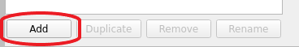
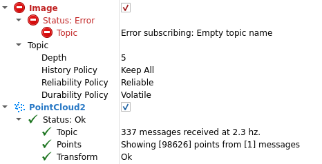
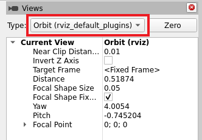
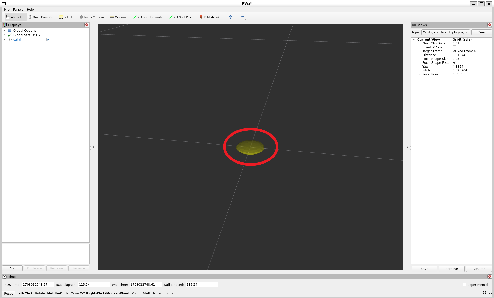
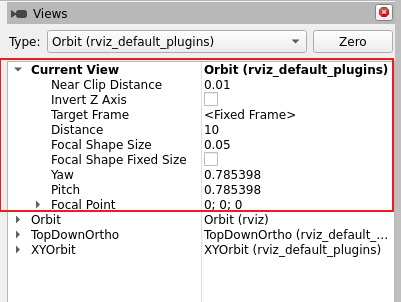
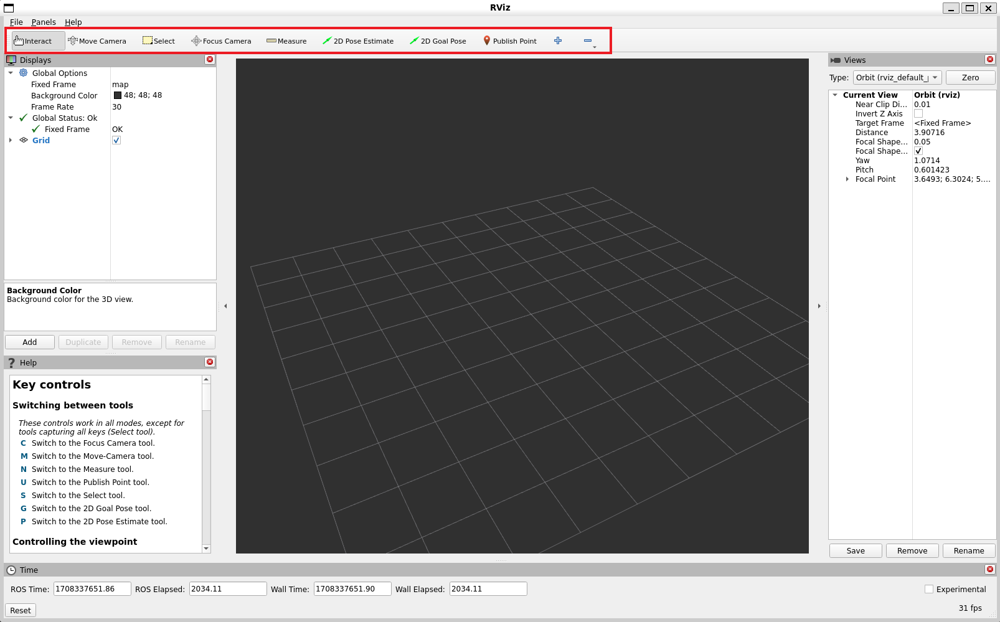
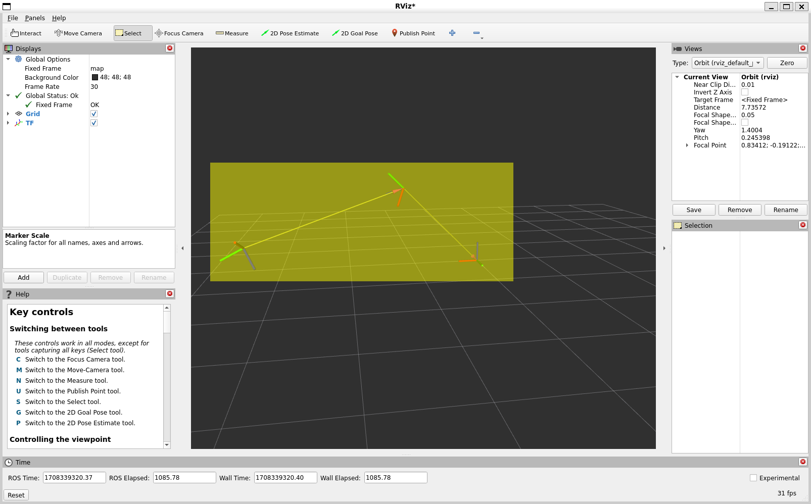
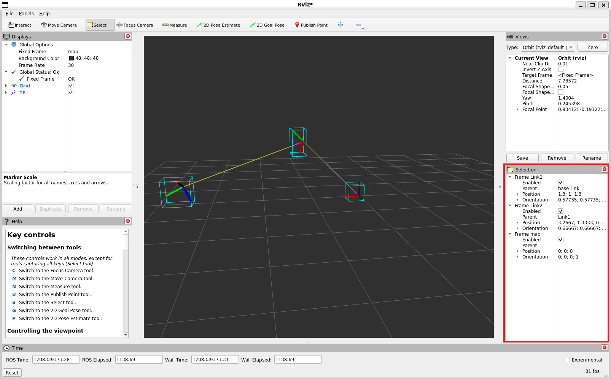
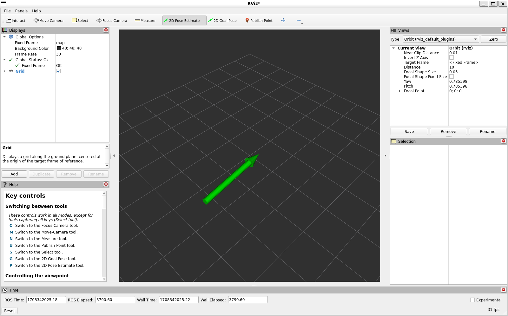
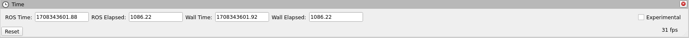

> Navigation: [Wiki index](../../../../index.md) | [Summary](../../../../SUMMARY.md) | [Tutorials hub](../../../../wiki/tutorial-paths.md)
> Related: [Building a Custom RViz Display](rviz-custom-display.md) | [Building a Custom RViz Panel](rviz-custom-panel.md) | [Defining worlds, robots, and sensors](../../advanced/simulators/mvsim/defining-worlds-mvsim.md) | [Gazebo](../../advanced/simulators/gazebo/simulation-gazebo.md) | [Getting started with MVSim](../../advanced/simulators/mvsim/getting-started-mvsim.md)

<a id="rviz-user-guide"></a>

# RViz User Guide

**Goal:** Understanding RViz

**Tutorial level:** Intermediate

**Time:** 25 Minutes

Contents

- [Background](#background)
- [Install or build rviz](#install-or-build-rviz)
- [Startup](#startup)
- [Displays](#displays)

  - [Adding a new display](#adding-a-new-display)
  - [Display Properties](#display-properties)
  - [Display Status](#display-status)
  - [Built-in Display Types](#built-in-display-types)
- [Configurations](#configurations)
- [Views Panel](#views-panel)

  - [Orbital Camera (default)](#orbital-camera-default)
  - [FPS (first-person) Camera](#fps-first-person-camera)
  - [Top-down Orthographic](#top-down-orthographic)
  - [XY Orbit](#xy-orbit)
  - [Third Person Follower](#third-person-follower)
  - [Custom Views](#custom-views)
- [Coordinate Frames](#coordinate-frames)

  - [The Fixed Frame](#the-fixed-frame)
  - [The Target Frame](#the-target-frame)
- [Tools](#tools)

  - [Interact](#interact)
  - [Move Camera](#move-camera)
  - [Select](#select)
  - [Focus Camera](#focus-camera)
  - [Measure](#measure)
  - [2D Pose Estimate](#d-pose-estimate)
  - [2D Nav Goal](#d-nav-goal)
  - [Publish Point](#publish-point)
- [Time](#time)

<a id="background"></a>

## Background

RViz is a 3D visualizer for the Robot Operating System (ROS) framework.

<a id="install-or-build-rviz"></a>

## Install or build rviz

Follow the [installation instructions](../../../installation/overview.md) for your operating system to install RViz.

<a id="startup"></a>

## Startup

Don’t forget to source the setup file.

```
$ source /opt/ros/jazzy/setup.bash
```

Then start the visualizer

```
$ ros2 run rviz2 rviz2
```

When RViz starts for the first time, you will see this window:


The big black window in the middle is the 3D view (empty because there is nothing to see).
On the left is the Displays list, which will show any displays you have loaded.
Right now it just contains the global options and a Grid, which we’ll get to later.
On the right are some of the other panels, described below.

<a id="displays"></a>

## Displays

A display is something that draws something in the 3D world, and likely has some options available in the displays list.
An example is a point cloud, the robot state, etc.

<a id="adding-a-new-display"></a>

### Adding a new display

To add a display, click the Add button at the bottom:



This will pop up the new display dialog:


The list at the top contains the display type.
The type details what kind of data this display will visualize.
The text box in the middle gives a description of the selected display type.
Finally, you must give the display a unique name.
If you have, for example, two laser scanners on your robot, you might create two `Laser Scan` displays named “Laser Base” and “Laser Head”.

<a id="display-properties"></a>

### Display Properties

Each display gets its own list of properties.
For example:


<a id="display-status"></a>

### Display Status

Each display gets its own status to help let you know if everything is OK or not.
The status can be one of: `OK`, `Warning`, `Error`, or `Disabled`.
The status is indicated in the display’s title by the background color,
as well as in the Status category that you can see if the display is expanded:



The `Status` category also expands to show specific status information.
This information is different for different displays, and the messages should be self explanatory.

<a id="built-in-display-types"></a>

### Built-in Display Types

| Name | Description | Messages Used |
| --- | --- | --- |
| Axes | Displays a set of Axes |  |
| Effort | Shows the effort being put into each revolute joint of a robot | [sensor\_msgs/msg/JointStates](https://github.com/ros2/common_interfaces/blob/jazzy/sensor_msgs/msg/JointState.msg) |
| Camera | Creates a new rendering window from the perspective of a camera, and overlays the image on top of it. | [sensor\_msgs/msg/Image](https://github.com/ros2/common_interfaces/blob/jazzy/sensor_msgs/msg/Image.msg), [sensor\_msgs/msg/CameraInfo](https://github.com/ros2/common_interfaces/blob/jazzy/sensor_msgs/msg/CameraInfo.msg) |
| Grid | Displays a 2D or 3D grid along a plane |  |
| Grid Cells | Draws cells from a grid, usually obstacles from a costmap from the [navigation](https://github.com/ros-planning/navigation2) stack. | [nav\_msgs/msg/GridCells](https://github.com/ros2/common_interfaces/blob/jazzy/nav_msgs/msg/GridCells.msg) |
| Image | Creates a new rendering window with an Image. Unlike the Camera display, this display does not use a CameraInfo | [sensor\_msgs/msg/Image](https://github.com/ros2/common_interfaces/blob/jazzy/sensor_msgs/msg/Image.msg) |
| InteractiveMarker | Displays 3D objects from one or multiple Interactive Marker servers and allows mouse interaction with them | [visualization\_msgs/msg/InteractiveMarker](https://github.com/ros2/common_interfaces/blob/jazzy/visualization_msgs/msg/InteractiveMarker.msg) |
| Laser Scan | Shows data from a laser scan, with different options for rendering modes, accumulation, etc. | [sensor\_msgs/msg/LaserScan](https://github.com/ros2/common_interfaces/blob/jazzy/sensor_msgs/msg/LaserScan.msg) |
| Map | Displays a map on the ground plane. | [nav\_msgs/msg/OccupancyGrid](https://github.com/ros2/common_interfaces/blob/jazzy/nav_msgs/msg/OccupancyGrid.msg) |
| Markers | Allows programmers to display arbitrary primitive shapes through a topic | [visualization\_msgs/msg/Marker](https://github.com/ros2/common_interfaces/blob/jazzy/visualization_msgs/msg/Marker.msg), [visualization\_msgs/msg/MarkerArray](https://github.com/ros2/common_interfaces/blob/jazzy/visualization_msgs/msg/MarkerArray.msg) |
| Path | Shows a path from the [navigation](https://github.com/ros-planning/navigation2) stack. | [nav\_msgs/msg/Path](https://github.com/ros2/common_interfaces/blob/jazzy/nav_msgs/msg/Path.msg) |
| Point | Draws a point as a small sphere. | [geometry\_msgs/msg/PointStamped](https://github.com/ros2/common_interfaces/blob/jazzy/geometry_msgs/msg/PointStamped.msg) |
| Pose | Draws a pose as either an arrow or axes. | [geometry\_msgs/msg/PoseStamped](https://github.com/ros2/common_interfaces/blob/jazzy/geometry_msgs/msg/PoseStamped.msg) |
| Pose Array | Draws a “cloud” of arrows, one for each pose in a pose array | [geometry\_msgs/msg/PoseArray](https://github.com/ros2/common_interfaces/blob/jazzy/geometry_msgs/msg/PoseArray.msg) |
| Point Cloud(2) | Shows data from a point cloud, with different options for rendering modes, accumulation, etc. | [sensor\_msgs/msg/PointCloud](https://github.com/ros2/common_interfaces/blob/jazzy/sensor_msgs/msg/PointCloud.msg), [sensor\_msgs/msg/PointCloud2](https://github.com/ros2/common_interfaces/blob/jazzy/sensor_msgs/msg/PointCloud2.msg) |
| Polygon | Draws the outline of a polygon as lines. | [geometry\_msgs/msg/Polygon](https://github.com/ros2/common_interfaces/blob/jazzy/geometry_msgs/msg/Polygon.msg) |
| Odometry | Accumulates odometry poses from over time. | [nav\_msgs/msg/Odometry](https://github.com/ros2/common_interfaces/blob/jazzy/nav_msgs/msg/Odometry.msg) |
| Range | Displays cones representing range measurements from sonar or IR range sensors. Version: Electric+ | [sensor\_msgs/msg/Range](https://github.com/ros2/common_interfaces/blob/jazzy/sensor_msgs/msg/Range.msg) |
| RobotModel | Shows a visual representation of a robot in the correct pose (as defined by the current TF transforms). |  |
| TF | Displays the [tf2](https://github.com/ros2/geometry2) transform hierarchy. |  |
| Wrench | Draws a wrench as arrow (force) and arrow + circle (torque) | [geometry\_msgs/msg/WrenchStamped](https://github.com/ros2/common_interfaces/blob/jazzy/geometry_msgs/msg/WrenchStamped.msg) |
| Twist | Draws a twist as arrow (linear) and arrow + circle (angular) | [geometry\_msgs/msg/TwistStamped](https://github.com/ros2/common_interfaces/blob/jazzy/geometry_msgs/msg/TwistStamped.msg) |

<a id="configurations"></a>

## Configurations

Different configurations of displays are often useful for different uses of the visualizer.
A configuration useful for a full PR2 is not necessarily useful for a test cart, for example.
To this end, the visualizer lets you load and save different configurations.

A configuration contains:

- Displays + their properties
- Tool properties
- The viewpoint and settings for the 3D visualization

<a id="views-panel"></a>

## Views Panel

There are a number of different camera types available in the visualizer.



Camera types consist both of different ways of controlling the camera and different types of projection (Orthographic vs. Perspective).

<a id="orbital-camera-default"></a>

### Orbital Camera (default)

The orbital camera simply rotates around a focal point, while always looking at that point.
The focal point is visualized as a small disc while you’re moving the camera:



Controls:

- **Left mouse button**: Click and drag to rotate around the focal point.
- **Middle mouse button**: Click and drag to move the focal point in the plane formed by the camera’s up and right vectors.
  The distance moved depends on the focal point – if there is an object on the focal point, and you click on top of it, it will stay under your mouse.
- **Right mouse button**: Click and drag to zoom in/out of the focal point.
  Dragging up zooms in, down zooms out.
- **Scrollwheel**: Zoom in/out of the focal point

<a id="fps-first-person-camera"></a>

### FPS (first-person) Camera

The FPS camera is a first-person camera, so it rotates as if you’re looking with your head.

Controls:

- **Left mouse button**: Click and drag to rotate.
  Control-click to pick the object under the mouse and look directly at it.
- **Middle mouse button**: Click and drag to move along the plane formed by the camera’s up and right vectors.
- **Right mouse button**: Click and drag to move along the camera’s forward vector.
  Dragging up moves forward, down moves backward.
- **Scrollwheel**: Move forward/backward.

<a id="top-down-orthographic"></a>

### Top-down Orthographic

The top-down orthographic camera always looks down along the Z axis (in the robot frame),
and is an orthographic view which means things do not get smaller as they get farther away.

Controls:

- **Left mouse button**: Click and drag to rotate around the Z axis.
- **Middle mouse button**: Click and drag to move the camera along the XY plane.
- **Right mouse button**: Click and drag to zoom the image.
- **Scrollwheel**: Zoom the image.

<a id="xy-orbit"></a>

### XY Orbit

Same as the orbital camera, with the focus point restricted to the XY plane.

Controls:

See orbital camera.

<a id="third-person-follower"></a>

### Third Person Follower

The camera maintains a constant viewing angle towards the target frame.
In contrast to XY Orbit the camera turns if the target frame yaws.
This could be handy if you are doing 3D mapping of a hallway with corners for example.

Controls:

See orbital camera.

<a id="custom-views"></a>

### Custom Views

The views panel also lets you create different named views, which are saved and can be switched between.
A view consists of a target frame, camera type and camera pose.
You can save a view by clicking the Save button of the views panel.



A view consists of:

- View controller type
- View configuration (position, orientation, etc; possibly different for each view controller type.)
- The Target Frame

Views are saved per user, not in the config files.

<a id="coordinate-frames"></a>

## Coordinate Frames

RViz uses the tf transform system for transforming data from the coordinate frame it arrives in into a global reference frame.
There are two coordinate frames that are important to know about in the visualizer, the target frame and the fixed frame.

<a id="the-fixed-frame"></a>

### The Fixed Frame

The more-important of the two frames is the fixed frame.
The fixed frame is the reference frame used to denote the `world` frame.
This is usually the `map`, or `world`, or something similar, but can also be, for example, your odometry frame.

If the fixed frame is erroneously set to, say, the base of the robot, then all the objects the robot has ever seen will appear in front of the robot, at the position relative to the robot at which they were detected.
For correct results, the fixed frame should not be moving relative to the world.

If you change the fixed frame, all data currently being shown is cleared rather than re-transformed.

<a id="the-target-frame"></a>

### The Target Frame

The target frame is the reference frame for the camera view.
For example, if your target frame is the map, you’ll see the robot driving around the map.
If your target frame is the base of the robot, the robot will stay in the same place while everything else moves relative to it.

<a id="tools"></a>

## Tools

The visualizer has a number of tools you can use on the toolbar.
The following sections will give a short introduction into these tools.
You can find some more information under Help -> Show Help panel.



<a id="interact"></a>

### Interact

This tool lets you interact with the visualized environment.
You can click on objects and depending on their properties simply select them, move them around and much more.

Keyboard shortcut: `i`

<a id="move-camera"></a>

### Move Camera

The Move Camera tool is the default tool.
When this is selected and you click inside the 3D view, the viewpoint changes according to the options and camera type you have selected in the `Views` panel.
See the previous section `Views Panel` for more information.

Keyboard shortcut: `m`

<a id="select"></a>

### Select

The Select tool allows you to select items being displayed in the 3D view.
It supports single-point selection as well as click/drag box selection.
You can add to a selection with the Shift key, and remove from the selection with the Ctrl key.
If you want to move the camera around while selecting without switching back to the Move Camera tool you can hold down the Alt key.
The `f` key will focus the camera on the current selection.




Keyboard shortcut: `s`

<a id="focus-camera"></a>

### Focus Camera

Focus camera lets you select a location in the visualizer.
The camera will then focus that point by changing its orientation but not its position.

Keyboard shortcut: `c`

<a id="measure"></a>

### Measure

With the measure tool you can measure the distance between to points in the visualizer.
The first click after activating the tool will set the starting point and the second one the end point of the measurement.
The resulting distance will be displayed at the bottom of the RViz window.
But notice that the measurement tool only works with actually rendered objects in the visualizer, you can not use it in empty space.


Keyboard shortcut: `n`

<a id="d-pose-estimate"></a>

### 2D Pose Estimate

This tool lets you set an initial pose to seed the localization system (sent on the `initialpose` ROS topic).
Click on a location on the ground plane and drag to select the orientation.
The output topic can be changed in the `Tool Properties` panel.



This tool works with the [navigation](https://github.com/ros-planning/navigation2) stack.

Keyboard shortcut: `p`

<a id="d-nav-goal"></a>

### 2D Nav Goal

This tool lets you set a goal sent on the `goal_pose` ROS topic.
Click on a location on the ground plane and drag to select the orientation.
The output topic can be changed in the `Tool Properties` panel.

This tool works with the [navigation](https://github.com/ros-planning/navigation2) stack.

Keyboard shortcut: `g`

<a id="publish-point"></a>

### Publish Point

The publish point tool lets you select an object in the visualizer
and the tool will publish the coordinates of that point based on the frame.
The results are shown at the bottom like with the measure tool but are also published on the `clicked_point` topic.

Keyboard shortcut: `u`

<a id="time"></a>

## Time

The Time panel is mostly useful when running in a simulator, since it allows you to see how much ROS Time has passed, vs. how much `Wall Clock` (aka real) time has passed.
The time panel also lets you reset the visualizer’s internal time state, which resets of all the displays as well as tf’s internal cache of data.



If you are not running in simulation, the time panel is mostly useless.
In most cases it can be closed and you will probably not even notice (other than having a bit more screen real estate for the rest of rviz).
