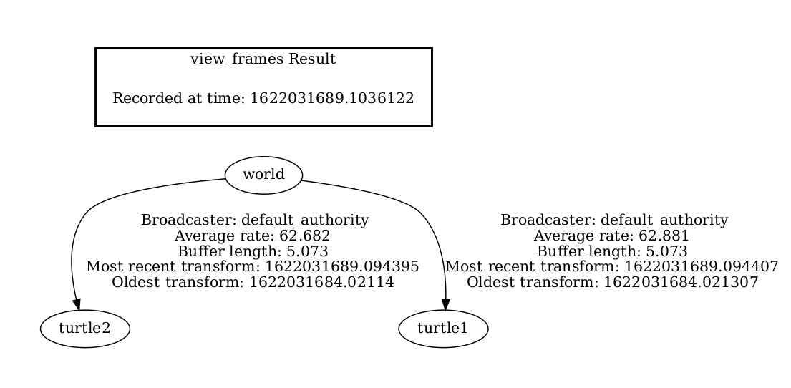
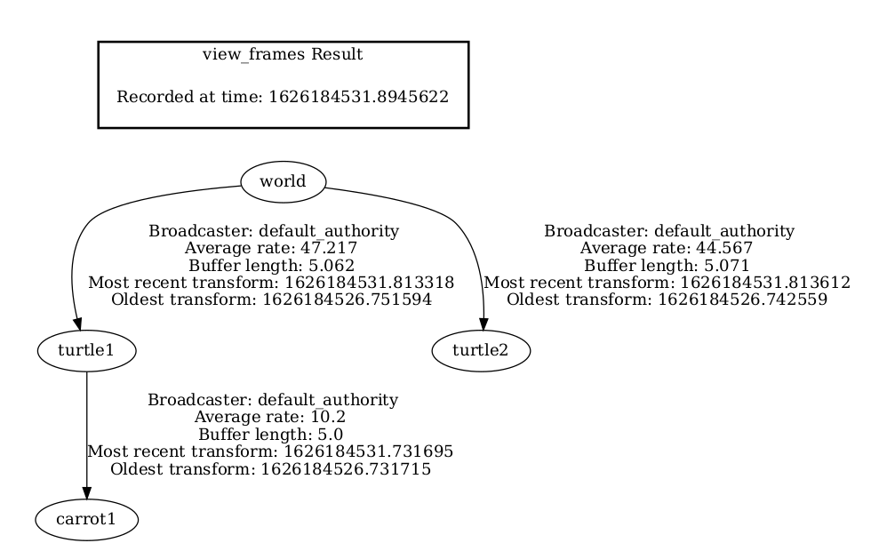
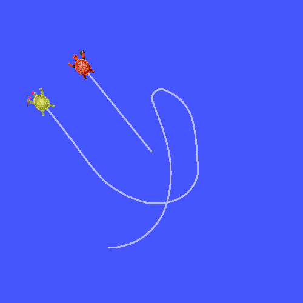

> Navigation: [Wiki index](../../../../index.md) | [Summary](../../../../SUMMARY.md) | [Tutorials hub](../../../../wiki/tutorial-paths.md)
> Related: [Adding a frame (C++)](adding-a-frame-cpp.md) | [Adding physical and collision properties](../urdf/adding-physical-and-collision-properties-to-a-urdf-model.md) | [Building a movable robot model](../urdf/building-a-movable-robot-model-with-urdf.md) | [Building a visual robot model from scratch](../urdf/building-a-visual-robot-model-with-urdf-from-scratch.md) | [Creating a launch file](../launch/creating-launch-files.md)

<a id="adding-a-frame-python"></a>

# Adding a frame (Python)

**Goal:** Learn how to to add an extra frame to tf2.

**Tutorial level:** Intermediate

**Time:** 15 minutes

Contents

- [Background](#background)
- [tf2 tree](#tf2-tree)
- [Tasks](#tasks)

  - [1 Write the fixed frame broadcaster](#write-the-fixed-frame-broadcaster)

    - [1.1 Examine the code](#examine-the-code)
    - [1.2 Add an entry point](#add-an-entry-point)
    - [1.3 Write the launch file](#write-the-launch-file)
    - [1.4 Build](#build)
    - [1.5 Run](#run)
  - [2 Write the dynamic frame broadcaster](#write-the-dynamic-frame-broadcaster)

    - [2.1 Examine the code](#id2)
    - [2.2 Add an entry point](#id3)
    - [2.3 Write the launch file](#id4)
    - [2.4 Build](#id6)
    - [1.5 Run](#id7)
- [Summary](#summary)

<a id="background"></a>

## Background

In previous tutorials, we recreated the turtle demo by writing a [tf2 broadcaster](writing-a-tf2-broadcaster-py.md) and a [tf2 listener](writing-a-tf2-listener-py.md).
This tutorial will teach you how to add extra fixed and dynamic frames to the transformation tree.
In fact, adding a frame in tf2 is very similar to creating the tf2 broadcaster, but this example will show you some additional features of tf2.

For many tasks related to transformations, it is easier to think inside a local frame.
For example, it is easiest to reason about laser scan measurements in a frame at the center of the laser scanner.
tf2 allows you to define a local frame for each sensor, link, or joint in your system.
When transforming from one frame to another, tf2 will take care of all the hidden intermediate frame transformations that are introduced.

<a id="tf2-tree"></a>

## tf2 tree

tf2 builds up a tree structure of frames and, thus, does not allow a closed loop in the frame structure.
This means that a frame only has one single parent, but it can have multiple children.
Currently, our tf2 tree contains three frames: `world`, `turtle1` and `turtle2`.
The two turtle frames are children of the `world` frame.
If we want to add a new frame to tf2, one of the three existing frames needs to be the parent frame, and the new one will become its child frame.



<a id="tasks"></a>

## Tasks

<a id="write-the-fixed-frame-broadcaster"></a>

### 1 Write the fixed frame broadcaster

In our turtle example, we’ll add a new frame `carrot1`, which will be the child of the `turtle1`.
This frame will serve as the goal for the second turtle.

Let’s first create the source files.
Go to the `learning_tf2_py` package we created in the previous tutorials.
Inside the `src/learning_tf2_py/learning_tf2_py` directory download the fixed frame broadcaster code by entering the following command:

Linux

```
$ wget https://raw.githubusercontent.com/ros/geometry_tutorials/jazzy/turtle_tf2_py/turtle_tf2_py/fixed_frame_tf2_broadcaster.py
```

macOS

```
$ wget https://raw.githubusercontent.com/ros/geometry_tutorials/jazzy/turtle_tf2_py/turtle_tf2_py/fixed_frame_tf2_broadcaster.py
```

Windows

In a Windows command line prompt:

```
$ curl -sk https://raw.githubusercontent.com/ros/geometry_tutorials/jazzy/turtle_tf2_py/turtle_tf2_py/fixed_frame_tf2_broadcaster.py -o fixed_frame_tf2_broadcaster.py
```

Or in powershell:

```
$ curl https://raw.githubusercontent.com/ros/geometry_tutorials/jazzy/turtle_tf2_py/turtle_tf2_py/fixed_frame_tf2_broadcaster.py -o fixed_frame_tf2_broadcaster.py
```

Now open the file called `fixed_frame_tf2_broadcaster.py`.

```
from geometry_msgs.msg import TransformStamped

import rclpy
from rclpy.node import Node

from tf2_ros import TransformBroadcaster

class FixedFrameBroadcaster(Node):

   def __init__(self):
       super().__init__('fixed_frame_tf2_broadcaster')
       self.tf_broadcaster = TransformBroadcaster(self)
       self.timer = self.create_timer(0.1, self.broadcast_timer_callback)

   def broadcast_timer_callback(self):
       t = TransformStamped()

       t.header.stamp = self.get_clock().now().to_msg()
       t.header.frame_id = 'turtle1'
       t.child_frame_id = 'carrot1'
       t.transform.translation.x = 0.0
       t.transform.translation.y = 2.0
       t.transform.translation.z = 0.0
       t.transform.rotation.x = 0.0
       t.transform.rotation.y = 0.0
       t.transform.rotation.z = 0.0
       t.transform.rotation.w = 1.0

       self.tf_broadcaster.sendTransform(t)

def main():
    rclpy.init()
    node = FixedFrameBroadcaster()
    try:
        rclpy.spin(node)
    except KeyboardInterrupt:
        pass

    rclpy.shutdown()
```

The code is very similar to the tf2 broadcaster tutorial example and the only difference is that the transform here does not change over time.

<a id="examine-the-code"></a>

#### 1.1 Examine the code

Let’s take a look at the key lines in this piece of code.
Here we create a new transform, from the parent `turtle1` to the new child `carrot1`.
The `carrot1` frame is 2 meters offset in y axis in terms of the `turtle1` frame.

```
t = TransformStamped()

t.header.stamp = self.get_clock().now().to_msg()
t.header.frame_id = 'turtle1'
t.child_frame_id = 'carrot1'
t.transform.translation.x = 0.0
t.transform.translation.y = 2.0
t.transform.translation.z = 0.0
```

<a id="add-an-entry-point"></a>

#### 1.2 Add an entry point

To allow the `ros2 run` command to run your node, you must add the entry point to `setup.py` (located in the `src/learning_tf2_py` directory).

Add the following line between the `'console_scripts':` brackets:

```
'fixed_frame_tf2_broadcaster = learning_tf2_py.fixed_frame_tf2_broadcaster:main',
```

<a id="write-the-launch-file"></a>

#### 1.3 Write the launch file

Now let’s create a launch file for this example.
With your text editor, create a new file called `turtle_tf2_fixed_frame_demo_launch` with extension `.py`, `.xml`, or `.yaml` in the `src/learning_tf2_py/launch` directory, and add the following lines:

Python

```
from launch import LaunchDescription
from launch.actions import IncludeLaunchDescription
from launch.substitutions import PathJoinSubstitution
from launch_ros.actions import Node
from launch_ros.substitutions import FindPackageShare

def generate_launch_description():
    return LaunchDescription([
        IncludeLaunchDescription(
            PathJoinSubstitution([
                FindPackageShare('learning_tf2_py'), 'launch', 'turtle_tf2_demo_launch.py'])
        ),
        Node(
            package='learning_tf2_py',
            executable='fixed_frame_tf2_broadcaster',
            name='fixed_broadcaster',
        ),
    ])
```

XML

```
<?xml version="1.0" encoding="UTF-8"?>
<launch>
  <include file="$(find-pkg-share learning_tf2_py)/launch/turtle_tf2_demo_launch.py" />
  <node pkg="learning_tf2_py" exec="fixed_frame_tf2_broadcaster" name="fixed_broadcaster" />
</launch>
```

YAML

```
%YAML 1.2
---
launch:
  - include:
      file: "$(find-pkg-share learning_tf2_py)/launch/turtle_tf2_demo_launch.py"
  - node:
      pkg: "learning_tf2_py"
      exec: "fixed_frame_tf2_broadcaster"
      name: "fixed_broadcaster"
```

This launch file imports the required packages and then creates a `demo_nodes` variable that will store nodes that we created in the previous tutorial’s launch file.

The last part of the code will add our fixed `carrot1` frame to the turtlesim world using our `fixed_frame_tf2_broadcaster` node.

Python

```
        Node(
            package='learning_tf2_py',
            executable='fixed_frame_tf2_broadcaster',
            name='fixed_broadcaster',
        ),
```

XML

```
  <include file="$(find-pkg-share learning_tf2_py)/launch/turtle_tf2_demo_launch.py" />
  <node pkg="learning_tf2_py" exec="fixed_frame_tf2_broadcaster" name="fixed_broadcaster" />
```

YAML

```
  - node:
      pkg: "learning_tf2_py"
      exec: "fixed_frame_tf2_broadcaster"
      name: "fixed_broadcaster"
```

<a id="build"></a>

#### 1.4 Build

Run `rosdep` in the root of your workspace to check for missing dependencies.

Linux

```
$ rosdep install -i --from-path src --rosdistro jazzy -y
```

macOS

rosdep only runs on Linux, so you will need to install `geometry_msgs` and `turtlesim` dependencies yourself

Windows

rosdep only runs on Linux, so you will need to install `geometry_msgs` and `turtlesim` dependencies yourself

Still in the root of your workspace, build your package:

Linux

```
$ colcon build --packages-select learning_tf2_py
```

macOS

```
$ colcon build --packages-select learning_tf2_py
```

Windows

```
$ colcon build --merge-install --packages-select learning_tf2_py
```

Open a new terminal, navigate to the root of your workspace, and source the setup files:

Linux

```
$ . install/setup.bash
```

macOS

```
$ . install/setup.bash
```

Windows

In a Windows command line prompt:

```
$ call install\setup.bat
```

Or in powershell:

```
$ call install\setup.bat
```

<a id="run"></a>

#### 1.5 Run

Now you can start the turtle broadcaster demo:

```
$ ros2 launch learning_tf2_py turtle_tf2_fixed_frame_demo_launch.xml # .py or .yaml are also acceptable
```

You should notice that the new `carrot1` frame appeared in the transformation tree.



If you drive the first turtle around, you should notice that the behavior didn’t change from the previous tutorial, even though we added a new frame.
That’s because adding an extra frame does not affect the other frames and our listener is still using the previously defined frames.

Therefore if we want our second turtle to follow the carrot instead of the first turtle, we need to change value of the `target_frame`.
This can be done two ways.
One way is to pass the `target_frame` argument to the launch file directly from the console:

```
$ ros2 launch learning_tf2_py turtle_tf2_fixed_frame_demo_launch.xml target_frame:=carrot1 # .py or .yaml are also acceptable
```

The second way is to update the launch file.
To do so, open the `turtle_tf2_fixed_frame_demo_launch.py` file, and add the `'target_frame': 'carrot1'` parameter via `launch_arguments` argument.

```
def generate_launch_description():
    demo_nodes = IncludeLaunchDescription(
        ...,
        launch_arguments={'target_frame': 'carrot1'}.items(),
        )
```

Now rebuild the package, restart the `turtle_tf2_fixed_frame_demo_launch.py`, and you’ll see the second turtle following the carrot instead of the first turtle!



<a id="write-the-dynamic-frame-broadcaster"></a>

### 2 Write the dynamic frame broadcaster

The extra frame we published in this tutorial is a fixed frame that doesn’t change over time in relation to the parent frame.
However, if you want to publish a moving frame you can code the broadcaster to change the frame over time.
Let’s change our `carrot1` frame so that it changes relative to `turtle1` frame over time.
Go to the `learning_tf2_py` package we created in the previous tutorial.
Inside the `src/learning_tf2_py/learning_tf2_py` directory download the dynamic frame broadcaster code by entering the following command:

Linux

```
$ wget https://raw.githubusercontent.com/ros/geometry_tutorials/jazzy/turtle_tf2_py/turtle_tf2_py/dynamic_frame_tf2_broadcaster.py
```

macOS

```
$ wget https://raw.githubusercontent.com/ros/geometry_tutorials/jazzy/turtle_tf2_py/turtle_tf2_py/dynamic_frame_tf2_broadcaster.py
```

Windows

In a Windows command line prompt:

```
$ curl -sk https://raw.githubusercontent.com/ros/geometry_tutorials/jazzy/turtle_tf2_py/turtle_tf2_py/dynamic_frame_tf2_broadcaster.py -o dynamic_frame_tf2_broadcaster.py
```

Or in powershell:

```
$ curl https://raw.githubusercontent.com/ros/geometry_tutorials/jazzy/turtle_tf2_py/turtle_tf2_py/dynamic_frame_tf2_broadcaster.py -o dynamic_frame_tf2_broadcaster.py
```

Now open the file called `dynamic_frame_tf2_broadcaster.py`:

```
import math

from geometry_msgs.msg import TransformStamped

import rclpy
from rclpy.node import Node

from tf2_ros import TransformBroadcaster

class DynamicFrameBroadcaster(Node):

    def __init__(self):
        super().__init__('dynamic_frame_tf2_broadcaster')
        self.tf_broadcaster = TransformBroadcaster(self)
        self.timer = self.create_timer(0.1, self.broadcast_timer_callback)

    def broadcast_timer_callback(self):
        seconds, _ = self.get_clock().now().seconds_nanoseconds()
        x = seconds * math.pi

        t = TransformStamped()
        t.header.stamp = self.get_clock().now().to_msg()
        t.header.frame_id = 'turtle1'
        t.child_frame_id = 'carrot1'
        t.transform.translation.x = 10 * math.sin(x)
        t.transform.translation.y = 10 * math.cos(x)
        t.transform.translation.z = 0.0
        t.transform.rotation.x = 0.0
        t.transform.rotation.y = 0.0
        t.transform.rotation.z = 0.0
        t.transform.rotation.w = 1.0

        self.tf_broadcaster.sendTransform(t)

def main():
    rclpy.init()
    node = DynamicFrameBroadcaster()
    try:
        rclpy.spin(node)
    except KeyboardInterrupt:
        pass

    rclpy.shutdown()
```

<a id="id2"></a>

#### 2.1 Examine the code

Instead of a fixed definition of our x and y offsets, we are using the `sin()` and `cos()` functions on the current time so that the offset of `carrot1` is constantly changing.

```
seconds, _ = self.get_clock().now().seconds_nanoseconds()
x = seconds * math.pi
...
t.transform.translation.x = 10 * math.sin(x)
t.transform.translation.y = 10 * math.cos(x)
```

<a id="id3"></a>

#### 2.2 Add an entry point

To allow the `ros2 run` command to run your node, you must add the entry point to `setup.py` (located in the `src/learning_tf2_py` directory).

Add the following line between the `'console_scripts':` brackets:

```
'dynamic_frame_tf2_broadcaster = learning_tf2_py.dynamic_frame_tf2_broadcaster:main',
```

<a id="id4"></a>

#### 2.3 Write the launch file

To test this code, create a new launch file `turtle_tf2_dynamic_frame_demo_launch` with extension `.py`, `.xml`, or `.yaml` in the `src/learning_tf2_py/launch` directory and paste the following code:

Python

```
from launch import LaunchDescription
from launch.actions import IncludeLaunchDescription
from launch.substitutions import PathJoinSubstitution
from launch_ros.actions import Node
from launch_ros.substitutions import FindPackageShare

def generate_launch_description():
    return LaunchDescription([
        IncludeLaunchDescription(
            PathJoinSubstitution([
                FindPackageShare('learning_tf2_py'), 'launch', 'turtle_tf2_demo_launch.py']),
            launch_arguments={'target_frame': 'carrot1'}.items(),
        ),
        Node(
            package='learning_tf2_py',
            executable='dynamic_frame_tf2_broadcaster',
            name='dynamic_broadcaster',
        ),
    ])
```

XML

```
<?xml version="1.0" encoding="UTF-8"?>
<launch>
  <include file="$(find-pkg-share learning_tf2_py)/launch/turtle_tf2_demo_launch.py">
    <let name="target_frame" value="carrot1" />
  </include>
  <node pkg="learning_tf2_py" exec="dynamic_frame_tf2_broadcaster" name="dynamic_broadcaster" />
</launch>
```

YAML

```
%YAML 1.2
---
launch:
  - include:
      file: "$(find-pkg-share learning_tf2_py)/launch/turtle_tf2_demo_launch.py"
      let:
      - name: "target_frame"
        value: "carrot1"
  - node:
      pkg: "learning_tf2_py"
      exec: "dynamic_frame_tf2_broadcaster"
      name: "dynamic_broadcaster"
```

<a id="id6"></a>

#### 2.4 Build

Run `rosdep` in the root of your workspace to check for missing dependencies.

Linux

```
$ rosdep install -i --from-path src --rosdistro jazzy -y
```

macOS

rosdep only runs on Linux, so you will need to install `geometry_msgs` and `turtlesim` dependencies yourself

Windows

rosdep only runs on Linux, so you will need to install `geometry_msgs` and `turtlesim` dependencies yourself

Still in the root of your workspace, build your package:

Linux

```
$ colcon build --packages-select learning_tf2_py
```

macOS

```
$ colcon build --packages-select learning_tf2_py
```

Windows

```
$ colcon build --merge-install --packages-select learning_tf2_py
```

Open a new terminal, navigate to the root of your workspace, and source the setup files:

Linux

```
$ . install/setup.bash
```

macOS

```
$ . install/setup.bash
```

Windows

In a Windows command line prompt:

```
$ call install\setup.bat
```

Or in powershell:

```
$ .\install\setup.ps1
```

<a id="id7"></a>

#### 1.5 Run

Now you can start the dynamic frame demo:

```
$ ros2 launch learning_tf2_py turtle_tf2_dynamic_frame_demo_launch.xml # .py or .yaml are also acceptable
```

You should see that the second turtle is following the carrot’s position that is constantly changing.


<a id="summary"></a>

## Summary

In this tutorial, you learned about the tf2 transformation tree, its structure, and its features.
You also learned that it is easiest to think inside a local frame, and learned to add extra fixed and dynamic frames for that local frame.
