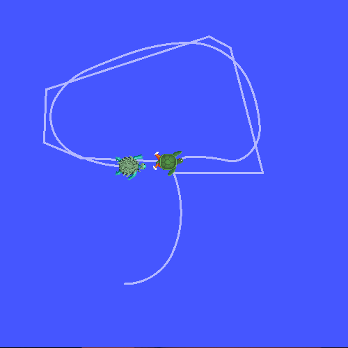
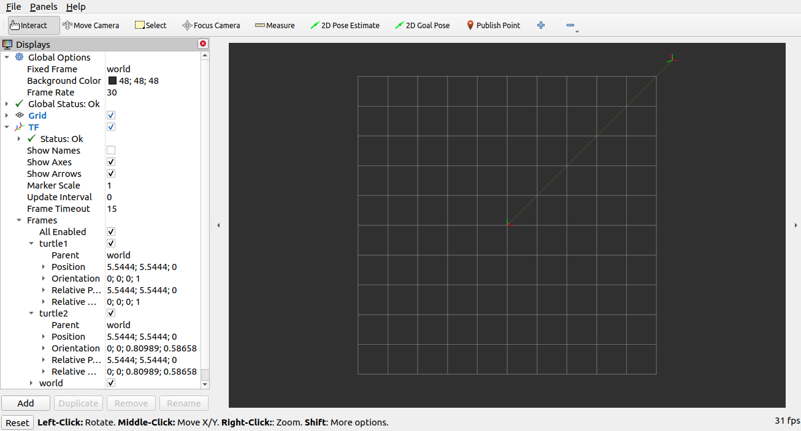

> Navigation: [Wiki index](../../../../index.md) | [Summary](../../../../SUMMARY.md) | [Tutorials hub](../../../../wiki/tutorial-paths.md)
> Related: [Adding a frame (C++)](adding-a-frame-cpp.md) | [Adding a frame (Python)](adding-a-frame-py.md) | [Adding physical and collision properties](../urdf/adding-physical-and-collision-properties-to-a-urdf-model.md) | [Building a movable robot model](../urdf/building-a-movable-robot-model-with-urdf.md) | [Building a visual robot model from scratch](../urdf/building-a-visual-robot-model-with-urdf-from-scratch.md)

<a id="introducing-tf2"></a>
<a id="intrototf2"></a>

# Introducing `tf2`

**Goal:** Run a turtlesim demo and see some of the power of tf2 in a multi-robot example using turtlesim.

**Tutorial level:** Intermediate

**Time:** 10 minutes

Contents

- [Installing the demo](#installing-the-demo)
- [Running the demo](#running-the-demo)
- [What is happening?](#what-is-happening)
- [tf2 tools](#tf2-tools)

  - [1 Using view\_frames](#using-view-frames)
  - [2 Using tf2\_echo](#using-tf2-echo)
- [rviz2 and tf2](#rviz2-and-tf2)

<a id="installing-the-demo"></a>

## Installing the demo

Let’s start by installing the demo package and its dependencies.

Ubuntu Packages

```
$ sudo apt-get install ros-jazzy-rviz2 ros-jazzy-turtle-tf2-py ros-jazzy-tf2-ros ros-jazzy-tf2-tools ros-jazzy-turtlesim
```

RHEL Packages

```
$ sudo dnf install ros-jazzy-rviz2 ros-jazzy-turtle-tf2-py ros-jazzy-tf2-ros ros-jazzy-tf2-tools ros-jazzy-turtlesim
```

From Source

```
$ git clone https://github.com/ros/geometry_tutorials.git -b ros2
```

<a id="running-the-demo"></a>

## Running the demo

Now that we’ve installed the `turtle_tf2_py` tutorial package let’s run the demo.
First, open a new terminal and [source your ROS 2 installation](../../beginner-cli-tools/configuring-ros2-environment.md) so that `ros2` commands will work.
Then run the following command:

```
$ ros2 launch turtle_tf2_py turtle_tf2_demo.launch.py
```

You will see the turtlesim start with two turtles.


In the second terminal window type the following command:

```
$ ros2 run turtlesim turtle_teleop_key
```

Once the turtlesim is started you can drive the central turtle around in the turtlesim using the keyboard arrow keys,
select the second terminal window so that your keystrokes will be captured to drive the turtle.



You can see that one turtle continuously moves to follow the turtle you are driving around.

<a id="what-is-happening"></a>

## What is happening?

This demo is using the tf2 library to create three coordinate frames: a `world` frame, a `turtle1` frame, and a `turtle2` frame.
This tutorial uses a *tf2 broadcaster* to publish the turtle coordinate frames and a *tf2 listener* to compute the difference in the turtle frames and move one turtle to follow the other.

<a id="tf2-tools"></a>

## tf2 tools

Now let’s look at how tf2 is being used to create this demo.
We can use `tf2_tools` to look at what tf2 is doing behind the scenes.

<a id="using-view-frames"></a>

### 1 Using view\_frames

`view_frames` creates a diagram of the frames being broadcast by tf2 over ROS.
Note that this utility only works on Linux; if you are Windows, skip to “Using tf2\_echo” below.

```
$ ros2 run tf2_tools view_frames
Listening to tf data during 5 seconds...
Generating graph in frames.pdf file...
```

Here a tf2 listener is listening to the frames that are being broadcast over ROS and drawing a tree of how the frames are connected.
To view the tree, open the resulting `frames.pdf` with your favorite PDF viewer.


Here we can see three frames that are broadcast by tf2: `world`, `turtle1`, and `turtle2`.
The `world` frame is the parent of the `turtle1` and `turtle2` frames.
`view_frames` also reports some diagnostic information about when the oldest and most
recent frame transforms were received and how fast the tf2 frame is published to tf2 for debugging purposes.

<a id="using-tf2-echo"></a>

### 2 Using tf2\_echo

`tf2_echo` reports the transform between any two frames broadcast over ROS.

Usage:

```
$ ros2 run tf2_ros tf2_echo [source_frame] [target_frame]
```

Let’s look at the transform of the `turtle2` frame with respect to `turtle1` frame which is equivalent to:

```
$ ros2 run tf2_ros tf2_echo turtle2 turtle1
At time 1683385337.850619099
- Translation: [2.157, 0.901, 0.000]
- Rotation: in Quaternion [0.000, 0.000, 0.172, 0.985]
- Rotation: in RPY (radian) [0.000, -0.000, 0.345]
- Rotation: in RPY (degree) [0.000, -0.000, 19.760]
- Matrix:
  0.941 -0.338  0.000  2.157
  0.338  0.941  0.000  0.901
  0.000  0.000  1.000  0.000
  0.000  0.000  0.000  1.000
At time 1683385338.841997774
- Translation: [1.256, 0.216, 0.000]
- Rotation: in Quaternion [0.000, 0.000, -0.016, 1.000]
- Rotation: in RPY (radian) [0.000, 0.000, -0.032]
- Rotation: in RPY (degree) [0.000, 0.000, -1.839]
- Matrix:
  0.999  0.032  0.000  1.256
 -0.032  0.999 -0.000  0.216
 -0.000  0.000  1.000  0.000
  0.000  0.000  0.000  1.000
```

You will see the transform displayed as the `tf2_echo` listener receives the frames broadcast over ROS 2.

As you drive your turtle around you will see the transform change as the two turtles move relative to each other.

<a id="rviz2-and-tf2"></a>

## rviz2 and tf2

`rviz2` is a visualization tool that is useful for examining tf2 frames.
Let’s look at our turtle frames using `rviz2` by starting it with a configuration file using the `-d` option:

Linux

```
$ ros2 run rviz2 rviz2 -d $(ros2 pkg prefix --share turtle_tf2_py)/rviz/turtle_rviz.rviz
```

Windows

```
$ for /f "usebackq tokens=*" %a in (`ros2 pkg prefix --share turtle_tf2_py`) do rviz2 -d %a/rviz/turtle_rviz.rviz
```



In the side bar you will see the frames broadcast by tf2.
As you drive the turtle around you will see the frames move in rviz.
