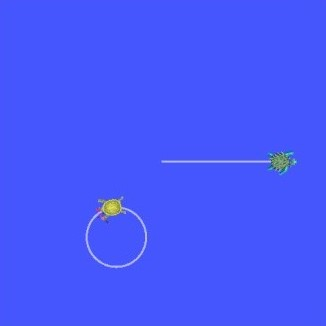

> Navigation: [Wiki index](../../../../index.md) | [Summary](../../../../SUMMARY.md) | [Tutorials hub](../../../../wiki/tutorial-paths.md)
> Related: [Adding a frame (C++)](adding-a-frame-cpp.md) | [Adding a frame (Python)](adding-a-frame-py.md) | [Adding physical and collision properties](../urdf/adding-physical-and-collision-properties-to-a-urdf-model.md) | [Building a movable robot model](../urdf/building-a-movable-robot-model-with-urdf.md) | [Building a visual robot model from scratch](../urdf/building-a-visual-robot-model-with-urdf-from-scratch.md)

<a id="using-stamped-datatypes-with-tf2-ros-messagefilter"></a>
<a id="usingstampeddatatypeswithtf2rosmessagefilter"></a>

# Using stamped datatypes with `tf2_ros::MessageFilter`

**Goal:** Learn how to use `tf2_ros::MessageFilter` to process stamped datatypes.

**Tutorial level:** Intermediate

**Time:** 10 minutes

Contents

- [Background](#background)
- [Prerequisites](#prerequisites)
- [Tasks](#tasks)

  - [1 Write the broadcaster node of PointStamped messages](#write-the-broadcaster-node-of-pointstamped-messages)

    - [1.1 Examine the code](#examine-the-code)
    - [1.2 Write the launch file](#write-the-launch-file)
    - [1.3 Add an entry point](#add-an-entry-point)
    - [1.4 Add an data file](#add-an-data-file)
    - [1.5 Build](#build)
  - [2 Writing the message filter/listener node](#writing-the-message-filter-listener-node)

    - [2.1 Examine the code](#id1)
    - [2.2 Add dependencies](#add-dependencies)
    - [2.3 CMakeLists.txt](#cmakelists-txt)
    - [2.4 Build](#id2)
  - [3 Run](#run)
- [Summary](#summary)

<a id="background"></a>

## Background

This tutorial explains how to use sensor data with tf2.
Some real-world examples of sensor data are:

> - cameras, both mono and stereo
> - laser scans

Suppose that a new turtle named `turtle3` is created and it doesn’t have good odometry, but there is an overhead camera tracking its position and publishing it as a `PointStamped` message in relation to the `world` frame.

`turtle1` wants to know where `turtle3` is compared to itself.

To do this `turtle1` must listen to the topic where `turtle3`’s pose is being published, wait until transforms into the desired frame are ready, and then do its operations.
To make this easier the `tf2_ros::MessageFilter` is very useful.
The `tf2_ros::MessageFilter` will take a subscription to any ROS 2 message with a header and cache it until it is possible to transform it into the target frame.

<a id="prerequisites"></a>

## Prerequisites

This tutorial expects you to have `turtle_tf2_py` package installed.

Ubuntu

```
$ sudo apt install ros-jazzy-turtle-tf2-py
```

RHEL

```
$ sudo dnf install ros-jazzy-turtle-tf2-py
```

From Source

```
# Clone the required package repository inside src directory of the ros2_ws
$ git clone https://github.com/ros/geometry_tutorials.git -b ros2
# Build the required package
$ colcon build --packages-select turtle_tf2_py
```

<a id="tasks"></a>

## Tasks

<a id="write-the-broadcaster-node-of-pointstamped-messages"></a>

### 1 Write the broadcaster node of PointStamped messages

For this tutorial we will set up a demo application which has a node (in Python) to broadcast the `PointStamped` position messages of `turtle3`.

First, let’s create the source file.

Go to the `learning_tf2_py` [package](writing-a-tf2-static-broadcaster-py.md) we created in the previous tutorial.
Inside the `src/learning_tf2_py/learning_tf2_py` directory download the example sensor message broadcaster code by entering the following command:

Linux

```
$ wget https://raw.githubusercontent.com/ros/geometry_tutorials/jazzy/turtle_tf2_py/turtle_tf2_py/turtle_tf2_message_broadcaster.py
```

macOS

```
$ wget https://raw.githubusercontent.com/ros/geometry_tutorials/jazzy/turtle_tf2_py/turtle_tf2_py/turtle_tf2_message_broadcaster.py
```

Windows

In a Windows command line prompt:

```
$ curl -sk https://raw.githubusercontent.com/ros/geometry_tutorials/jazzy/turtle_tf2_py/turtle_tf2_py/turtle_tf2_message_broadcaster.py -o turtle_tf2_message_broadcaster.py
```

Or in powershell:

```
$ curl https://raw.githubusercontent.com/ros/geometry_tutorials/jazzy/turtle_tf2_py/turtle_tf2_py/turtle_tf2_message_broadcaster.py -o turtle_tf2_message_broadcaster.py
```

Open the file using your preferred text editor.

```
from geometry_msgs.msg import PointStamped
from geometry_msgs.msg import Twist

import rclpy
from rclpy.node import Node

from turtlesim.msg import Pose
from turtlesim.srv import Spawn

class PointPublisher(Node):

    def __init__(self):
        super().__init__('turtle_tf2_message_broadcaster')

        # Create a client to spawn a turtle
        self.spawner = self.create_client(Spawn, 'spawn')
        # Boolean values to store the information
        # if the service for spawning turtle is available
        self.turtle_spawning_service_ready = False
        # if the turtle was successfully spawned
        self.turtle_spawned = False
        # if the topics of turtle3 can be subscribed
        self.turtle_pose_cansubscribe = False

        self.timer = self.create_timer(1.0, self.on_timer)

    def on_timer(self):
        if self.turtle_spawning_service_ready:
            if self.turtle_spawned:
                self.turtle_pose_cansubscribe = True
            else:
                if self.result.done():
                    self.get_logger().info(
                        f'Successfully spawned {self.result.result().name}')
                    self.turtle_spawned = True
                else:
                    self.get_logger().info('Spawn is not finished')
        else:
            if self.spawner.service_is_ready():
                # Initialize request with turtle name and coordinates
                # Note that x, y and theta are defined as floats in turtlesim/srv/Spawn
                request = Spawn.Request()
                request.name = 'turtle3'
                request.x = 4.0
                request.y = 2.0
                request.theta = 0.0
                # Call request
                self.result = self.spawner.call_async(request)
                self.turtle_spawning_service_ready = True
            else:
                # Check if the service is ready
                self.get_logger().info('Service is not ready')

        if self.turtle_pose_cansubscribe:
            self.vel_pub = self.create_publisher(Twist, 'turtle3/cmd_vel', 10)
            self.sub = self.create_subscription(Pose, 'turtle3/pose', self.handle_turtle_pose, 10)
            self.pub = self.create_publisher(PointStamped, 'turtle3/turtle_point_stamped', 10)

    def handle_turtle_pose(self, msg):
        vel_msg = Twist()
        vel_msg.linear.x = 1.0
        vel_msg.angular.z = 1.0
        self.vel_pub.publish(vel_msg)

        ps = PointStamped()
        ps.header.stamp = self.get_clock().now().to_msg()
        ps.header.frame_id = 'world'
        ps.point.x = msg.x
        ps.point.y = msg.y
        ps.point.z = 0.0
        self.pub.publish(ps)

def main():
    rclpy.init()
    node = PointPublisher()
    try:
        rclpy.spin(node)
    except KeyboardInterrupt:
        pass

    rclpy.shutdown()
```

<a id="examine-the-code"></a>

#### 1.1 Examine the code

Now let’s take a look at the code.
First, in the `on_timer` callback function, we spawn the `turtle3` by asynchronously calling the `Spawn` service of `turtlesim`, and initialize its position at (4, 2, 0), when the turtle spawning service is ready.

```
# Initialize request with turtle name and coordinates
# Note that x, y and theta are defined as floats in turtlesim/srv/Spawn
request = Spawn.Request()
request.name = 'turtle3'
request.x = 4.0
request.y = 2.0
request.theta = 0.0
# Call request
self.result = self.spawner.call_async(request)
```

Afterward, the node publishes the topic `turtle3/cmd_vel`, topic `turtle3/turtle_point_stamped`, and subscribes to topic `turtle3/pose` and runs callback function `handle_turtle_pose` on every incoming message.

```
self.vel_pub = self.create_publisher(Twist, '/turtle3/cmd_vel', 10)
self.sub = self.create_subscription(Pose, '/turtle3/pose', self.handle_turtle_pose, 10)
self.pub = self.create_publisher(PointStamped, '/turtle3/turtle_point_stamped', 10)
```

Finally, in the callback function `handle_turtle_pose`, we initialize the `Twist` messages of `turtle3` and publish them, which will make the `turtle3` move along a circle.
Then we fill up the `PointStamped` messages of `turtle3` with incoming `Pose` messages and publish them.

```
vel_msg = Twist()
vel_msg.linear.x = 1.0
vel_msg.angular.z = 1.0
self.vel_pub.publish(vel_msg)

ps = PointStamped()
ps.header.stamp = self.get_clock().now().to_msg()
ps.header.frame_id = 'world'
ps.point.x = msg.x
ps.point.y = msg.y
ps.point.z = 0.0
self.pub.publish(ps)
```

<a id="write-the-launch-file"></a>

#### 1.2 Write the launch file

In order to run this demo, we need to create a launch file `turtle_tf2_sensor_message_launch` with extension `.py`, `.xml`, or `.yaml` in the `launch` subdirectory of package `learning_tf2_py`:

Python

```
from launch import LaunchDescription
from launch.actions import DeclareLaunchArgument
from launch_ros.actions import Node

def generate_launch_description():
    return LaunchDescription([
        DeclareLaunchArgument(
            'target_frame', default_value='turtle1',
            description='Target frame name.'
        ),
        Node(
            package='turtlesim',
            executable='turtlesim_node',
            name='sim',
            output='screen'
        ),
        Node(
            package='turtle_tf2_py',
            executable='turtle_tf2_broadcaster',
            name='broadcaster1',
            parameters=[
                {'turtlename': 'turtle1'}
            ]
        ),
        Node(
            package='turtle_tf2_py',
            executable='turtle_tf2_broadcaster',
            name='broadcaster2',
            parameters=[
                {'turtlename': 'turtle3'}
            ]
        ),
        Node(
            package='turtle_tf2_py',
            executable='turtle_tf2_message_broadcaster',
            name='message_broadcaster',
        ),
    ])
```

XML

```
<?xml version="1.0" encoding="UTF-8"?>
<launch>
  <arg name="target_frame" default="turtle1" description="Target frame name." />
  <node pkg="turtlesim" exec="turtlesim_node" name="sim" output="screen" />
  <node pkg="turtle_tf2_py" exec="turtle_tf2_broadcaster" name="broadcaster1">
    <param name="turtlename" value="turtle1" />
  </node>
  <node pkg="turtle_tf2_py" exec="turtle_tf2_broadcaster" name="broadcaster2">
    <param name="turtlename" value="turtle3" />
  </node>
  <node pkg="turtle_tf2_py" exec="turtle_tf2_message_broadcaster" name="message_broadcaster" />
</launch>
```

YAML

```
%YAML 1.2
---
launch:
  - arg:
      name: "target_frame"
      default: "turtle1"
      description: "Target frame name."
  - node:
      pkg: "turtlesim"
      exec: "turtlesim_node"
      name: "sim"
      output: "screen"
  - node:
      pkg: "turtle_tf2_py"
      exec: "turtle_tf2_broadcaster"
      name: "broadcaster1"
      param:
      - name: "turtlename"
        value: "turtle1"
  - node:
      pkg: "turtle_tf2_py"
      exec: "turtle_tf2_broadcaster"
      name: "broadcaster2"
      param:
      - name: "turtlename"
        value: "turtle3"
  - node:
      pkg: "turtle_tf2_py"
      exec: "turtle_tf2_message_broadcaster"
      name: "message_broadcaster"
```

<a id="add-an-entry-point"></a>

#### 1.3 Add an entry point

To allow the `ros2 run` command to run your node, you must add the entry point to `setup.py` (located in the `src/learning_tf2_py` directory).

Add the following line between the `'console_scripts':` brackets:

```
'turtle_tf2_message_broadcaster = learning_tf2_py.turtle_tf2_message_broadcaster:main',
```

<a id="add-an-data-file"></a>

#### 1.4 Add an data file

To allow the `ros2 launch` command to launch your launch file, you must add the data file to `setup.py` (located in the `src/learning_tf2_py` directory).

Import the following libraries at the top, in `setup.py`:

```
...
import os
from glob import glob
```

Add the following line between the `'data_files':` brackets:

```
data_files=[
    ...
    (os.path.join('share', package_name, 'launch'), glob('launch/*')),
],
```

<a id="build"></a>

#### 1.5 Build

Run `rosdep` in the root of your workspace to check for missing dependencies.

Linux

```
$ rosdep install -i --from-path src --rosdistro jazzy -y
```

macOS

rosdep only runs on Linux, so you will need to install `geometry_msgs` and `turtlesim` dependencies yourself

Windows

rosdep only runs on Linux, so you will need to install `geometry_msgs` and `turtlesim` dependencies yourself

And then we can build the package:

Linux

```
$ colcon build --packages-select learning_tf2_py
```

macOS

```
$ colcon build --packages-select learning_tf2_py
```

Windows

```
$ colcon build --merge-install --packages-select learning_tf2_py
```

<a id="writing-the-message-filter-listener-node"></a>

### 2 Writing the message filter/listener node

Now, to get the streaming `PointStamped` data of `turtle3` in the frame of `turtle1` reliably, we will create the source file of the message filter/listener node.

Go to the `learning_tf2_cpp` [package](writing-a-tf2-static-broadcaster-cpp.md) we created in the previous tutorial.
Inside the `src/learning_tf2_cpp/src` directory download file `turtle_tf2_message_filter.cpp` by entering the following command:

Linux

```
$ wget https://raw.githubusercontent.com/ros/geometry_tutorials/jazzy/turtle_tf2_cpp/src/turtle_tf2_message_filter.cpp
```

macOS

```
$ wget https://raw.githubusercontent.com/ros/geometry_tutorials/jazzy/turtle_tf2_cpp/src/turtle_tf2_message_filter.cpp
```

Windows

In a Windows command line prompt:

```
$ curl -sk https://raw.githubusercontent.com/ros/geometry_tutorials/jazzy/turtle_tf2_cpp/src/turtle_tf2_message_filter.cpp -o turtle_tf2_message_filter.cpp
```

Or in powershell:

```
$ curl https://raw.githubusercontent.com/ros/geometry_tutorials/jazzy/turtle_tf2_cpp/src/turtle_tf2_message_filter.cpp -o turtle_tf2_message_filter.cpp
```

Open the file using your preferred text editor.

```
#include <chrono>
#include <memory>
#include <string>

#include "geometry_msgs/msg/point_stamped.hpp"
#include "message_filters/subscriber.hpp"
#include "rclcpp/rclcpp.hpp"
#include "tf2_ros/buffer.hpp"
#include "tf2_ros/create_timer_ros.hpp"
#include "tf2_ros/message_filter.hpp"
#include "tf2_ros/transform_listener.hpp"
#include "tf2_geometry_msgs/tf2_geometry_msgs.hpp"

using namespace std::chrono_literals;

class PoseDrawer : public rclcpp::Node
{
public:
  PoseDrawer()
  : Node("turtle_tf2_pose_drawer")
  {
    // Declare and acquire `target_frame` parameter
    target_frame_ = this->declare_parameter<std::string>("target_frame", "turtle1");

    std::chrono::duration<int> buffer_timeout(1);

    tf2_buffer_ = std::make_shared<tf2_ros::Buffer>(this->get_clock());
    // Create the timer interface before call to waitForTransform,
    // to avoid a tf2_ros::CreateTimerInterfaceException exception
    auto timer_interface = std::make_shared<tf2_ros::CreateTimerROS>(
      this->get_node_base_interface(),
      this->get_node_timers_interface());
    tf2_buffer_->setCreateTimerInterface(timer_interface);
    tf2_listener_ =
      std::make_shared<tf2_ros::TransformListener>(*tf2_buffer_);

    point_sub_.subscribe(this, "/turtle3/turtle_point_stamped");
    tf2_filter_ = std::make_shared<tf2_ros::MessageFilter<geometry_msgs::msg::PointStamped>>(
      point_sub_, *tf2_buffer_, target_frame_, 100, this->get_node_logging_interface(),
      this->get_node_clock_interface(), buffer_timeout);
    // Register a callback with tf2_ros::MessageFilter to be called when transforms are available
    tf2_filter_->registerCallback(&PoseDrawer::msgCallback, this);
  }

private:
  void msgCallback(const geometry_msgs::msg::PointStamped::SharedPtr point_ptr)
  {
    geometry_msgs::msg::PointStamped point_out;
    try {
      tf2_buffer_->transform(*point_ptr, point_out, target_frame_);
      RCLCPP_INFO(
        this->get_logger(), "Point of turtle3 in frame of turtle1: x:%f y:%f z:%f\n",
        point_out.point.x,
        point_out.point.y,
        point_out.point.z);
    } catch (const tf2::TransformException & ex) {
      RCLCPP_WARN(
        // Print exception which was caught
        this->get_logger(), "Failure %s\n", ex.what());
    }
  }

  std::string target_frame_;
  std::shared_ptr<tf2_ros::Buffer> tf2_buffer_;
  std::shared_ptr<tf2_ros::TransformListener> tf2_listener_;
  message_filters::Subscriber<geometry_msgs::msg::PointStamped> point_sub_;
  std::shared_ptr<tf2_ros::MessageFilter<geometry_msgs::msg::PointStamped>> tf2_filter_;
};

int main(int argc, char * argv[])
{
  rclcpp::init(argc, argv);
  rclcpp::spin(std::make_shared<PoseDrawer>());
  rclcpp::shutdown();
  return 0;
}
```

<a id="id1"></a>

#### 2.1 Examine the code

First, you must include the `tf2_ros::MessageFilter` headers from the `tf2_ros` package, as well as the previously used `tf2` and `ros2` related headers.

```
#include "geometry_msgs/msg/point_stamped.hpp"
#include "message_filters/subscriber.hpp"
#include "rclcpp/rclcpp.hpp"
#include "tf2_ros/buffer.hpp"
#include "tf2_ros/create_timer_ros.hpp"
#include "tf2_ros/message_filter.hpp"
#include "tf2_ros/transform_listener.hpp"
#include "tf2_geometry_msgs/tf2_geometry_msgs.hpp"
```

Second, there needs to be persistent instances of `tf2_ros::Buffer`, `tf2_ros::TransformListener` and `tf2_ros::MessageFilter`.

```
std::string target_frame_;
std::shared_ptr<tf2_ros::Buffer> tf2_buffer_;
std::shared_ptr<tf2_ros::TransformListener> tf2_listener_;
message_filters::Subscriber<geometry_msgs::msg::PointStamped> point_sub_;
std::shared_ptr<tf2_ros::MessageFilter<geometry_msgs::msg::PointStamped>> tf2_filter_;
```

Third, the ROS 2 `message_filters::Subscriber` must be initialized with the topic.
And the `tf2_ros::MessageFilter` must be initialized with that `Subscriber` object.
The other arguments of note in the `MessageFilter` constructor are the `target_frame` and the callback function.
The target frame is the frame into which it will make sure `canTransform` will succeed.
And the callback function is the function that will be called when the data is ready.

```
PoseDrawer()
: Node("turtle_tf2_pose_drawer")
{
  // Declare and acquire `target_frame` parameter
  target_frame_ = this->declare_parameter<std::string>("target_frame", "turtle1");

  std::chrono::duration<int> buffer_timeout(1);

  tf2_buffer_ = std::make_shared<tf2_ros::Buffer>(this->get_clock());
  // Create the timer interface before call to waitForTransform,
  // to avoid a tf2_ros::CreateTimerInterfaceException exception
  auto timer_interface = std::make_shared<tf2_ros::CreateTimerROS>(
    this->get_node_base_interface(),
    this->get_node_timers_interface());
  tf2_buffer_->setCreateTimerInterface(timer_interface);
  tf2_listener_ =
    std::make_shared<tf2_ros::TransformListener>(*tf2_buffer_);

  point_sub_.subscribe(this, "/turtle3/turtle_point_stamped");
  tf2_filter_ = std::make_shared<tf2_ros::MessageFilter<geometry_msgs::msg::PointStamped>>(
    point_sub_, *tf2_buffer_, target_frame_, 100, this->get_node_logging_interface(),
    this->get_node_clock_interface(), buffer_timeout);
  // Register a callback with tf2_ros::MessageFilter to be called when transforms are available
  tf2_filter_->registerCallback(&PoseDrawer::msgCallback, this);
}
```

And last, the callback method will call `tf2_buffer_->transform` when the data is ready and print output to the console.

```
private:
  void msgCallback(const geometry_msgs::msg::PointStamped::SharedPtr point_ptr)
  {
    geometry_msgs::msg::PointStamped point_out;
    try {
      tf2_buffer_->transform(*point_ptr, point_out, target_frame_);
      RCLCPP_INFO(
        this->get_logger(), "Point of turtle3 in frame of turtle1: x:%f y:%f z:%f\n",
        point_out.point.x,
        point_out.point.y,
        point_out.point.z);
    } catch (const tf2::TransformException & ex) {
      RCLCPP_WARN(
        // Print exception which was caught
        this->get_logger(), "Failure %s\n", ex.what());
    }
  }
```

<a id="add-dependencies"></a>

#### 2.2 Add dependencies

Before building the package `learning_tf2_cpp`, please add two another dependencies in the `package.xml` file of this package:

```
<depend>message_filters</depend>
<depend>tf2_geometry_msgs</depend>
```

<a id="cmakelists-txt"></a>

#### 2.3 CMakeLists.txt

And in the `CMakeLists.txt` file, add two lines below the existing dependencies:

```
find_package(message_filters REQUIRED)
find_package(tf2_geometry_msgs REQUIRED)
```

The lines below will deal with differences between ROS distributions:

```
if(TARGET tf2_geometry_msgs::tf2_geometry_msgs)
  get_target_property(_include_dirs tf2_geometry_msgs::tf2_geometry_msgs INTERFACE_INCLUDE_DIRECTORIES)
else()
  set(_include_dirs ${tf2_geometry_msgs_INCLUDE_DIRS})
endif()

find_file(TF2_CPP_HEADERS
  NAMES tf2_geometry_msgs.hpp
  PATHS ${_include_dirs}
  NO_CACHE
  PATH_SUFFIXES tf2_geometry_msgs
)
```

After that, add the executable and name it `turtle_tf2_message_filter`, which you’ll use later with `ros2 run`.

```
add_executable(turtle_tf2_message_filter src/turtle_tf2_message_filter.cpp)
ament_target_dependencies(
  turtle_tf2_message_filter
  geometry_msgs
  message_filters
  rclcpp
  tf2
  tf2_geometry_msgs
  tf2_ros
)

if(EXISTS ${TF2_CPP_HEADERS})
  target_compile_definitions(turtle_tf2_message_filter PUBLIC -DTF2_CPP_HEADERS)
endif()
```

Finally, add the `install(TARGETS…)` section (below other existing nodes) so `ros2 run` can find your executable:

```
install(TARGETS
  turtle_tf2_message_filter
  DESTINATION lib/${PROJECT_NAME})
```

<a id="id2"></a>

#### 2.4 Build

Run `rosdep` in the root of your workspace to check for missing dependencies.

Linux

```
$ rosdep install -i --from-path src --rosdistro jazzy -y
```

macOS

rosdep only runs on Linux, so you will need to install `geometry_msgs` and `turtlesim` dependencies yourself

Windows

rosdep only runs on Linux, so you will need to install `geometry_msgs` and `turtlesim` dependencies yourself

Now open a new terminal, navigate to the root of your workspace, and rebuild the package with command:

Linux

```
$ colcon build --packages-select learning_tf2_cpp
```

macOS

```
$ colcon build --packages-select learning_tf2_cpp
```

Windows

```
$ colcon build --merge-install --packages-select learning_tf2_cpp
```

Open a new terminal, navigate to the root of your workspace, and source the setup files:

Linux

```
$ . install/setup.bash
```

macOS

```
$ . install/setup.bash
```

Windows

In a windows command line prompt:

```
$ call install\setup.bat
```

Or in powershell:

```
$ .\install\setup.ps1
```

<a id="run"></a>

### 3 Run

First we need to run several nodes (including the broadcaster node of PointStamped messages) by launching the launch file `turtle_tf2_sensor_message_launch`:

XML

```
$ ros2 launch learning_tf2_py turtle_tf2_sensor_message_launch.xml
```

YAML

```
$ ros2 launch learning_tf2_py turtle_tf2_sensor_message_launch.yaml
```

Python

```
$ ros2 launch learning_tf2_py turtle_tf2_sensor_message_launch.py
```

This will bring up the `turtlesim` window with two turtles, where `turtle3` is moving along a circle, while `turtle1` isn’t moving at first.
But you can run the `turtle_teleop_key` node in another terminal to drive `turtle1` to move:

```
$ ros2 run turtlesim turtle_teleop_key
```



Now if you echo the topic `turtle3/turtle_point_stamped`:

```
$ ros2 topic echo /turtle3/turtle_point_stamped
header:
  stamp:
    sec: 1629877510
    nanosec: 902607040
  frame_id: world
point:
  x: 4.989276885986328
  y: 3.073937177658081
  z: 0.0
---
header:
  stamp:
    sec: 1629877510
    nanosec: 918389395
  frame_id: world
point:
  x: 4.987966060638428
  y: 3.089883327484131
  z: 0.0
---
header:
  stamp:
    sec: 1629877510
    nanosec: 934186680
  frame_id: world
point:
  x: 4.986400127410889
  y: 3.105806589126587
  z: 0.0
---
```

When the demo is running, open another terminal and run the message filter/listener node:

```
$ ros2 run learning_tf2_cpp turtle_tf2_message_filter
[INFO] [1630016162.006173900] [turtle_tf2_pose_drawer]: Point of turtle3 in frame of turtle1: x:-6.493231 y:-2.961614 z:0.000000

[INFO] [1630016162.006291983] [turtle_tf2_pose_drawer]: Point of turtle3 in frame of turtle1: x:-6.472169 y:-3.004742 z:0.000000

[INFO] [1630016162.006326234] [turtle_tf2_pose_drawer]: Point of turtle3 in frame of turtle1: x:-6.479420 y:-2.990479 z:0.000000

[INFO] [1630016162.006355644] [turtle_tf2_pose_drawer]: Point of turtle3 in frame of turtle1: x:-6.486441 y:-2.976102 z:0.000000
```

<a id="summary"></a>

## Summary

In this tutorial you learned how to use sensor data/messages in tf2.
Specifically speaking, you learned how to publish `PointStamped` messages on a topic, and how to listen to the topic and transform the frame of `PointStamped` messages with `tf2_ros::MessageFilter`.
