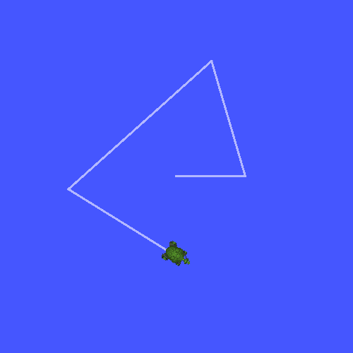

> Navigation: [Wiki index](../../../../index.md) | [Summary](../../../../SUMMARY.md) | [Tutorials hub](../../../../wiki/tutorial-paths.md)
> Related: [Adding a frame (C++)](adding-a-frame-cpp.md) | [Adding a frame (Python)](adding-a-frame-py.md) | [Adding physical and collision properties](../urdf/adding-physical-and-collision-properties-to-a-urdf-model.md) | [Building a movable robot model](../urdf/building-a-movable-robot-model-with-urdf.md) | [Building a visual robot model from scratch](../urdf/building-a-visual-robot-model-with-urdf-from-scratch.md)

<a id="writing-a-broadcaster-python"></a>

# Writing a broadcaster (Python)

**Goal:** Learn how to broadcast the state of a robot to tf2.

**Tutorial level:** Intermediate

**Time:** 15 minutes

Contents

- [Background](#background)
- [Prerequisites](#prerequisites)
- [Tasks](#tasks)

  - [1 Write the broadcaster node](#write-the-broadcaster-node)
  - [2 Write the launch file](#write-the-launch-file)
  - [3 Build](#build)
  - [4 Run](#run)
- [Summary](#summary)

<a id="background"></a>

## Background

In the next two tutorials we will write the code to reproduce the demo from the [Introduction to tf2](introduction-to-tf2.md) tutorial.
After that, the following tutorials focus on extending the demo with more advanced tf2 features, including the usage of timeouts in transformation lookups and time travel.

<a id="prerequisites"></a>

## Prerequisites

This tutorial assumes you have a working knowledge of ROS 2 and you have completed the [Introduction to tf2 tutorial](introduction-to-tf2.md) and [tf2 static broadcaster tutorial (Python)](writing-a-tf2-static-broadcaster-py.md).
We’ll be reusing the `learning_tf2_py` package from that last tutorial.

In previous tutorials, you learned how to [create a workspace](../../beginner-client-libraries/creating-a-workspace.md) and [create a package](../../beginner-client-libraries/creating-your-first-ros2-package.md).

<a id="tasks"></a>

## Tasks

<a id="write-the-broadcaster-node"></a>

### 1 Write the broadcaster node

Let’s first create the source files.
Go to the `learning_tf2_py` package we created in the previous tutorial.
Inside the `src/learning_tf2_py/learning_tf2_py` directory download the example broadcaster code by entering the following command:

Linux

```
$ wget https://raw.githubusercontent.com/ros/geometry_tutorials/jazzy/turtle_tf2_py/turtle_tf2_py/turtle_tf2_broadcaster.py
```

macOS

```
$ wget https://raw.githubusercontent.com/ros/geometry_tutorials/jazzy/turtle_tf2_py/turtle_tf2_py/turtle_tf2_broadcaster.py
```

Windows

In a Windows command line prompt:

```
$ curl -sk https://raw.githubusercontent.com/ros/geometry_tutorials/jazzy/turtle_tf2_py/turtle_tf2_py/turtle_tf2_broadcaster.py -o turtle_tf2_broadcaster.py
```

Or in powershell:

```
$ curl https://raw.githubusercontent.com/ros/geometry_tutorials/jazzy/turtle_tf2_py/turtle_tf2_py/turtle_tf2_broadcaster.py -o turtle_tf2_broadcaster.py
```

Now open the file called `turtle_tf2_broadcaster.py` using your preferred text editor.

```
import math

from geometry_msgs.msg import TransformStamped

import numpy as np

import rclpy
from rclpy.node import Node

from tf2_ros import TransformBroadcaster

from turtlesim.msg import Pose

def quaternion_from_euler(ai, aj, ak):
    ai /= 2.0
    aj /= 2.0
    ak /= 2.0
    ci = math.cos(ai)
    si = math.sin(ai)
    cj = math.cos(aj)
    sj = math.sin(aj)
    ck = math.cos(ak)
    sk = math.sin(ak)
    cc = ci*ck
    cs = ci*sk
    sc = si*ck
    ss = si*sk

    q = np.empty((4, ))
    q[0] = cj*sc - sj*cs
    q[1] = cj*ss + sj*cc
    q[2] = cj*cs - sj*sc
    q[3] = cj*cc + sj*ss

    return q

class FramePublisher(Node):

    def __init__(self):
        super().__init__('turtle_tf2_frame_publisher')

        # Declare and acquire `turtlename` parameter
        self.turtlename = self.declare_parameter(
          'turtlename', 'turtle').get_parameter_value().string_value

        # Initialize the transform broadcaster
        self.tf_broadcaster = TransformBroadcaster(self)

        # Subscribe to a turtle{1}{2}/pose topic and call handle_turtle_pose
        # callback function on each message
        self.subscription = self.create_subscription(
            Pose,
            f'/{self.turtlename}/pose',
            self.handle_turtle_pose,
            1)
        self.subscription  # prevent unused variable warning

    def handle_turtle_pose(self, msg):
        t = TransformStamped()

        # Read message content and assign it to
        # corresponding tf variables
        t.header.stamp = self.get_clock().now().to_msg()
        t.header.frame_id = 'world'
        t.child_frame_id = self.turtlename

        # Turtle only exists in 2D, thus we get x and y translation
        # coordinates from the message and set the z coordinate to 0
        t.transform.translation.x = msg.x
        t.transform.translation.y = msg.y
        t.transform.translation.z = 0.0

        # For the same reason, turtle can only rotate around one axis
        # and this why we set rotation in x and y to 0 and obtain
        # rotation in z axis from the message
        q = quaternion_from_euler(0, 0, msg.theta)
        t.transform.rotation.x = q[0]
        t.transform.rotation.y = q[1]
        t.transform.rotation.z = q[2]
        t.transform.rotation.w = q[3]

        # Send the transformation
        self.tf_broadcaster.sendTransform(t)

def main():
    rclpy.init()
    node = FramePublisher()
    try:
        rclpy.spin(node)
    except KeyboardInterrupt:
        pass

    rclpy.shutdown()
```

<a id="examine-the-code"></a>

#### 1.1 Examine the code

Now, let’s take a look at the code that is relevant to publishing the turtle pose to tf2.
Firstly, we define and acquire a single parameter `turtlename`, which specifies a turtle name, e.g. `turtle1` or `turtle2`.

```
self.turtlename = self.declare_parameter(
  'turtlename', 'turtle').get_parameter_value().string_value
```

Afterward, the node subscribes to topic `{self.turtlename}/pose` and runs function `handle_turtle_pose` on every incoming message.

```
self .subscription = self.create_subscription(
    Pose,
    f'/{self.turtlename}/pose',
    self.handle_turtle_pose,
    1)
```

Now, we create a `TransformStamped` object and give it the appropriate metadata.

1. We need to give the transform being published a timestamp, and we’ll just stamp it with the current time by calling `self.get_clock().now()`.
   This will return the current time used by the `Node`.
2. Then we need to set the name of the parent frame of the link we’re creating, in this case `world`.
3. Finally, we need to set the name of the child node of the link we’re creating, in this case this is the name of the turtle itself.

The handler function for the turtle pose message broadcasts this turtle’s translation and rotation, and publishes it as a transform from frame `world` to frame `turtleX`.

```
t = TransformStamped()

# Read message content and assign it to
# corresponding tf variables
t.header.stamp = self.get_clock().now().to_msg()
t.header.frame_id = 'world'
t.child_frame_id = self.turtlename
```

Here we copy the information from the 3D turtle pose into the 3D transform.

```
# Turtle only exists in 2D, thus we get x and y translation
# coordinates from the message and set the z coordinate to 0
t.transform.translation.x = msg.x
t.transform.translation.y = msg.y
t.transform.translation.z = 0.0

# For the same reason, turtle can only rotate around one axis
# and this why we set rotation in x and y to 0 and obtain
# rotation in z axis from the message
q = quaternion_from_euler(0, 0, msg.theta)
t.transform.rotation.x = q[0]
t.transform.rotation.y = q[1]
t.transform.rotation.z = q[2]
t.transform.rotation.w = q[3]
```

Finally we take the transform that we constructed and pass it to the `sendTransform` method of the `TransformBroadcaster` that will take care of broadcasting.

```
# Send the transformation
self.tf_broadcaster.sendTransform(t)
```

<a id="add-an-entry-point"></a>

#### 1.2 Add an entry point

To allow the `ros2 run` command to run your node, you must add the entry point
to `setup.py` (located in the `src/learning_tf2_py` directory).

Add the following line between the `'console_scripts':` brackets:

```
'turtle_tf2_broadcaster = learning_tf2_py.turtle_tf2_broadcaster:main',
```

<a id="write-the-launch-file"></a>

### 2 Write the launch file

Now create a launch file for this demo.
Create a `launch` folder in the `src/learning_tf2_py` directory.
With your text editor, create a new file called `turtle_tf2_demo_launch` with extension `.py`, `.xml`, or `.yaml` in the `launch` folder, and add the following lines:

XML

```
<?xml version="1.0" encoding="UTF-8"?>
<launch>
  <node pkg="turtlesim" exec="turtlesim_node" name="sim" />
  <node pkg="learning_tf2_py" exec="turtle_tf2_broadcaster" name="broadcaster1">
    <param name="turtlename" value="turtle1" />
  </node>
</launch>
```

YAML

```
%YAML 1.2
---
launch:
  - node:
      pkg: "turtlesim"
      exec: "turtlesim_node"
      name: "sim"
  - node:
      pkg: "learning_tf2_py"
      exec: "turtle_tf2_broadcaster"
      name: "broadcaster1"
      param:
      - name: "turtlename"
        value: "turtle1"
```

Python

```
from launch import LaunchDescription
from launch_ros.actions import Node

def generate_launch_description():
    return LaunchDescription([
        Node(
            package='turtlesim',
            executable='turtlesim_node',
            name='sim'
        ),
        Node(
            package='learning_tf2_py',
            executable='turtle_tf2_broadcaster',
            name='broadcaster1',
            parameters=[
                {'turtlename': 'turtle1'}
            ]
        ),
    ])
```

<a id="id4"></a>

#### 2.1 Examine the code

Let’s examine the launch file structure.
Each format has its own way of setting up the launch file:

XML

XML launch files start with an XML declaration and a root `<launch>` element.

```
<?xml version="1.0" encoding="UTF-8"?>
<launch>
```

YAML

YAML launch files start with a YAML version declaration and a `launch:` key.

```
%YAML 1.2
---
launch:
```

Python

In Python launch files, we first import required modules from the `launch` and `launch_ros` packages.
It should be noted that `launch` is a generic launching framework (not ROS 2 specific) and `launch_ros` has ROS 2 specific things, like nodes that we import here.

```
from launch import LaunchDescription
from launch_ros.actions import Node
```

Now we run our nodes that start the turtlesim simulation and broadcast `turtle1` state to the tf2 using our `turtle_tf2_broadcaster` node.

XML

```
  <node pkg="turtlesim" exec="turtlesim_node" name="sim" />
  <node pkg="learning_tf2_py" exec="turtle_tf2_broadcaster" name="broadcaster1">
    <param name="turtlename" value="turtle1" />
  </node>
```

YAML

```
  - node:
      pkg: "turtlesim"
      exec: "turtlesim_node"
      name: "sim"
  - node:
      pkg: "learning_tf2_py"
```

Python

```
def generate_launch_description():
    return LaunchDescription([
        Node(
            package='turtlesim',
            executable='turtlesim_node',
            name='sim'
        ),
        Node(
            package='learning_tf2_py',
            executable='turtle_tf2_broadcaster',
            name='broadcaster1',
            parameters=[
                {'turtlename': 'turtle1'}
            ]
        ),
    ])
```

<a id="add-dependencies"></a>

#### 2.2 Add dependencies

Navigate one level back to the `learning_tf2_py` directory, where the `setup.py`, `setup.cfg`, and `package.xml` files are located.

Open `package.xml` with your text editor.
Add the following dependencies corresponding to your launch file’s import statements:

```
<exec_depend>launch</exec_depend>
<exec_depend>launch_ros</exec_depend>
```

This declares the additional required `launch` and `launch_ros` dependencies when its code is executed.

Make sure to save the file.

<a id="update-setup-py"></a>

#### 2.3 Update setup.py

Reopen `setup.py` and add the line so that the launch files from the `launch/` folder will be installed.
The `data_files` field should now look like this:

```
data_files=[
    ...
    (os.path.join('share', package_name, 'launch'), glob('launch/*')),
],
```

Also add the appropriate imports at the top of the file:

```
import os
from glob import glob
```

You can learn more about creating launch files in [this tutorial](../launch/creating-launch-files.md).

<a id="build"></a>

### 3 Build

Run `rosdep` in the root of your workspace to check for missing dependencies.

Linux

```
$ rosdep install -i --from-path src --rosdistro jazzy -y
```

macOS

rosdep only runs on Linux, so you will need to install `geometry_msgs` and `turtlesim` dependencies yourself

Windows

rosdep only runs on Linux, so you will need to install `geometry_msgs` and `turtlesim` dependencies yourself

Still in the root of your workspace, build your package:

Linux

```
$ colcon build --packages-select learning_tf2_py
```

macOS

```
$ colcon build --packages-select learning_tf2_py
```

Windows

```
$ colcon build --merge-install --packages-select learning_tf2_py
```

Open a new terminal, navigate to the root of your workspace, and source the setup files:

Linux

```
$ . install/setup.bash
```

macOS

```
$ . install/setup.bash
```

Windows

In a Windows command line prompt:

```
$ call install\setup.bat
```

Or in powershell:

```
$ .\install\setup.ps1
```

<a id="run"></a>

### 4 Run

Now run the launch file that will start the turtlesim simulation node and `turtle_tf2_broadcaster` node:

XML

```
$ ros2 launch learning_tf2_py turtle_tf2_demo_launch.xml
```

YAML

```
$ ros2 launch learning_tf2_py turtle_tf2_demo_launch.yaml
```

Python

```
$ ros2 launch learning_tf2_py turtle_tf2_demo_launch.py
```

In the second terminal window type the following command:

```
$ ros2 run turtlesim turtle_teleop_key
```

You will now see that the turtlesim simulation has started with one turtle that you can control.



Now, use the `tf2_echo` tool to check if the turtle pose is actually getting broadcast to tf2:

```
$ ros2 run tf2_ros tf2_echo world turtle1
```

This should show you the pose of the first turtle.
Drive around the turtle using the arrow keys (make sure your `turtle_teleop_key` terminal window is active, not your simulator window).
In your console output you will see something similar to this:

```
At time 1714913843.708748879
- Translation: [4.541, 3.889, 0.000]
- Rotation: in Quaternion [0.000, 0.000, 0.999, -0.035]
- Rotation: in RPY (radian) [0.000, -0.000, -3.072]
- Rotation: in RPY (degree) [0.000, -0.000, -176.013]
- Matrix:
 -0.998  0.070  0.000  4.541
 -0.070 -0.998  0.000  3.889
  0.000  0.000  1.000  0.000
  0.000  0.000  0.000  1.000
```

If you run `tf2_echo` for the transform between the `world` and `turtle2`, you should not see a transform, because the second turtle is not there yet.
However, as soon as we add the second turtle in the next tutorial, the pose of `turtle2` will be broadcast to tf2.

<a id="summary"></a>

## Summary

In this tutorial you learned how to broadcast the pose of the robot (position and orientation of the turtle) to tf2 and how to use the `tf2_echo` tool.
To actually use the transforms broadcasted to tf2, you should move on to the next tutorial about creating a [tf2 listener](writing-a-tf2-listener-py.md).
