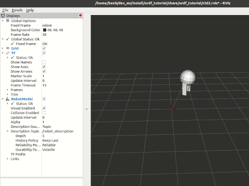

> Navigation: [Wiki index](../../../../index.md) | [Summary](../../../../SUMMARY.md) | [Tutorials hub](../../../../wiki/tutorial-paths.md)
> Related: [Adding a frame (C++)](../tf2/adding-a-frame-cpp.md) | [Adding a frame (Python)](../tf2/adding-a-frame-py.md) | [Adding physical and collision properties](adding-physical-and-collision-properties-to-a-urdf-model.md) | [Building a movable robot model](building-a-movable-robot-model-with-urdf.md) | [Building a visual robot model from scratch](building-a-visual-robot-model-with-urdf-from-scratch.md)

<a id="using-urdf-with-robot-state-publisher-python"></a>
<a id="urdfplusrsppython"></a>

# Using URDF with `robot_state_publisher` (Python)

**Goal:** Simulate a walking robot modeled in URDF and view it in Rviz.

**Tutorial level:** Intermediate

**Time:** 15 minutes

Contents

- [Background](#background)
- [Prerequisites](#prerequisites)
- [Tasks](#tasks)

  - [1 Create a package](#create-a-package)
  - [2 Create the URDF File](#create-the-urdf-file)
  - [3 Publish the state](#publish-the-state)
  - [4 Create a launch file](#create-a-launch-file)
  - [5 Edit the setup.py file](#edit-the-setup-py-file)
  - [6 Install the package](#install-the-package)
  - [7 View the results](#view-the-results)
- [Summary](#summary)

<a id="background"></a>

## Background

This tutorial will show you how to model a walking robot, publish the state as a [tf2](https://wiki.ros.org/tf2) message and view the simulation in Rviz.
First, we create the URDF model describing the robot assembly.
Next we write a node which simulates the motion and publishes the JointState and transforms.
We then use `robot_state_publisher` to publish the entire robot state to `/tf2`.



<a id="prerequisites"></a>

## Prerequisites

- [rviz2](https://index.ros.org/p/rviz2/)

As always, don’t forget to source ROS 2 in [every new terminal you open](../../beginner-cli-tools/configuring-ros2-environment.md).

<a id="tasks"></a>

## Tasks

<a id="create-a-package"></a>

### 1 Create a package

Create the directory:

Linux

```
$ mkdir -p second_ros2_ws/src
```

macOS

```
$ mkdir -p second_ros2_ws/src
```

Windows

```
$ md second_ros2_ws/src
```

Then create the package:

```
$ cd second_ros2_ws/src
$ ros2 pkg create --build-type ament_python --license Apache-2.0 urdf_tutorial_r2d2 --dependencies rclpy
$ cd urdf_tutorial_r2d2
```

You should now see a `urdf_tutorial_r2d2` folder.
Next you will make several changes to it.

<a id="create-the-urdf-file"></a>

### 2 Create the URDF File

Create the directory where we will store some assets:

Linux

```
$ mkdir -p urdf
```

macOS

```
$ mkdir -p urdf
```

Windows

```
$ md urdf
```

Download the [`URDF file`](../../../../assets/downloads/r2d2.urdf.xml) and save it as `second_ros2_ws/src/urdf_tutorial_r2d2/urdf/r2d2.urdf.xml`.
Download the [`Rviz configuration file`](../../../../assets/downloads/r2d2.rviz) and save it as `second_ros2_ws/src/urdf_tutorial_r2d2/urdf/r2d2.rviz`.

<a id="publish-the-state"></a>

### 3 Publish the state

Now we need a method for specifying what state the robot is in.
To do this, we must specify all three joints and the overall odometry.

Fire up your favorite editor and paste the following code into `second_ros2_ws/src/urdf_tutorial_r2d2/urdf_tutorial_r2d2/state_publisher.py`

```
from math import sin, cos, pi
import rclpy
from rclpy.node import Node
from rclpy.qos import QoSProfile
from geometry_msgs.msg import Quaternion
from sensor_msgs.msg import JointState
from tf2_ros import TransformBroadcaster, TransformStamped

class StatePublisher(Node):

    def __init__(self):
        rclpy.init()
        super().__init__('state_publisher')

        qos_profile = QoSProfile(depth=10)
        self.joint_pub = self.create_publisher(JointState, 'joint_states', qos_profile)
        self.broadcaster = TransformBroadcaster(self, qos=qos_profile)
        self.nodeName = self.get_name()
        self.get_logger().info("{0} started".format(self.nodeName))

        degree = pi / 180.0
        loop_rate = self.create_rate(30)

        # robot state
        tilt = 0.
        tinc = degree
        swivel = 0.
        angle = 0.
        height = 0.
        hinc = 0.005

        # message declarations
        odom_trans = TransformStamped()
        odom_trans.header.frame_id = 'odom'
        odom_trans.child_frame_id = 'axis'
        joint_state = JointState()

        try:
            while rclpy.ok():
                rclpy.spin_once(self)

                # update joint_state
                now = self.get_clock().now()
                joint_state.header.stamp = now.to_msg()
                joint_state.name = ['swivel', 'tilt', 'periscope']
                joint_state.position = [swivel, tilt, height]

                # update transform
                # (moving in a circle with radius=2)
                odom_trans.header.stamp = now.to_msg()
                odom_trans.transform.translation.x = cos(angle)*2
                odom_trans.transform.translation.y = sin(angle)*2
                odom_trans.transform.translation.z = 0.7
                odom_trans.transform.rotation = \
                    euler_to_quaternion(0, 0, angle + pi/2) # roll,pitch,yaw

                # send the joint state and transform
                self.joint_pub.publish(joint_state)
                self.broadcaster.sendTransform(odom_trans)

                # Create new robot state
                tilt += tinc
                if tilt < -0.5 or tilt > 0.0:
                    tinc *= -1
                height += hinc
                if height > 0.2 or height < 0.0:
                    hinc *= -1
                swivel += degree
                angle += degree/4

                # This will adjust as needed per iteration
                loop_rate.sleep()

        except KeyboardInterrupt:
            pass

def euler_to_quaternion(roll, pitch, yaw):
    qx = sin(roll/2) * cos(pitch/2) * cos(yaw/2) - cos(roll/2) * sin(pitch/2) * sin(yaw/2)
    qy = cos(roll/2) * sin(pitch/2) * cos(yaw/2) + sin(roll/2) * cos(pitch/2) * sin(yaw/2)
    qz = cos(roll/2) * cos(pitch/2) * sin(yaw/2) - sin(roll/2) * sin(pitch/2) * cos(yaw/2)
    qw = cos(roll/2) * cos(pitch/2) * cos(yaw/2) + sin(roll/2) * sin(pitch/2) * sin(yaw/2)
    return Quaternion(x=qx, y=qy, z=qz, w=qw)

def main():
    node = StatePublisher()

if __name__ == '__main__':
    main()
```

<a id="create-a-launch-file"></a>

### 4 Create a launch file

Create a new `second_ros2_ws/src/urdf_tutorial_r2d2/launch` folder.
Open your editor and paste the following code, saving it as `second_ros2_ws/src/urdf_tutorial_r2d2/launch/demo_launch.py`

```
from launch import LaunchDescription
from launch.actions import DeclareLaunchArgument
from launch.substitutions import FileContent, LaunchConfiguration, PathJoinSubstitution
from launch_ros.actions import Node
from launch_ros.substitutions import FindPackageShare

def generate_launch_description():
    use_sim_time = LaunchConfiguration('use_sim_time', default='false')
    urdf = FileContent(
        PathJoinSubstitution([FindPackageShare('urdf_tutorial_r2d2'), 'r2d2.urdf.xml']))

    return LaunchDescription([
        DeclareLaunchArgument(
            'use_sim_time',
            default_value='false',
            description='Use simulation (Gazebo) clock if true'),
        Node(
            package='robot_state_publisher',
            executable='robot_state_publisher',
            name='robot_state_publisher',
            output='screen',
            parameters=[{'use_sim_time': use_sim_time, 'robot_description': urdf}],
            arguments=[urdf]),
        Node(
            package='urdf_tutorial_r2d2',
            executable='state_publisher',
            name='state_publisher',
            output='screen'),
    ])
```

<a id="edit-the-setup-py-file"></a>

### 5 Edit the setup.py file

You must tell the **colcon** build tool how to install your Python package.
Edit the `second_ros2_ws/src/urdf_tutorial_r2d2/setup.py` file as follows:

- include these import statements

```
import os
from glob import glob
from setuptools import setup
from setuptools import find_packages
```

- append these 2 lines inside `data_files`

```
data_files=[
  ...
  (os.path.join('share', package_name, 'launch'), glob('launch/*')),
  (os.path.join('share', package_name), glob('urdf/*')),
],
```

- modify the `entry_points` table so you can later run ‘state\_publisher’ from a console

```
'console_scripts': [
    'state_publisher = urdf_tutorial_r2d2.state_publisher:main'
],
```

Save the `setup.py` file with your changes.

<a id="install-the-package"></a>

### 6 Install the package

```
$ cd second_ros2_ws
$ colcon build --symlink-install --packages-select urdf_tutorial_r2d2
```

Source the setup files:

Linux

```
$ source install/setup.bash
```

macOS

```
$ source install/setup.bash
```

Windows

```
$ call install/setup.bat
```

<a id="view-the-results"></a>

### 7 View the results

Launch the package

```
$ ros2 launch urdf_tutorial_r2d2 demo_launch.py
```

Open a new terminal, the run Rviz using

```
$ rviz2 -d `ros2 pkg prefix urdf_tutorial_r2d2 --share`/r2d2.rviz
```

See the [User Guide](http://wiki.ros.org/rviz/UserGuide) for details on how to use Rviz.

<a id="summary"></a>

## Summary

You created a `JointState` publisher node and coupled it with `robot_state_publisher` to simulate a walking robot.
The code used in these examples is originally from [here](https://github.com/benbongalon/ros2-migration/tree/master/urdf_tutorial).

Credit is given to the authors of this
[ROS 1 tutorial](http://wiki.ros.org/urdf/Tutorials/Using%20urdf%20with%20robot_state_publisher)
from which some content was reused.
