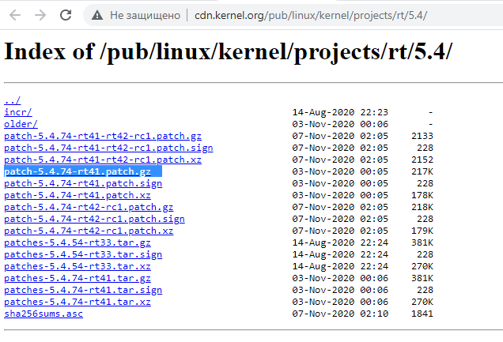

> Navigation: [Wiki index](../../../index.md) | [Summary](../../../SUMMARY.md) | [Tutorials hub](../../../wiki/tutorial-paths.md)
> Related: [Ament Lint CLI Utilities](../advanced/ament-lint-for-clean-code.md) | [Building a package with Eclipse 2021-06](building-ros2-package-with-eclipse-2021-06.md) | [Composing multiple nodes in a single process](../intermediate/composition.md) | [Configure service introspection](../demos/service-introspection.md) | [Configuring environment](../beginner-cli-tools/configuring-ros2-environment.md)

<a id="building-a-real-time-linux-kernel-community-contributed"></a>

# Building a real-time Linux kernel [community-contributed]

This tutorial begins with a clean Ubuntu 20.04.1 install on Intel x86\_64.
Actual kernel is 5.4.0-54-generic, but we will install the Latest Stable RT\_PREEMPT Version.
To build the kernel you need at least 30GB free disk space.

Check [this wiki](https://wiki.linuxfoundation.org/realtime/start) for the latest stable version, at the time of writing this is “Latest Stable Version 5.4-rt”.
If we click on the [link](http://cdn.kernel.org/pub/linux/kernel/projects/rt/5.4/), we get the exact version.
Currently it is `patch-5.4.78-rt44.patch.gz`.



We create a directory in our home dir with

```
$ mkdir ~/kernel
```

and switch into it with

```
$ cd ~/kernel
```

We can go with a browser to [this page](https://mirrors.edge.kernel.org/pub/linux/kernel/v5.x/) and see if the version is there.
You can download it from the site and move it manually from /Downloads to the /kernel folder, or download it using wget by right clicking the link using “copy link location”.
Example:

```
$ wget https://mirrors.edge.kernel.org/pub/linux/kernel/v5.x/linux-5.4.78.tar.gz
```

unpack it with

```
$ tar -xzf linux-5.4.78.tar.gz
```

download rt\_preempt patch matching the Kernel version we just downloaded over at [kernel.org](http://cdn.kernel.org/pub/linux/kernel/projects/rt/5.4/)

```
$ wget http://cdn.kernel.org/pub/linux/kernel/projects/rt/5.4/older/patch-5.4.78-rt44.patch.gz
```

unpack it with

```
$ gunzip patch-5.4.78-rt44.patch.gz
```

Then switch into the linux directory with

```
$ cd linux-5.4.78/
```

and patch the kernel with the realtime patch

```
$ patch -p1 < ../patch-5.4.78-rt44.patch
```

We simply want to use the config of our Ubuntu installation, so we get the Ubuntu config with

```
$ cp /boot/config-5.4.0-54-generic .config
```

Open Software & Updates.
in the Ubuntu Software menu tick the ‘Source code’ box

We need some tools to build kernel, install them with

```
$ sudo apt-get build-dep linux
$ sudo apt-get install libncurses-dev flex bison openssl libssl-dev dkms libelf-dev libudev-dev libpci-dev libiberty-dev autoconf fakeroot
```

To enable all Ubuntu configurations, we simply use

```
$ yes '' | make oldconfig
```

Then we need to enable rt\_preempt in the kernel.
We call

```
$ make menuconfig
```

and set the following

```
# Enable CONFIG_PREEMPT_RT
 -> General Setup
  -> Preemption Model (Fully Preemptible Kernel (Real-Time))
   (X) Fully Preemptible Kernel (Real-Time)

# Enable CONFIG_HIGH_RES_TIMERS
 -> General setup
  -> Timers subsystem
   [*] High Resolution Timer Support

# Enable CONFIG_NO_HZ_FULL
 -> General setup
  -> Timers subsystem
   -> Timer tick handling (Full dynticks system (tickless))
    (X) Full dynticks system (tickless)

# Set CONFIG_HZ_1000 (note: this is no longer in the General Setup menu, go back twice)
 -> Processor type and features
  -> Timer frequency (1000 HZ)
   (X) 1000 HZ

# Set CPU_FREQ_DEFAULT_GOV_PERFORMANCE [=y]
 ->  Power management and ACPI options
  -> CPU Frequency scaling
   -> CPU Frequency scaling (CPU_FREQ [=y])
    -> Default CPUFreq governor (<choice> [=y])
     (X) performance
```

Save and exit menuconfig.
Now we’re going to build the kernel which will take quite some time.
(10-30min on a modern cpu)

```
$ make -j `nproc` deb-pkg
```

After the build is finished check the deb packages

```
$ ls ../*deb
../linux-headers-5.4.78-rt41_5.4.78-rt44-1_amd64.deb  ../linux-image-5.4.78-rt44-dbg_5.4.78-rt44-1_amd64.deb
../linux-image-5.4.78-rt41_5.4.78-rt44-1_amd64.deb    ../linux-libc-dev_5.4.78-rt44-1_amd64.deb
```

Then we install all kernel deb packages

```
$ sudo dpkg -i ../*.deb
```

Now the real time kernel should be installed.
Reboot the system:

```
$ sudo reboot
```

And check the new kernel version:

```
$ uname -a
Linux ros2host 5.4.78-rt44 #1 SMP PREEMPT_RT Fri Nov 6 10:37:59 CET 2020 x86_64 xx
```
