> Navigation: [Wiki index](../../../index.md) | [Summary](../../../SUMMARY.md) | [Tutorials hub](../../../wiki/tutorial-paths.md)
> Related: [Ament Lint CLI Utilities](../advanced/ament-lint-for-clean-code.md) | [Building a real-time Linux kernel [community-contributed]](building-realtime-rt-preempt-kernel-for-ros-2.md) | [Composing multiple nodes in a single process](../intermediate/composition.md) | [Configure service introspection](../demos/service-introspection.md) | [Configuring environment](../beginner-cli-tools/configuring-ros2-environment.md)

# Building a package with Eclipse 2021-06

You cannot create a ROS 2 package with eclipse, you need to create it with commandline tools.
Follow the [Create a package](../beginner-client-libraries/creating-your-first-ros2-package.md) tutorial.

After you created your project, you can edit the source code and build it with eclipse.

We start eclipse and select a eclipse-workspace.

[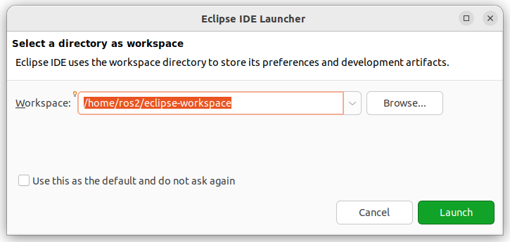](../../../assets/images/eclipse_work_dir.png)

We create a C++ project

[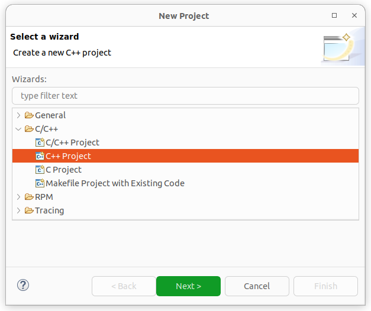](../../../assets/images/eclipse_create_c++_project.png)
[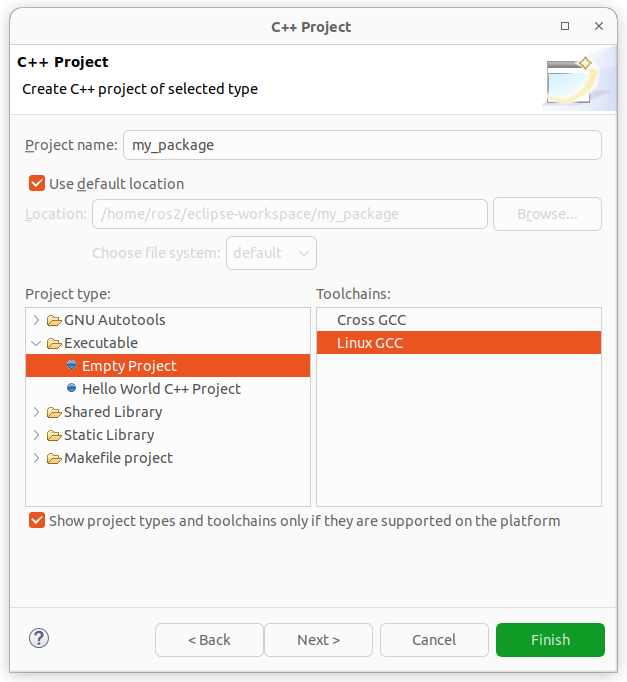](../../../assets/images/eclipse_c++_project_select_type.png)

We see that we got C++ includes.

[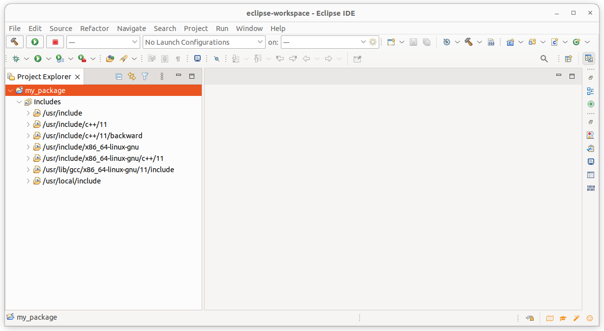](../../../assets/images/eclipse_c++_project_includes.png)

We now import our ROS 2 project.
The code is still in the old place.

[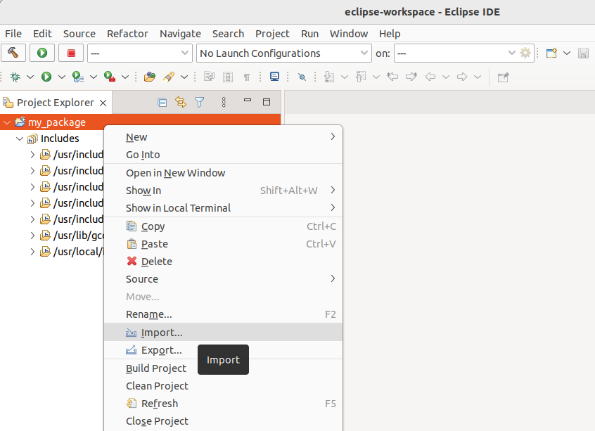](../../../assets/images/eclipse_import_project.png)
[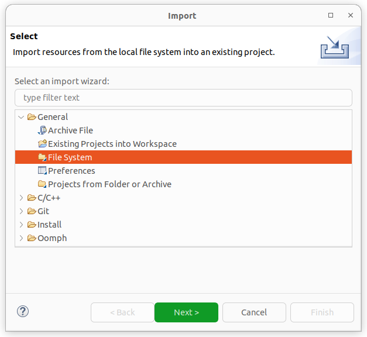](../../../assets/images/eclipse_import_filesystem.png)

Click the Advanced in the Options and check the **Create links in worksapce**.

[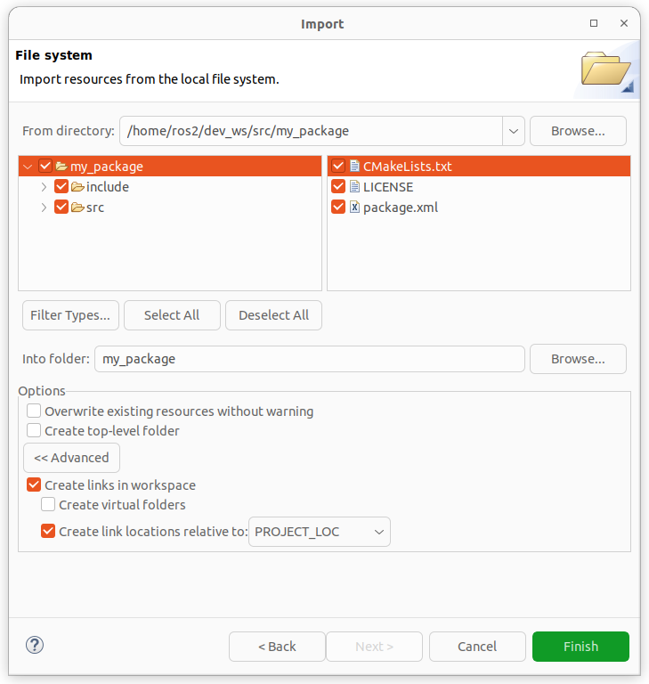](../../../assets/images/eclipse_import_select_my_package.png)

We see in the source code that the C++ includes got resolved but not the ROS 2 ones.

[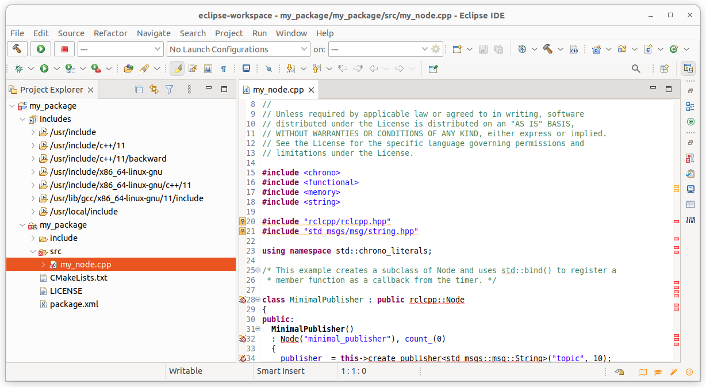](../../../assets/images/eclipse_c++_wo_ros_includes.png)
[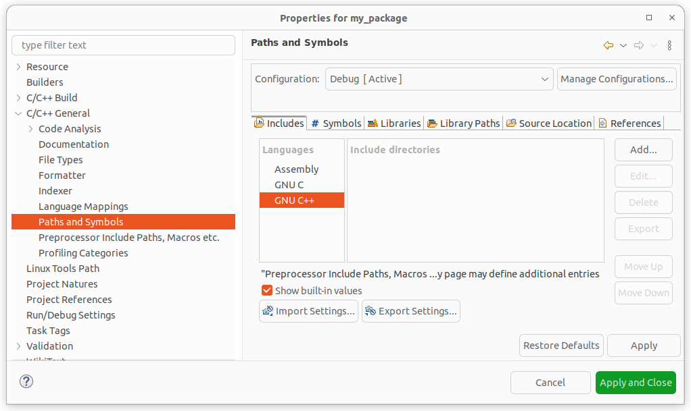](../../../assets/images/eclipse_c++_path_and_symbols.png)

Add include paths of needed packages.
(e.g. **/opt/ros/lyrical/include/rclcpp**, **/opt/ros/lyrical/include/std\_msgs**, etc.)

[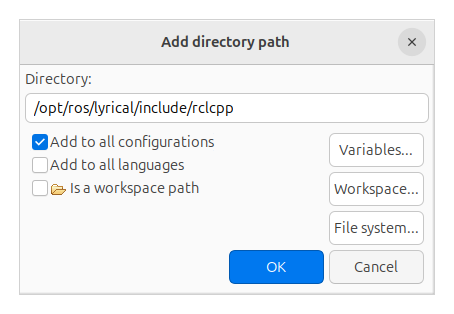](../../../assets/images/eclipse_c++_add_directory_path.png)

We now see that the ROS 2 includes got resolved too.

[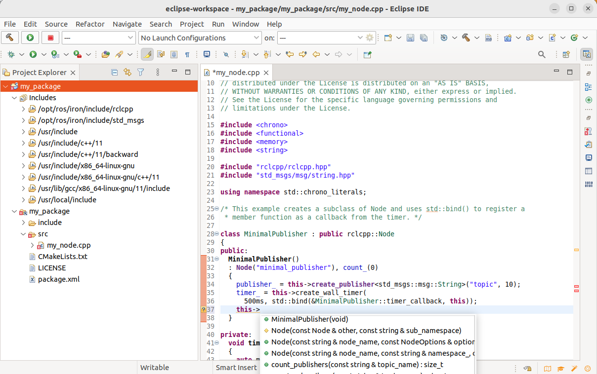](../../../assets/images/eclipse_c++_indexer_ok.png)

Adding Builder colcon, so that we can build with right-click on project and “Build project”.

[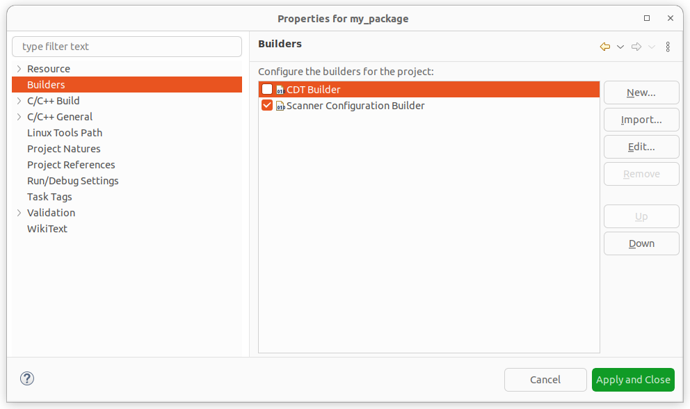](../../../assets/images/eclipse_c++_properties_builders.png)
[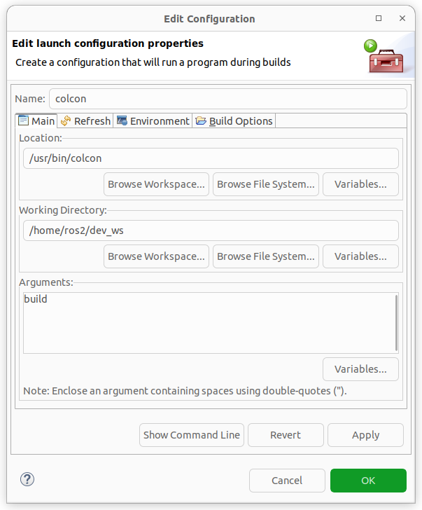](../../../assets/images/eclipse_c++_builder_main.png)

With PYTHONPATH you can also build python projects.

[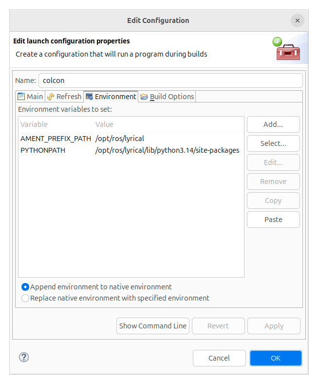](../../../assets/images/eclipse_c++_builder_env.png)
[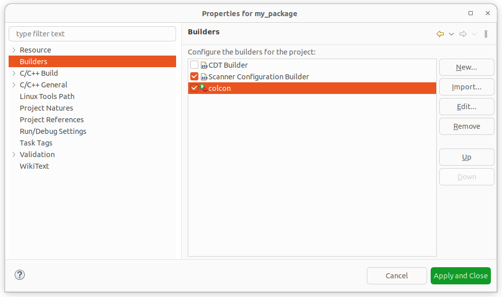](../../../assets/images/eclipse_c++_properties_builders_with_colcon.png)

Right-click on the project and select “Build Project”.

[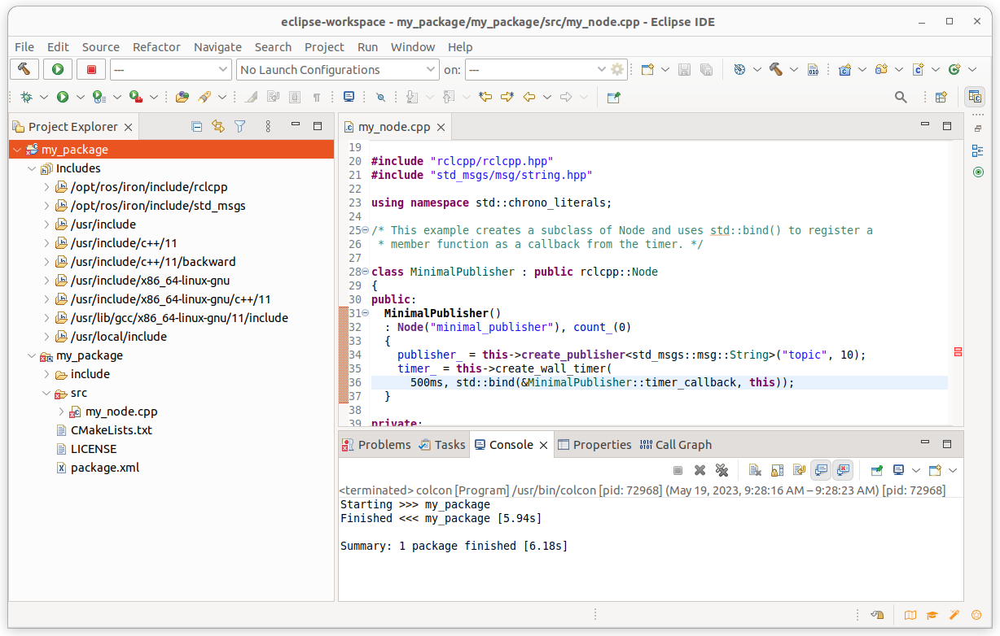](../../../assets/images/eclipse_c++_build_project_with_colcon.png)
