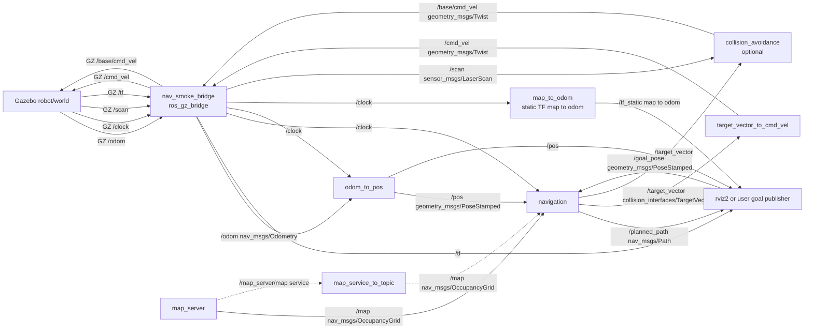

# Navigation

ROS 2 navigation node for planning a path over an occupancy grid and publishing
velocity intent toward the next waypoint.

In ros_ws directory

The node is installed as:

```bash
ros2 run navigation navigation
```

In the Gazebo smoke setup, it is launched by:

```bash
ros2 launch navigation_gazebo nav_smoke_gazebo.launch.py
```

With both gazebo and rviz:

```bash
source /opt/ros/jazzy/setup.bash
colcon build --packages-select navigation --symlink-install
source install/setup.bash
ros2 launch navigation_gazebo nav_smoke_gazebo.launch.py gui:=true rviz:=true
```

## What The Node Does

`/navigation` waits until it has a map, robot pose, and goal pose. It then:

1. Converts the robot pose and goal pose from world coordinates into map cells.
2. Plans a path using A* over the occupancy grid.
3. Publishes the planned path for visualization.
4. Publishes a `TargetVector` command toward a lookahead waypoint.
5. Publishes a zero command and logs `Goal succeeded` when the robot reaches the
   goal tolerance.

The node does not publish `/cmd_vel` directly. It publishes `/target_vector`,
and `target_vector_to_cmd_vel` converts that into `/cmd_vel`.

## Navigation Inputs

| Topic | Type | Source | Purpose |
|---|---|---|---|
| `/map` | `nav_msgs/msg/OccupancyGrid` | `map_server` or `map_service_to_topic` | Static occupancy grid used for A* planning. |
| `/pos` | `geometry_msgs/msg/PoseStamped` | `odom_to_pos` | Robot pose in the map frame. |
| `/goal_pose` | `geometry_msgs/msg/PoseStamped` | RViz or another goal publisher | Target pose for navigation. |
| `/clock` | `rosgraph_msgs/msg/Clock` | `nav_smoke_bridge` | Simulation time when `use_sim_time` is enabled. |

## Navigation Outputs

| Topic | Type | Destination | Purpose |
|---|---|---|---|
| `/target_vector` | `collision_interfaces/msg/TargetVector` | `target_vector_to_cmd_vel`, optional `collision_avoidance` | Desired linear and angular motion. |
| `/planned_path` | `nav_msgs/msg/Path` | RViz or other visualizers | Current planned path in the map frame. |
| `/rosout` | `rcl_interfaces/msg/Log` | ROS logging | Runtime logs, including planning and goal status. |
| `/parameter_events` | `rcl_interfaces/msg/ParameterEvent` | ROS parameter system | Standard ROS parameter events. |

`collision_interfaces/msg/TargetVector` contains:

```text
float64 linear
float64 angular
```

## Full Runtime Graph

This is the graph for the Gazebo launch setup in
`navigation_gazebo/launch/nav_smoke_gazebo.launch.py`.



## Core Topic Flow

The normal command path is:

```text
Gazebo /odom
  -> nav_smoke_bridge /odom
  -> odom_to_pos /pos
  -> navigation /target_vector
  -> target_vector_to_cmd_vel /cmd_vel
  -> nav_smoke_bridge
  -> Gazebo /cmd_vel
```

The planning path is:

```text
map_server /map
RViz /goal_pose
odom_to_pos /pos
  -> navigation
  -> /planned_path
```

## Useful Commands

Show the live node graph:

```bash
ros2 node list
ros2 node info /navigation
```

Show relevant topics and types:

```bash
ros2 topic list -t
ros2 topic info -v /map
ros2 topic info -v /pos
ros2 topic info -v /goal_pose
ros2 topic info -v /target_vector
ros2 topic info -v /planned_path
ros2 topic info -v /cmd_vel
```

Send a goal manually:

```bash
ros2 topic pub --once /goal_pose geometry_msgs/msg/PoseStamped "{
  header: {frame_id: 'map'},
  pose: {
    position: {x: 11.5, y: -2.0, z: 0.0},
    orientation: {w: 1.0}
  }
}"
```

Watch the navigation command:

```bash
ros2 topic echo /target_vector
```

Watch the converted robot command:

```bash
ros2 topic echo /cmd_vel
```
