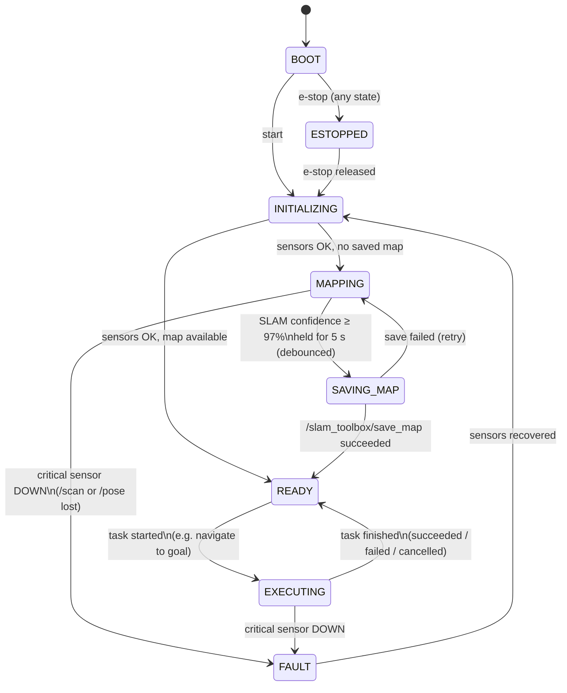
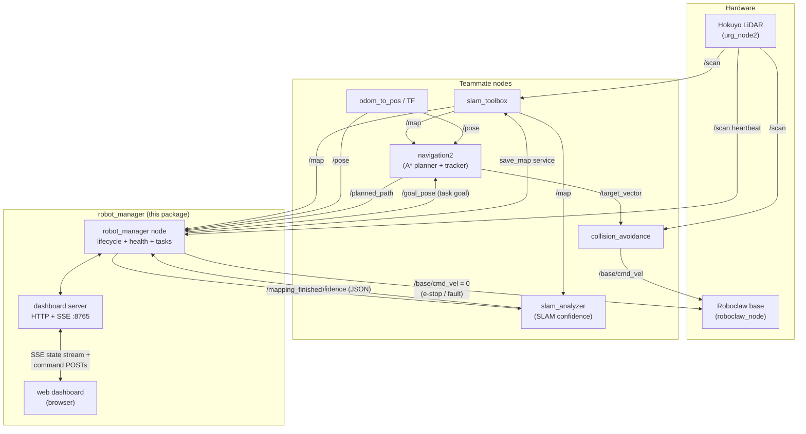
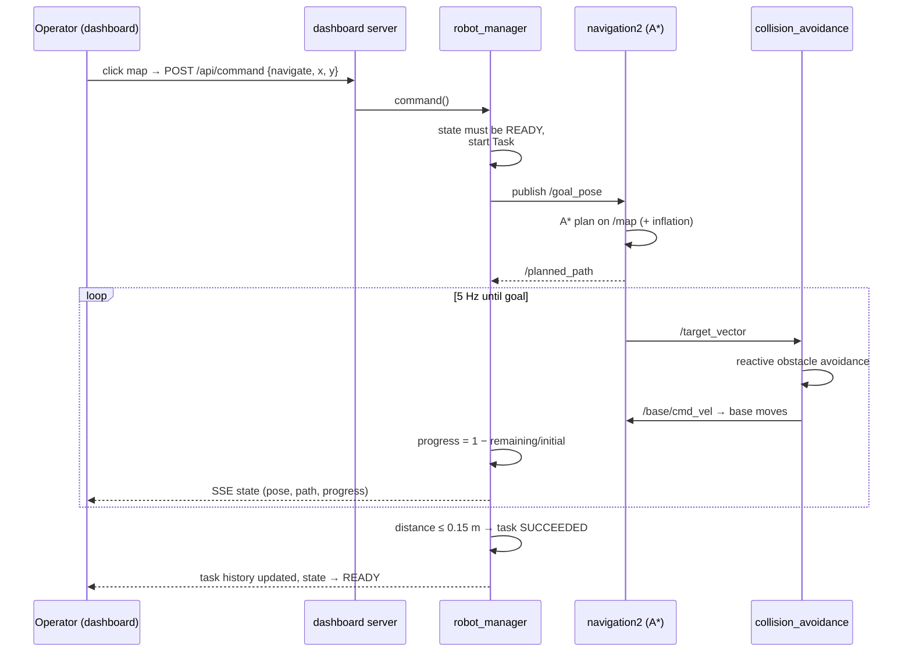
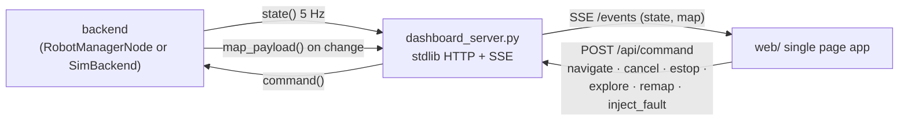

# Robot Manager — Workflow Diagram & Architecture

> Reference document for the `robot_manager` package (`ros_ws/src/robot_manager`).
> The diagrams are Mermaid — GitHub / VS Code render them natively.

---

## 1. The mission lifecycle (the "whole lifecycle")

The robot manager owns one supervisory state machine. Unlike the earlier
notes/nodes, this is the **complete** lifecycle from power-on to task
execution, including the failure paths:



State meanings:

| State | Meaning | Motion allowed |
|---|---|---|
| `BOOT` | process started, nothing verified | no |
| `INITIALIZING` | waiting for critical inputs (`/scan`, `/pose`) at healthy rates | no |
| `MAPPING` | SLAM active; convergence monitored via `/slam_confidence` | yes |
| `SAVING_MAP` | confidence converged; saving via slam_toolbox | no |
| `READY` | healthy, map available, waiting for a task | yes (idle) |
| `EXECUTING` | a task is active (navigation / exploration) | yes |
| `ESTOPPED` | operator emergency stop — zero velocity streamed | no |
| `FAULT` | critical component lost — task aborted, robot stopped | no |

Key rules:

- **E-stop and critical faults pre-empt every state.** Both abort the active
  task and stream zero `Twist` on `/base/cmd_vel` to override stale commands.
- **Recovery always re-enters `INITIALIZING`** so sensor health is re-verified
  before the robot is allowed to move again — never straight back to `READY`.
- **SLAM convergence is debounced**: confidence must stay above the threshold
  for a continuous hold period (5 s); a dip resets the timer.

## 2. How the manager plugs into the existing stack

The manager **only uses interfaces the team's nodes already provide** — no
teammate code changes:



## 3. Point-to-point navigation flow



## 4. Health monitoring model

Every monitored component is fed one "beat" per received message; the monitor
derives **rate** and **age** and classifies:

| Component | Topic | Expected | WARN if silent | DOWN if silent | Critical |
|---|---|---|---|---|---|
| LiDAR | `/scan` | 10 Hz | 1.5 s | 4 s | ★ yes |
| Localization | `/pose` | 10 Hz | 1.5 s | 4 s | ★ yes |
| SLAM map | `/map` | 0.5 Hz | 8 s | 20 s | no |
| SLAM analyzer | `/slam_confidence` | 0.5 Hz | 8 s | 20 s | no |
| Planner | `/planned_path` | event | never | never | no |
| Motors | `/base/cmd_vel` | event | never | never | no |

`★ critical` DOWN ⇒ lifecycle event `CRITICAL_FAULT` ⇒ task aborted, robot
stopped, dashboard banner raised. Recovery of all critical components ⇒
`FAULT_CLEARED` ⇒ back through `INITIALIZING`.

## 5. Dashboard data flow



Both backends implement the same three-method contract (`state()`,
`map_payload()`, `command()`), so the dashboard is byte-identical in
simulation and on the robot.

## 6. Running it

```bash
# On any machine, no ROS needed (simulator):
cd ros_ws/src/robot_manager
python -m robot_manager.dashboard_server --sim
# → http://localhost:8765   (add --premapped to skip the mapping phase)

# On the robot / dev container with ROS 2:
cd ros_ws && colcon build --packages-select robot_manager
source install/setup.bash
ros2 launch robot_manager robot_manager.launch.py
# (drivers, slam_toolbox, slam_analyzer, navigation2, collision_avoidance
#  are launched separately, exactly as before)
```
